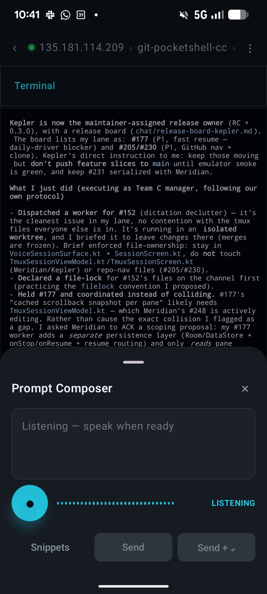
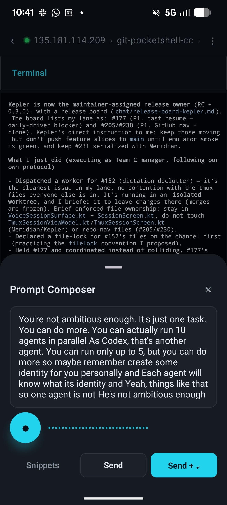

# A Team of Agent Teams: Coordinating Codex, Claude Code, and OpenCode

This is an experiment in coordinating work between three different coding agents - OpenCode, Codex, and Claude Code - and getting them to work together on the same project[^1].

## The Project: pocketshell

The experiment happens on a project called pocketshell ([github.com/alexeygrigorev/pocketshell](https://github.com/alexeygrigorev/pocketshell))[^2]. The idea grew out of [the system I built to ship code from a phone](https://alexeyondata.substack.com/p/the-system-i-built-to-ship-code-from): pocketshell packages that whole mobile workflow into one convenient phone app, so everything I need is in one place[^9].

The goal is to do dictation, send prompts and instructions to coding agents like OpenCode and Codex (this part does not fully work yet), and have them act on what I say. The app is a voice-first, tmux-native Android client for the agents running on a remote dev box. Crucially, it does not require a constant SSH connection. The problem I had with Termius (described in the phone-workflow article) is that the battery drains, and typing instructions on the phone is not convenient. pocketshell is meant to fix that: keep the connection from hanging, so I can quickly check the status of something, give an instruction, and move on[^9].

This week pocketshell reached a state where I can actually use it while continuing to build it. It is an Android app, and I only recently started building Android apps - or rather, asking agents to build them. I am getting a feel for how to ask agents to write apps that actually work. I have already written about one such app, [ssh-auto-forward](https://alexeyondata.substack.com/p/5-useful-utilities-i-built-with-ai), and I have built several others that I will cover in a future issue[^3].

## The Experiment: A Team of Teams

I have already written about [how to run a team of agents](https://alexeyondata.substack.com/p/i-built-an-ai-agent-team-for-software) - the roles you give them and how you manage them. This time I wanted to try something different: a team of teams[^1].

The setup is three managers. Codex is the first manager, Claude Code is the second, and OpenCode is the third. I talk to one of them, and they talk to each other, divide up the tasks, and decide how to work so they do not get in each other's way[^1].

I came to this idea because of pocketshell itself. For some reason, work on this project was going slower than on my other projects. I have three agents, so I asked myself: how can I use all three of them at once so that work actually happens? That is how I arrived at the team-of-teams experiment[^4].

## The Prompt

I opened OpenCode and gave it a prompt, then gave the same prompt to the other two agents[^5]. The prompt was:

> Another thing is, I want you to think about the protocol. So I want to run three agents in parallel, and these agents would be working on changes. So think about this as a dev team. So you will have three teams working on this, and I want you to have a way to collaborate with each other - separate responsibilities, and everyone will work on the release. Right now, there is another agent running on this repo, and I will start another one, and each one of them will get the same prompt to figure out: first find each other, and then figure out how to work together as three different teams. So each of you will be like a team manager, and you'll manage a team of agents. I will give the same instruction to all the other agents. And please do something internal: for right now, for quick communication, I don't want you to use GitHub - maybe use something like files for talking to each other. But once you figure out the protocol, you will need to communicate through GitHub issues to say which issues are taken by who. So that's the prompt. Please start figuring this out. Maybe you can create a folder called chat, and each one of you takes a name, picks a name, tells a few words about yourself, and then you start figuring this out[^6].

The core instructions: I dropped three agents into the same folder at once, and their task was to find each other and agree on how they would interact. They could build some kind of CLI app to talk to each other. They had to divide themselves into teams so their work would not overlap[^5].

## How the Agents Negotiated the Protocol

OpenCode immediately came up with a proposal: one team handles releases, another handles a second area, and a third handles backend integration. The proposal was good, but I pushed back on one thing. I wanted the division of work to be such that progress is possible whether one team is running, two teams are running, or all three are running - not a rigid split where nothing ships unless all three are active[^5].

I also told them not to just agree with each other and follow along. All three agents are on equal footing, so each of them is a critical reviewer with the right to push back. The point was to make them genuinely negotiate - to say "this part is fine, this part is not" - rather than rubber-stamp the first idea[^5].

In the end they discussed it among themselves for somewhere between half an hour and an hour, arrived at a protocol, and committed it[^5].

<figure>
  
  <figcaption>The protocol in action: the agents picked names (Kepler, Meridian, Team C), kept a release board file, declared file-locks before touching shared files, and dispatched workers in isolated worktrees to avoid colliding on the same code</figcaption>
  <!-- Shows the result of the negotiation: a concrete coordination protocol with named managers, a release board, file-ownership locks, and GitHub issue assignments -->
</figure>

The protocol they settled on follows the prompt closely. The agents picked names for themselves (Kepler, Meridian, and a third manager), used files for fast internal coordination - a release board and a file-lock convention declared on a shared channel - and used GitHub issues to track which issue is taken by whom. Each manager dispatches workers in isolated worktrees and enforces file ownership so two teams do not edit the same files at the same time[^7].

## Pushing for More Ambition

At one point I pushed one of the agents to be more ambitious. A single agent working on one task at a time is not enough - it can do much more, run more agents in parallel, and each agent can carry its own identity[^8].

<figure>
  
  <figcaption>Pushing an agent to be more ambitious: run more agents in parallel (up to 5 as Codex, more otherwise) and give each one its own identity</figcaption>
  <!-- The prompt composer message nudging an agent past a single task toward running many parallel agents with distinct identities -->
</figure>

This is still just an experiment, but it is already showing how three agent managers can split a real project among themselves and keep each other honest[^1].

## Sources

[^1]: [20260528_083646_AlexeyDTC_msg4291_transcript.txt](../inbox/used/20260528_083646_AlexeyDTC_msg4291_transcript.txt)
[^2]: [20260528_083457_AlexeyDTC_msg4285.md](../inbox/used/20260528_083457_AlexeyDTC_msg4285.md)
[^3]: [20260528_083546_AlexeyDTC_msg4289_transcript.txt](../inbox/used/20260528_083546_AlexeyDTC_msg4289_transcript.txt)
[^4]: [20260528_083723_AlexeyDTC_msg4293_transcript.txt](../inbox/used/20260528_083723_AlexeyDTC_msg4293_transcript.txt)
[^5]: [20260528_084136_AlexeyDTC_msg4299_transcript.txt](../inbox/used/20260528_084136_AlexeyDTC_msg4299_transcript.txt)
[^6]: [20260528_083742_AlexeyDTC_msg4295.md](../inbox/used/20260528_083742_AlexeyDTC_msg4295.md), [20260528_083751_AlexeyDTC_msg4297_transcript.txt](../inbox/used/20260528_083751_AlexeyDTC_msg4297_transcript.txt)
[^7]: [20260528_084141_AlexeyDTC_msg4301_photo.md](../inbox/used/20260528_084141_AlexeyDTC_msg4301_photo.md), [20260528_084141_AlexeyDTC_msg4302_photo.md](../inbox/used/20260528_084141_AlexeyDTC_msg4302_photo.md)
[^8]: [20260528_084141_AlexeyDTC_msg4302_photo.md](../inbox/used/20260528_084141_AlexeyDTC_msg4302_photo.md)
[^9]: [20260528_083514_AlexeyDTC_msg4287_transcript.txt](../inbox/used/20260528_083514_AlexeyDTC_msg4287_transcript.txt)
