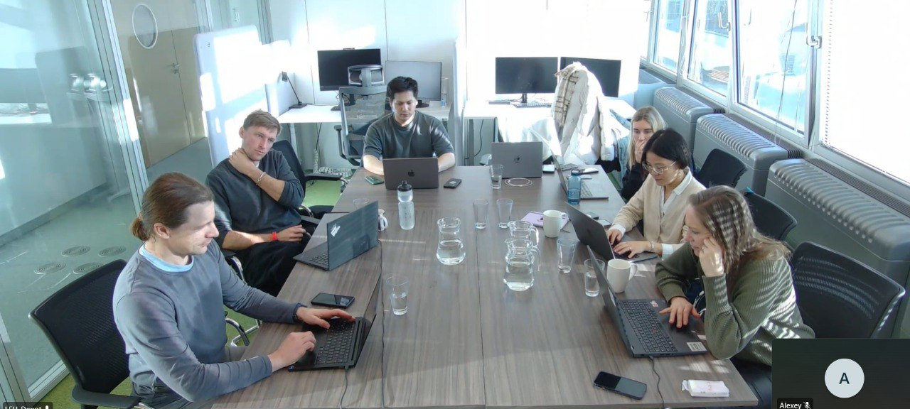

# Agents Workshop

A two-day workshop on AI agents, based on materials from the AI Bootcamp course.

## Workshop Format

This is a two-day workshop:
- Day 1: Introduction to Agents
- Day 2: Implementing Your Calling Agent

The content is based on what we do in the AI Bootcamp course. A company in Berlin reached out and asked me to create this course for them.

## Day 1: Introduction to Agents

The first day covers foundational concepts:

- OpenAI API basics
- Slide-based queries and prompts
- RAG (Retrieval Augmented Generation)
- Building agents using Toiyaikit
- Using Anthropic's Claude API
- MCP (Model Context Protocol)

The approach is hands-on. We start with introduction, talk about OpenAI, then move to structured prompts, build RAG, then create agents using various frameworks.

## Teaching Experience

It went very well. The participants were engaged and the material flowed naturally from one topic to the next. The progression from basic API usage to full agent implementations worked well for building understanding.

## Day 2: Coding Agents

The second day focuses specifically on implementing coding agents - agents that can write and work with code.

<figure>
  
  <figcaption>Participants working through the exercises during the in-person workshop session</figcaption>
  <!-- This shows the collaborative learning environment -->
</figure>

## Sources
- [20260119_154030_AlexeyDTC_msg308_transcript.txt](../inbox/raw/20260119_154030_AlexeyDTC_msg308_transcript.txt)
- [20260119_154248_AlexeyDTC_msg309.jpg](../assets/images/agents-workshop/workshop-group-session.jpg)
