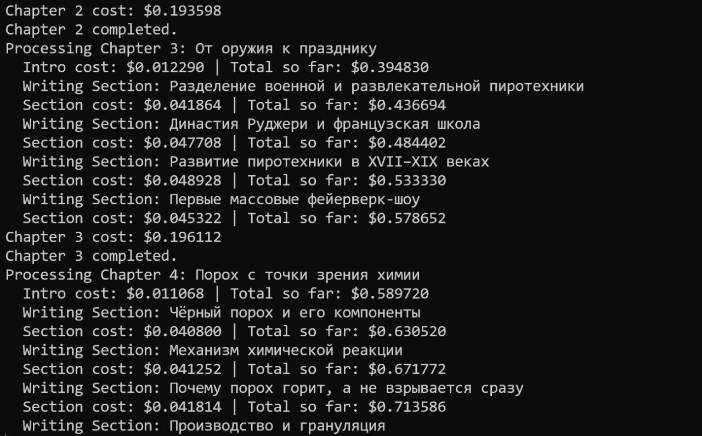
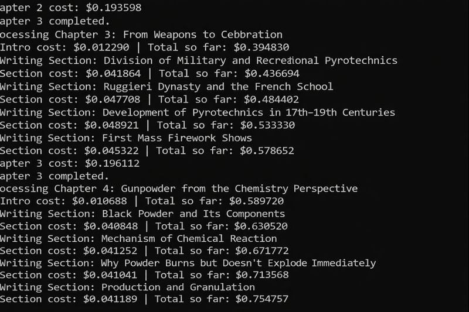
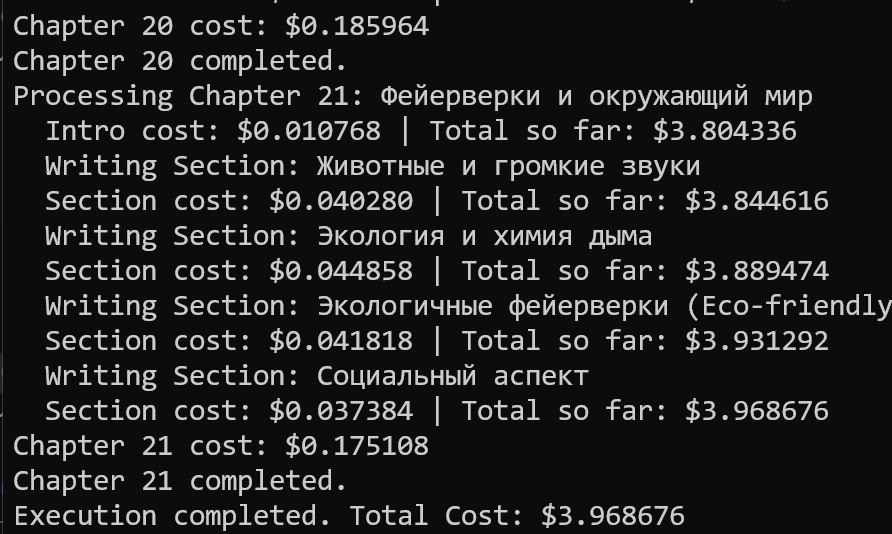

# Generating Books with AI

Using AI to generate complete books with text, covers, and multiple output formats (EPUB, PDF).

## The Request

My child asked for a book about fireworks. Instead of finding one, I decided to generate it using AI[^1].

## The Process

The book generator processes content chapter by chapter and section by section. The output shows real-time progress and costs:

<figure>
  
  <figcaption>Terminal output shows the cost for each chapter and section as it's generated</figcaption>
  <!-- Real-time cost tracking helps monitor expenses during generation -->
</figure>

<figure>
  
  <figcaption>The generator processes sections within each chapter, tracking costs incrementally</figcaption>
  <!-- Each section shows individual cost plus running total -->
</figure>

<figure>
  
  <figcaption>Final output shows completion of all 21 chapters with total cost of approximately $4</figcaption>
  <!-- The entire book was generated in about 45 minutes -->
</figure>

## Results

- 21 chapters generated
- Total time: approximately 45 minutes
- Total cost: approximately $4
- Model used: Gemini 3 Pro[^2]
- Gemini Flash has not been tested yet[^3]

## Image Translation

One interesting feature is translating images with text from Russian to English. I used ChatGPT's new model to replace Russian text with English while preserving the image layout. The results were quite good - only noticed one typo. This is remarkable compared to how image generation models struggled with text in the past[^4][^5].

## Output Formats

The generator produces multiple formats:
- EPUB for e-readers
- PDF interior for print-on-demand (KDP)
- PDF cover for print-on-demand[^6][^7]

## Cover Generation

For the cover, I used a simple prompt: "make a cover for the book" and copied the book description from the inside flap. The result was an effective cover[^8][^9].

<figure>
  
  <figcaption>AI-generated cover for the fireworks book with Russian text translated to English</figcaption>
  <!-- The cover uses the book description as the prompt -->
</figure>

## Content Structure

Content is generated section by section in markdown, then assembled into the final book format. Each section is a markdown file that gets combined[^10][^11].

## Source

https://github.com/alexeygrigorev/ai-book-generator

## Sources

- [20260123_121736_valeriia_kuka_msg464.md](../inbox/raw/20260123_121736_valeriia_kuka_msg464.md)
- [20260123_121736_valeriia_kuka_msg465_photo.md](../inbox/raw/20260123_121736_valeriia_kuka_msg465_photo.md)
- [20260123_121736_valeriia_kuka_msg466.md](../inbox/raw/20260123_121736_valeriia_kuka_msg466.md)
- [20260123_121736_valeriia_kuka_msg467_transcript.txt](../inbox/raw/20260123_121736_valeriia_kuka_msg467_transcript.txt)
- [20260123_121736_valeriia_kuka_msg468_photo.md](../inbox/raw/20260123_121736_valeriia_kuka_msg468_photo.md)
- [20260123_121736_valeriia_kuka_msg469_transcript.txt](../inbox/raw/20260123_121736_valeriia_kuka_msg469_transcript.txt)
- [20260123_121736_valeriia_kuka_msg470_transcript.txt](../inbox/raw/20260123_121736_valeriia_kuka_msg470_transcript.txt)
- [20260123_121736_valeriia_kuka_msg471_transcript.txt](../inbox/raw/20260123_121736_valeriia_kuka_msg471_transcript.txt)
- [20260123_121736_valeriia_kuka_msg472.md](../inbox/raw/20260123_121736_valeriia_kuka_msg472.md)
- [20260123_121736_valeriia_kuka_msg473.md](../inbox/raw/20260123_121736_valeriia_kuka_msg473.md)
- [20260123_121736_valeriia_kuka_msg474.md](../inbox/raw/20260123_121736_valeriia_kuka_msg474.md)
- [20260123_121736_valeriia_kuka_msg475.md](../inbox/raw/20260123_121736_valeriia_kuka_msg475.md)
- [20260123_121736_valeriia_kuka_msg476.md](../inbox/raw/20260123_121736_valeriia_kuka_msg476.md)
- [20260123_121736_valeriia_kuka_msg477.md](../inbox/raw/20260123_121736_valeriia_kuka_msg477.md)
- [20260123_121736_valeriia_kuka_msg478_photo.md](../inbox/raw/20260123_121736_valeriia_kuka_msg478_photo.md)
- [20260123_121736_valeriia_kuka_msg479.md](../inbox/raw/20260123_121736_valeriia_kuka_msg479.md)
- [20260123_121736_valeriia_kuka_msg480.md](../inbox/raw/20260123_121736_valeriia_kuka_msg480.md)
- [20260123_121736_valeriia_kuka_msg481.md](../inbox/raw/20260123_121736_valeriia_kuka_msg481.md)
- [20260123_121736_valeriia_kuka_msg482.md](../inbox/raw/20260123_121736_valeriia_kuka_msg482.md)
- [20260123_121736_valeriia_kuka_msg483.md](../inbox/raw/20260123_121736_valeriia_kuka_msg483.md)
- [20260123_121736_valeriia_kuka_msg484_file.md](../inbox/raw/20260123_121736_valeriia_kuka_msg484_file.md)
- [20260123_121736_valeriia_kuka_msg485_file.md](../inbox/raw/20260123_121736_valeriia_kuka_msg485_file.md)
- [20260123_121736_valeriia_kuka_msg486_file.md](../inbox/raw/20260123_121736_valeriia_kuka_msg486_file.md)
- [20260123_121736_valeriia_kuka_msg487.md](../inbox/raw/20260123_121736_valeriia_kuka_msg487.md)
- [20260123_121736_valeriia_kuka_msg488_file.md](../inbox/raw/20260123_121736_valeriia_kuka_msg488_file.md)
- [20260123_121736_valeriia_kuka_msg489.md](../inbox/raw/20260123_121736_valeriia_kuka_msg489.md)
- [20260123_121736_valeriia_kuka_msg490_photo.md](../inbox/raw/20260123_121736_valeriia_kuka_msg490_photo.md)
- [20260123_121736_valeriia_kuka_msg465.jpg](../inbox/raw/20260123_121736_valeriia_kuka_msg465.jpg)
- [20260123_121736_valeriia_kuka_msg468.jpg](../inbox/raw/20260123_121736_valeriia_kuka_msg468.jpg)
- [20260123_121736_valeriia_kuka_msg478.jpg](../inbox/raw/20260123_121736_valeriia_kuka_msg478.jpg)
- [20260123_121736_valeriia_kuka_msg490.jpg](../inbox/raw/20260123_121736_valeriia_kuka_msg490.jpg)

[^1]: [20260123_121736_valeriia_kuka_msg471_transcript.txt](../inbox/raw/20260123_121736_valeriia_kuka_msg471_transcript.txt)
[^2]: [20260123_121736_valeriia_kuka_msg479.md](../inbox/raw/20260123_121736_valeriia_kuka_msg479.md)
[^3]: [20260123_121736_valeriia_kuka_msg483.md](../inbox/raw/20260123_121736_valeriia_kuka_msg483.md)
[^4]: [20260123_121736_valeriia_kuka_msg469_transcript.txt](../inbox/raw/20260123_121736_valeriia_kuka_msg469_transcript.txt)
[^5]: [20260123_121736_valeriia_kuka_msg470_transcript.txt](../inbox/raw/20260123_121736_valeriia_kuka_msg470_transcript.txt)
[^6]: [20260123_121736_valeriia_kuka_msg484_file.md](../inbox/raw/20260123_121736_valeriia_kuka_msg484_file.md)
[^7]: [20260123_121736_valeriia_kuka_msg485_file.md](../inbox/raw/20260123_121736_valeriia_kuka_msg485_file.md)
[^8]: [20260123_121736_valeriia_kuka_msg489.md](../inbox/raw/20260123_121736_valeriia_kuka_msg489.md)
[^9]: [20260123_121736_valeriia_kuka_msg488_file.md](../inbox/raw/20260123_121736_valeriia_kuka_msg488_file.md)
[^10]: [20260123_121736_valeriia_kuka_msg473.md](../inbox/raw/20260123_121736_valeriia_kuka_msg473.md)
[^11]: [20260123_121736_valeriia_kuka_msg474.md](../inbox/raw/20260123_121736_valeriia_kuka_msg474.md)
