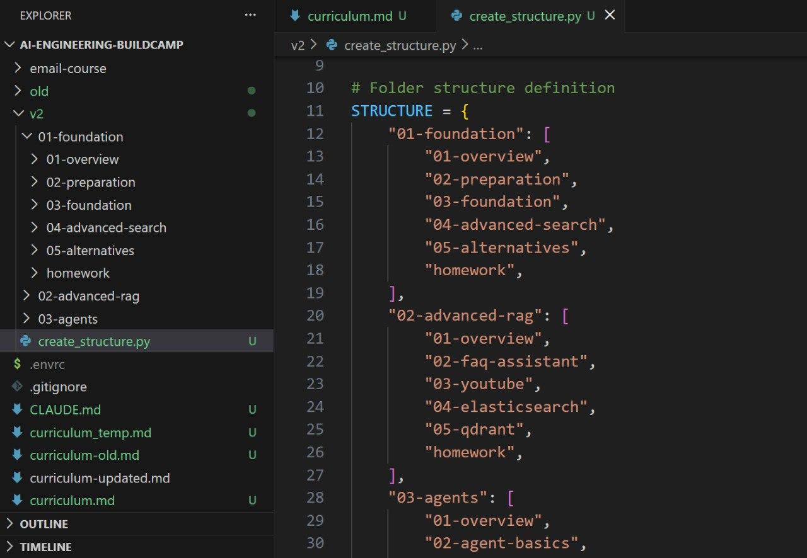
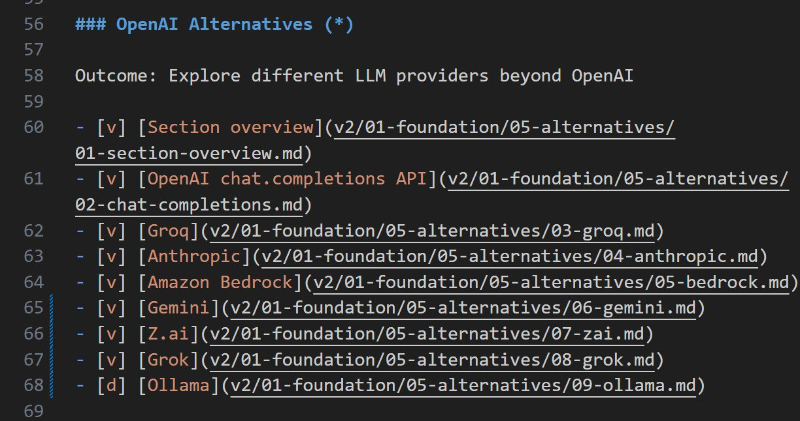

# AI Buildcamp Course

The AI Bootcamp "From RAG to Agents" course is now called "AI Engineering Buildcamp" - a comprehensive 9-week program that takes students from core concepts to production-grade AI systems. The first iteration had 49 participants, and their feedback was incorporated into an updated syllabus[^1].

## Course Renaming

The course is being renamed from "AI Bootcamp" to "AI Engineering BuildCamp". There are many bootcamps in the space (iBootCamp, etc.) and it's hard to stand out. Since the course focus is on Learning by Doing and Building, with many projects as output, "BuildCamp" is a fitting name that emphasizes the building aspect[^2].

The course outline is being redesigned to be more focused. The material remains the same but is now better organized. Posts about the renaming should be made on social media explaining the change, with a Substack article covering the details[^3].

## New Syllabus Development

A completely new syllabus and curriculum are being created for the upcoming cohort. This requires re-recording most materials. Four out of five sections in Module 1 are already complete, with only the alternatives section remaining[^16].

The new material includes:
- Many new topics and examples
- Redesigned old content for better clarity
- A more focused approach to the subject matter
- Some topics moved from Week 1 to Week 2
- Streaming content now covered in the structured output section, including a newly written Jackson streaming parser[^16]

<figure>
  
  <figcaption>Course folder structure showing the organized curriculum layout from v2 materials</figcaption>
  <!-- This illustrates how the course materials are structured and organized -->
</figure>

## Course Structure

The course is redesigned with 90% of materials re-recorded based on prior cohort feedback. It's longer but less dense, and more focused.

### Course Overview and Logistics

The first section of Week 1 covers course organization and navigation. Students learn how to find videos and articles, what content is mandatory versus optional, and the overall course structure. All materials are organized with clear navigation - videos for watching, articles for reading, and hands-on exercises that must be completed[^11].

### Week 1: LLMs and RAG Foundations

- Course overview and logistics
- Environment preparation with GitHub Codespaces
- AI-assisted development tools (ChatGPT, GitHub Copilot, Codex, Antigravity)
- OpenAI API basics and responses
- RAG (Retrieval-Augmented Generation) introduction
- Building a document assistant with RAG
- Structured output and vector search
- Alternatives to OpenAI (Groq, Anthropic, Gemini, Z.ai)
- Advanced chunking techniques

The main focus of Week 1 is on RAG, which remains the workhorse of AI applications. Even though the course has an agent focus, understanding RAG is essential for building effective agents. Many solutions require only RAG, so it's covered in detail first[^15].

### Course Scope and Approach

The course focuses on AI engineering - integrating AI and agents into products. It does not cover:
- Fine-tuning open source models
- Running models locally
- LLM internals and architecture

Students use pre-trained models via API, treating LLMs as a black box that accepts requests and returns responses. The course emphasizes practical application over model training and internal architecture[^15].

### Week 2: Buffer Week

This is a buffer week for environment setup, with optional content on other use cases and external databases. Week 2 is designed as extra time for students who join later, or for those who need more time with Week 1 material since the first week can be intensive[^15].

### Week 3: Agents

- Introduction to agents and agentic RAG
- Agent tool-call loop foundation
- Pydantic AI framework
- Multi-agent systems (linear execution, agents as tools)
- Model-Context Protocol (MCP) for tool integration

Several frameworks have been added as optional materials based on numerous student requests:
- LangChain and LangGraph (popular, but PydanticAI remains the primary focus)
- Google ADK (Agent Development Kit)
- CrewAI
- OpenAI Agents SDK

While many students ask for LangChain and LangGraph, and they are among the first frameworks used for RAG and agents, the course focuses primarily on PydanticAI. Other frameworks are included as optional content to accommodate different preferences and backgrounds[^4].

### Week 4: Testing for Agents

- Converting Jupyter notebooks to Python projects
- Writing agent tests
- Tracking usage and costs
- Testing with structured output
- LLM judges for agent testing

### Week 5: Monitoring

- Pydantic Logfire for observability
- OpenTelemetry and Jaeger
- DIY logging and monitoring with Postgres and Streamlit
- Grafana dashboards
- Other observability platforms (Evidently, LangWatch)

### Week 6: Evaluation

- Manual log evaluation
- Synthetic data generation
- Retrieval evaluation
- LLM judges for evaluation
- Prompt optimization with evaluator pattern
- Selecting chunking approaches with evals

### Weeks 7-9: Bonus and Use Cases

- Guardrails (input/output validation with OpenAI Agents SDK and Pydantic AI)
- Deployment (Streamlit, Render, AWS)
- Building a coding agent from scratch
- Deep research agent
- Other use cases (FAQ assistant, code explainer, book writer)
- Project work and demos

## Student Projects

Students create multiple projects throughout the course including FAQ assistants, YouTube Q&A systems, documentation agents, coding agents, and deep research agents. All projects can be viewed on the course website.

### Capstone Project

Starting from the first week, students begin working on their final Capstone Project. In week 1, they need to come up with an idea for what they want to build. Throughout the course, they progressively understand more about what needs to be implemented - first conceptually, then with two weeks dedicated entirely to implementation at the end[^6].

In addition to the Capstone Project, students complete weekly mini-projects through homework assignments. These are smaller projects designed to reinforce learning and material absorption, separate from the final Capstone. Each module includes both in-class projects and independent homework mini-projects. By the end of the course, students have completed numerous projects ranging from guided exercises to independent builds[^7].

The term "Capstone Project" is used to distinguish the final graduation project from regular weekly projects and mini-projects, avoiding confusion about project scope and importance[^8].

### Homework Structure

Weekly homework consists of two parts:
1. Small projects - to reinforce the week's material
2. Capstone project work - ongoing development of the final project

Homework is optional depending on the student's schedule, but highly recommended for solidifying course concepts. The course platform includes a leaderboard with points, and students are encouraged to actively share what they learn - this is valuable for career development and visibility[^11].

### Certificates and Peer Review

Certificates are awarded based on project completion. A key requirement is peer review - each student must review 3 other students' projects. This requirement ensures:
- Students learn from seeing their peers' approaches
- Projects are taken more seriously knowing others will review them
- Exposure to different project ideas and implementations

Without completing peer reviews, no certificate is awarded[^12].

### Demo Day Webinar

At the end of the course, a demo day webinar is organized where students can present what they've built. This is an open event - not just for other students - providing exposure to a wider audience. Past demo day recordings are shared as examples of what students can achieve[^12].

## Framework Approach

The course focuses on PydanticAI as the primary framework. Other frameworks (LangChain, LangGraph, Google ADK, CrewAI, OpenAI Agents SDK) are included as optional materials based on student demand, but the main teaching and examples use PydanticAI.

### OpenAI and Alternative Providers

The course uses OpenAI as the main provider, but is not tied exclusively to it. Multiple alternatives are covered throughout including Groq, Anthropic, Gemini, and Z.ai. This multi-provider approach is important based on student feedback - one student from the first cohort requested a refund because they felt alternative frameworks and providers weren't covered sufficiently[^9].

### Framework Coverage

The frameworks section (Week 3) does not heavily emphasize LangChain and LangGraph, despite them being popular first choices for many entering the field. They are included as optional materials along with the full list: OpenAI Agents SDK, Google ADK, CrewAI, LangChain, and LangGraph. Approximately 10 prospective students have asked about LangChain since the course was first announced, which represents meaningful interest that's addressed through optional coverage rather than main curriculum focus[^10].

## Teaching Philosophy

The agents portion starts from the very beginning: building the first agent without any frameworks. This approach ensures students understand what happens inside frameworks before using them. By seeing how tool calling works from scratch, students can:

- Read and understand framework source code
- Write their own framework if needed for specific requirements
- Debug issues more effectively when frameworks don't behave as expected

This fundamental understanding is valuable because companies sometimes need to rewrite existing frameworks when they don't support specific use cases. Starting without frameworks then transitioning to them provides both theoretical understanding and practical skills[^5].

## Student Feedback and Course Improvement

Feedback from students is actively sought and used to improve the course. The first cohort's feedback was instrumental in making the course better, and students are encouraged not to hesitate in sharing their thoughts. Students who actively provide feedback are given priority access to register for the next cohort. Unlike the first cohort where this opportunity was available to everyone, subsequent cohorts limit this to those who participate actively and provide constructive feedback[^13].

This approach ensures the course continues to improve while rewarding students who contribute to its development.

## Course Recording Progress

Module 1 of the course has been fully recorded. The recording covers:
- OpenAI API basics
- RAG (Retrieval-Augmented Generation) in detail
- Vector search
- Extensive coverage of OpenAI alternatives

A significant amount of new material was added on alternatives to OpenAI. Previously, this content was minimal, but students have been asking about options like Bedrock. The new module includes dedicated videos for:
- AWS Bedrock
- Anthropic
- Groq
- Gemini
- Z.ai
- Grok
- Ollama

This expanded coverage gives students more options for choosing providers based on their needs and constraints[^18].

<figure>
  
  <figcaption>The OpenAI Alternatives section in Module 1 covers multiple providers including Groq, Anthropic, Bedrock, Gemini, Z.ai, Grok, and Ollama</figcaption>
  <!-- This illustrates the comprehensive alternatives content added to the course -->
</figure>

The alternatives section was newly created for Module 1, along with content on Structured Output and Streaming. The Structured Output topic was given more emphasis and moved earlier in the course because of its importance for building AI applications[^19].

## Sources

- [20260120_135731_AlexeyDTC_msg333_transcript.txt](../inbox/raw/20260120_135731_AlexeyDTC_msg333_transcript.txt)
- [20260120_135733_AlexeyDTC_msg334.md](../inbox/raw/20260120_135733_AlexeyDTC_msg334.md)
- [20260120_135830_AlexeyDTC_msg337.md](../inbox/raw/20260120_135830_AlexeyDTC_msg337.md)
- [20260120_135830_AlexeyDTC_msg338.md](../inbox/raw/20260120_135830_AlexeyDTC_msg338.md)
- [20260121_091318_AlexeyDTC_msg353_transcript.txt](../inbox/raw/20260121_091318_AlexeyDTC_msg353_transcript.txt)
- [20260121_125000_AlexeyDTC_msg359_transcript.txt](../inbox/raw/20260121_125000_AlexeyDTC_msg359_transcript.txt)
- [20260121_123704_AlexeyDTC_msg357_photo.md](../inbox/used/20260121_123704_AlexeyDTC_msg357_photo.md)
- [20260122_170642_AlexeyDTC_msg407_transcript.txt](../inbox/raw/20260122_170642_AlexeyDTC_msg407_transcript.txt)
- [20260123_143149_AlexeyDTC_msg538_transcript.txt](../inbox/raw/20260123_143149_AlexeyDTC_msg538_transcript.txt)
- [20260123_143149_AlexeyDTC_msg539_transcript.txt](../inbox/raw/20260123_143149_AlexeyDTC_msg539_transcript.txt)
- [20260123_143149_AlexeyDTC_msg540_transcript.txt](../inbox/raw/20260123_143149_AlexeyDTC_msg540_transcript.txt)
- [20260123_143149_AlexeyDTC_msg541_transcript.txt](../inbox/raw/20260123_143149_AlexeyDTC_msg541_transcript.txt)
- [20260123_143149_AlexeyDTC_msg542_transcript.txt](../inbox/raw/20260123_143149_AlexeyDTC_msg542_transcript.txt)
- [20260123_143149_AlexeyDTC_msg543_transcript.txt](../inbox/raw/20260123_143149_AlexeyDTC_msg543_transcript.txt)
- [20260123_143206_AlexeyDTC_msg547_transcript.txt](../inbox/raw/20260123_143206_AlexeyDTC_msg547_transcript.txt)
- [20260124_183631_AlexeyDTC_msg576_transcript.txt](../inbox/raw/20260124_183631_AlexeyDTC_msg576_transcript.txt)
- [20260124_183837_AlexeyDTC_msg578_transcript.txt](../inbox/raw/20260124_183837_AlexeyDTC_msg578_transcript.txt)
- [20260124_184002_AlexeyDTC_msg580_transcript.txt](../inbox/raw/20260124_184002_AlexeyDTC_msg580_transcript.txt)
- [20260124_184855_AlexeyDTC_msg582_transcript.txt](../inbox/raw/20260124_184855_AlexeyDTC_msg582_transcript.txt)
- [20260128_131258_AlexeyDTC_msg609_photo.md](../inbox/raw/20260128_131258_AlexeyDTC_msg609_photo.md)
- [20260128_131338_AlexeyDTC_msg611_transcript.txt](../inbox/raw/20260128_131338_AlexeyDTC_msg611_transcript.txt)
- [20260128_065907_AlexeyDTC_msg607.md](../inbox/raw/20260128_065907_AlexeyDTC_msg607.md)
- [20260129_171716_AlexeyDTC_msg642_transcript.txt](../inbox/raw/20260129_171716_AlexeyDTC_msg642_transcript.txt)
- [20260129_173022_AlexeyDTC_msg650_transcript.txt](../inbox/raw/20260129_173022_AlexeyDTC_msg650_transcript.txt)

[^1]: [AI Bootcamp: From RAG to Agents](https://maven.com/alexey-grigorev/from-rag-to-agents)
[^2]: [20260121_091318_AlexeyDTC_msg353_transcript.txt](../inbox/raw/20260121_091318_AlexeyDTC_msg353_transcript.txt)
[^3]: [20260121_091318_AlexeyDTC_msg353_transcript.txt](../inbox/raw/20260121_091318_AlexeyDTC_msg353_transcript.txt)
[^4]: [20260121_125000_AlexeyDTC_msg359_transcript.txt](../inbox/raw/20260121_125000_AlexeyDTC_msg359_transcript.txt)
[^5]: [20260122_170642_AlexeyDTC_msg407_transcript.txt](../inbox/raw/20260122_170642_AlexeyDTC_msg407_transcript.txt)
[^6]: [20260123_143149_AlexeyDTC_msg538_transcript.txt](../inbox/raw/20260123_143149_AlexeyDTC_msg538_transcript.txt)
[^7]: [20260123_143149_AlexeyDTC_msg539_transcript.txt](../inbox/raw/20260123_143149_AlexeyDTC_msg539_transcript.txt)
[^8]: [20260123_143149_AlexeyDTC_msg540_transcript.txt](../inbox/raw/20260123_143149_AlexeyDTC_msg540_transcript.txt)
[^9]: [20260123_143149_AlexeyDTC_msg541_transcript.txt](../inbox/raw/20260123_143149_AlexeyDTC_msg541_transcript.txt)
[^10]: [20260123_143149_AlexeyDTC_msg543_transcript.txt](../inbox/raw/20260123_143149_AlexeyDTC_msg543_transcript.txt)
[^11]: [20260124_183631_AlexeyDTC_msg576_transcript.txt](../inbox/raw/20260124_183631_AlexeyDTC_msg576_transcript.txt)
[^12]: [20260124_183837_AlexeyDTC_msg578_transcript.txt](../inbox/raw/20260124_183837_AlexeyDTC_msg578_transcript.txt)
[^13]: [20260124_184002_AlexeyDTC_msg580_transcript.txt](../inbox/raw/20260124_184002_AlexeyDTC_msg580_transcript.txt)
[^14]: [20260128_131258_AlexeyDTC_msg609_photo.md](../inbox/raw/20260128_131258_AlexeyDTC_msg609_photo.md)
[^15]: [20260128_065907_AlexeyDTC_msg607.md](../inbox/raw/20260128_065907_AlexeyDTC_msg607.md)
[^16]: [20260129_171716_AlexeyDTC_msg642_transcript.txt](../inbox/raw/20260129_171716_AlexeyDTC_msg642_transcript.txt)
[^17]: [20260129_173022_AlexeyDTC_msg650_transcript.txt](../inbox/raw/20260129_173022_AlexeyDTC_msg650_transcript.txt)
[^18]: [20260201_113629_AlexeyDTC_msg814_transcript.txt](../inbox/raw/20260201_113629_AlexeyDTC_msg814_transcript.txt)
[^19]: [20260202_143419_valeriia_kuka_msg850_transcript.txt](../inbox/raw/20260202_143419_valeriia_kuka_msg850_transcript.txt)
