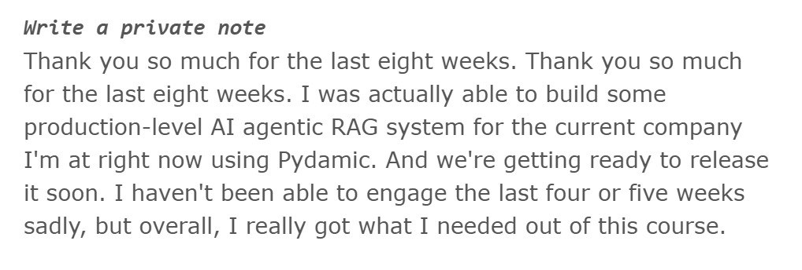

# AI Engineering Buildcamp Testimonials

Collected testimonials from AI Engineering Buildcamp participants.

## Production agentic RAG built during the course

A review from one of the Buildcamp students, who thanked the course for the last eight weeks and said they were actually able to build a production-level AI agentic RAG system for the company they are at right now, using Pydantic AI, and are getting ready to release it soon. They could not engage for the last four or five weeks, but overall they really got what they needed out of the course [^1].

<figure>
  
  <figcaption>A private note from a Buildcamp student about shipping a production agentic RAG system during the eight-week course</figcaption>
  <!-- The student review Alexey shared, captioned as feedback from a Buildcamp participant -->
</figure>

## Sources

[^1]: [20260615_102429_AlexeyDTC_msg4601_photo.md](../inbox/used/20260615_102429_AlexeyDTC_msg4601_photo.md)
