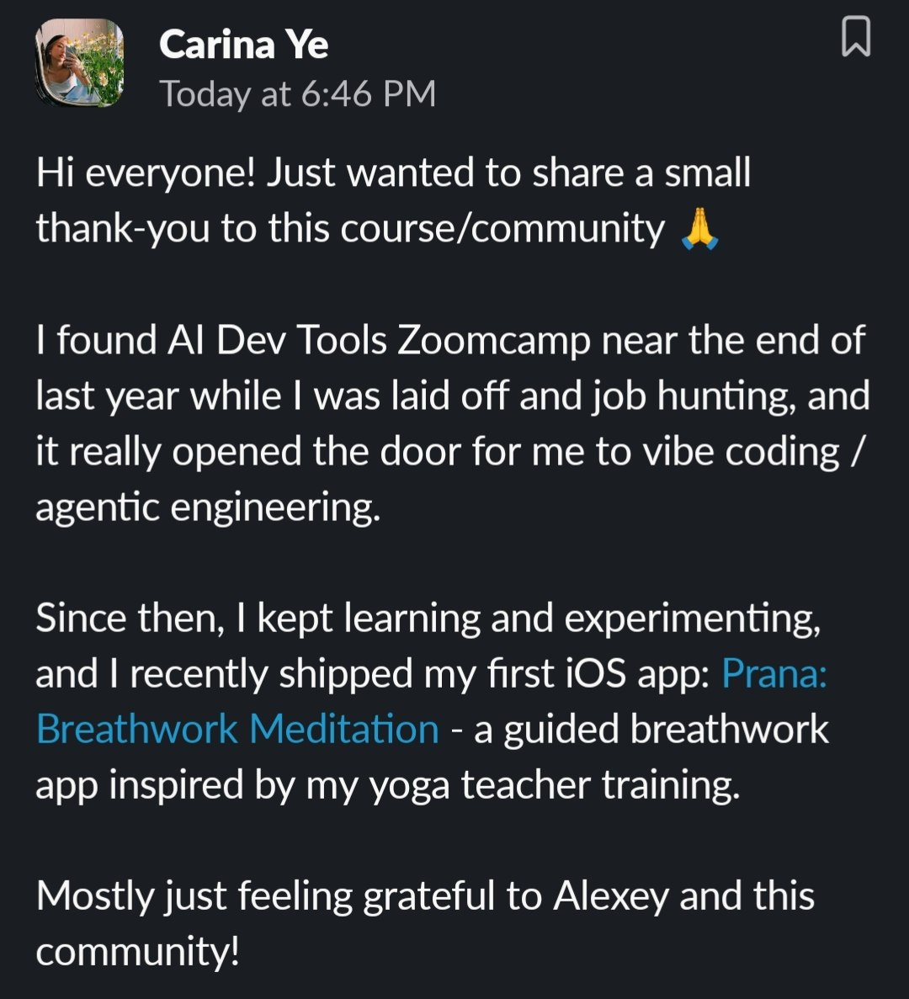

# AI Dev Tools Zoomcamp Testimonials

Testimonials from AI Dev Tools Zoomcamp participants, collected in one place.

## Carina Ye

Hi everyone! Just wanted to share a small thank-you to this course/community.

I found AI Dev Tools Zoomcamp near the end of last year while I was laid off and job hunting, and it really opened the door for me to vibe coding / agentic engineering.

Since then, I kept learning and experimenting, and I recently shipped my first iOS app: Prana: Breathwork Meditation - a guided breathwork app inspired by my yoga teacher training.

Mostly just feeling grateful to Alexey and this community![^1]

<figure>
  
  <figcaption>Carina Ye's testimonial in the course chat</figcaption>
  <!-- Original screenshot of the thank-you message after shipping Prana: Breathwork Meditation -->
</figure>

## Sources

[^1]: [20260501_164723_AlexeyDTC_msg3820_photo.md](../inbox/used/20260501_164723_AlexeyDTC_msg3820_photo.md)
