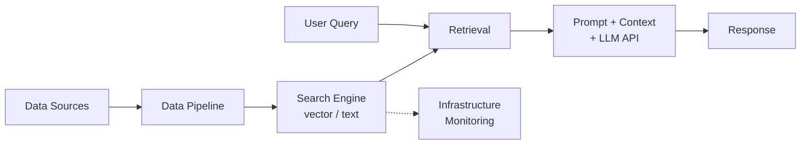
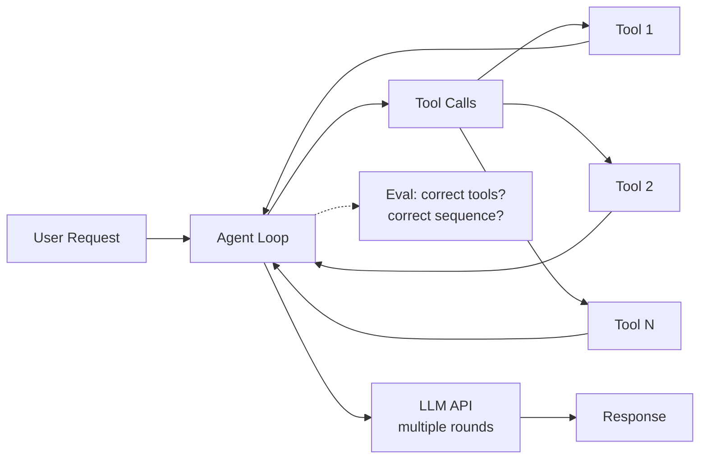

# AI Engineer My Vision

This article describes my personal vision of the AI engineer role, based on my own experience rather than industry surveys or external data.

## Context

I'm preparing for a "Day of AI Engineer" event and want to share how I see this role. The high interest in previous posts about webinars confirmed there's appetite for this content. Rather than relying on others' data or surveys, I want to describe the role from my direct experience.

As someone teaching AI engineering courses and working with ML and AI for years, I have a clear vision of what the AI Engineer role should be. I'm collecting data to compare my vision with industry reality.

I also have a reference article about data team roles at DataTalks.Club[^4]. It is about 5-6 years old now, but it describes the roles in a data team: Product Managers, Data Analysts, Data Scientists, Data Engineers, ML Engineers, and MLOps Engineers. Things have changed since then, and this event is a good opportunity to revisit these roles in the context of AI engineering[^5].

## Core Responsibility: AI Integration

The main responsibility of the AI Engineer is integrating AI into the product, whatever that means[^6]. In practice, integrating AI into a product typically means interacting with an LLM provider like OpenAI, Anthropic, or others through their API. You know how to call this API, it returns something, and then you integrate these results into whatever product you are working on.

AI engineers communicate with product managers. Product managers interact with users and know what user problems are. Together, the product manager and AI engineer identify whether AI could be the solution. It's not like we heard AI is cool and decided to integrate it. There is some problem that users have, and we realize we can help solve it with AI[^17].

Having OpenAI simplifies things compared to traditional ML engineering. ML engineers don't have the luxury of a provider with an existing platform. For AI engineers, 85-90% of the work is sending requests to OpenAI, Anthropic, or some other LLM provider, and then coming up with the right prompt[^17].

## The Role is Similar to ML Engineering

It is very similar to data science. If you think about data science - what data scientists need to do, what ML engineers need to do - they need to integrate machine learning into the product. Here everything is similar. The roles of ML engineer and AI engineer are very similar[^14].

Data scientists focus on creating the model: translating business requirements to ML, designing evaluation datasets, designing training sets, training the model, testing and loading it. ML engineers focus on bringing models into production. AI engineers need to do both, but there is no real modeling since the model already exists. Most of the effort goes to prompt tuning. So AI teams don't necessarily need a separate data scientist role - the AI engineer can handle both parts and focus on everything around it[^17].

For ML engineers, the transition is easy: you just replace a call to a locally hosted model with a call to OpenAI. The rest is the same. ML engineers would need to work a bit on the evaluation side. Data scientists would need to work on the engineering side. For ML engineers, it's probably the easiest transition[^17].

## Simple Example: Online Classifieds with AI Pre-filling

GitHub: https://github.com/alexeygrigorev/simple-sell/[^16]

To illustrate what AI engineers do, consider this example. We have a web interface for an online classifieds website where you can upload anything. Based on what you upload, it classifies the type, extracts the details, and fills everything automatically[^6].

I created this website with Lovable. The prompt was: create an online classifieds platform where people can create and see things to buy and sell. It will be very simplistic - a list page with products, a create page where we create a listing (title, description, categories, and a place to upload a single image). Plus there's a contact button that currently doesn't do anything. The listings come from API (mock it for now) and when we save the event, it also saves into the API. We also pre-fill the details with AI. The posting flow: first they ask the image, you upload, and then you see the form with all pre-filled information from the image. All the API interactions are in a single file[^7].

<figure>
  
  <figcaption>Prep: creating the example marketplace with Lovable in one prompt</figcaption>
  <!-- My preparation for the webinar - building the demo project with Lovable -->
</figure>

With a second prompt, I asked Lovable to rename the website and switch to EUR pricing[^8].

<figure>
  
  <figcaption>Prep: second prompt renamed to "Trova" and switched currency to euros</figcaption>
  <!-- My preparation for the webinar - adjusting the demo project -->
</figure>

Then I exported this from Lovable and added backend support with Claude Code[^9].

<figure>
  
  <figcaption>Prep: using Claude Code to add a FastAPI backend to the example project</figcaption>
  <!-- My preparation for the webinar - adding backend with Claude Code -->
</figure>

I asked Claude Code to create a simple FastAPI backend that takes care of listings and pre-filling with AI. It should return the content, and there would be two endpoints: one for adding a listing and another for pre-filling it with AI[^9].

### What the AI engineer does with this example

<figure>
  
  <figcaption>AI pre-filling the listing form after uploading a photo of headphones</figcaption>
  <!-- Demonstrates the core AI engineer task: upload image, get structured data back from the LLM, auto-fill the form -->
</figure>

The prototype: I uploaded a picture of headphones. The LLM returned "Comfortable wired headphones - experience crisp sound quality and comfort." This sounds like a marketing person wrote it. For an online classifieds platform, the description should be more like "comfortable headphones, I didn't wear them for long, just get them right now." As AI engineers, we can go back to the prompt, edit and modify it to get the right tone[^17].

The simple implementation is literally 56 lines of code ([ai.py](https://github.com/alexeygrigorev/simple-sell/blob/main/backend/app/services/ai.py)):

```python
class AIAnalysisResult(BaseModel):
    title: str
    description: str
    category: str
    price: float

SYSTEM_PROMPT = f"""
You are an assistant that analyzes images of items for
a marketplace listing.

Given an image, suggest:
- A concise, appealing title
- A detailed description (2-3 sentences)
- A category from this list: {", ".join(CATEGORIES)}
- A fair price in euros
""".strip()

async def analyze_image_with_ai(image_bytes: bytes) -> AIAnalysisResult:
    client = AsyncOpenAI()
    b64 = base64.b64encode(image_bytes).decode("utf-8")
    messages = [
        {"role": "system", "content": SYSTEM_PROMPT},
        {"role": "user", "content": [
            {"type": "input_image",
             "image_url": f"data:image/jpeg;base64,{b64}",
             "detail": "low"},
            {"type": "input_text",
             "text": "Analyze this item for a marketplace listing."},
        ]},
    ]
    response = await client.responses.parse(
        model="gpt-4o-mini",
        input=messages,
        text_format=AIAnalysisResult,
    )
    return response.output_parsed
```

You may think: all they need to do is send a request to OpenAI and call it a day?[^17][^10]

But not quite. Here is everything that needs to happen:

1. The prompt - how good is this prompt? We need to test it. We need to make sure that the agent is actually doing what we want. We create a test where we send an image and verify the output ([test_ai.py](https://github.com/alexeygrigorev/simple-sell/blob/main/backend/tests/test_ai.py))[^10].

2. Evaluation dataset - we can have a few tests, but we can also have an evaluation set where we have a bunch of images. We run this extraction process and verify that every time we run with the current prompt, we get what we want. This becomes our evaluation dataset. Tests must always pass. The evaluation dataset gives us a metric of how good our model is doing. Sometimes the model describes something incorrectly - it is not the end of the world. Sometimes it is really important. We define all that[^10].

3. Iterating on the prompt - we change something in the prompt, we run the evaluation set, we see that the model is not degrading. It is very important to have all these things[^10].

4. Rolling out to users - if everything works, we can roll it out. But how? We need to make sure there are no regressions so user experience stays good. We split this to do an A/B test - roll out to a small portion of people first[^10].

5. Production monitoring - we observe that there are no errors. It is very important to have proper production monitoring. In how many cases does our endpoint not return anything? It breaks. We need a dashboard for that[^10].

6. Collecting logs and inspecting results - we also need to know in how many cases this does not work. We need to be able to inspect the results, inspect the input, inspect the output, and see if things are misaligned[^10].

7. Human annotators - we can add humans here, human annotators that regularly sample data from this monitoring system and verify things work. When humans evaluate and we roll it out to some users, they can see some problematic cases. We can actually add these to our evaluation set[^10].

8. Model updates - we deploy the system, everything works, we rolled out to all users, we have monitoring, we have evaluation set, we have testing. Then OpenAI releases a new model. We need to update to the new model. We run it on the evaluation set and we see that things don't work so well as before. But because we have evaluations, we can actually determine this[^10].

9. Prompt versioning - when we iterate on the prompt, we need version control for prompts. How do we control the version of the prompt? We need a proper experimentation system in place. Could be MLflow, could be just keeping things in Git, but it is something important. When we evaluate something, we need to know what we changed. Did we change the prompt? Maybe if we are working on an agent, we changed some tools, maybe we changed the model. We need to know what exactly we changed. We need to properly set the experiment - this is the change and this is the result[^10].

10. Feedback from users - we also need to collect feedback. Feedback could be explicit - if we add a thumbs up or thumbs down button and the user clicks on that, that is explicit feedback. But also implicit - maybe the user corrects the output. We need to think about all these things[^10].

Even for this simplest example, there are so many things that need to happen. It is not enough to just define a Pydantic class, send it to OpenAI, and call it a day. There is a lot of things that need to happen to properly integrate this into the product[^11].

We did not even talk about UI changes. There also need to be UI changes. Typically front-end engineers do this, but in some cases, if you work at a startup, AI engineers might also do that. With AI assistance like Claude Code, it doesn't really matter if your TypeScript knowledge is not the best. AI engineers or any engineer can make these changes, they can integrate this into the product. But typically in bigger companies, it would be a front-end engineer[^11].

<figure>
  
  <figcaption>Prep: Claude Code building out the example project - backend, API, AI service, tests</figcaption>
  <!-- My preparation for the webinar - Claude Code task list showing the demo project build progress -->
</figure>

In this example, we have tests ([test_listings.py](https://github.com/alexeygrigorev/simple-sell/blob/main/backend/tests/test_listings.py), [test_ai.py](https://github.com/alexeygrigorev/simple-sell/blob/main/backend/tests/test_ai.py)), we have CI/CD ([test-backend.yml](https://github.com/alexeygrigorev/simple-sell/blob/main/.github/workflows/test-backend.yml)), you can see everything that is implemented[^12][^13].

### Also CI/CD

When we talk about testing and deployment, CI/CD is important. When we run tests, we want to be able to run these tests on push to Git. When we deploy, we want to be able to deploy to a staging environment. When our tests on the staging environment pass, we want to roll out to production. Setting this up, of course, the AI engineer would not be doing this alone. Typically there could be some platform engineers that help. But if it is a startup, knowing how to do these things will certainly help[^14].

## Complex Scenarios: RAG and Agents

That was just a very simple thing. But imagine we go from this simple thing to RAG. We make our process more complex. Now we have a search engine that we need to use, something like Elasticsearch. We need to ingest the data. We need to know how to build data pipelines, and how to build data pipelines reliably, because the data is coming from somewhere. We need to put it into our search engine. This could be a vector search engine or a text search engine. We need to be able to do that. Sometimes, oftentimes, we need to be able to provision the infrastructure for that[^14].

Simple case - just call the LLM API:


With RAG, things get maybe 5 times more difficult[^17]. Now we need a search engine, data pipelines, infrastructure:



We also need to handle reliability: what if the database goes down? What if it's slow? We need to think about all of these scenarios[^17].

With agents, complexity grows to maybe 10 times the simple case[^17]. Multiple tool calls, multiple LLM rounds, evaluation of tool correctness:



We need to make sure agents can use tools reliably. We need to write tests for tools and for agent behavior. We need to update our evaluation framework and criteria - in this scenario, these tools must be used, things like that. The evaluation dataset becomes more difficult because we need to verify the correct tool is called for each scenario and that tool combinations work correctly[^15][^17].

In the simple case, it is already a lot of work. All these things are solved by AI engineers[^15].

## What AI Engineers Don't Focus On

Unlike traditional ML engineers, AI engineers typically don't:
- Create models from scratch
- Build custom model architectures
- Focus heavily on feature engineering in the traditional ML sense

Sometimes using the API is too complicated and you might need to replace it with a traditional ML model. But ML knowledge is not necessarily something AI engineers automatically should know. Being a "full-stack role" doesn't mean automatically knowing ML[^17].

Instead, AI engineers focus on:
- Engineering best practices for AI systems
- Effective prompt design and versioning
- Integration of AI capabilities into products

This vision guides both my teaching and my research into how the industry actually defines and hires for AI Engineer roles.

## Sources

[^1]: [20260208_114623_AlexeyDTC_msg1188_transcript.txt](../inbox/used/20260208_114623_AlexeyDTC_msg1188_transcript.txt)
[^2]: [20260204_102339_AlexeyDTC_msg900_transcript.txt](../inbox/used/20260204_102339_AlexeyDTC_msg900_transcript.txt)
[^3]: [20260204_102429_AlexeyDTC_msg902_transcript.txt](../inbox/used/20260204_102429_AlexeyDTC_msg902_transcript.txt)
[^4]: [Data Team Roles Explained](https://datatalks.club/blog/data-roles.html)
[^5]: [20260216_125341_AlexeyDTC_msg1721_transcript.txt](../inbox/used/20260216_125341_AlexeyDTC_msg1721_transcript.txt)
[^6]: [20260216_125634_AlexeyDTC_msg1727_transcript.txt](../inbox/used/20260216_125634_AlexeyDTC_msg1727_transcript.txt)
[^7]: [20260216_130544_AlexeyDTC_msg1729_photo.md](../inbox/used/20260216_130544_AlexeyDTC_msg1729_photo.md)
[^8]: [20260216_130631_AlexeyDTC_msg1731_photo.md](../inbox/used/20260216_130631_AlexeyDTC_msg1731_photo.md)
[^9]: [20260216_130937_AlexeyDTC_msg1735_photo.md](../inbox/used/20260216_130937_AlexeyDTC_msg1735_photo.md)
[^10]: [20260216_131724_AlexeyDTC_msg1737_transcript.txt](../inbox/used/20260216_131724_AlexeyDTC_msg1737_transcript.txt)
[^11]: [20260216_131833_AlexeyDTC_msg1739_transcript.txt](../inbox/used/20260216_131833_AlexeyDTC_msg1739_transcript.txt)
[^12]: [20260216_140036_AlexeyDTC_msg1777_photo.md](../inbox/used/20260216_140036_AlexeyDTC_msg1777_photo.md)
[^13]: [20260216_140204_AlexeyDTC_msg1779_transcript.txt](../inbox/used/20260216_140204_AlexeyDTC_msg1779_transcript.txt)
[^14]: [20260216_132048_AlexeyDTC_msg1741_transcript.txt](../inbox/used/20260216_132048_AlexeyDTC_msg1741_transcript.txt)
[^15]: [20260216_132214_AlexeyDTC_msg1743_transcript.txt](../inbox/used/20260216_132214_AlexeyDTC_msg1743_transcript.txt)
[^16]: [20260216_181218_AlexeyDTC_msg1787.md](../inbox/used/20260216_181218_AlexeyDTC_msg1787.md)
[^17]: Webinar recording: "A Day in the Life of an AI Engineer" (2026-02-16)
