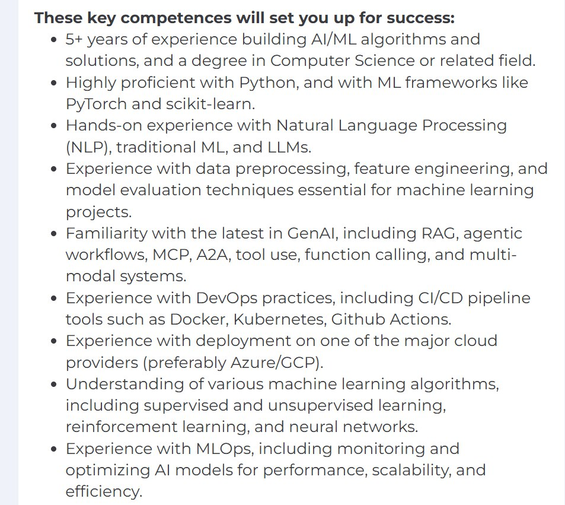

# AI Engineer Role Research

Research into the AI Engineer and Gen AI Engineer roles in the industry, covering what these positions entail, what companies are looking for, and the interview process.

## Research Origin

The idea for this research came from an Office Hours session where a student actively asked for examples of home assignments used in AI Engineer job interviews. This type of content tends to resonate well both for the course and for social media[^1].

## Research Approach

The research uses multiple data sources to build a comprehensive picture of the AI Engineer role:

1. Job postings from the last three months for AI and Gen AI Engineer positions
2. Analysis of requirements and technologies from these postings
3. Stories from people on Reddit about what they do in their roles
4. Personal anecdotes from people I know in the industry
5. Interview questions shared on Twitter and Reddit

The goal is to aggregate data rather than rely on anecdotal evidence alone, to get an accurate picture of what the role actually entails[^2].

## Planned Article Series

The research will be organized into multiple focused articles:

### Article 1: The AI Engineer Role

Focuses on what the role is, what AI Engineers do in their day-to-day work, and how the position is defined in the industry. This is based on job postings, Reddit discussions, and aggregated information from multiple sources[^3].

### Article 2: Role Requirements and Position Definition

Covers what companies want when they hire AI and Gen AI Engineers. Based on job posting analysis, this article will detail the requirements and technologies that companies are looking for[^4].

<figure>
  
  <figcaption>Key competencies listed in a Senior AI Engineer job posting - note that only one point specifically mentions GenAI (RAG, agentic workflows, MCP, A2A), while the rest focuses on traditional ML engineering skills like Python, PyTorch, NLP, and MLOps.</figcaption>
  Illustrates how some companies use "AI Engineer" as a title for what is essentially an ML Engineer role with minimal GenAI requirements.
</figure>

### Article 3: Interview Process

Focuses on how interviews look for AI Engineer positions. Based on:
- Questions people are actually asking in interviews
- Posts from Reddit and Twitter
- Personal websites where people share their experiences
- Real interview stories rather than generic lists of 100 questions

The focus is on real experiences rather than compiling existing question banks without clear sources[^5].

### Typical Hiring Process

A typical hiring process for a Staff AI Engineer position follows this pattern[^9]:

Step 1: 30-minute screening call with talent partner to discuss background, motivation, experience, and practical details.

Step 2: 30-minute call with founder to learn more about the candidate and share more about the product.

Step 3: 45-minute call with a team member to dive deeper into experience.

Step 4: Take-home assignment and 1-hour on-site panel interview with the team.

Step 5: Social meeting with 3 team members to get to know each other better.

Step 6: Offer.

### Article 4: Home Assignments

Analyzes GitHub repositories where people share their solutions to AI Engineer home assignments. This will show:
- What types of assignments companies give
- What technologies candidates use
- What's expected in these assignments

The focus is on understanding what assignments are given, not necessarily the solutions themselves[^6].

### Common Assignment Patterns

Based on analysis of over 60 GitHub repositories where candidates share their home assignment solutions, clear patterns emerge in what companies ask for[^7].

Most Frequent Tasks:

1. RAG Systems (40%+ of assignments)
   - Document upload (PDF, DOCX, TXT, MD)
   - Vector databases (MongoDB Atlas, Qdrant, FAISS, Pinecone)
   - LangChain/LangGraph orchestration
   - Citation support

2. Agentic Systems (25%+)
   - ReACT agents
   - Tool-calling
   - Multi-step reasoning
   - LangGraph workflows

3. Conversational AI (20%+)
   - Chatbots
   - Telegram/Discord bots
   - Voice assistants

4. Document Processing (15%)
   - PDF parsing
   - Data extraction
   - Compliance checking

Tech Stack Frequency:

| Tool | Frequency |
|------|-----------|
| LangChain/LangGraph | 60%+ |
| OpenAI API | 50%+ |
| FastAPI | 40%+ |
| MongoDB Atlas | 30%+ |
| Streamlit | 25%+ |
| Google Gemini | 20%+ |
| Anthropic Claude | 15%+ |
| FAISS | 15%+ |

RAG systems dominate the assignment landscape. Wherever RAG is involved, document parsing is typically required as well[^8].

## Additional Applications

The research material can also be used for:
- Lightning lessons on Maven about interview breakdown
- Course content about AI Engineer careers
- Articles that can be shared and promoted

## Using Deep Research Agents

I experimented with deep research agents from both Google and OpenAI to help with data collection. The results were mixed:
- They didn't fully deliver on finding 100 GitHub repositories as requested
- They often found one result and hallucinated the rest
- However, they were useful for crafting better search queries for GitHub

For Twitter and Reddit analysis, deep research agents were more helpful because:
- Twitter/X (via Grok) has good access to recent interview question discussions
- People often share "just got asked this in my interview" content
- This content is valuable for real interview preparation

The current approach involves using agents to help craft search queries, then manually finding and aggregating the actual data sources for local analysis[^14].

## Industry Interview Examples

### Real Interview Questions from Industry

I asked a contact at a company that hires AI engineers about their interview process. They treat AI engineers similarly to regular engineers with experience working on systems that include LLMs. Their questions focus on fundamental AI concepts rather than framework details[^10]:

- "Explain the function calling flow"
- "How and why would you use structured output"
- "Calculate the costs for this type of agent"
- "How does prompt caching work"
- "What information retrieval approach would you use for 10 documents vs 10 million documents"
- "Why would you need MCP (Model Context Protocol)"
- "Given this product, what LLMOps would you add"

These questions test practical understanding rather than theoretical knowledge.

### A Common Interview Issue

A concerning pattern from their interviews: a data engineer answered all questions about Kafka and Spark correctly, but when asked about AI, he started discussing multi-agent systems. When asked how the agents communicate with each other, he said he didn't know - "LangGraph handles it internally"[^11].

This highlights a problem: candidates may use frameworks without understanding the underlying concepts. For multi-agent systems, it's important to know how agents communicate, regardless of which framework is being used.

## My Vision of the AI Engineer Role

As someone teaching AI engineering courses and working with ML and AI for years, I have a clear vision of what the AI Engineer role should be. I'm collecting data to compare my vision with industry reality.

### Core Responsibility: AI Integration

The AI Engineer's role is integrating AI into products. This primarily means calling LLMs through providers like OpenAI, Anthropic, or others. Self-hosting is less common, and fine-tuning is even rarer[^12].

The work involves:
- Calling LLM APIs through providers
- Integrating AI capabilities into existing products
- Building features that leverage LLMs

### Simple Example: Structured Information Extraction

Consider a marketplace where users upload a photo and description instead of manually filling out forms. The AI automatically extracts: colors, materials, size, and other attributes.

This seems simple - send data to OpenAI, get structured output. But the devil is in the details:
- Prompt engineering to extract correct information
- Evaluating prompts to ensure they work across scenarios
- Testing locally before deploying to users
- Evolution sets to measure prompt improvements
- Production monitoring: how often does it fail, what edge cases exist
- User feedback: implicit (user corrects the output) and explicit (thumbs down button)

Even for simple integrations, the AI Engineer needs to handle:
- Prompt engineering
- Prompt versioning
- Testing
- Evaluation
- Monitoring and observability

### Complex Scenarios: RAG and Agents

For more complex systems involving RAG (Retrieval Augmented Generation) or agents, the same responsibilities apply, just at greater scale:
- Building RAG pipelines for knowledge bases
- Finding uses for RAG beyond Q&A bots
- Understanding function calling and when tools should be used
- Writing tests for agent behavior
- Defining metrics to evaluate agent performance

The core principle remains: integrate AI into products so they work reliably, and be confident they work through data-driven decisions and monitoring[^13].

This vision guides both my teaching and my research into how the industry actually defines and hires for AI Engineer roles.

## Job Scraping Analysis

To gather data on AI Engineer roles, I scraped job postings from multiple cities including Los Angeles, New York, London, Amsterdam, and Berlin. The initial scrape collected approximately 1400 postings before deduplication[^15].

Not all postings are for "AI Engineer" specifically - many use different titles for roles that still involve AI work. The analysis involves:
- Deduplicating postings
- Categorizing which roles are actually AI Engineer positions
- Understanding how different companies use different titles for similar roles
- Identifying which "AI Engineer" postings are actually for ML Engineer roles or other related positions

After filtering, approximately 300 AI Engineer position titles remain. Additionally, there are related roles where the title differs but the job description describes what I would call AI Engineer work[^15].

The material from this research will be presented in Lightning Lessons on Maven, where people can register to learn about the findings on AI Engineer roles, interview processes, and industry expectations[^15].

## Sources

- [20260202_191851_AlexeyDTC_msg856_transcript.txt](../inbox/raw/20260202_191851_AlexeyDTC_msg856_transcript.txt)
- [20260202_192058_AlexeyDTC_msg858_transcript.txt](../inbox/raw/20260202_192058_AlexeyDTC_msg858_transcript.txt)
- [20260202_192157_AlexeyDTC_msg860_transcript.txt](../inbox/raw/20260202_192157_AlexeyDTC_msg860_transcript.txt)
- [20260202_192228_AlexeyDTC_msg862_transcript.txt](../inbox/raw/20260202_192228_AlexeyDTC_msg862_transcript.txt)
- [20260202_192519_AlexeyDTC_msg864_transcript.txt](../inbox/raw/20260202_192519_AlexeyDTC_msg864_transcript.txt)
- [20260202_192601_AlexeyDTC_msg866_transcript.txt](../inbox/raw/20260202_192601_AlexeyDTC_msg866_transcript.txt)
- [20260203_084951_valeriia_kuka_msg880_transcript.txt](../inbox/raw/20260203_084951_valeriia_kuka_msg880_transcript.txt)
- [20260203_212101_AlexeyDTC_msg891.md](../inbox/raw/20260203_212101_AlexeyDTC_msg891.md)
- [20260203_212101_AlexeyDTC_msg892.md](../inbox/raw/20260203_212101_AlexeyDTC_msg892.md)
- [20260204_102339_AlexeyDTC_msg900_transcript.txt](../inbox/raw/20260204_102339_AlexeyDTC_msg900_transcript.txt)
- [20260204_102429_AlexeyDTC_msg902_transcript.txt](../inbox/raw/20260204_102429_AlexeyDTC_msg902_transcript.txt)
- [20260202_192519_AlexeyDTC_msg864_transcript.txt](../inbox/raw/20260202_192519_AlexeyDTC_msg864_transcript.txt)
- [20260204_135510_AlexeyDTC_msg914.md](../inbox/raw/20260204_135510_AlexeyDTC_msg914.md)
- [20260204_135608_AlexeyDTC_msg915_transcript.txt](../inbox/raw/20260204_135608_AlexeyDTC_msg915_transcript.txt)
- [20260204_140153_AlexeyDTC_msg918.md](../inbox/raw/20260204_140153_AlexeyDTC_msg918.md)

[^1]: [20260202_191851_AlexeyDTC_msg856_transcript.txt](../inbox/raw/20260202_191851_AlexeyDTC_msg856_transcript.txt)
[^2]: [20260202_191851_AlexeyDTC_msg856_transcript.txt](../inbox/raw/20260202_191851_AlexeyDTC_msg856_transcript.txt)
[^3]: [20260202_191851_AlexeyDTC_msg856_transcript.txt](../inbox/raw/20260202_191851_AlexeyDTC_msg856_transcript.txt)
[^4]: [20260202_191851_AlexeyDTC_msg856_transcript.txt](../inbox/raw/20260202_191851_AlexeyDTC_msg856_transcript.txt)
[^5]: [20260202_192058_AlexeyDTC_msg858_transcript.txt](../inbox/raw/20260202_192058_AlexeyDTC_msg858_transcript.txt)
[^6]: [20260202_192157_AlexeyDTC_msg860_transcript.txt](../inbox/raw/20260202_192157_AlexeyDTC_msg860_transcript.txt)
[^7]: [20260204_135510_AlexeyDTC_msg914.md](../inbox/raw/20260204_135510_AlexeyDTC_msg914.md)
[^8]: [20260204_135608_AlexeyDTC_msg915_transcript.txt](../inbox/raw/20260204_135608_AlexeyDTC_msg915_transcript.txt)
[^9]: [20260204_140153_AlexeyDTC_msg918.md](../inbox/raw/20260204_140153_AlexeyDTC_msg918.md)
[^10]: [20260203_212101_AlexeyDTC_msg891.md](../inbox/raw/20260203_212101_AlexeyDTC_msg891.md)
[^11]: [20260203_212101_AlexeyDTC_msg892.md](../inbox/raw/20260203_212101_AlexeyDTC_msg892.md)
[^12]: [20260204_102339_AlexeyDTC_msg900_transcript.txt](../inbox/raw/20260204_102339_AlexeyDTC_msg900_transcript.txt)
[^13]: [20260204_102429_AlexeyDTC_msg902_transcript.txt](../inbox/raw/20260204_102429_AlexeyDTC_msg902_transcript.txt)
[^14]: [20260202_192519_AlexeyDTC_msg864_transcript.txt](../inbox/raw/20260202_192519_AlexeyDTC_msg864_transcript.txt)
[^15]: [20260205_121704_AlexeyDTC_msg935_transcript.txt](../inbox/raw/20260205_121704_AlexeyDTC_msg935_transcript.txt)
[^16]: [20260205_121714_AlexeyDTC_msg936_transcript.txt](../inbox/raw/20260205_121714_AlexeyDTC_msg936_transcript.txt)
[^17]: [20260204_141838_AlexeyDTC_msg925_photo.md](../inbox/raw/20260204_141838_AlexeyDTC_msg925_photo.md)
