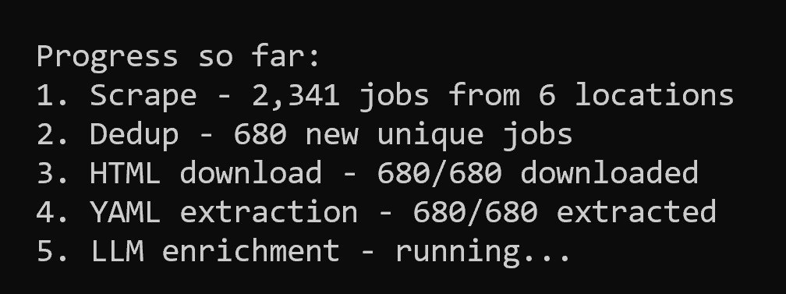

# AI Engineering Field Guide

[Project](https://github.com/alexeygrigorev/ai-engineering-field-guide)[^2]

The AI Engineering Field Guide collects and curates job listings for AI Engineer roles across multiple locations. The pipeline scrapes jobs and deduplicates them. It then downloads HTML pages, extracts structured data into YAML, and enriches entries using LLMs.

A new batch processed in late March 2026 scraped 2,341 jobs from 6 locations. That resulted in 680 new unique jobs after deduplication[^1][^2].

<figure>
  
  <figcaption>Field guide pipeline progress - scraping, deduplication, download, extraction, and LLM enrichment</figcaption>
  <!-- Shows the automated pipeline processing a new batch of job listings -->
</figure>

## Sources

[^1]: [20260327_123130_AlexeyDTC_msg3110_photo.md](../inbox/used/20260327_123130_AlexeyDTC_msg3110_photo.md)
[^2]: [20260327_145217_AlexeyDTC_msg3112.md](../inbox/used/20260327_145217_AlexeyDTC_msg3112.md)
