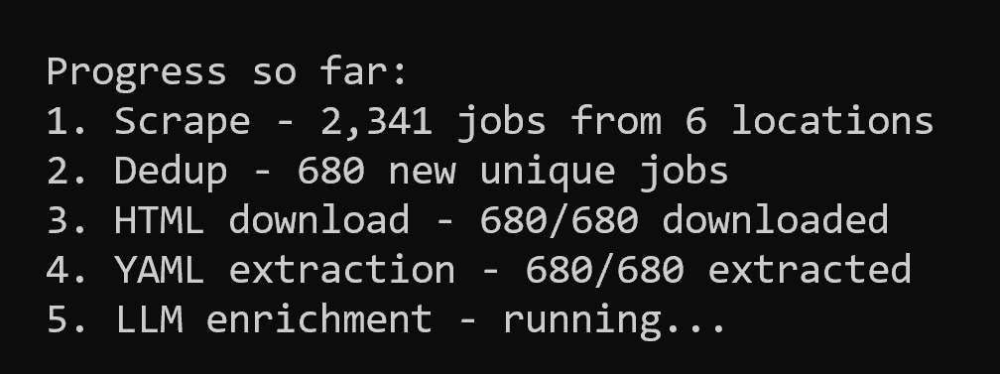

# AI Engineering Field Guide

[Project](https://github.com/alexeygrigorev/ai-engineering-field-guide)[^2]

The AI Engineering Field Guide collects and curates job listings for AI Engineer roles across multiple locations. The pipeline scrapes jobs and deduplicates them. It then downloads HTML pages, extracts structured data into YAML, and enriches entries using LLMs.

A new batch processed in late March 2026 scraped 2,341 jobs from 6 locations. That resulted in 680 new unique jobs after deduplication[^1][^2].

The scrape runs on a recurring basis. The goal is to keep collecting job postings throughout the year and then analyse the trends - to see what changes over this year and beyond. A late-May 2026 run scraped 2,751 listings and added 919 new unique jobs after deduplication, with the fresh dump holding around 4,000 unique vacancies[^3][^4].

A late-June 2026 run scraped 3,024 raw listings across the six locations and added 888 new unique jobs after deduplication against the 4,009-job global CSV. The dump now holds 4,894 total jobs (up from 2,445), spanning January through June 2026 across 1,954 unique companies. The LLM enrichment step ran on 12 parallel Z.ai/GLM-5.1 workers[^5].

Trend analysis on the collected job descriptions has begun. An early clustering pass (spherical k-means, k=6) surfaced six distinct role archetypes. SQL is the single fastest-rising skill, the "AI infra/inference engineer" role has not actually emerged yet (a useful null finding), and FDE (forward-deployed engineer) is a small but growing customer-facing archetype[^6].

<figure>
  
  <figcaption>Field guide pipeline progress - scraping, deduplication, download, extraction, and LLM enrichment</figcaption>
  <!-- Shows the automated pipeline processing a new batch of job listings -->
</figure>

## Sources

[^1]: [20260327_123130_AlexeyDTC_msg3110_photo.md](../inbox/used/20260327_123130_AlexeyDTC_msg3110_photo.md)
[^2]: [20260327_145217_AlexeyDTC_msg3112.md](../inbox/used/20260327_145217_AlexeyDTC_msg3112.md)
[^3]: [20260529_082620_AlexeyDTC_msg4351_transcript.txt](../inbox/used/20260529_082620_AlexeyDTC_msg4351_transcript.txt)
[^4]: [20260529_082326_AlexeyDTC_msg4349_photo.md](../inbox/used/20260529_082326_AlexeyDTC_msg4349_photo.md)
[^5]: [20260625_193805_AlexeyDTC_msg4639_photo.md](../inbox/used/20260625_193805_AlexeyDTC_msg4639_photo.md)
[^6]: [20260626_201403_AlexeyDTC_msg4641_photo.md](../inbox/used/20260626_201403_AlexeyDTC_msg4641_photo.md)
