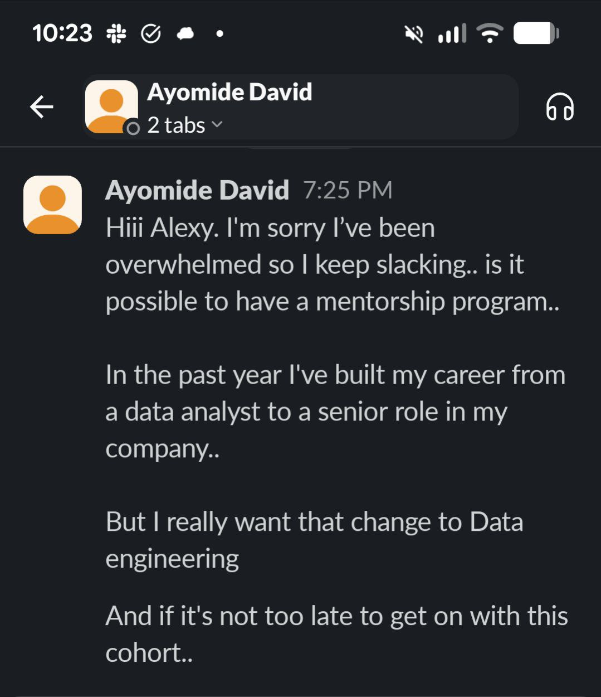
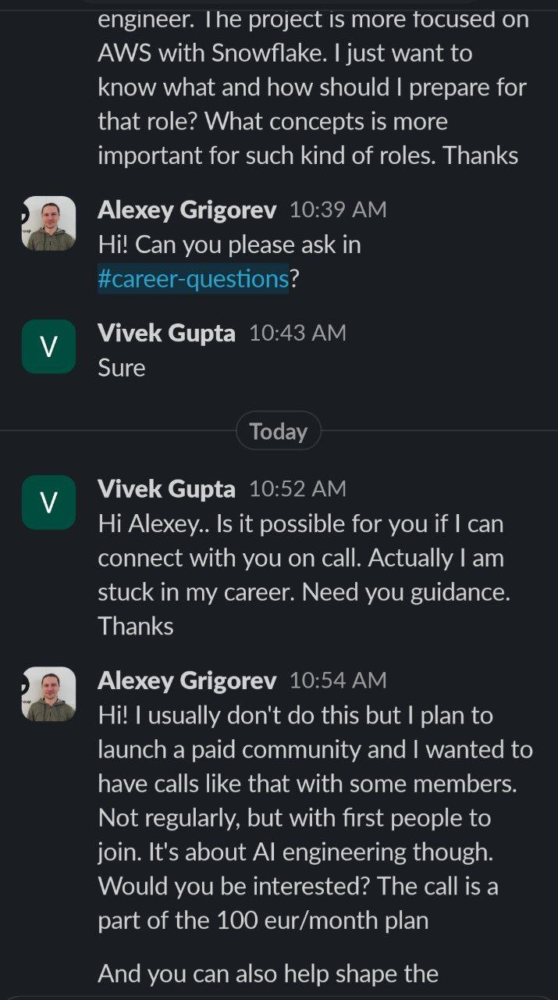
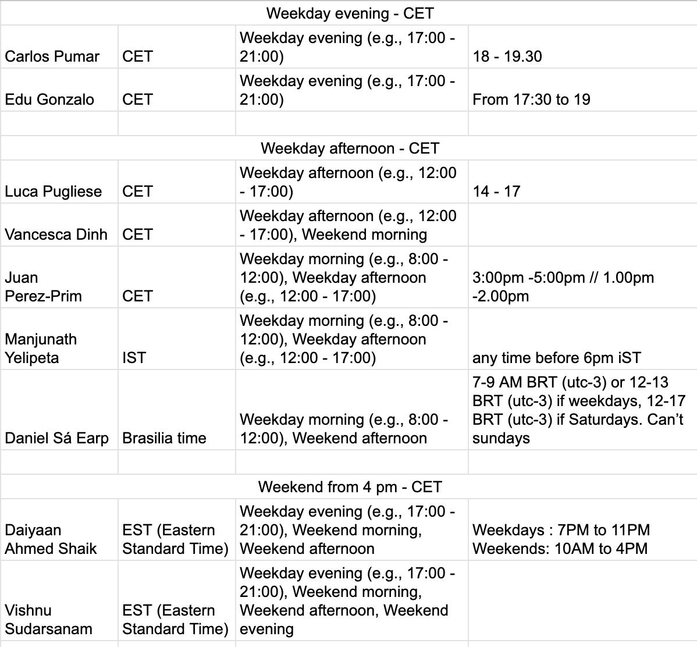
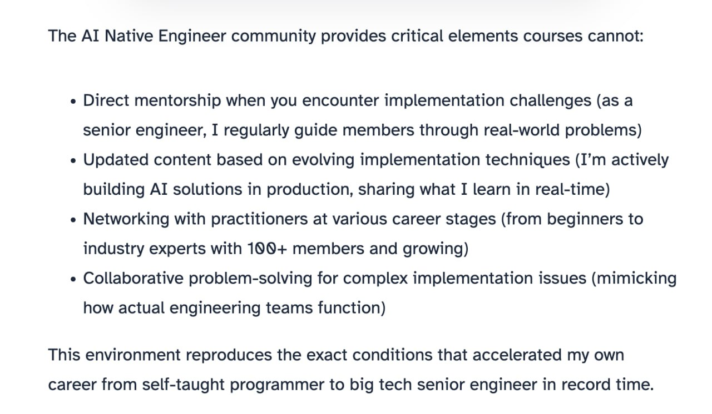

# AI Shipping Labs Community Activities

## Overview

- Project implementation sessions
- Paper implementation projects
- Hackathon-style community projects
- Resume review sessions (visible to all as community learning)
- Career advancement discussions
- Workplace effectiveness and productivity
- Group course study - when a new course comes out (e.g. from Andrej Karpathy), we go through it together as a group, creating structure for people to learn together[^72]
- Seminars - like university seminars where each person gets assigned a topic (an article, a technology, a new tool) to research, and then presents their findings on a call. Everyone learns from each other's research[^72]
- Book Reading Club - reading and discussing books together[^72]

These are three ideas that came up at once. Which tier they belong to still needs to be figured out. We can ask people what interests them and what resonates, and then build from there[^72].

These activities also help cut through the noise. There is a lot of noise on social media right now. People open social media and see others talking about many things, which creates FOMO. The community can help people focus on what is important instead of chasing everything[^72].

Key principle: the value should come from the community, not just from the founder. Activities should work even without direct involvement. The community should feel valuable even without direct founder involvement. This means designing activities that run themselves or are led by community members[^52].

## Regular Sessions

## Building sessions

Regular sessions (once or twice a month) where we get on a call for 1.5-2 hours and work on something together. This can be a problem being worked on right now, or a problem someone brings. The idea is to build something together live[^86].

## Accountability standups

Regular meetings where people report on their goals and progress - similar to standups at a company. Each person has an idea they want to work on (alone or with someone). For example: "I am looking for a job as an AI engineer. Here is what I am doing: I am working on a project, I have a plan, I have deliverables." They share what they did, what they plan to do, and what blockers they have[^86].

This can happen once a week. The question is who can lead these - ideally Valeria could run them. The preference is to focus on the building sessions personally, while getting to know all new members to understand how to help them specifically and collect ideas about what to do together[^86].

## Events calendar

The goal is to have a proper platform where people can see materials, have a calendar with events, and understand what activities are available and what is planned. People should be able to see a schedule and know what to expect[^86].

## Office Hours tied to LLM Zoomcamp

LLM Zoomcamp starts soon, and both people I talked to on Friday want to take it. The idea: do something inside AI Shipping Labs similar to what I did on Maven (office hours and so on) but only for AI Shipping Labs members[^95].

When LLM Zoomcamp starts, the framing would be: "There's a new community focused on AI, and our course is about AI. If you want to support me and support this course, you can join the community. If it's not for you, the course stays free, but if you want to support us, join the community"[^95].

By that time the Maven course should be finishing or close to finishing, so the office hours can be run personally for AI Shipping Labs subscribers[^95].

## Group course study in autumn

In the autumn we can find another course (not necessarily my own, maybe an open course from somewhere) and announce that we're going through it together. There are a lot of different courses I would also find interesting, and we can just go through them together[^96].

## Accountability and Mentoring

## The mentoring demand

People often ask me if I can mentor them. I usually say no, but suggest they use the community as a mentor (ask questions in the right channels at DataTalks Club and we can help with plans and implementation. Usually people do not do this. They want something more personal) someone to guide them by hand and watch what they are doing[^68].

## Accountability circles

I thought about how to address this within the new paid community. The idea came while riding a tram: create accountability groups or accountability circles. These are groups where people have their own tasks and plans (everyone has different goals) but they meet together regularly[^68].

This is similar to mastermind groups where people are roughly at the same level but have slightly different problems. Together they are better than each person individually - they complement each other and the collective level ends up one or two notches higher than any individual[^68].

These groups can be organized by focus area:
- Career-focused groups (meeting once a month)
- Project-focused groups (meeting once a week)

What happens in these groups: people share progress, talk about blockers, and get help from each other. It works like a regular standup at a company - you say what you did, what your plans are, and what blockers you have. Team members help resolve blockers and suggest solutions[^68].

## Why this works

The same mechanism that makes mentoring effective applies here. A person knows a session is coming in two days, realizes they have done nothing, and sits down to make progress. With group calls, the same effect kicks in - they know the meeting is coming, so they sit down and do the work to have something to show, a demo or progress to discuss[^68].

Scrum masters are usually not technical people. The real help comes from everyone in the team ("you could do this, you could try that." This is essentially group mentoring. The right term is mastermind groups) people at roughly the same level but with slightly different problems who complement each other[^68].

## Redirecting mentoring requests

I want to send all people who ask me for mentoring to this community. I will say: "Look, here is what we do. We create these groups. I will not mentor you personally, but I will give you a structure to follow." We can discuss their plan together. This does not have to be synchronous - we do not have to schedule calls[^69].

A framework can be designed where people describe their problem and I provide a solution. They could record a voice message or video describing their problem. I run it through an LLM, and based on ready-made plans, select the most suitable one and send it to them. Their task is to follow that plan[^69].

This starts as one-on-one but can be automated over time. Initially it takes a lot of my involvement, but as more ready-made plans accumulate, the task becomes just selecting a similar plan and adjusting it for the person[^69].

## Validating the idea

I will write to everyone who has recently asked me for mentoring and ask how interested they would be in this. A woman recently reached out wanting help with AI skills - she seems like an ideal candidate for this. Once we formulate this better and launch the community, I will reach out, offer a call, and tell her about this idea[^70].

My hypothesis is that people who ask for mentoring need an accountability partner or accountability structure - someone to report progress to. This is a hypothesis that can be tested[^68].

Another confirmation of this hypothesis: a community member wrote asking for a mentorship program. They built their career from a data analyst to a senior role at their company but want to transition to Data Engineering. They admit they keep "slacking" and need the push. This person is more interested in Data Engineering, but there are likely people in the same situation who are interested specifically in AI Engineering[^74].

<figure>
  
  <figcaption>Community member asking for mentorship - admits to slacking without accountability</figcaption>
  <!-- Another validation of the accountability hypothesis - the person explicitly says they need structure to stop slacking -->
</figure>

The same day, two people wrote asking for career consultations. One said even 50 euros is too much, the other seemed fine with the price. Both are data engineers. For people who want consultations, the community could provide value and some form of help[^75].

<figure>
  
  <figcaption>Second career consultation request in one day - asking to connect on a call for career guidance</figcaption>
  <!-- Shows demand for career consultations and how the paid community could serve these people -->
</figure>

## Sprint-based format

Instead of running these groups continuously (like "every Tuesday"), a more organized approach would be to run them in sprints or cohorts[^71].

Benefits of sprints:
- Promotion opportunity - "our 10th sprint is starting, here are results from sprint 9" to attract new members
- Easier to plan vacations and breaks
- Clear understanding of participation numbers - if 10 people sign up, expect 7 to start and 3 to finish
- Ongoing social media promotion - "new cohort starting" creates regular marketing moments[^71]

Continuous activities lose interest over time, like "Book of the Week" or "Project of the Week" where interest fades. Running in sprints with periodic pauses helps avoid this. Sprints can have different focus areas. Taking breaks to rethink and adjust is valuable[^71].

## Sprint weekly call format

This is the format I have in mind for the AI Shipping Labs accountability sprints. People meet once a week on a call, and each person gives a status update in turn (the order can be free or fixed - we can think about it).

The status update has three parts[^97]:

- What I worked on this week - so other people know what is going on
- Blockers - this is where the rest of the community can help
- Plans for next week - so people know what to expect, and so the speaker has a target to aim for[^97]

Weeks 2 to 5 follow this format. The first call is different: we can spend a bit on the format itself, and ask each person to introduce themselves in about 5 sentences and describe in 5 sentences what they plan to do over the next 5 weeks. We might also want to ask people in advance how they feel about being recorded - some things they would prefer to say off the record[^97].

The last week of the sprint is a demo: people show what they ended up with[^97].

Not everyone will be able to join every call - day jobs, timezones, or just a busy week. People who cannot make a call (or who skip a week) can post the same status in Slack: what I worked on, blockers, plans for next week. The plans are a rough draft and can be adjusted during the week[^97].

The framing for these sprints is "accountability sprints" inside AI Shipping Labs[^98].

## Scaling sprint moderation and member networking

After collecting timezone availability for the May sprint, 9 people responded. The answers fell into three groups - a CET weekday-evening group, a CET weekday-afternoon group, and a weekend / IST / Americas group[^99].

<figure>
  
  <figcaption>Three groups by availability after 9 people responded to the May sprint timezone survey</figcaption>
  <!-- Visual source for the three-group split described in this section -->
</figure>

One of these groups lands on the weekend, which is not equally convenient for both of us[^100]. It is not easy to set up[^101].

The bigger question is moderation: with many groups and only two of us (Alexey and Valeriia), how do we run all of these calls without our time becoming the bottleneck[^100]?

The short-term answer is for Valeriia to join the groups and observe. The longer-term question is how to design this so that the number of groups can grow to five or more without us having to actively participate in everything. Both of us have limited time, so the format needs to scale[^100].

### Pair and triple accountability partners

One direction is to split people into groups of 2-3 - accountability partners who call each other and discuss progress between themselves. This is easier on us and on them: each person tracks their partner instead of trying to follow what everyone in a large group is doing. The plan is to propose this to people, see what they think, and try it in the next sprint[^105].

For pairs of two, moderating does not make sense. They can discuss between themselves, and the only role left for us is verifying that they are on the call and creating the meeting link. For groups around five people, moderation does still make sense[^103].

The risk in a pair of two is that one person can drop out of the sprint. The challenge is catching that early so the remaining person can be moved into another group instead of being left without a partner[^105].

This pair / triple format also serves networking - more on that below.

### People drop in and out

Even without the pair-vs-group question, the same problem comes up: people come and go. Vancesca might be free now and overloaded at work next month. The format cannot depend on specific individuals staying active[^102].

This is something that happens regularly at DataTalks.Club too. Someone gets very active for a while and then disappears. Usually something has come up - work, life, something else. Sometimes they come back, sometimes not. DataTalks.Club is a free community and ours is paid, but the same pattern shows up here as well: a portion of our members are there because they came through a course, and joining the community costs them nothing extra, so there is no built-in reason for them to stay active. The general truth is that people are more active in some periods than others - planning around constant activity is wrong[^106].

A more concrete trigger for this thinking is that some previously active members have gone quiet recently and are not answering messages[^104].

### Champions or group leaders

One possible direction is that over time we notice which people are more active, and they become "champions" or group leaders - members who can act as moderators for their group. This is an idea worth keeping in mind, with the caveat from the previous point that depending on specific individuals is fragile[^101].

### Member-to-member networking

A separate motivation for pair / triple groups is networking. Right now the shape is one-to-many: we talk to everyone, so we know everyone, but members do not really know each other. Accountability partners help fix that - people get to know each other, help each other, and the community starts to feel like something where people do things together, not just something the two of us coordinate[^107].

People should be able to come to the community for the networking too, not only for the accountability we can provide. Knowing other members and helping each other is part of the value people should be getting out of this[^110].

The hypothesis is that these internal connections - formed through activity in the community - end up being useful to people, retain them inside the community, and lead them to invite friends and colleagues[^111][^112].

### School-inspired guide pattern for new members

In our kid's school, first and second grade are combined into one class. The idea is that the second grader mentors the first grader. The first grader shows up and does not know anything - what is here, where things are - and the second grader shows them around: here is the cafeteria, here is where we play games, here is the sandbox. The second grader gets a real responsibility - mentoring the first grader - and they all walk around feeling important and responsible[^108].

The community version of this: as the community grows, new members get paired with an existing member - not a mentor in the formal sense, just someone who can help them get oriented. That way the onboarding conversations are not only the two of us talking to every new person. Other members talk to the new person, and they learn who in the community can be useful to whom[^108].

### Random coffee pairings

Another idea worth trying: random coffee, where a bot connects two people and tells them "you two, go talk." This worked very well at work during COVID. It might be worth running in the community too[^109].

### Status

This whole section is a brain dump after a discussion with Valeriia. The ideas are written down to think about, not finalised as a plan yet[^109][^110].

## Monthly themes with deadlines

Another idea for accountability in Tier 1 (the newsletter tier): dedicate each month to a specific topic. For example, April is the month of RAG. Provide a plan for how to study it, set deadlines, and send short reminder messages - "today is the deadline for this part, did you do it or not?" This gives structure even without the community tier[^88].

It could also work to announce peer review at the end of each month. Although peer review might be too complex since people join at different times. The core idea is that beyond content, there should be a plan with deadlines and accountability reminders[^88].

## Member onboarding process

For existing community members, the plan is to create a format for understanding each person's goals. What do they want to learn in the next month? What project do they want to build? Then give them personal feedback (as promised in the launch) and help them start building or studying a topic. Events should be added to the shared calendar where members present what they built and discuss their problems[^89][^90].

One approach: Valeriia calls each member to learn their expectations and goals. She records the calls through Gemini to get transcripts. Then she loads the transcripts into the bot or shows them to Alexey, who reviews all the descriptions and provides feedback. Valeriia then sends a message to each member: "Alexey reviewed your case, here is what you can work on this month, let us know if you have questions"[^91].

This could also be done directly on the platform if it is working - put descriptions and learning plans in member profiles on AI Shipping Labs. Track progress for each person: on this date we gave you the plan, on this date we met, on this date you built this[^92].

The outreach message to members: "Hi, we are launching the community. I previously asked about your expectations and content requests. Now we want to start an activity where everyone has their own project to work on. Let's get on a call to discuss your case, your ideas, or maybe you already have a project idea. Then Alexey will review your ideas and help make a plan, and we will send you feedback"[^93].

For those who do not want to get on a call, a Google Form with the same questions works. For those who do not want to fill out a form, the same questions can be asked through chat. Having a standardized set of questions makes it easier for Alexey to review all the applications. The goal is to learn the most important things about each person[^94].

## Launch preparation

Vishnu, who was on a previous call, wrote asking when the community launches. Valeriia told him Monday and that there will be a newsletter announcement today. An announcement is also needed inside the community about the launch and the planned events. The events are all on Luma AI Shipping Labs (Valeriia added Alexey as an admin there) and need to be reviewed to make sure everything looks right[^89].

## Career Development

## Resume review sessions

When doing resume review sessions that are visible to the community as learning, there is a question of how to select participants:

- Random selection from those interested
- Premium tier members guaranteed to get reviewed
- Waitlist system where premium members get priority

One challenge: people usually need resume reviews immediately when job searching, not on a monthly schedule. A possible approach is when you join the premium tier, you get added to a waitlist, and we do a certain number per month[^53].

## Conference speaking support

Another potential community benefit: maintain a regularly updated list of conferences and help community members participate as speakers by connecting them with organizers. This provides tangible career value and public speaking experience[^29].

## Learning in public and personal branding

A key benefit for the paid community: helping members with career advancement through learning in public and personal branding.

This would include guidance on:

- How to properly do learning in public
- How to create content effectively
- How to promote on X (Twitter) and LinkedIn
- How to generate ideas for content
- How to maintain consistency in posting

Personal branding was instrumental in career advancement - the founder was hired for a previous job because they were already known and wanted by the employer[^31]. This is particularly valuable for students who want career advancement or are looking for new jobs.

The idea is to create resources about promotion on X, LinkedIn, and creating personal websites. This could include round table sessions for personal brand reviews, where community members can give each other feedback and help each other with social media algorithms[^28].

The community aspect is important here - when more people are involved in a founders-type community, there is less pressure for content to come only from one person. Community members also participate and create things, making it feel more like a collective effort rather than a one-person show[^27].

Examples of content that could be shared include behind-the-scenes work for community projects, such as building visualization tools or websites. The community manager role encompasses moderating, creating content, formatting, and promoting both content and the community itself[^30].

## Mentorship and guidance

- Direct mentorship for implementation challenges
- Updated content based on evolving techniques
- Networking with practitioners at various career stages
- Collaborative problem-solving for complex issues

The environment should reproduce the conditions that accelerate career growth, similar to how the founder went from self-taught to big tech senior engineer.

## Knowledge Sharing

## Research and content reviews

Based on research of other communities like "AI Native Engineer", potential activities include:

<figure>
  
  <figcaption>Example from AI Native Engineer showing the key elements that communities can provide beyond courses</figcaption>
  <!-- This illustrates direct mentorship, updated content, networking, and collaborative problem-solving -->
</figure>

- Weekly or bi-weekly reviews of new research papers
- Hot articles and tools worth exploring
- Members can be assigned to research specific topics and share findings
- This creates engagement and distributes content creation workload

## Private Community Benefits

One advantage of a private community is the ability to share insights and discuss topics that would not be appropriate in public channels.

Members can share insights from interviews and discuss interview preparation questions that they might not want to discuss publicly. For example, someone might say they are interviewing somewhere and share what questions are being asked, asking for help preparing. In a public community like DataTalks Club, their current employer might see this[^5].

Some members might want to go to interviews not because they are actively looking for a job, but to understand what the market is asking for and what skills are in demand.

They might not want to discuss this publicly because:
- Their current employer might see it and think they are leaving
- Some people might consider it unethical to interview without serious intent to change jobs
- Public visibility could create awkward professional situations

In a private community, these kinds of discussions can happen more freely. The private community enables sharing of insights and experiences from interviews, salary negotiations, and other career-related topics that people prefer not to discuss in public forums where their current employer or colleagues might see them[^5].

## Sources

[^5]: [20260210_215004_AlexeyDTC_msg1303_transcript.txt](../../inbox/used/20260210_215004_AlexeyDTC_msg1303_transcript.txt)
[^27]: [20260211_102558_AlexeyDTC_msg1417.md](../../inbox/used/20260211_102558_AlexeyDTC_msg1417.md)
[^28]: [20260211_102558_AlexeyDTC_msg1418.md](../../inbox/used/20260211_102558_AlexeyDTC_msg1418.md)
[^29]: [20260211_125822_valeriia_kuka_msg1429.md](../../inbox/used/20260211_125822_valeriia_kuka_msg1429.md)
[^30]: [20260211_102558_AlexeyDTC_msg1419.md](../../inbox/used/20260211_102558_AlexeyDTC_msg1419.md)
[^31]: [20260211_102558_AlexeyDTC_msg1420.md](../../inbox/used/20260211_102558_AlexeyDTC_msg1420.md)
[^52]: [20260212_120318_AlexeyDTC_msg1556.md](../../inbox/used/20260212_120318_AlexeyDTC_msg1556.md)
[^53]: [20260212_122718_AlexeyDTC_msg1559_transcript.txt](../../inbox/used/20260212_122718_AlexeyDTC_msg1559_transcript.txt)
[^68]: [20260213_152027_AlexeyDTC_msg1610_transcript.txt](../../inbox/used/20260213_152027_AlexeyDTC_msg1610_transcript.txt)
[^69]: [20260213_152227_AlexeyDTC_msg1611_transcript.txt](../../inbox/used/20260213_152227_AlexeyDTC_msg1611_transcript.txt)
[^70]: [20260213_152303_AlexeyDTC_msg1612_transcript.txt](../../inbox/used/20260213_152303_AlexeyDTC_msg1612_transcript.txt)
[^71]: [20260213_153009_AlexeyDTC_msg1623_transcript.txt](../../inbox/used/20260213_153009_AlexeyDTC_msg1623_transcript.txt)
[^72]: [20260214_092313_AlexeyDTC_msg1669_transcript.txt](../../inbox/used/20260214_092313_AlexeyDTC_msg1669_transcript.txt)
[^74]: [20260217_092429_AlexeyDTC_msg1885_transcript.txt](../../inbox/used/20260217_092429_AlexeyDTC_msg1885_transcript.txt), [20260217_092405_AlexeyDTC_msg1883_photo.md](../../inbox/used/20260217_092405_AlexeyDTC_msg1883_photo.md)
[^75]: [20260217_100942_AlexeyDTC_msg1894_transcript.txt](../../inbox/used/20260217_100942_AlexeyDTC_msg1894_transcript.txt), [20260217_095600_AlexeyDTC_msg1891_photo.md](../../inbox/used/20260217_095600_AlexeyDTC_msg1891_photo.md)
[^86]: [20260320_152314_AlexeyDTC_msg3037_transcript.txt](../../inbox/used/20260320_152314_AlexeyDTC_msg3037_transcript.txt)
[^88]: [20260410_095445_AlexeyDTC_msg3332_transcript.txt](../../inbox/used/20260410_095445_AlexeyDTC_msg3332_transcript.txt)
[^89]: [20260410_095445_AlexeyDTC_msg3333_transcript.txt](../../inbox/used/20260410_095445_AlexeyDTC_msg3333_transcript.txt)
[^90]: [20260410_095445_AlexeyDTC_msg3334_transcript.txt](../../inbox/used/20260410_095445_AlexeyDTC_msg3334_transcript.txt)
[^91]: [20260410_095445_AlexeyDTC_msg3335_transcript.txt](../../inbox/used/20260410_095445_AlexeyDTC_msg3335_transcript.txt)
[^92]: [20260410_095445_AlexeyDTC_msg3336_transcript.txt](../../inbox/used/20260410_095445_AlexeyDTC_msg3336_transcript.txt)
[^93]: [20260410_095445_AlexeyDTC_msg3337_transcript.txt](../../inbox/used/20260410_095445_AlexeyDTC_msg3337_transcript.txt)
[^94]: [20260410_095445_AlexeyDTC_msg3338_transcript.txt](../../inbox/used/20260410_095445_AlexeyDTC_msg3338_transcript.txt)
[^95]: [20260427_091223_AlexeyDTC_msg3677_transcript.txt](../../inbox/used/20260427_091223_AlexeyDTC_msg3677_transcript.txt)
[^96]: [20260427_091223_AlexeyDTC_msg3678_transcript.txt](../../inbox/used/20260427_091223_AlexeyDTC_msg3678_transcript.txt)
[^97]: [20260430_082614_AlexeyDTC_msg3763_transcript.txt](../../inbox/used/20260430_082614_AlexeyDTC_msg3763_transcript.txt)
[^98]: [20260430_082629_AlexeyDTC_msg3765_transcript.txt](../../inbox/used/20260430_082629_AlexeyDTC_msg3765_transcript.txt)
[^99]: [20260521_074535_AlexeyDTC_msg4224_photo.md](../../inbox/used/20260521_074535_AlexeyDTC_msg4224_photo.md)
[^100]: [20260521_074535_AlexeyDTC_msg4227_transcript.txt](../../inbox/used/20260521_074535_AlexeyDTC_msg4227_transcript.txt)
[^101]: [20260521_074535_AlexeyDTC_msg4228_transcript.txt](../../inbox/used/20260521_074535_AlexeyDTC_msg4228_transcript.txt), [20260521_074535_AlexeyDTC_msg4225.md](../../inbox/used/20260521_074535_AlexeyDTC_msg4225.md)
[^102]: [20260521_074535_AlexeyDTC_msg4229_transcript.txt](../../inbox/used/20260521_074535_AlexeyDTC_msg4229_transcript.txt)
[^103]: [20260521_074535_AlexeyDTC_msg4230.md](../../inbox/used/20260521_074535_AlexeyDTC_msg4230.md), [20260521_074535_AlexeyDTC_msg4226.md](../../inbox/used/20260521_074535_AlexeyDTC_msg4226.md)
[^104]: [20260521_074535_AlexeyDTC_msg4231.md](../../inbox/used/20260521_074535_AlexeyDTC_msg4231.md)
[^105]: [20260521_074535_AlexeyDTC_msg4232_transcript.txt](../../inbox/used/20260521_074535_AlexeyDTC_msg4232_transcript.txt)
[^106]: [20260521_074535_AlexeyDTC_msg4233_transcript.txt](../../inbox/used/20260521_074535_AlexeyDTC_msg4233_transcript.txt)
[^107]: [20260521_074535_AlexeyDTC_msg4234_transcript.txt](../../inbox/used/20260521_074535_AlexeyDTC_msg4234_transcript.txt)
[^108]: [20260521_074535_AlexeyDTC_msg4235_transcript.txt](../../inbox/used/20260521_074535_AlexeyDTC_msg4235_transcript.txt)
[^109]: [20260521_074535_AlexeyDTC_msg4236_transcript.txt](../../inbox/used/20260521_074535_AlexeyDTC_msg4236_transcript.txt)
[^110]: [20260521_074615_AlexeyDTC_msg4250_transcript.txt](../../inbox/used/20260521_074615_AlexeyDTC_msg4250_transcript.txt)
[^111]: [20260521_080138_AlexeyDTC_msg4260.md](../../inbox/used/20260521_080138_AlexeyDTC_msg4260.md)
[^112]: [20260521_080154_AlexeyDTC_msg4262.md](../../inbox/used/20260521_080154_AlexeyDTC_msg4262.md)
