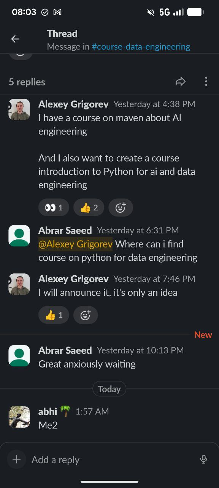

# AI Shipping Labs Course Ideas

Several ideas for courses that could be offered in the community.

## Specification-Driven Development for AI

A course about becoming a good product manager to effectively communicate with AI agents. The core insight: programmers now need to become good product managers to tell agents what to do. When the specification is not good, the agent produces garbage. If the agent misunderstands the request and does something completely different, it is the programmer's fault for not communicating clearly enough[^1].

The course would teach how to properly communicate to agents what they need to do and how to manage development when the team is made of agents[^1].

### Course structure

The course can cover software development methodologies more broadly - how teamwork happens, what roles exist in a team. Then map this to agents: you are now the product manager, the agents are the implementers[^2].

Topics to cover[^2]:
- How to set tasks in a way that is maximally clear
- What grooming is
- Product management in general
- Acceptance criteria - they must be clear
- Specifications - they must exist
- Kanban

### Final project

The course output will be a kanban board for agents - an application that everyone builds together throughout the course. The graduation project is to build any project of their choosing[^2].

### Domain-driven design module

The course could include a domain-driven design component[^11]:
- Have event storming sessions
- Have an actual team of agents for discussing things, each with their own personality (so a personality generator is needed)
- Outcome: a shared vocabulary document

There is already research on spec-driven development patterns and tools collected in the [Spec-Driven Development research article](../research/spec-driven-development.md).

## Refactoring AI Slop

A course called "Refactoring AI Slop." The idea came from thinking about learned helplessness - people who used to know how to program now fully delegate to LLMs and lose the skill. People who never programmed do not learn either[^3].

We can now generate large amounts of code, but then we need to look at what we got and manage the project in a way that minimizes the amount of slop. The course would cover how to set up a project so that slop is minimized from the start, how often to do code reviews, and how to organize the development process with agents[^3].

The course would also cover removing slop: examining examples of slop, dealing with defensive coding (which causes many problems), how to fight it, how to refactor it, and how to make sure it does not keep happening[^3].

AI-generated code has specific problems: it contains too much boilerplate, too much defensive coding, it is hard to read, and it is often overly complex. LLMs also tend to reuse things that could easily be replaced with a library, which results in a lot of unmaintainable code[^3][^4].

The idea is to transform unmaintainable code into maintainable code - following clean code recommendations, checking that tests are meaningful (not written just for test count), and actually useful[^4].

This is related to the idea of the Spec-Driven Development course but with a different focus. Spec-Driven Development is about communicating with agents effectively. Refactoring AI Slop is about what to do with the code afterwards - how to bring it to a normal state[^3].

The course can also serve as a reminder of best coding practices, clean code from Robert Martin, and how we used to write code versus how we write it now. It could cover reading tests, deleting useless tests, and making agents work properly[^3].

One caveat: when I am the only user of the code, if something breaks, I just run an agent to fix it. But when we talk about a platform used by multiple people or a library that many people use, the requirements are different. And since I work in education and show code to students, I want the code to be maximally understandable. AI-generated code is not always understandable, which makes it hard to use as teaching material[^3].

## Python for AI and Data Engineering

The Python course idea is to take all existing Zoomcamps and the Buildcamp, analyze what Python is needed there, and create a course based on that. Target audience: both AI and data engineers[^5].

### Student interest

Students are already asking about paid courses. This is a positive signal for the Python course idea[^8].

<figure>
  
  <figcaption>Students already inquiring about upcoming AI engineering and Python courses in the community</figcaption>
  <!-- This shows existing demand for courses being planned -->
</figure>

## AI Data Engineering course

Want to create a course on data engineering for AI - how all these AI tools can be used to build pipelines. This area is underserved - little content exists on how data actually gets into agents in reality. Everyone talks about having a clean dataset and building an agent, but not how the data gets there. Several modules on the new Maven course should be dedicated to this topic[^6].

### Market demand

There seems to be less demand and less content about data engineering for AI compared to generic AI engineering. This might actually be an advantage - an underserved niche where we can create something and see how it works. The community should cover these topics to attract people interested in both areas[^7].

## Maven course continuation

Want to continue the AI Engineering course on Maven with focus on creating AI products. This attracts AI engineers who will be interested and potentially buy the course[^9].

## CloudCode and AI Assistant Development

Want to create a course about CloudCode and AI Assistant Development as a supplement to the existing AI DevTools content. This would focus on:
- How to configure and customize these tools
- Specific tricks and workflows discovered from using these tools for two years
- Less structured but very practical content
- Sharing experience and knowledge with community members[^10]

## Build Docker from scratch workshop

Workshop idea: build Docker from scratch. Inspired by a [tweet from John Crickett](https://x.com/johncrickett/status/2047694453733773472)[^12].

## Testing workshop

There is not much content available on testing, so want to create a mini-course on testing with focus on Python. Topics would include:
- Simple unit tests
- Integration tests
- How to test agents (though this might already be covered in AI Buildcamp)
- A course spanning several weeks[^10]

## DevOps and infrastructure

Topics where there is not much content available:
- Environment setup and management
- DevOps practices
- Terraform
- GitHub actions[^10]

## Course format strategy

The plan is to have at least one big course on Maven (if time permits), while the rest would be mini-courses available in the community at tier 3. Will actively ask people what they're interested in and monitor what content they engage with most[^10].

## Sources

[^1]: [20260301_085144_AlexeyDTC_msg2642_transcript.txt](../../inbox/used/20260301_085144_AlexeyDTC_msg2642_transcript.txt)
[^2]: [20260301_092840_AlexeyDTC_msg2648_transcript.txt](../../inbox/used/20260301_092840_AlexeyDTC_msg2648_transcript.txt)
[^3]: [20260320_063747_AlexeyDTC_msg3022_transcript.txt](../../inbox/used/20260320_063747_AlexeyDTC_msg3022_transcript.txt)
[^4]: [20260320_063926_AlexeyDTC_msg3024_transcript.txt](../../inbox/used/20260320_063926_AlexeyDTC_msg3024_transcript.txt)
[^5]: [20260212_071345_AlexeyDTC_msg1474_transcript.txt](../../inbox/used/20260212_071345_AlexeyDTC_msg1474_transcript.txt)
[^6]: [20260212_071345_AlexeyDTC_msg1475_transcript.txt](../../inbox/used/20260212_071345_AlexeyDTC_msg1475_transcript.txt)
[^7]: [20260212_071639_AlexeyDTC_msg1477_transcript.txt](../../inbox/used/20260212_071639_AlexeyDTC_msg1477_transcript.txt)
[^8]: [20260212_070350_AlexeyDTC_msg1463_photo.md](../../inbox/used/20260212_070350_AlexeyDTC_msg1463_photo.md)
[^9]: [20260212_071140_AlexeyDTC_msg1471_transcript.txt](../../inbox/used/20260212_071140_AlexeyDTC_msg1471_transcript.txt)
[^10]: [20260212_095052_AlexeyDTC_msg1487_transcript.txt](../../inbox/used/20260212_095052_AlexeyDTC_msg1487_transcript.txt)
[^11]: [20260415_105059_AlexeyDTC_msg3397.md](../../inbox/used/20260415_105059_AlexeyDTC_msg3397.md)
[^12]: [20260425_113656_AlexeyDTC_msg3663.md](../../inbox/used/20260425_113656_AlexeyDTC_msg3663.md)
