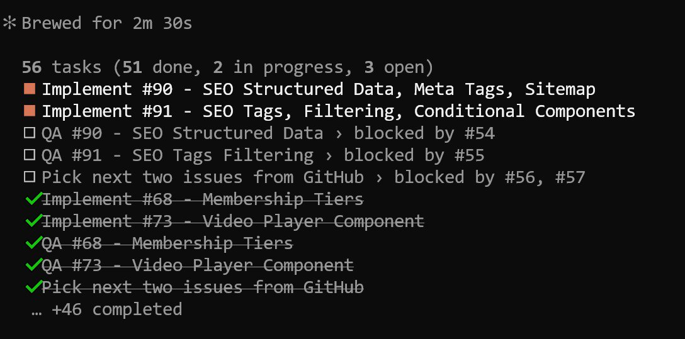
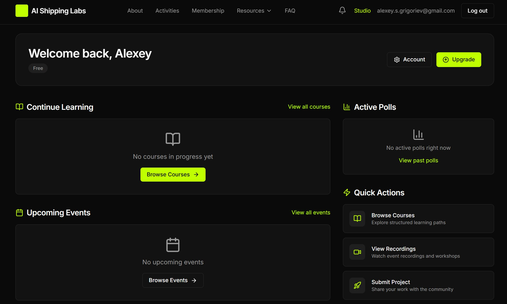

# Launching AI Shipping Labs: A Community for AI Builders

[Valeriia and I](https://aishippinglabs.com/about) are launching a new community for AI builders - AI Shipping Labs. We've been working together on DataTalks.Club for a long time, and now we're building something new. In this article I will tell you what it is, who it is for, and how we built the entire platform using AI agents.

<!-- illustration -->

## AI Shipping Labs

AI is moving fast. Every week there's a new framework, a new "must-learn" tool, and no clear answer on what you should actually focus on.

- You don't know where to start
- You followed a tutorial but can't build something on your own
- You built a prototype but it breaks in ways you don't know how to fix
- You have a main job and your AI project keeps getting pushed to "next weekend"

The common pattern: you're learning alone, without structure, and things stall.

AI Shipping Labs changes that. It's a community where you learn to build AI products by actually building and shipping them - with a clear plan, a group of practitioners alongside you, and regular check-ins that keep you moving forward.

<!-- illustration: screenshot of aishippinglabs.com landing page -->

## Who this is for

You might be:

- A software engineer who wants to move into AI - you already have the engineering skills, but not yet AI-specific knowledge
- An AI/ML engineer who wants to go deeper - move from "it works" to reliable systems
- A researcher or data scientist who wants to ship - you understand models but need to learn deployment, APIs, and engineering practices
- An analyst or PM with programming basics who wants to start building AI applications

The common thread: you want to build and ship AI products, not just learn about them.

## What happens inside

When you join, we'll figure out together where you are and where you want to go. You'll get a clear plan - and the community will help you get there.

- Building sessions - regular live calls where we build something together
- Group learning - going through courses and new materials together
- Accountability circles - mastermind groups with regular check-ins
- Career support - resume reviews, personal branding, conference speaking
- Private discussions - interview prep, salary negotiations, career moves
- Courses - mini-courses on specialized topics

## Building sessions and group learning

We get on a call once or twice a month and build something together for 1.5 to 2 hours. It could be a problem I'm working on, or something a member brings.

We also run seminars where members research a topic and present their findings, and we go through new courses and materials as a group.

## Career support

We help members with resume and LinkedIn reviews - getting feedback from people who have been through the hiring process and know what works.

We also help with personal branding - how to do learning in public, create content on LinkedIn and X, and build a presence that opens doors.

If you want to speak at conferences, we can help with that too - from finding the right events to preparing your talk.

Because it's a private community, you can talk about things you wouldn't bring up publicly. What questions companies are asking in interviews right now, how to negotiate a better offer, whether you should leave your current job.

## Accountability circles

I get asked for mentoring all the time. I usually say no because I don't have the bandwidth - and one-on-one mentoring doesn't scale.

But I've realized that what most people actually need is not a mentor - they need an accountability structure. They want a plan, a deadline and a reason to show up prepared.

So we're creating mastermind groups where people are at a similar level but facing different problems. It works like a company standup - you say what you did, what you plan to do, and what's blocking you. The group helps resolve those blockers, and you learn a lot from each other.

<!-- illustration: diagram or visual showing how accountability circles work - small groups, regular meetings, progress sharing -->

These run in sprints rather than continuously, so there's always a clear start and end.

## Courses

Mini-courses on specialized topics are coming. These will be shorter and more focused than a full Buildcamp. Think several weeks rather than several months.

As an early member, you help shape which courses get built. Members vote on what gets built next.

Some ideas we already have:

- Python for AI Engineering - a comprehensive Python course for preparing for AI engineering, but it will also help you anywhere Python is needed
- Spec-Driven Development for AI - how to write clear specifications and manage a team of AI agents
- Refactoring AI Slop - how to deal with AI-generated code that has too much boilerplate, too much defensive coding, and is hard to maintain

These are ideas, not promises. What actually gets built depends on what the community needs.

## The tiers

There are three tiers, available monthly or annually.

<!-- illustration: pricing cards from the website -->

- Basic is for self-directed builders who prefer learning at their own pace.
- Main adds the structure, accountability, and community support to ship projects consistently.
- Premium adds structured courses and personalized feedback.

## Early member benefit

Everyone joining main and premium now gets a personal onboarding - a short call, voice message exchange, or async conversation to understand your goals and how the community can help. Not a generic welcome email. This is something I can do while the community is small.

## How to join

Head to aishippinglabs.com, select the plan and sign up!

This is a brand new platform, and some automations might not work perfectly yet. If you sign up and do not get access automatically, just reply to this email and let me know - I will sort it out.

## Why starting something new

Many of you know me from DataTalks.Club. It's not changing - the principle of free education for everyone stays the same. LLM Zoomcamp, Data Engineering Zoomcamp, ML Zoomcamp - all of that continues.

But I have been wanting something different for a while. The idea evolved step by step:

- First, I ran the AI Engineering course on Maven, and the students showed me there's real demand for structured, paid learning. They were engaged, they wanted to keep going after the course ended
- Then I started a personal newsletter - a place to share what I learn and try every day, separate from DataTalks.Club
- That made me want a smaller group where I could go deeper - live sessions, solving problems together, exchanging experiences

Everything connected organically into a community.

## How I built the platform behind it

Now that you know what AI Shipping Labs is about, I also wanted to share how I built the platform behind it. It was built almost entirely by AI agents working autonomously.

The original plan was to use something existing. We evaluated several platforms:

- Substack - natural fit for a paid newsletter, but did not support the tier plans we needed
- Ghost - works perfectly for articles behind a paywall, but falls short for course management, event scheduling, and community features
- Maven - great for courses, but no API for programmatic student registration and missing other features we needed

No single platform could handle everything we needed.

Then I thought - what if I show Claude Code all these requirements and ask it to implement them? I estimated about a week of work. I had been using Claude Code for a few months on small projects and wanted to try something larger.

## From requirements to specs to tasks

The requirements gathering happened through my Telegram bot. I dictated features into the bot. Valeriia discussed hers in ChatGPT, and we added those too (the bot could easily access them).

Then I told Claude Code to turn that raw requirements list into specifications. It created a "specification" folder with 15 files. I reviewed them, gave feedback, and then said: now turn these specs into tasks on GitHub Issues.

The first attempt at task decomposition was not great - too granular, no acceptance criteria. I iterated on the format until each task had a clear scope, acceptance criteria with checkboxes, and a "human" tag for anything that needed manual verification.

<!-- illustration: screenshot of a GitHub issue showing the task format with scope, acceptance criteria checkboxes, and human tag -->

I chose Django for the framework. I have known Django since 2010, and if something breaks, it'd be easier for me to fix it.

## The multi-agent architecture

Instead of doing everything in one Claude Code session, I used subagents with different roles:

- Orchestrator/manager - pulls tasks from GitHub Issues, assigns work, coordinates the workflow
- Software Engineer - implements features
- Tester - checks the work independently, no bias about what the code should do
- On-Call Engineer - monitors CI/CD after each push, finds and fixes breaks
- Product Manager - grooms tasks, writes clear requirements, has final say in acceptance

The Software Engineer and Tester iterate back and forth until both agree the task is done. The Orchestrator manages everything - when tasks finish, it pulls the next ones from the backlog. To keep the loop going, I gave it a standing instruction: "when you finish all current tasks, go to GitHub, pull the next two issues, and add them to the todo list."

## How it worked

The agents communicated through GitHub. They pushed code and left comments on issues - "I implemented this", "I tested this, these tests failed".

They used checklists in acceptance criteria so I could track progress. I could not look inside a subagent's session, so GitHub became the shared log.

All agents worked in one branch (main) - no pull requests, no code reviews between them. The orchestrator would pick two independent tasks and run them simultaneously.

## Results

Setting everything up took one evening. Then the agents worked overnight. Autonomously.

In the morning, I checked: 41 out of 46 tasks were done. By the 12-hour mark, it was 51 out of 56 tasks completed - the backlog had grown as the Product Manager decomposed additional work. After 16 hours, the agents were still going, picking up new tasks automatically.

Some issues were labeled "human" - they needed input from me. I had to provide API keys, configure integrations, and set up OAuth credentials.

After that, when I logged into the platform for the first time, things just worked:

- Gmail and GitHub OAuth
- Zoom integration
- Slack integration 
- Stripe payments

## Not a one-shot 

AI helped. A lot. But it wasn't "type a prompt and get a platform". It was a lot of work - before, during, and after.

Before:

- Iterating on the ideas
- Gathering requirements over many days
- Turning them into proper specifications and reviewing those specs
- Figuring out the right task format

During:

- Configuring the agents
- Setting up the right roles and workflows
- Checking in regularly to make sure things were on track

After:

- All the integrations needed API keys and configuration that only I could do
- Each one required testing manually - does the Zoom meeting actually get created, does the Stripe payment go through, does the Slack invite arrive

The agents also made decisions I didn't agree with:

- They put too many things in the Django admin panel instead of building a proper interface
- Some features had no clear path to find them - there was simply no place in the UI to access them
- Other things were missing entirely, like a user dashboard, which I had to explicitly ask them to build

Still, after 24 hours there was a lot of good stuff already working. The bottleneck was me - I was busy with the AI Engineering Buildcamp at the time and had to postpone a lot of the review work.

Here I described what happened within those 24 hours. But later it took multiple weeks of polishing. Understanding where things should be, fixing UX. The platform is still raw - things need to be improved, things need to be polished. But we're getting there.

On the other hand, a project like this would take six months to a year to build the traditional way. We got a working platform in weeks. It's not magic - it's project management, the same skills you need to manage a team of human engineers, applied to AI agents.

For me the important part is that I'm learning a lot while doing all this. Going from a vague idea to a working product using AI agents is exactly the kind of thing we'll be exploring together in AI Shipping Labs. If any of this resonates with you, check out aishippinglabs.com.
