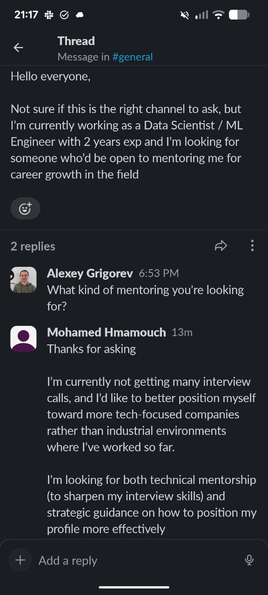

# AI Shipping Labs Marketing and Content Strategy

## Marketing Channels and Audience

A key challenge is marketing and finding people who can pay for the community. DataTalks Club may not be the ideal place to find paying members because:
- The courses are free
- Many members are from countries with lower purchasing power (India, Nigeria, etc.)
- They may not have the ability to pay for a paid community

Alternative channels to explore:
- Social media platforms where the target audience spends time
- Other communities where AI engineers gather
- AI optimization and SEO strategies
- CEO-level networking and partnerships

The goal is to find people who have both the interest and the financial capacity to pay for a premium community.

People who ask for mentoring in the existing community are a potential audience for the paid community. For example, a Data Scientist / ML Engineer with 2 years of experience posted in the community asking for career mentoring - both technical (interview skills) and strategic (profile positioning). These are exactly the people who could benefit from the paid community and might be interested in joining[^54].

<figure>
  
  <figcaption>Community member asking for mentoring - a potential audience for the paid community</figcaption>
  <!-- This shows the type of person who could be converted from free community mentoring requests into paid community members -->
</figure>

## Marketing Plan

Ideas and planning for how to promote and market the paid community. These are initial ideas to build into a more systematic plan over time[^1].

## The Need for a Plan

We need to think about how to build a marketing plan and how we will promote the community. This is useful both for the course and for the community. Maven already has tools for this - things like Lightning Lessons and lead magnets. We will need to come up with all of this ourselves. Obviously we will use social media, but we can approach it more systematically and put together at least a rough promotion plan[^1].

## Marketing Funnel

A rough outline of the funnel, besides social media[^2]:

- SEO
- Lead magnets
- Free newsletter, where we advertise the paid community
- Short webinars to promote the community

## Lead Magnets

Based on the recent webinar, Learning Paths could work as lead magnets. For example, a Learning Path for Data Engineers or a Learning Path for Frontend Engineers. These could be published on Maven as well[^5].

## Community as a Funnel Step

The course price is quite high, so the level of trust people need to have is also high. Not everyone is ready to spend $1700 on someone they don't know well. A possible solution: let them first buy something small, see that they get a lot of value from it, and then buy something more expensive like the course[^6].

Right now there are a lot of people on the course waitlist, but only tenths of a percent actually convert. If we set up the funnel so that there is a community step in between, it helps in two ways. First, we already start generating revenue. Second, people get to know what happens in the community, their trust in us grows, and they end up buying the course[^6].

The community works as the intermediate step in the funnel that helps convert more people. Instead of going directly from awareness to a high-priced course, people enter through the community, experience value firsthand, and then upgrade[^6].

## Open Questions

There are still questions about where paid content will live - on Substack or on the website[^2].

## Content Strategy for Tiers

There will be a closed repository of event recordings from the community, written tutorials that come from those events, and all other materials shared in the closed community[^3].

The paid newsletter publishes these materials gradually for tier 1 members - not all at once, but in portions[^3].

## Content Strategy Discussion with Valeria

Discussion with Valeria about how to develop the blog and content inside AI Shipping Labs[^79].

## Content based on AI Engineer role analysis

Based on the analysis we already have about the AI Engineer role, we know what skills and tools an AI engineer needs, and roughly how to prepare for interviews. This will be the foundation for the first blog posts or pages on the website, similar to what we did with theoretical interview questions[^79].

## Using conference talks as content sources

Looking at the AI Engineer conference (organized by Swyx), which had talks about Context Engineering, RAG, and similar topics. The idea is to use the skills and tools data from the AI Engineer role analysis to narrow down article topics and base them on this data. This applies not just to articles but to courses as well[^79].

## Workshops as content pipeline

One approach: create workshops (for example, Python workshops for AI engineers), then turn those workshops into articles. This creates a pipeline from interactive sessions to written content[^79].

## Listicles as easy content format

Listicles are a lightweight content format that can be produced relatively easily with AI help. Even though someone could ask ChatGPT for the same information, an organized article is more useful than a ChatGPT response. The example is the cheat sheets done for the Data Engineering course at DataTalks Club. These lists bring traffic to the page[^79].

## Concept explainer articles

An idea for content that Valeria can produce independently: articles that explain a concept (like what is RAG, what is GraphRAG, what is Agentic RAG) without direct implementation. Similar to what Turing Post, The Sequence, and Xenia do - they explain a concept and link to a package or resource where it can be implemented. These articles study a topic, review what others have said about it, but do not give direct instructions on how to apply it. This is a hypothesis about whether it would be interesting to people in the community[^80].

## Paid content ideas

Some of the materials being prepared can be made into paid content in the newsletter. The concept explainer articles (without implementation) could become paid articles for subscribers who buy the resources-only package (without community). The Karpathy-style trend analysis articles also have potential as paid content - people like it when someone they trust explains trends in a way that is quick to read and easy to understand. These articles do not take much time to produce and editing goes quickly because the information is straightforward[^81].

## Audience research using forums

Looking at forums, especially Reddit, to research what people are asking about and what their problems are. This is the same thing currently being done through interviews, but at scale. Grok (at grok.com, not the one inside Twitter) can be used for this research since the agent does better research there. The existing tools built for finding questions for community brainstorming can also be reused for this research[^82][^84][^85].

## Target audience definition

The target audience: people interested in AI engineering who want to develop in this area - either transitioning into it or already working there and wanting to improve their skills. Plus everyone interested in AI tools that make them more productive. This can be defined more precisely, and then we can look at what problems this audience has and what help they need[^83].

## Content based on audience problems

The approach: look at what problems the target audience has (through community research, Reddit, Twitter, interviews) and then think about what content we can create to solve those problems[^84].

## Overview articles that funnel into the community

Valeria's suggestion on how to turn the AI Engineer role research into content that also promotes AI Shipping Labs. The idea is to make an overview article after the research: describe what hiring managers look at in general, give an overview of the most important points, and where relevant explain how to choose a GitHub project and what goes into it. The article itself stays at the general level[^97].

The concrete, detailed pieces live inside AI Shipping Labs: a GitHub repository template that community members can reuse (the link to the template is shared with them), specific prompts for picking a project, described workflows that anyone can reuse. The article links out to these as a reason to join the community. This way the public article covers the general topic, and the specifics and individual resources are inside AI Shipping Labs - which attracts people into the community[^97][^98][^99].

Depending on how broad the topic is and how deep you can go on each piece, workshops on the same topic also fit here as separate resources. In other words, extra events about the topic plus ready-made resources like content pieces or templates[^98][^99][^100][^101].

## Inspiration: Lenny's Newsletter

[Lenny's Newsletter](https://www.lennysnewsletter.com/) is a good reference for developing the paid community. Several ideas from their model[^78]:

## Lenny's Product Pass

Access to paid subscriptions on products. Every paid subscriber gets this. Whenever a new paid product is added to the bundle, they make a newsletter issue about it. This creates ongoing value for subscribers and gives them a reason to stay[^78].

## Community Wisdom

A weekly hand-curated digest of the most helpful conversations from their member-only Slack community. It is a subscriber-only email delivered every Saturday, highlighting the most helpful conversations. This is similar to our idea of surfacing community content for tier 1 members[^78].

## Chatbot with the Creator

[LennyBot](https://www.lennybot.com/) - a chatbot based on the newsletter creator that answers subscriber questions. This could be an interesting feature for our community as well[^78].

## Community Offerings

What they offer inside their community[^78]:
- Real-talk conversations about product, growth, and career
- Mentorship programs, book clubs, live AMAs, and hands-on workshops
- Monthly community meetups across five continents

## Curated Course List

They have a list of recommended courses on [Maven](https://maven.com/lenny). When you enroll in a course from their list, you receive $1,395 in free credits for tools including Superhuman, Linear, Sprig, Dovetail, and Gamma. Each offer can only be used once across all courses, and credits are only available for new customers of each tool[^78].

## Merchandise

They also have [merch/swag](https://lennyswag.com/en-eur) as an additional engagement channel[^78].

## Inspiration: Paul Iusztin's Decoding AI Newsletter

Valeriia has been studying the content Paul from Decoding AI puts out. She likes both his newsletter and his social media. Recently he has been sharing that he has an agent that writes his social media posts - he shared workshop code where he explains this agent. He also described an agent that writes his Substack articles, and made a separate newsletter issue about it[^95].

Paul uses all of this to promote his AI engineering course. Everything is in service of that course - he also has one[^95].

One thing Valeriia likes is how the course ad slots naturally into his article. In the piece where he describes his writing pipeline, there is an inline ad for his Agentic AI Engineering Course placed right inside the content. It does not feel forced, and it reads as a natural continuation of the article. See the example embedded in the research article at [articles/research/decode-ai-content-generation.md](../research/decode-ai-content-generation.md)[^96].

This same approach could work for Alexey's free Friday newsletters. The newsletter is already about sharing useful things, so pre-advertising the course can slot in the same way Paul does it without feeling like an awkward insert[^96].

The technical side of how Paul generates the branded diagrams and runs his pipeline is covered separately in [articles/research/decode-ai-content-generation.md](../research/decode-ai-content-generation.md). That side is mostly interesting for improving the telegram-writing-assistant agent; the marketing lesson is the one captured here.

## Content Reuse and Planning

## Content Reuse System

I want to build a system for myself that helps achieve different formats by reusing existing content. The goal is to understand where content lives and what can be pulled from it for different purposes[^73].

## Community Content Plan

For the community, the goal is to create an events plan and content plan. Once we conduct research and understand what people need, we can build a calendar showing how often different events happen and what content to expect. This way people can set their expectations based on a clear schedule[^73].

## Sources

[^1]: [20260214_103109_AlexeyDTC_msg1671.md](../../inbox/used/20260214_103109_AlexeyDTC_msg1671.md)
[^2]: [20260214_104030_AlexeyDTC_msg1677.md](../../inbox/used/20260214_104030_AlexeyDTC_msg1677.md)
[^3]: [20260214_104030_AlexeyDTC_msg1678.md](../../inbox/used/20260214_104030_AlexeyDTC_msg1678.md)
[^4]: [20260214_104316_AlexeyDTC_msg1681_transcript.txt](../../inbox/used/20260214_104316_AlexeyDTC_msg1681_transcript.txt)
[^5]: [20260217_100942_AlexeyDTC_msg1893_transcript.txt](../../inbox/used/20260217_100942_AlexeyDTC_msg1893_transcript.txt)
[^6]: [20260217_101359_AlexeyDTC_msg1897_transcript.txt](../../inbox/used/20260217_101359_AlexeyDTC_msg1897_transcript.txt)
[^7]: [20260219_091512_AlexeyDTC_msg2020_transcript.txt](../../inbox/used/20260219_091512_AlexeyDTC_msg2020_transcript.txt)
[^54]: [20260212_201835_AlexeyDTC_msg1567_photo.md](../../inbox/used/20260212_201835_AlexeyDTC_msg1567_photo.md)
[^73]: [20260214_111721_AlexeyDTC_msg1687.md](../../inbox/used/20260214_111721_AlexeyDTC_msg1687.md)
[^78]: [20260304_120642_valeriia_kuka_msg2716.md](../../inbox/used/20260304_120642_valeriia_kuka_msg2716.md)
[^79]: [20260320_152314_AlexeyDTC_msg3032_transcript.txt](../../inbox/used/20260320_152314_AlexeyDTC_msg3032_transcript.txt)
[^80]: [20260320_152314_AlexeyDTC_msg3033_transcript.txt](../../inbox/used/20260320_152314_AlexeyDTC_msg3033_transcript.txt)
[^81]: [20260320_152314_AlexeyDTC_msg3034_transcript.txt](../../inbox/used/20260320_152314_AlexeyDTC_msg3034_transcript.txt)
[^82]: [20260320_152314_AlexeyDTC_msg3035_transcript.txt](../../inbox/used/20260320_152314_AlexeyDTC_msg3035_transcript.txt)
[^83]: [20260320_153909_AlexeyDTC_msg3046_transcript.txt](../../inbox/used/20260320_153909_AlexeyDTC_msg3046_transcript.txt)
[^84]: [20260320_153909_AlexeyDTC_msg3047_transcript.txt](../../inbox/used/20260320_153909_AlexeyDTC_msg3047_transcript.txt)
[^85]: [20260320_153909_AlexeyDTC_msg3048_transcript.txt](../../inbox/used/20260320_153909_AlexeyDTC_msg3048_transcript.txt)
[^95]: [20260424_124837_AlexeyDTC_msg3605_transcript.txt](../../inbox/used/20260424_124837_AlexeyDTC_msg3605_transcript.txt)
[^96]: [20260424_124837_AlexeyDTC_msg3610_transcript.txt](../../inbox/used/20260424_124837_AlexeyDTC_msg3610_transcript.txt)
[^97]: [20260424_130858_AlexeyDTC_msg3625_transcript.txt](../../inbox/used/20260424_130858_AlexeyDTC_msg3625_transcript.txt)
[^98]: [20260424_130858_AlexeyDTC_msg3626_transcript.txt](../../inbox/used/20260424_130858_AlexeyDTC_msg3626_transcript.txt)
[^99]: [20260424_130858_AlexeyDTC_msg3627_transcript.txt](../../inbox/used/20260424_130858_AlexeyDTC_msg3627_transcript.txt)
[^100]: [20260424_130858_AlexeyDTC_msg3624.md](../../inbox/used/20260424_130858_AlexeyDTC_msg3624.md)
[^101]: [20260424_130906_AlexeyDTC_msg3628.md](../../inbox/used/20260424_130906_AlexeyDTC_msg3628.md)
