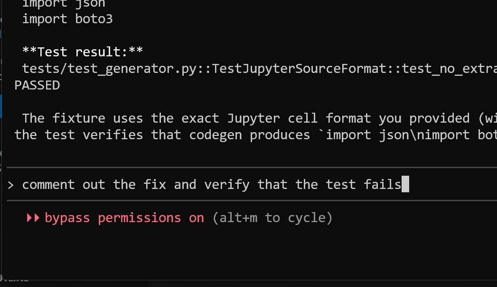
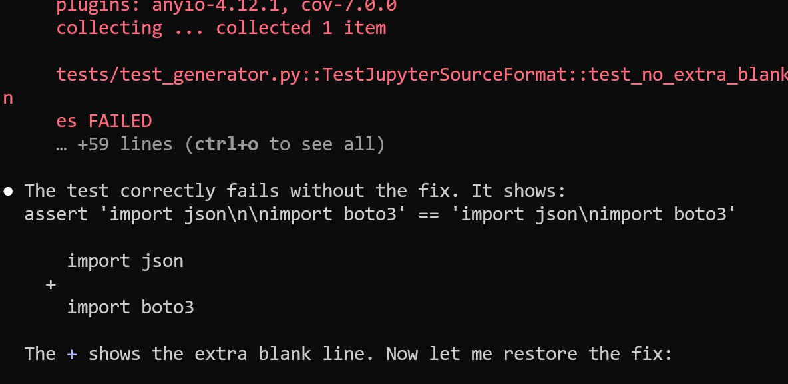

# AI Testing Tools for End-to-End Tests

End-to-end testing of websites has traditionally been a painful and manual process. New AI-powered tools are emerging that can automate this work by describing tests in plain English.

## The Problem with End-to-End Testing

Testing websites end-to-end is difficult. When building sites, the biggest pain point is properly testing the entire user flow. Manual testing is time-consuming and repetitive[^2].

## AI-Powered Solution

A company reached out about their AI agent for automated testing - an agent that handles end-to-end website testing. The tool allows describing test scenarios in English rather than writing code manually[^2].

For example, instead of writing Selenium or Playwright code, you can simply describe what should happen: "submit the form" or "navigate to the checkout page." The test scenario runs automatically based on this description[^2].

## Course Management Platform Use Case

The course management platform at DataTalks Club is the most important project right now. Thousands of people use it daily for submitting projects and homework[^4].

When using coding agents, it is critical to ensure no regressions are introduced into the codebase. The current workflow includes unit and integration tests that run automatically on push, deploying to a dev environment, then manually inspecting before rolling out to production. This is tedious[^4].

Using TestMu AI, test scenarios can be described in plain English without writing cryptic Selenium scripts. The KaneAI automation test agent verifies that the dev environment runs properly[^4].

## Benefits

- No need to write test code manually
- Tests can be described in plain English
- Faster iteration on test scenarios
- Lower barrier to entry for testing[^2]

## Personal Experience

I tried the tool and found it genuinely useful. While it still requires some fine-tuning and isn't perfect, the potential is clear. Browser automation for AI agents is an actively developing area[^3].

My prediction is that within 1-2 years, these tools will be very powerful. Just as AI coding assistants have grown significantly over the past year, general-purpose assistants that can perform browser actions including testing will also improve dramatically[^3].

The hope is that tools like Selenium and Playwright will become things of the past, and tests can be run without the complexity that currently exists[^3].

## Current Workflow with AI Assistants

When writing code with Claude or Copilot, I first write out the test scenario in plain English. I describe the sequence of actions step by step. Then I ask the AI to write a Playwright test for that specific scenario[^3].

### The Three-Step Test Verification Process

The proper workflow for ensuring tests are valid:

1. First, ask the assistant to write a test that passes
2. Then, ask to break the functionality being tested
3. Run the test again - it should now fail

<figure>
  
  <figcaption>After asking Claude to verify the test is meaningful, the test passes correctly</figcaption>
  <!-- This shows step 1 - the test passes when the functionality is implemented -->
</figure>

<figure>
  
  <figcaption>Commenting out the fix makes the test fail - this confirms the test is actually checking something meaningful</figcaption>
  <!-- This shows step 2-3 - a good test should fail when the code is broken -->
</figure>

If the test doesn't fail when the code is broken, the test is bad and needs to be rewritten. Once we verify the test fails properly, we restore the functionality[^1].

Through iterations, a collection of tests emerges that can be run with browser automation. This verification step is critical - it ensures tests actually catch regressions rather than giving false confidence[^3].

The problem with Playwright and Selenium scripts is that they're very difficult to read and understand. Tests can fail even when everything works due to UI/CSS selectors. Being able to describe tests in plain English is a significant advantage[^2].

## Why Tests Matter for AI Agents

A lot of code is now written by agents. When using AI coding assistants, tests and specifications about how code should work are incredibly helpful. They help the agent focus on the task at hand[^5].

When agents are required to write tests and we verify those tests are legitimate (not sloppy shortcuts), the code the agent produces actually works. This enables an easy feedback loop:

1. The agent writes code and tests
2. The test runs
3. If the test fails, the agent tries to fix it
4. This continues until the test passes

The test creates an environment for quick feedback. Without tests, the agent says "everything works" but when you check, nothing actually works. With a test that fails, the agent keeps trying different approaches until it fixes the issue[^5].

## Testing Workshop Idea

I noticed many people struggle with testing. This relates to the testing content I've been working on. The problem is that not everyone has a good understanding of:

- How to use unit tests
- How to use integration tests
- How to write tests
- What needs testing and what doesn't
- Test-driven development

Many developers don't have this background. Software developers typically don't struggle because testing is commonly used in development work. But people with more scientific backgrounds, data science, or analytics often lack this experience. The more I work with AI Buildcamp and workshops, the more I see the need for foundational material covering these topics[^6].

I have the knowledge and accumulated material on this subject. The idea is to:

1. Create a testing workshop for NOW (the company)
2. Create testing material to promote AI Buildcamp
3. Cover different types of tests
4. Show how to do testing in Python
5. Include pytest, project setup, and best practices

This could even be split into multiple workshops:
- One on testing in general
- One on testing agents
- One on testing data pipelines

This idea is currently in the background as something close to implementation. Recording this message serves as a demonstration of how the bot works[^6].

## Collaboration

This was a paid collaboration with the testing tool company. I created a demo showing how the tool works. The fact that I agreed to promote it indicates that I found genuine value in the product, not just the partnership aspect[^1].

## Resource

- Kane AI by TestMu: [https://www.testmu.ai/kane-ai/](https://www.testmu.ai/kane-ai/?utm_source=linkedin&utm_medium=alexey&via=vibetest)

## Sources

[^1]: [20260130_092548_AlexeyDTC_msg691.md](../inbox/raw/20260130_092548_AlexeyDTC_msg691.md)
[^2]: [20260129_172852_AlexeyDTC_msg648_transcript.txt](../inbox/raw/20260129_172852_AlexeyDTC_msg648_transcript.txt)
[^3]: [20260130_090255_AlexeyDTC_msg675_transcript.txt](../inbox/raw/20260130_090255_AlexeyDTC_msg675_transcript.txt)
[^4]: [X Post - Al_Grigor/status/2017160202525569536](https://x.com/Al_Grigor/status/2017160202525569536)
[^5]: [20260130_170956_AlexeyDTC_msg728_transcript.txt](../inbox/raw/20260130_170956_AlexeyDTC_msg728_transcript.txt)
[^6]: [20260130_170956_AlexeyDTC_msg727_transcript.txt](../inbox/raw/20260130_170956_AlexeyDTC_msg727_transcript.txt)
