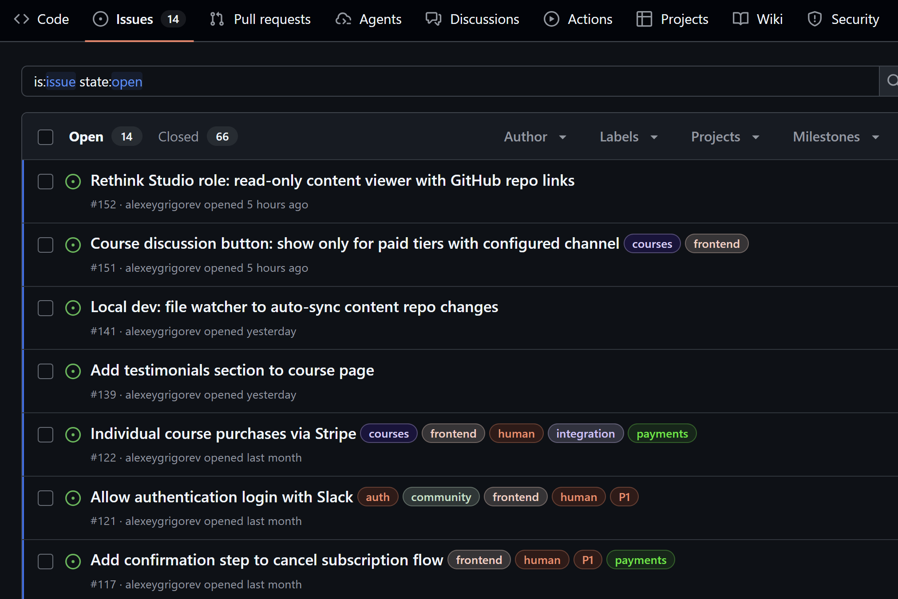
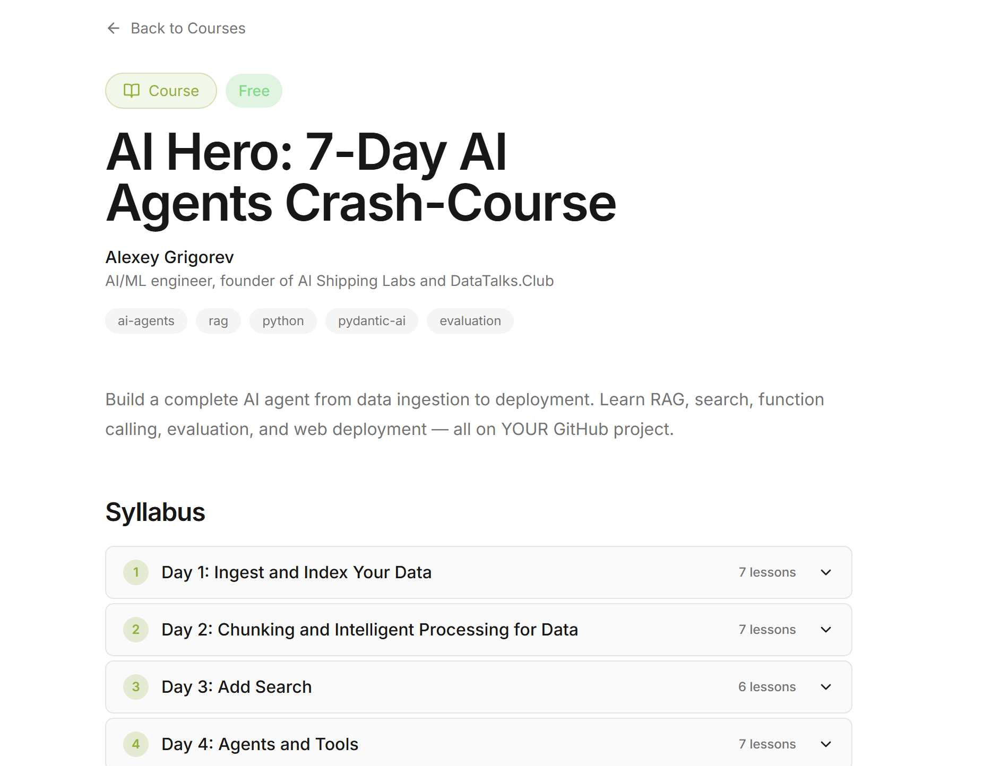
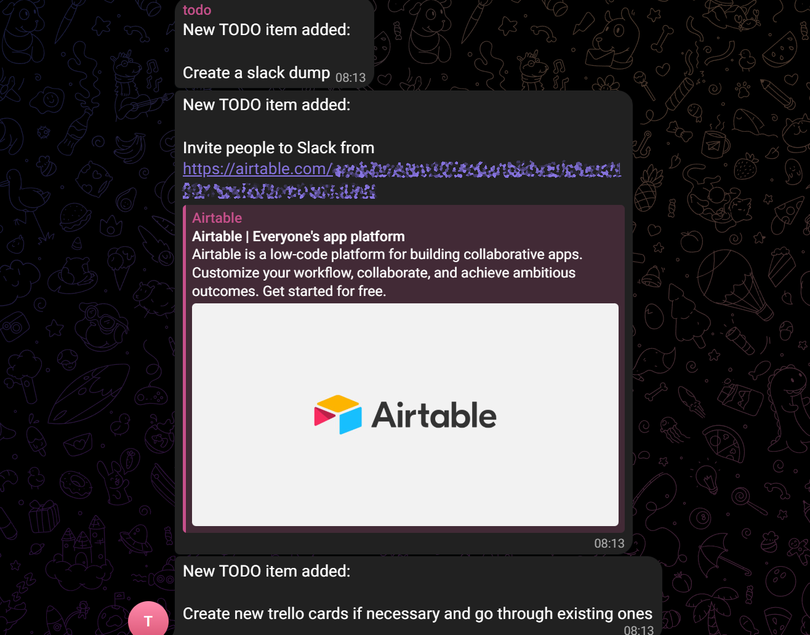
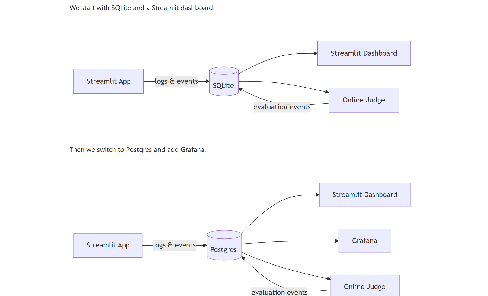
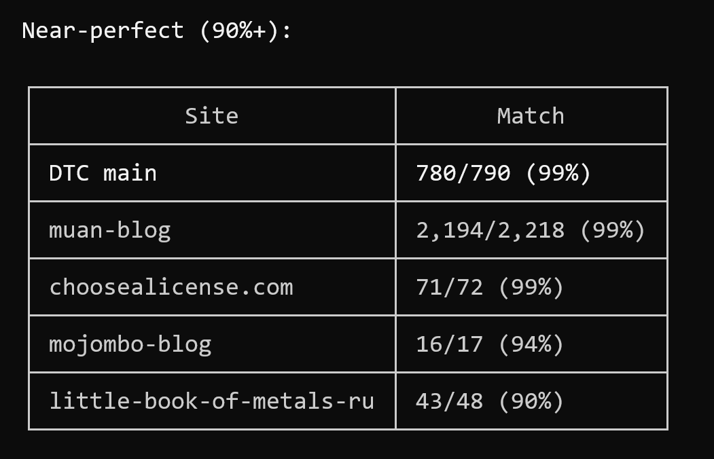
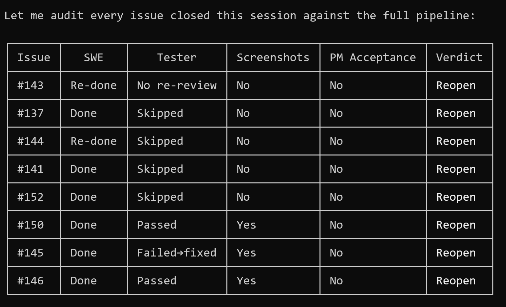
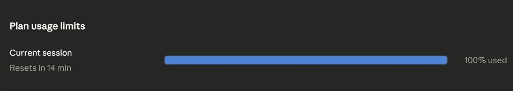

# Building Projects with Agent Teams

In this article I want to share an approach I use for implementing complex projects. 

For simple things, I can just open a Claude Code session and start working. But for complex projects, we need proper planning and decomposition. In these cases, my main Claude Code session becomes an orchestrator that manages a team of agents.

## The Process

Before I open Claude Code, I need to be really clear about what I want to implement. I do this by dumping my idea to [the telegram writing assistant](https://alexeyondata.substack.com/p/telegram-assistant) or talking to ChatGPT to refine it (or both).

The goal is to get requirements written down. You can read more about how I approach brainstorming sessions with ChatGPT in [How I Built SQLiteSearch](https://alexeyondata.substack.com/p/how-i-built-sqlitesearch-a-lightweight).

For small projects this is enough. I ask the agent to read the requirements and start implementing. But for bigger projects, the requirements file is too much for one agent to handle at once. I break it into smaller, well-scoped tasks. 

Each task needs:

- A description of what exactly needs to be done
- Acceptance criteria - how do we know it's done 
- User scenarios - how exactly users are going to use it

I delegate this grooming to a special agent - the Product Manager. The PM picks a task and fills in the details. Then I can look at it and confirm if this is what I actually want.

Then the team of agents starts working on it.

## The Team

Four agents handle the full task lifecycle:

- [Product Manager](https://github.com/AI-Shipping-Labs/website/blob/main/.claude/agents/product-manager.md) (PM) - represents the user and has the final say into what gets into the feature and what doesn't 
- [Software Engineer](https://github.com/AI-Shipping-Labs/website/blob/main/.claude/agents/software-engineer.md) (SWE) - implements code and writes tests
- [Tester](https://github.com/AI-Shipping-Labs/website/blob/main/.claude/agents/tester.md) (QA) - verifies the task according to the acceptance criteria and user scenarios
- [On-Call Engineer](https://github.com/AI-Shipping-Labs/website/blob/main/.claude/agents/oncall-engineer.md) - monitors CI/CD and fixes pipeline failures

<figure>
  
  <figcaption>The agent roles: PM, Software Engineer, Tester, and On-Call Engineer</figcaption>
</figure>

The process is the following:

- I ask the orchestrator to create a task
- The task is added to the backlog
- Eventually PM picks it up and grooms it
- The SWE implements it
- QA tests the task and either accepts it or rejects it
- If QA rejects the task, the SWE needs to fix it
- If QA accepts the task, PM makes the final check
- PM can reject the task, then SWE and QA need to work on it again
- If PM accepts the task, the code is committed and the task is closed

The orchestrator (the main Claude Code session) manages the process. It launches agents, routes work between them, and commits code only after the PM accepts. 

Of course, the process needs to be written down. You can see mine here: [`PROCESS.md`](https://github.com/AI-Shipping-Labs/website/blob/main/_docs/PROCESS.md).

You can use anything you want to track your tasks:

- The file system
- GitHub issues
- Linear
- Anything else that your agents can access

<figure>
  
  <figcaption>GitHub issues as the task tracker</figcaption>
</figure>

## Parallel Batches

I always run two tasks in parallel. When one batch with two tasks is finished, the orchestrator pulls the next two from the backlog.

<figure>
  
  <figcaption>Two tasks processed in parallel, then the next batch is pulled from the backlog</figcaption>
</figure>

To keep the loop going, there's always a task that says "when you finish all current tasks, pull the next two issues from the backlog". This creates a self-sustaining loop until the backlog is empty.

<figure>
  
  <figcaption>Task list with agents running in parallel</figcaption>
</figure>

With this methodology, I worked on five different projects:

- AI Shipping Labs community platform
- DataTasks
- Merm (Mermaid diagram renderer)
- Rustkyll (Jekyll to Rust rewrite)
- Codehive (Coding orchestrator)

## AI Shipping Labs Website

My first attempt at this approach was the [AI Shipping Labs](https://github.com/AI-Shipping-Labs/website) community platform. I will publish a separate article about this, but here I'll describe it briefly. 

[ADD SUBSCRIBE BUTTON]

When Valeriia and I decided to create a new community, we started by gathering the requirements for the platform to host it. We recorded a lot of voice messages and had multiple sessions with ChatGPT. Eventually we realized that no existing platform satisfies the requirements we have, so we decided to build our own.

We already did the first step: requirement gathering, so I just needed to put all this information into one file. Then I told Claude Code to turn it into specifications and then into tasks. As the tracker, I used [GitHub Issues](https://github.com/AI-Shipping-Labs/website/issues).

After I set up everything, I let agents run through the night. When I woke up the next day, 41 out of 46 tasks were done.

<figure>
  
  <figcaption>Morning after: 41 out of 46 tasks completed overnight without intervention</figcaption>
</figure>

That was one month ago. I had a lot of iterations since then, but I always followed the same process:

- Talk to the orchestrator
- The orchestrator creates an issue
- Then it launches the implementation pipeline (grooming -> implementing -> testing -> acceptance)

If you're interested to see how issues look like, check [this one about adding comments](https://github.com/AI-Shipping-Labs/website/issues/147):

- PM described the requirements, acceptance criteria and test scenarios
- SWE reports that the feature is completed
- QA accepts the feature
- They add the screenshots with the feature implemented 

<figure>
  
  <figcaption>AI Shipping Labs - the AI Hero course is already there (and it remains free)</figcaption>
</figure>

## DataTasks for DataTalks

I successfully tried this approach for one project and I wanted to see if it generalizes for others.

The first project that came to mind was a task tracker for DataTalks.Club's team. Right now, organizing work within the DataTalks.Club team is scattered across:

- A Trello board
- Different spreadsheets
- A telegram channel with a TODO bot

<figure>
  
  <figcaption>Our current task tracking in a Telegram channel with a TODO bot</figcaption>
</figure>

It works, but there's a lot of cognitive load. I've wanted to replace all of that with a custom solution but never had time. With coding agents, I finally could. I used the Telegram bot to dictate all the requirements, then followed the same approach as for AI Shipping Labs.

When the requirements were ready, I added the only technical requirement: it has to be serverless, work on AWS Lambda and DynamoDB. I didn't care about the rest and let the team decide. 

The project is called [DataTasks](https://github.com/alexeygrigorev/datatasks). I spent around 20 minutes dictating the requirements and maybe 20 minutes more to start the Claude Code session and give some feedback the next day.

I dropped this project for now because I don't have time to properly look into it (the current approach for our tasks works anyways) but it was a fun experiment. The main value was testing the methodology, and one day I'll come back to it and continue.

<figure>
  
  <figcaption>DataTasks dashboard</figcaption>
</figure>

## Merm (Mermaid Diagrams)

Eventually I ran into a third project where I had a chance to test this approach.

I was working on the [AI Engineering Buildcamp course](https://maven.com/alexey-grigorev/from-rag-to-agents) and I needed to add a diagram to a lesson. Mermaid is the obvious choice for that.

<figure>
  
  <figcaption>A Mermaid diagram I needed for the course</figcaption>
</figure>

But when I tried to render Mermaid diagrams to images from Python, I found two problems:

- No Python library for that
- The only available Node.js library launches a full browser under the hood to do the rendering

I couldn't find anything on Python that would just render SVG directly without a browser. Mermaid diagrams are so popular, and the only library uses a browser? So I asked Claude Code to implement a pure Python renderer.

I followed the same approach as the other projects, with one difference. I didn't know if it was going to be useful, so I just used the file system instead of GitHub issues to track the tasks.

- I created a folder, did `git init`
- Instructed the agent to put all tasks into the `tracker` folder
- File name encodes the status: `.todo.md` → `.groomed.md` → `.in-progress.md` → `done/`
- Used the same pipeline

My involvement was minimal. I checked in occasionally, said what I didn't like, described clear criteria. At the end I also asked for benchmarks to see if it's actually faster[^2].

I liked the results, so I published it as [merm](https://github.com/alexeygrigorev/merm).

Now I'm using it for generating diagrams (also for this article). Here are a few examples from [the gallery](https://github.com/alexeygrigorev/merm/tree/main/docs/examples):

<figure>
  
  <figcaption>CI pipeline with subgraphs for Build, Test, and Deploy stages</figcaption>
</figure>

<figure>
  
  <figcaption>Sequence diagram with participants, loops, and notes</figcaption>
</figure>

## Rustkyll (Jekyll to Rust)

Our [DataTalks.Club](https://datatalks.club/) website uses [Jekyll](https://github.com/DataTalksClub/datatalksclub.github.io). It's a static website generator written in Ruby, and the majority of websites on GitHub pages use it. It works great for small sites, and I'd still use it for new small projects.

But the DataTalks.Club website is more than 5 years old and it has grown very large over the years. There's a lot of content.

Now it reached the point when building the website takes more than one minute on my computer. It means that I change something and I need to wait for one minute to see the results. This is very long and very annoying. 

I was making another change recently - I was adding a logo of our new sponsor (Snowplow), and it would again take me one minute to see the logo appear. I finally decided that it's time to make it faster.

I've had this idea of rewriting Jekyll to Rust for at least 6 months, if not more. Now agents are finally at the level where they can run autonomously, and I have the methodology that I want to test and refine. So I decided to test it to implement [Rustkyll](https://github.com/alexeygrigorev/rustkyll/). 

I didn't think it was necessary to do the requirements part (mistake!) so I just pointed Claude to our website and said "let's reimplement it in Rust, use this methodology, go".

I checked the results next day. It was specifically tailored to our site, completely not generic. It wouldn't work on other websites. So I told it to find other Jekyll sites and make it work for those too.

It's been 3 weeks since agents are working on this project. It turned out to be far more complex than I expected.

But they can run it autonomously - they don't really need my input. I came up with a very clear optimization criteria - minimize the differences between the content generated by Jekyll and Rustkyll. When it finishes the backlog, it runs the comparison and comes up with new tasks.

It's still work in progress but for the DTC website it already takes 1 second. There are almost no visible differences between Jekyll and Rustkyll for our website right now. 

But I want to make it a drop-in replacement for Jekyll and it requires a lot of work from the team. From my side it's minimal oversight. I just drop by sometimes, check that the agents aren't idle, and if they are, I poke them to continue working.

<figure>
  
  <figcaption>Comparing DOM trees across multiple sites to find differences between Jekyll and Rustkyll output</figcaption>
</figure> 

## Codehive (Coding Orchestrator)

After running several projects with this methodology, I started noticing the same problems over and over.

The most common problem is that Claude Code orchestrator stops. It can ask "shall we proceed?" and wait the entire night for my answer. Or it sometimes reports that the job is done, even though there are items in its task widget.

<figure>
  
  <figcaption>Claude Code stopping and waiting for input instead of continuing autonomously</figcaption>
</figure>

Also, I can't see what subagents are doing. A subagent can do something for an hour, and I have no idea if it's stuck or not.

Another problem is that the orchestrator sometimes ignores the process completely. It launches the SWE directly, skipping PM grooming and QA verification. I had to point this out and make it follow the process.

<figure>
  
  <figcaption>The orchestrator ignoring the process and going straight to implementation</figcaption>
</figure>

And last week and this week I started hitting Claude Code usage limits. I want to be able to switch between different tools easily and not depend on just Claude.

<figure>
  
  <figcaption>Claude Code session at 100% - hit the limit on a simple task</figcaption>
</figure> 

So I decided to implement my own orchestrator - [Codehive](https://github.com/alexeygrigorev/codehive). It's a coding orchestrator that follows the methodology from this article. 

But I want the orchestrator itself to be more rigid - the pipeline, the agent roles, the grooming process, the acceptance criteria. All of that should be built into the application, not just described in a markdown file that the agent may or may not follow.

I have a few things in mind for Codehive:

- Hard-coded methodology - the pipeline from this article is enforced by the orchestrator, not by prompting
- Multiple agent backends. Not just Claude Code, but also Codex, GitHub Copilot, and Z.ai. When Claude has issues (like this week with usage limits), I want to switch easily between providers.
- Non-blocking workflow - sometimes the agent has a question and stops doing anything while waiting for an answer. I want a separate pool for questions. When I have time, I look at the pool and answer. The agent keeps working on other tasks that don't need my input, and the questions that do wait in the pool until I get to them
- Visibility into subagents - I can peek inside to see what's happening and correct course
- GitHub integration - when I create an issue in GitHub, Codehive picks it up

The team is working on it right now.

<figure>
  
  <figcaption>Codehive project summary - 96 issues, ~2,195 tests across all components</figcaption>
</figure>

Right now my focus is on finishing the platform for AI Shipping Labs, but eventually I will focus more on Codehive. 

## What I've Learned

Over this month I experimented with different projects, and now my goal is to refine this methodology. I really like the shape it's taking. Having clear specifications, having roles for agents, assigning responsibilities - you're responsible for implementation, you're responsible for testing - and then having a manager that oversees the process. I like this approach.

It still requires my supervision, so I want to continue working on different projects and see how I can reduce my involvement to the bare minimum. Only step in when it's really necessary.

I think I already have enough material for an entire course on this topic, so I'll go into more details in future articles. Don't forget to subscribe if you want to follow along.

If you want to learn more about building projects with agents, we're also going to have a course about this in [AI Shipping Labs](https://github.com/AI-Shipping-Labs/website).
