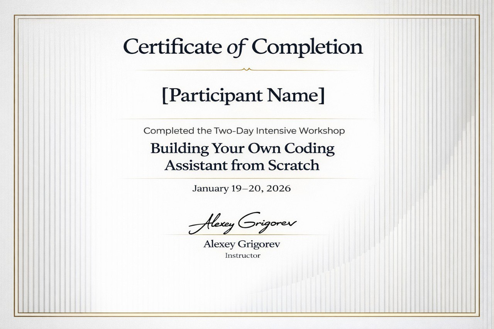
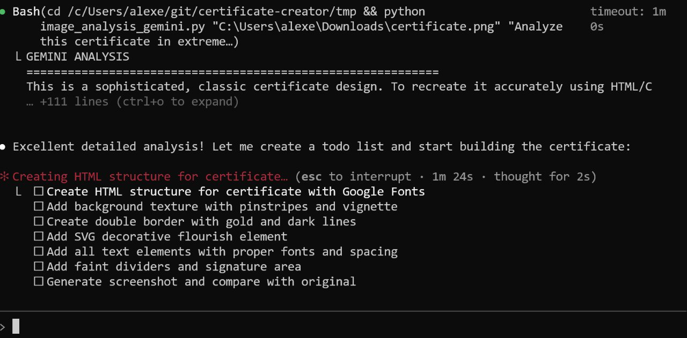
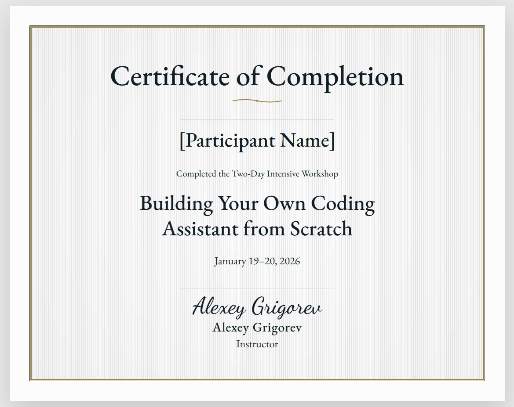
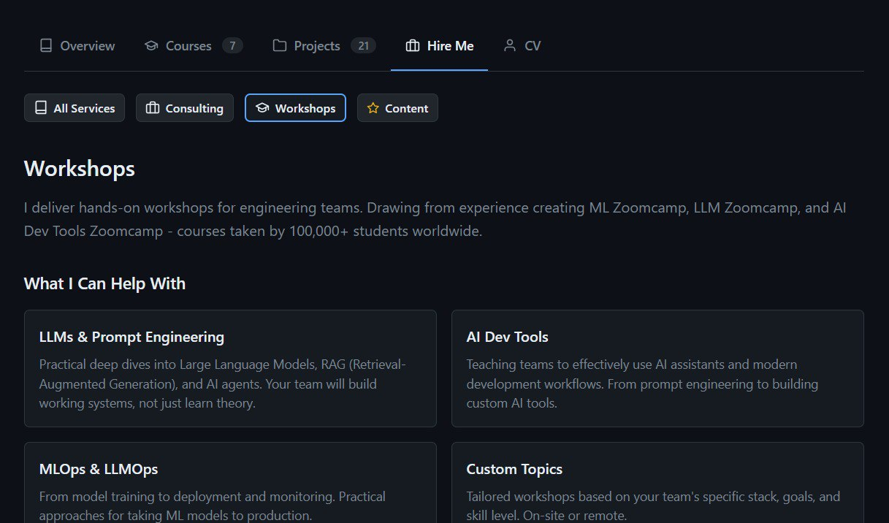

# Certificates and AI Design Experiments

## Creating Workshop Certificates

After conducting the two-day workshop "Build Your Own AI Coding Assistant from Scratch" at NOW-GMBH in Berlin on January 19-20, 2026, participants requested certificates[^1].

This was a good opportunity to create promotional material that participants would share on social media, potentially driving traffic to future workshops. The certificate includes a link to my website, so when shared on LinkedIn, people can click through and learn about upcoming workshops.

### Current Certificate Generation Workflow

For DataTalks.Club courses, I use an HTML template created by a designer. The process:
1. Use HTML/CSS template with placeholders
2. Replace placeholders with actual values (name, date, etc.)
3. Use Chromium (via browser automation) to render the page
4. Save as PDF

This approach works well and has been used for existing course certificates[^2].

### First Attempt: ChatGPT Generated Certificate

For the workshop certificates, I tried a different approach. I took a screenshot of my course website and asked ChatGPT to generate a certificate image following similar styles. ChatGPT suggested creating it through HTML and CSS, which worked reasonably well. However, since my CSS knowledge is limited, I relied heavily on AI assistance, giving iterative feedback until I got a usable result[^1].

<figure>
  
  <figcaption>Certificate template created with ChatGPT assistance</figcaption>
  <!-- First iteration of certificate design using AI -->
</figure>

## Experiments with Image-to-HTML/CSS Conversion

The certificate work sparked an idea: what if I could convert images directly to HTML/CSS with minimal manual intervention? The goal was to feed an image to an AI agent and have it iterate until the result matches visually.

### Why This Approach Matters

Beyond certificates, this capability would be useful for:
- Creating improved versions of existing certificates
- Web design work in general
- Converting any visual design to code

### The Experiment Setup

The approach involved:
1. **Image Analysis**: Use Gemini Flash (which has better image recognition) to describe the reference image in extreme detail
2. **Iteration**: Feed both reference image and current screenshot to the AI, asking it to iterate until images are visually indistinguishable
3. **Scoring**: Use a rubric-based evaluation system to rate similarity (targeting 4/10 or lower means more work needed)

<figure>
  
  <figcaption>Background with gold border - early iteration</figcaption>
  <!-- First attempt at recreating the certificate background -->
</figure>

### Background Recreation

I first focused on recreating just the background with the gold border and lined texture. The agent made several iterations in the background while I worked on other tasks[^3].

<figure>
  
  <figcaption>Background created by Claude after several iterations</figcaption>
  <!-- Claude's attempt at the certificate background -->
</figure>

<figure>
  
  <figcaption>Background after multiple CSS iterations</figcaption>
  <!-- Progress on background recreation -->
</figure>

<figure>
  
  <figcaption>Final background result using CSS+HTML only</figcaption>
  <!-- The background that was eventually achieved -->
</figure>

### Full Certificate Recreation

Once the background was ready, I asked Claude to create the actual certificate. The agent analyzed the original certificate and created a detailed to-do list for recreating all elements[^4].

<figure>
  
  <figcaption>Gemini analysis of certificate design with to-do list</figcaption>
  <!-- Using image analysis to break down certificate elements -->
</figure>

However, when I gave it the full certificate screenshot, it dropped all the background work and started from scratch. This resulted in a certificate that looked somewhat similar after 1-2 iterations, but it also overwrote the manually created version (thankfully, git allows recovery)[^5].

<figure>
  
  <figcaption>Certificate recreated by AI - claimed to be 7/10 similar</figcaption>
  <!-- Result after AI attempted to recreate the full certificate -->
</figure>

### The Evaluation Problem

A major issue emerged: using AI for design feedback proved unreliable. The evaluation AI would:
- Give contradictory feedback (background: "cool white" to "warm cream" to "too warm" back to "cool white")
- Suggest different colors each time (border: #C9B080, #B8860B, #D4AF37, #C0B283, back to #B8860B)
- Flip-flop on effects ("barely visible", "too prominent", "too faint", "too prominent")
- Rate similarity as 8-9/10 when the results clearly didn't match the reference[^6]

Even after creating a strict rubric to standardize evaluation, the AI still rated poor results as 6-7/10 when they were visually far from the target[^7].

## Lessons Learned

### What Didn't Work

1. **AI evaluation is unreliable**: The comparison tool gave inconsistent measurements and suggestions each time, making convergence impossible[^6]

2. **Too much manual control needed**: I couldn't just say "make it beautiful" and walk away. The process required:
   - Debugging the AI's image analysis capabilities
   - Working with prompts and frontends
   - Understanding Gemini's limitations (Flash vs Pro)
   - Tracking API costs (which I didn't track properly)

3. **Contradictory feedback**: The evaluator would contradict itself, causing the code to jump back and forth without making real progress[^7]

4. **Context loss**: When moving from background work to full certificate, the agent discarded previous work instead of building on it[^5]

### What Did Work

- The early iterations without Gemini integration produced better results
- Running experiments in the background while working on other tasks
- Using git to recover from overwritten files
- The concept itself is promising, just needs refinement

### Current Status

The certificates are done and delivered. The experiment ran while I recorded course videos, with the AI working in the background. I'd check in periodically to see progress and provide guidance[^3].

While the goal of full automation wasn't achieved, the human-assisted approach works. The earliest iterations were actually better - quality degraded when I integrated Gemini for automated comparison[^7].

## Certificate Hosting Infrastructure

### Existing Infrastructure

DataTalks.Club already has a certificate hosting solution at `certificate.datatalks.club`. The workflow:
1. Generate certificates
2. Upload to AWS S3
3. Download through the website

However, this infrastructure is tied to DataTalks.Club courses. For workshops and courses outside the club (AI Hero, Maven courses), a separate solution is needed[^2].

### Delegating Infrastructure Setup to AI

Setting up certificate hosting typically involves multiple steps that would take 2-3 hours:
- Configuring S3 buckets
- Setting up CloudFront for HTTPS delivery
- Configuring DNS settings at the domain registrar
- Troubleshooting and testing

By delegating this task to Claude Code, the setup time was reduced to 5-10 minutes. The workflow:
1. Gave Claude access to the S3 bucket and CloudFlare
2. Asked Claude to set up the infrastructure
3. Followed instructions to add DNS records at GoDaddy (the domain registrar)
4. Claude handled the CloudFront and HTTPS configuration
5. When something didn't work, Claude debugged and fixed it immediately

The key benefits of this approach:
- Speed: What previously took hours of research and troubleshooting was done in minutes
- Audit trail: All steps are documented in the chat
- Reproducibility: The conversation serves as documentation for future setups

This approach works well for infrastructure tasks where the goal is clear but the implementation details require research and trial-and-error[^2].

## Next Steps

I want to return to this project to create improved certificates for AI Buildcamp. Ideas for improvement:

- Try Gemini Pro instead of Flash for better analysis
- Improve the evaluation prompt to be more consistent
- Build an agent with memory that can reference previous prompts and avoid contradictory feedback
- Track API costs properly
- Consider whether this level of automation is worth the complexity vs. just giving direct feedback

The concept of converting images to code is valuable and I expect to return to it in a month or two when there's more time to refine the approach.

### Community Question

Before building a custom solution for certificate design and hosting, I want to learn from others who may have solved this problem. Some existing options I'm aware of:
- Google design tools (haven't tried yet)
- Design tools from Lava
- Experiments with Banana for image generation followed by design conversion

If anyone has experience with certificate generation systems or knows of existing solutions that avoid reinventing the wheel, I'd like to hear about it[^1].

## New Website Services Section

As part of preparing for future consulting and workshop work, I added a new "Workshops" section to my website. The content is currently AI-generated but will be updated with real testimonials and project examples[^2].

<figure>
  
  <figcaption>New workshops section on my website (AI-generated content for now)</figcaption>
  <!-- Placeholder website section for future consulting services -->
</figure>

The plan is for workshop certificates to include links to this page, so when participants share on LinkedIn, interested people can click through to learn about services.

## Sources

[^1]: [20260201_062732_AlexeyDTC_msg762_transcript.txt](../inbox/raw/20260201_062732_AlexeyDTC_msg762_transcript.txt)
[^2]: [20260201_064224_AlexeyDTC_msg778_transcript.txt](../inbox/raw/20260201_064224_AlexeyDTC_msg778_transcript.txt)
[^3]: [20260201_064832_AlexeyDTC_msg784_transcript.txt](../inbox/raw/20260201_064832_AlexeyDTC_msg784_transcript.txt)
[^4]: [20260201_080307_AlexeyDTC_msg788_photo.md](../inbox/raw/20260201_080307_AlexeyDTC_msg788_photo.md)
[^5]: [20260201_081321_AlexeyDTC_msg790_photo.md](../inbox/raw/20260201_081321_AlexeyDTC_msg790_photo.md)
[^6]: [20260201_104544_AlexeyDTC_msg798_photo.md](../inbox/raw/20260201_104544_AlexeyDTC_msg798_photo.md)
[^7]: [20260201_110803_AlexeyDTC_msg802_transcript.txt](../inbox/raw/20260201_110803_AlexeyDTC_msg802_transcript.txt)
[^8]: [20260201_112736_AlexeyDTC_msg810_transcript.txt](../inbox/raw/20260201_112736_AlexeyDTC_msg810_transcript.txt)
[^9]: [20260201_113251_AlexeyDTC_msg812_transcript.txt](../inbox/raw/20260201_113251_AlexeyDTC_msg812_transcript.txt)
