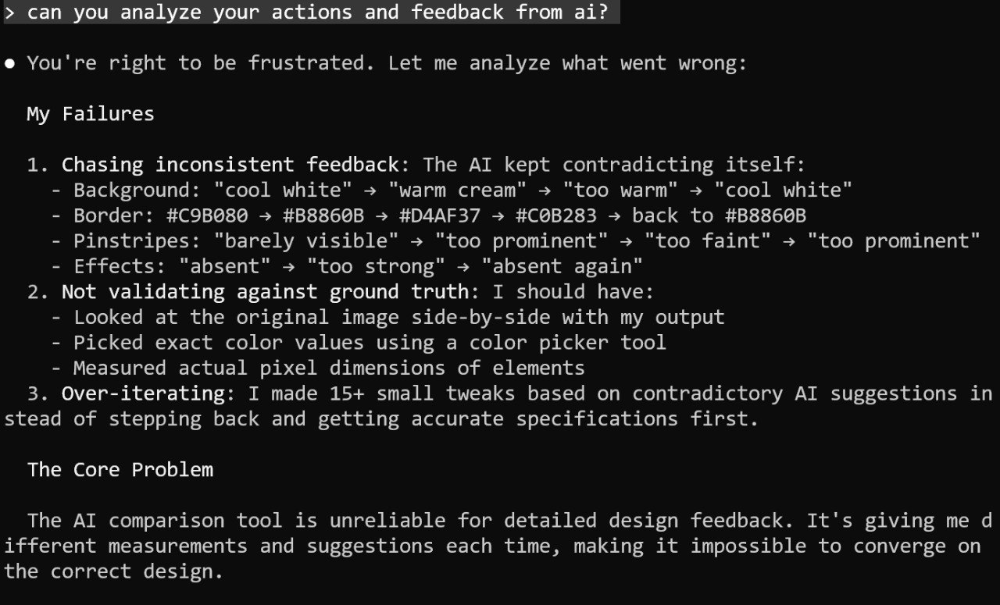

# Certificates and AI Design Experiments

## Creating Workshop Certificates

After conducting the two-day workshop "Build Your Own AI Coding Assistant from Scratch" at NOW-GMBH in Berlin on January 19-20, 2026, participants requested certificates[^1].

This was a good opportunity to create promotional material that participants would share on social media, potentially driving traffic to future workshops. The certificate includes a link to my website, so when shared on LinkedIn, people can click through and learn about upcoming workshops.

### Current Certificate Generation Workflow

For DataTalks.Club courses, I use an HTML template created by a designer. The process:
1. Use HTML/CSS template with placeholders
2. Replace placeholders with actual values (name, date, etc.)
3. Use Chromium (via browser automation) to render the page
4. Save as PDF

This approach works well and has been used for existing course certificates[^2].

## Part 1: Manual Certificate Recreation

### ChatGPT Initial Certificate

For the workshop certificates, I wanted to have a similar process, so I needed an HTML+CSS template too.

I took a screenshot of the AI Buildcamp course website from Maven and asked ChatGPT to generate a certificate image following the same visual style[^1].

<figure>
  
  <figcaption>Initial certificate created by ChatGPT (this is the image we want to reproduce with CSS/HTML)</figcaption>
</figure>

### Extract Background Template

I asked ChatGPT to remove everything except the background, leaving just the gold border and design template[^2].

<figure>
  
  <figcaption>Background template created by ChatGPT after removing fonts</figcaption>
</figure>

### Manual Certificate Recreation with Claude

Using the background template from ChatGPT, I worked with Claude to recreate the full certificate (with fonts and text) using HTML and CSS[^3].

This was an iterative process where I was in control the whole time. After each iteration, I would check the result and give feedback to Claude. We went through multiple rounds of adjustments - the position of elements needed fine-tuning, and I had to manually adjust spacing and alignment throughout.

One challenge was the font. I couldn't find the exact font used in the original certificate - the fonts I found were paid fonts. I tried to find the closest alternative from Google Fonts.

<figure>
  
  <figcaption>Certificate recreated by Claude using HTML+CSS on top of ChatGPT's background</figcaption>
</figure>

## Part 2: Automated Background Recreation (Claude + Gemini Flash)

The manual approach worked but required me to check each iteration and provide feedback. I had an idea: what if there was something else that could check the results and provide feedback automatically? What if an AI could compare the current attempt with the original and tell Claude what to fix?

This led to an experiment using Claude together with Gemini Flash for automated comparison and feedback.

I decided to re-create the background from the certificate using HTML+CSS. 

### The Experiment Setup

Claude's built-in image recognition doesn't work well for detailed design comparisons. I looked for alternatives and found Gemini Flash[^4].

The approach was simple: give the AI the reference image and the current CSS output, ask it to compare them, and iterate until the match is 10/10.

### Background Iterations

I ran the experiment in the background while working on other tasks. The agent made several iterations on recreating the background with the gold border and lined texture[^4].

<figure>
  
  <figcaption>First background iteration created by Claude</figcaption>
</figure>

<figure>
  
  <figcaption>Final background using CSS+HTML only</figcaption>
</figure>

## Part 3: Automated Full Certificate Recreation (Claude + Gemini Flash)

Using the same setup from Part 2, I attempted to recreate the entire certificate including fonts and text.

I asked Claude to use Gemini to analyze the original certificate and create a detailed to-do list for recreating all elements.

<figure>
  
  <figcaption>Gemini analysis of certificate design with to-do list</figcaption>
</figure>

The first thing Claude did was dropping all the work on the background we did previously and re-created something very simple - not even remotely close to what we had. Thankfully, git allows recovery.

But eventually, the result wasn't bad:

<figure>
  
  <figcaption>First attempt at recreating the full certificate - dropped background work, started from scratch</figcaption>
</figure>

At this point I noticed a problem: I had told the AI to iterate until it's a 10/10 match. The AI would stop when it thought it was 8/10, saying that's "close enough."

So I decided to a strict rubric to standardize the evaluation and define what "good enough" means[^6]. Without it, the AI would give scores like 8/10 or 9/10 even when results clearly didn't match.

In my opionion the match was 4/10, so I asked it to create a rubric and iterate until gemini returns a 4/10 result.

Once the rubric was defined, I switched to another task (AI Engineering Buildcamp course), and let it run unobserved. 

After many iterations, the AI evaluator created this and rated the result as 7/10 in similarity to the original.

<figure>
  
  <figcaption>Full certificate recreation rated 7/10 by AI evaluator - not quite matching the original</figcaption>
</figure>

Not only it was awful, but also definitely not 7/10.

### The Evaluation Problem

A major issue emerged: using AI for design feedback proved unreliable. The evaluation AI would:
- Give contradictory feedback (background: "cool white" to "warm cream" to "too warm" back to "cool white")
- Suggest different colors each time (border: #C9B080, #B8860B, #D4AF37, #C0B283, back to #B8860B)
- Flip-flop on effects ("barely visible", "too prominent", "too faint", "too prominent")
- Rate similarity as 8-9/10 when the results clearly didn't match the reference[^6]

<figure>
  
  <figcaption>AI evaluation feedback showing contradictory suggestions and the core problem</figcaption>
</figure>

Even after creating a strict rubric to standardize evaluation, the AI still rated poor results as 6-7/10 when they were visually far from the target[^7].

## Lessons Learned

### What Didn't Work

1. **AI evaluation is unreliable**: The comparison tool gave inconsistent measurements and suggestions each time, making convergence impossible[^6]

2. **Too much manual control needed**: I couldn't just say "make it beautiful" and walk away. The process required:
   - Debugging the AI's image analysis capabilities
   - Working with prompts and frontends
   - Understanding Gemini's limitations (Flash vs Pro)
   - Tracking API costs (which I didn't track properly)

3. **Contradictory feedback**: The evaluator would contradict itself, causing the code to jump back and forth without making real progress[^7]

4. **Context loss**: When moving from background work to full certificate, the agent discarded previous work instead of building on it[^5]

### What Did Work

- The early iterations without Gemini integration produced better results
- Running experiments in the background while working on other tasks
- Using git to recover from overwritten files
- The concept itself is promising, just needs refinement

### Current Status

The certificates are done and delivered. The experiment ran while I recorded course videos, with the AI working in the background. I'd check in periodically to see progress and provide guidance[^3].

While the goal of full automation wasn't achieved, the human-assisted approach works. The earliest iterations were actually better - quality degraded when I integrated Gemini for automated comparison[^7].

## Certificate Hosting Infrastructure

### Existing Infrastructure

DataTalks.Club already has a certificate hosting solution at `certificate.datatalks.club`. The workflow:
1. Generate certificates
2. Upload to AWS S3
3. Download through the website

However, this infrastructure is tied to DataTalks.Club courses. For workshops and courses outside the club (AI Hero, Maven courses), a separate solution is needed[^2].

### Delegating Infrastructure Setup to AI

Setting up certificate hosting typically involves multiple steps that would take 2-3 hours:
- Configuring S3 buckets
- Setting up CloudFront for HTTPS delivery
- Configuring DNS settings at the domain registrar
- Troubleshooting and testing

By delegating this task to Claude Code, the setup time was reduced to 5-10 minutes. The workflow:
1. Gave Claude access to the S3 bucket and CloudFlare
2. Asked Claude to set up the infrastructure
3. Followed instructions to add DNS records at GoDaddy (the domain registrar)
4. Claude handled the CloudFront and HTTPS configuration
5. When something didn't work, Claude debugged and fixed it immediately

The key benefits of this approach:
- Speed: What previously took hours of research and troubleshooting was done in minutes
- Audit trail: All steps are documented in the chat
- Reproducibility: The conversation serves as documentation for future setups

This approach works well for infrastructure tasks where the goal is clear but the implementation details require research and trial-and-error[^2].

## Next Steps

I want to return to this project to create improved certificates for AI Buildcamp. Ideas for improvement:

- Try Gemini Pro instead of Flash for better analysis
- Improve the evaluation prompt to be more consistent
- Build an agent with memory that can reference previous prompts and avoid contradictory feedback
- Track API costs properly
- Consider whether this level of automation is worth the complexity vs. just giving direct feedback

The concept of converting images to code is valuable and I expect to return to it in a month or two when there's more time to refine the approach.

### Community Question

Before building a custom solution for certificate design and hosting, I want to learn from others who may have solved this problem. Some existing options I'm aware of:
- Google design tools (haven't tried yet)
- Design tools from Lava
- Experiments with Banana for image generation followed by design conversion

If anyone has experience with certificate generation systems or knows of existing solutions that avoid reinventing the wheel, I'd like to hear about it[^1].

## New Website Services Section

As part of preparing for future consulting and workshop work, I added a new "Workshops" section to my website. The content is currently AI-generated but will be updated with real testimonials and project examples[^2].

<figure>
  
  <figcaption>New workshops section on my website (AI-generated content for now)</figcaption>
  <!-- Placeholder website section for future consulting services -->
</figure>

The plan is for workshop certificates to include links to this page, so when participants share on LinkedIn, interested people can click through to learn about services.

## Sources

[^1]: [20260201_062732_AlexeyDTC_msg762_transcript.txt](../inbox/used/20260201_062732_AlexeyDTC_msg762_transcript.txt)
[^2]: [20260201_063504_AlexeyDTC_msg767_photo.md](../inbox/used/20260201_063504_AlexeyDTC_msg767_photo.md)
[^3]: [20260201_063436_AlexeyDTC_msg766_transcript.txt](../inbox/used/20260201_063436_AlexeyDTC_msg766_transcript.txt)
[^3]: [20260201_063912_AlexeyDTC_msg774_transcript.txt](../inbox/used/20260201_063912_AlexeyDTC_msg774_transcript.txt)
[^4]: [20260201_080307_AlexeyDTC_msg788_photo.md](../inbox/used/20260201_080307_AlexeyDTC_msg788_photo.md)
[^5]: [20260201_081321_AlexeyDTC_msg790_photo.md](../inbox/used/20260201_081321_AlexeyDTC_msg790_photo.md)
[^6]: [20260201_104544_AlexeyDTC_msg798_photo.md](../inbox/used/20260201_104544_AlexeyDTC_msg798_photo.md)
[^7]: [20260201_110803_AlexeyDTC_msg802_transcript.txt](../inbox/used/20260201_110803_AlexeyDTC_msg802_transcript.txt)
[^8]: [20260201_112736_AlexeyDTC_msg810_transcript.txt](../inbox/used/20260201_112736_AlexeyDTC_msg810_transcript.txt)
[^9]: [20260201_113251_AlexeyDTC_msg812_transcript.txt](../inbox/used/20260201_113251_AlexeyDTC_msg812_transcript.txt)
[^10]: [20260201_115109_AlexeyDTC_msg822_transcript.txt](../inbox/used/20260201_115109_AlexeyDTC_msg822_transcript.txt)
