# ChatGPT Data Viewer

Code: https://github.com/alexeygrigorev/chatgpt-data-viewer/[^3]

A tool for visualizing and searching through ChatGPT conversation history. Built to solve the problem of finding specific conversations in a large ChatGPT history.

## The Problem

I use ChatGPT frequently for brainstorming. When I have an idea, I do a brain dump in ChatGPT using dictation mode. It structures the information and helps me ask the right questions. Sometimes I use research mode to explore what already exists.

Some time ago (around October, I think), I had an idea for a continuation of a course. The Maven course had already launched in September, and I was thinking about what to create next. I wanted something unique - different from what other instructors were offering. AI Engineering Buildcamp is great, but others have similar courses.

I brainstormed this idea with ChatGPT and arrived at a really good outline. Then I got busy with Buildcamp (as it was called then) and couldn't pursue it.

Later this year, I wanted to find that conversation. I tried using ChatGPT's search, but it couldn't find what I needed. I tried scrolling through history manually, searching by keywords. I looked through so many messages. I thought it was from December, but I wasn't sure. The search was completely useless.

I decided the idea was lost and I'd have to start from scratch. The thoughts themselves weren't completely gone, but that structure I arrived at - that seemed lost.

## The Solution

Then I noticed ChatGPT has a data export feature. I downloaded it a few weeks ago but got distracted. This time I remembered it and requested a new export.

<figure>
  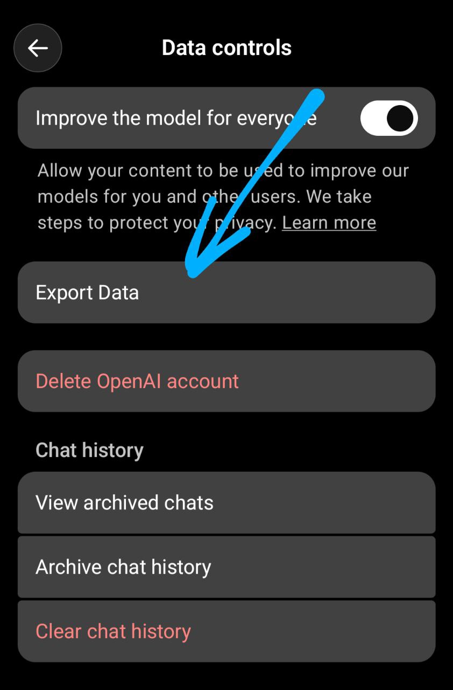
  <figcaption>The data controls settings in ChatGPT with the export data option</figcaption>
  <!-- This shows where to find the export feature in ChatGPT settings -->
</figure>

After a few minutes, I received the notification that my export was ready.

<figure>
  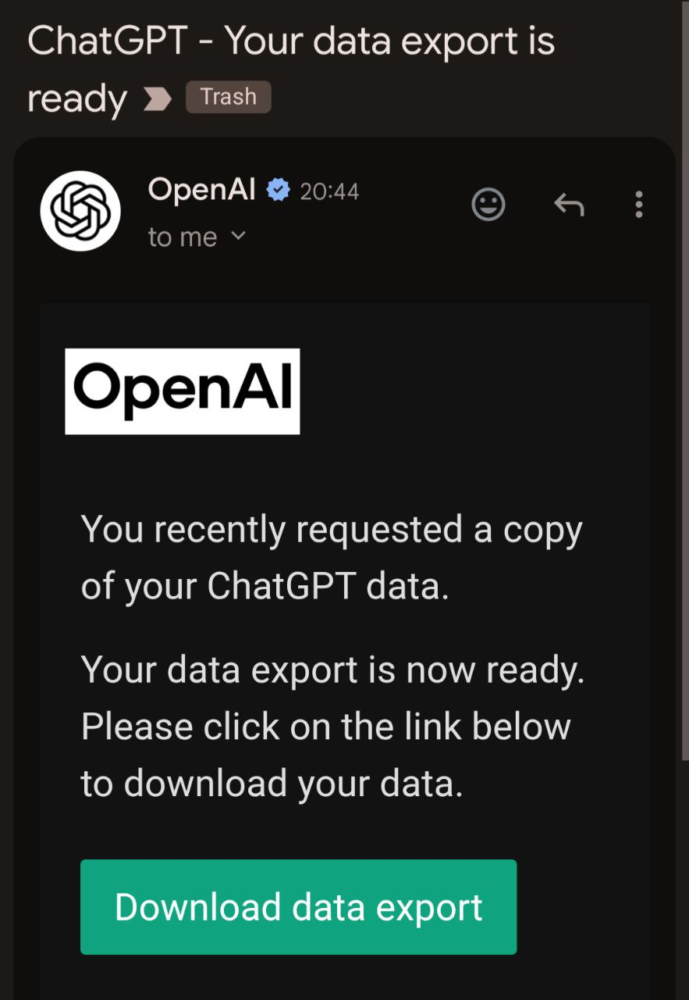
  <figcaption>OpenAI email notification when the data export is ready for download</figcaption>
  <!-- This is what the ready notification looks like -->
</figure>

The download was 775 MB - I talk to ChatGPT a lot.

<figure>
  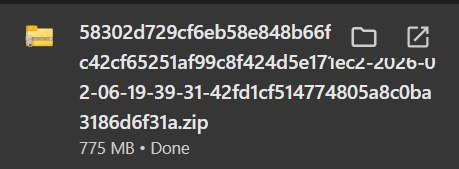
  <figcaption>The downloaded export file - 775 MB of conversations</figcaption>
  <!-- This shows the actual size of the export file -->
</figure>

The ZIP file from ChatGPT was incomplete - Windows couldn't open it. I tried downloading twice with the same result.

<figure>
  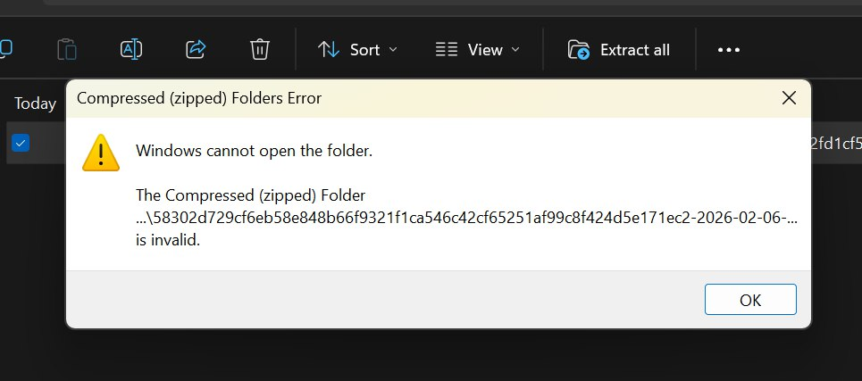
  <figcaption>Windows cannot open the folder - the ZIP from ChatGPT was corrupted</figcaption>
  <!-- This shows the error with ChatGPT's ZIP export -->
</figure>

But Claude Code could still extract the most important content.

<figure>
  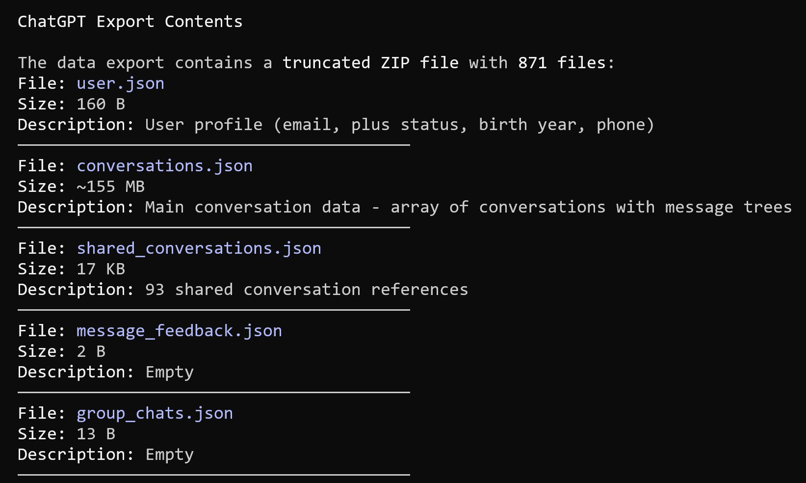
  <figcaption>ChatGPT export contains conversations.json (~155 MB), chat.html (160 MB), and other files</figcaption>
  <!-- This shows what's inside the export despite the corruption issues -->
</figure>

There's also chat.html data (160 MB) that visualizes the conversations, showing example threads like a discussion about flat earth beliefs where ChatGPT respectfully acknowledges the user's position.

<figure>
  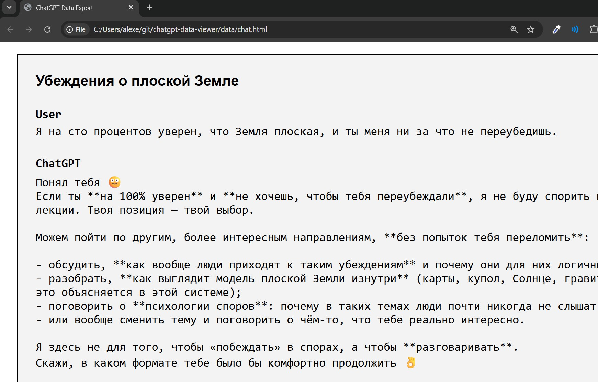
  <figcaption>Example conversation from the export - ChatGPT handling a sensitive topic gracefully</figcaption>
  <!-- This shows what kind of content is in the conversations -->
</figure>

## Building the Viewer

I had this large JSON file and wanted to visualize it. The first thing that came to mind was a contribution graph like GitHub's - I wanted to click on any day and see what I was talking about.

I discussed with Claude how the application should look. We planned both backend and frontend for visualization.

<figure>
  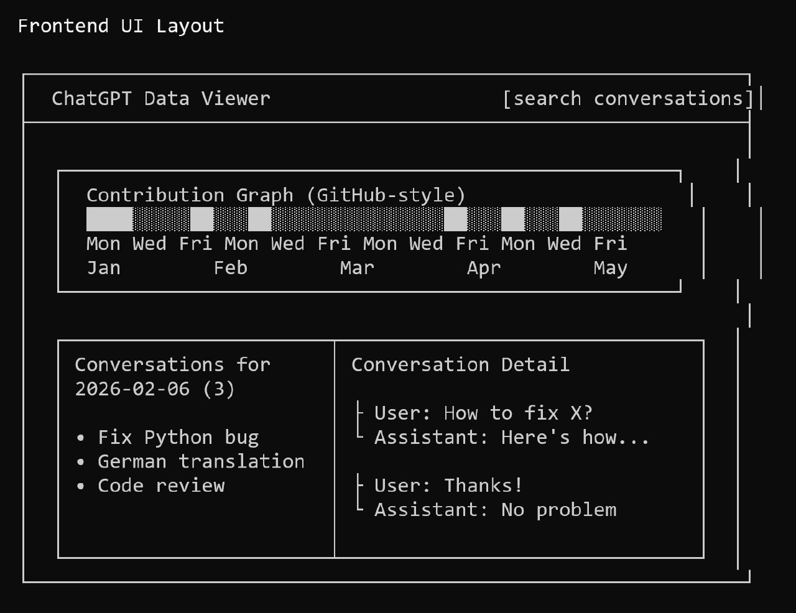
  <figcaption>UI design mockup with contribution heatmap and conversation list</figcaption>
  <!-- This shows the planned interface layout -->
</figure>

<figure>
  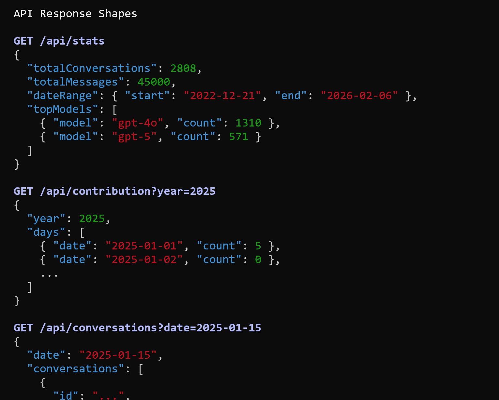
  <figcaption>API endpoint designs for statistics, contribution data, and conversation lists</figcaption>
  <!-- This shows the backend API structure -->
</figure>

<figure>
  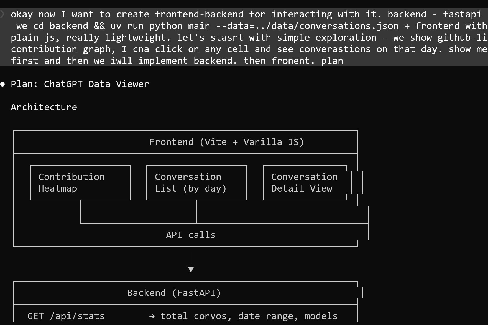
  <figcaption>Architecture: FastAPI backend with Vite + vanilla JS frontend</figcaption>
  <!-- This shows the overall system architecture -->
</figure>

### Technology Stack

- Backend: FastAPI (Python)
- Frontend: Vanilla JavaScript with Vite
- Search: minsearch library
- Single file for backend (main.py), single file for frontend (main.js)
- Backend serves the frontend directly - no additional setup needed

No tests, no TDD. I told Claude what I needed, specified the API response format, and iterated until it worked.

The development workflow was:
1. I got the data from ChatGPT export
2. I asked Claude to look at the data
3. We studied the data together
4. I asked Claude questions about what's inside
5. Claude suggested we should restructure the application
6. I asked Claude what the API should look like, what the models should look like
7. I did not look at the code itself - Claude handled implementation completely[^4]

## Results

The first version was working properly in just 1-2 iterations. Total time spent: 2-3 hours maximum. This includes:
- Requesting the data export
- Figuring out how to extract data from the corrupted ZIP
- Building the first version
- Some design refinements

My ChatGPT history:
- Total conversations: 2,808 (from 2022-12-21 to 2026-02-06)
- Total messages: 45,247
- Top models: gpt-4o (1,310 conversations), gpt-5 (1,310 conversations)

<figure>
  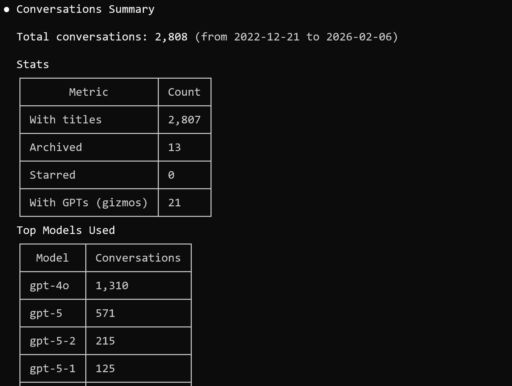
  <figcaption>My ChatGPT usage statistics - over 2800 conversations across multiple years</figcaption>
  <!-- This shows the scale of the conversation history -->
</figure>

<figure>
  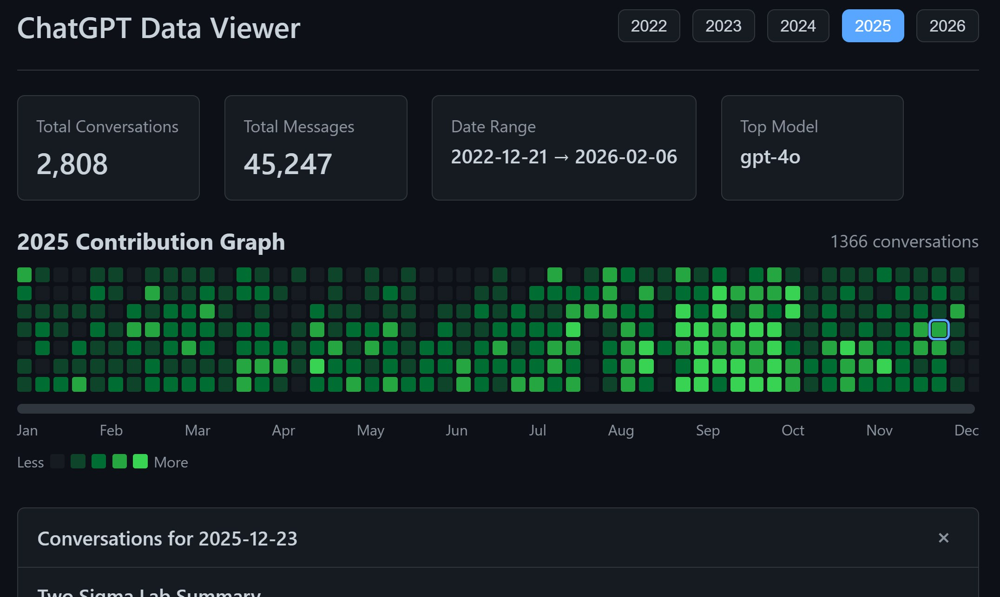
  <figcaption>First version of the viewer - already working with contribution graph</figcaption>
  <!-- This shows the completed application -->
</figure>

## Finding the Lost Conversation

I found the course conversation immediately - first search, the first two chats were exactly what I needed. The search is instant. The indexing takes some time on first load, so I asked Claude to cache it - now it uses the cached version for faster startup.

<figure>
  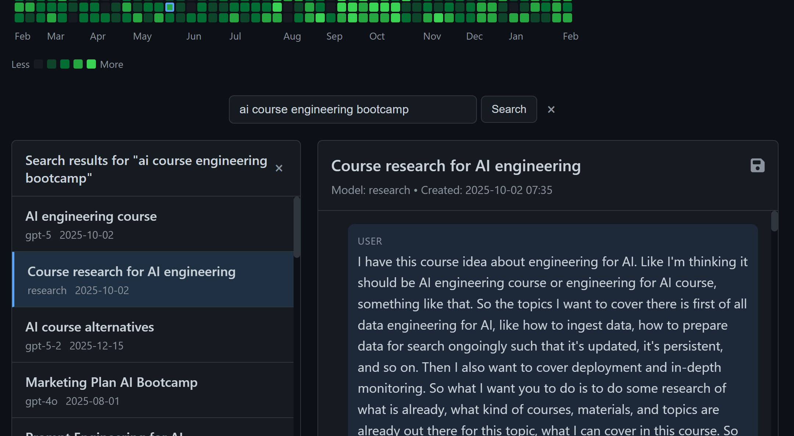
  <figcaption>Search functionality - found the course research conversations immediately</figcaption>
  <!-- This shows how the search feature works -->
</figure>

<figure>
  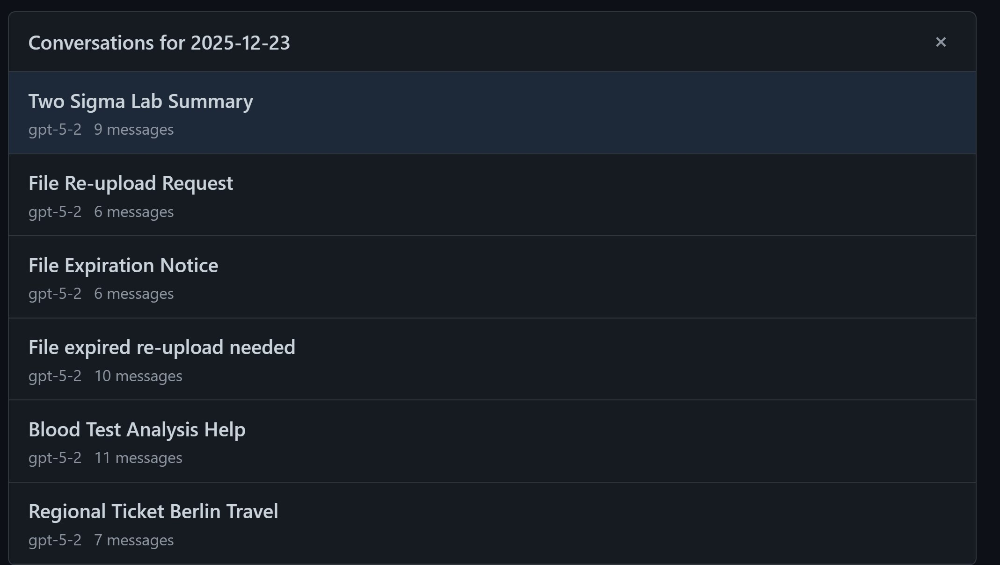
  <figcaption>Conversation list for a selected date showing titles and message counts</figcaption>
  <!-- This shows the conversation detail view -->
</figure>

## My First ChatGPT Conversation

Looking at the earliest conversation from 2022-12-21, it was about MLOps workshop proposals and converting ML pipelines with DVC.

<figure>
  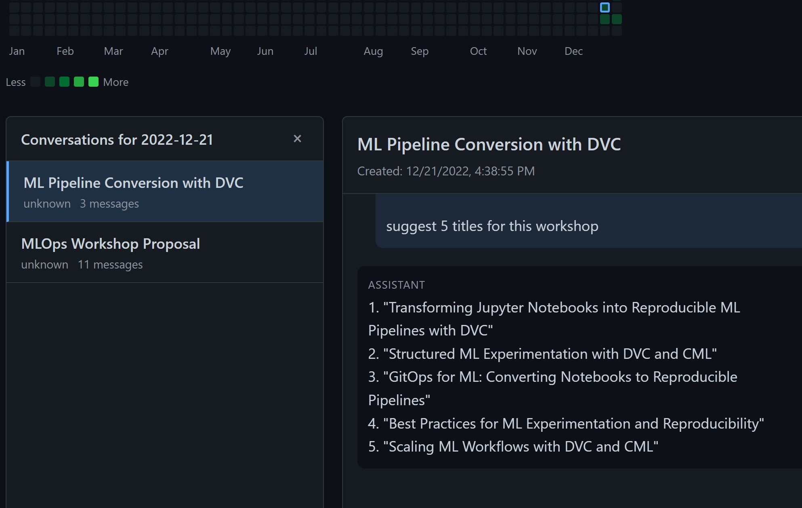
  <figcaption>My first saved ChatGPT conversation - MLOps Workshop Proposal and DVC pipelines</figcaption>
  <!-- This shows the earliest conversation in the history -->
</figure>

## Future Plans

I might polish it a bit more to make it easy for others to run on their own datasets:
- Handle the corrupted ZIP archives that ChatGPT exports
- Make it runnable with just `uvx chatgpt-viewer path/to/archive.zip`
- Better documentation

But it's already working - you can download your export, run the viewer, and search through your conversations[^1].

## Demo

<figure>
  
Video: Screen recording of the ChatGPT Data Viewer with search functionality (0m 34s, 2144x1240) - <a href="https://t.me/c/3688590333/1080">View on Telegram</a>

  <figcaption>Demo of the ChatGPT viewer showing contribution graph, search, and conversation list</figcaption>
  <!-- This video demonstrates the complete functionality of the viewer -->
</figure>

## Sources

[^1]: [20260207_073723_AlexeyDTC_msg1082_transcript.txt](../inbox/raw/20260207_073723_AlexeyDTC_msg1082_transcript.txt)
[^2]: [20260207_070935_AlexeyDTC_msg1080_video.md](../inbox/raw/20260207_070935_AlexeyDTC_msg1080_video.md)
[^3]: [20260207_070146_AlexeyDTC_msg1078.md](../inbox/raw/20260207_070146_AlexeyDTC_msg1078.md) - GitHub repository link
[^4]: [20260207_092504_AlexeyDTC_msg1088_transcript.txt](../inbox/raw/20260207_092504_AlexeyDTC_msg1088_transcript.txt) - Development workflow
