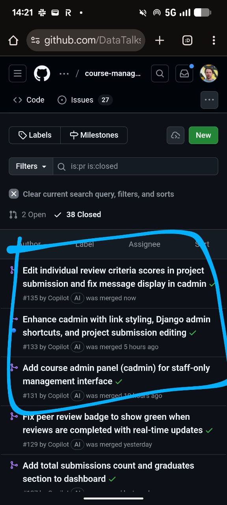

# Claude Code Experiments

Experiments and practical applications of Claude Code in various scenarios beyond traditional coding tasks.

## USB Device Control

Claude Code has terminal access which enables interaction with connected hardware. I connected my phone via USB and asked Claude to figure out what to do. It provided step-by-step instructions for the required actions.

The experiment demonstrates that Claude has sufficient knowledge to handle various scenarios. When errors occur, it can search the internet for solutions. This opens up many possibilities - not just coding, but any action that can be performed through a terminal.

### Phone as a Server Experiment

I wanted to install Code Code on my phone. Not just as an application, but to install Linux on the phone to run Code Code, and then connect via SSH. The idea was to use the phone instead of renting a server instance.

The rationale: Android phones have many Google services consuming resources. My old Samsung has 2GB of RAM, with 1.8GB occupied by Google services and Android itself. Installing Linux or a minimal Android could free up resources for running a personal server.

The experiment did not succeed due to Samsung's Knox protection, which prevents reflashing. The phone turned into a brick during the process. However, Claude helped me restore it to factory settings. With a different phone brand (friends say non-Samsung phones work), this approach might succeed.

## Learning New Products Independently

I was asked to prepare an in-person workshop for Exo, a company with a new product for AI agents. The product has minimal documentation. They gave me access to internal courses and asked me to figure out how to use it.

Instead of spending hours going through the materials myself, I gave the task to Claude Code. Here is what I provided:
- The task description
- Instructions on how to install the product
- How to create an account
- Links to internal courses

Claude spent about two hours analyzing the materials. It found a Python library and solved all the required tasks using it. Then it produced a markdown file with complete documentation.

This saved me significant time. I did not have to figure out what works and what does not. Claude did the exploration and delivered organized documentation.

## Course Management Platform Development

Currently working on a new feature for the course management platform to reduce manual administrative work. Previously, administrative tasks required clicking through the Django admin interface manually.

With AI assistants available, I decided to create a more convenient custom admin interface tailored to our platform.

<figure>
  
  <figcaption>Recent closed pull requests showing Copilot's contributions to the course management platform</figcaption>
  <!-- This illustrates the output of delegating features to AI assistants -->
</figure>

### GitHub-Copilot Workflow

Copilot handles this project well. I have already written about my workflow - I create a GitHub issue, assign it to Copilot, and review the pull request when ready.

The recent pull requests demonstrate this workflow in action[^1]. PR #135 shows a comprehensive implementation:
- Individual review criteria scores editing (instead of aggregate score)
- Auto-calculation of total scores using JavaScript
- Message display fixes across templates
- Template refactoring to eliminate code duplication
- Full test coverage

What is notable about this approach is how features that were previously delayed due to implementation time can now be attempted. If the implementation is good, I accept it. If not, I can iterate with feedback.

### Copilot vs Claude Code

Both tools have their place:

- Cursor and other coding-focused IDEs are optimized for writing code within projects
- Claude Code is better for general-purpose tasks that are not strictly about coding

For example, tasks like "figure out this binary file" or "deal with this USB-connected phone" are better suited to Claude Code's terminal access and general problem-solving capabilities. Cursor can handle them too, but its strength is in coding workflows rather than general automation.

## Sources
- [20260117_193932_AlexeyDTC_msg249_transcript.txt](../inbox/raw/20260117_193932_AlexeyDTC_msg249_transcript.txt)
- [20260117_193932_AlexeyDTC_msg250_transcript.txt](../inbox/raw/20260117_193932_AlexeyDTC_msg250_transcript.txt)
- [20260117_193932_AlexeyDTC_msg251_transcript.txt](../inbox/raw/20260117_193932_AlexeyDTC_msg251_transcript.txt)
- [20260117_193932_AlexeyDTC_msg252.md](../inbox/raw/20260117_193932_AlexeyDTC_msg252.md)
- [20260117_193932_AlexeyDTC_msg253_transcript.txt](../inbox/raw/20260117_193932_AlexeyDTC_msg253_transcript.txt)
- [20260117_193932_AlexeyDTC_msg254.md](../inbox/raw/20260117_193932_AlexeyDTC_msg254.md)
- [20260117_193932_AlexeyDTC_msg255_transcript.txt](../inbox/raw/20260117_193932_AlexeyDTC_msg255_transcript.txt)
- [20260117_193932_AlexeyDTC_msg257_transcript.txt](../inbox/raw/20260117_193932_AlexeyDTC_msg257_transcript.txt)
- [20260117_193932_AlexeyDTC_msg256.jpg](../assets/images/claude-code-experiments/closed-pull-requests.jpg)

[^1]: [PR #135 - Edit individual review criteria scores in project submission and fix message display in cadmin](https://github.com/DataTalksClub/course-management-platform/pull/135)
