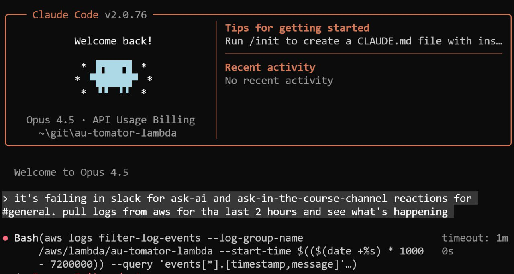

# Claude Code Experiments

Experiments and practical applications of Claude Code in various scenarios beyond traditional coding tasks.

## Running Code on Cloud vs Phone

I experimented with running Claude Code on different platforms. Initially, I wanted to run it on my phone to be able to work from anywhere without carrying a laptop. The idea was to install Linux on the phone and run Code Code there, connecting via SSH[^1].

### Phone as Server Experiment

The rationale: Android phones have many Google services consuming resources. My old Samsung has 2GB of RAM, with 1.8GB occupied by Google services and Android itself. Installing Linux or a minimal Android could free up resources for running a personal server.

The experiment did not succeed due to Samsung's Knox protection, which prevents reflashing. The phone turned into a brick during the process. However, Claude helped me restore it to factory settings. With a different phone brand (friends say non-Samsung phones work), this approach might succeed[^1].

### Why Not Cloud?

GitHub Copilot Cloud can run code remotely, but it's tied to a specific project and requires a properly configured environment with tests. Claude Code can handle any task possible through a terminal - a much broader range of operations[^1].

Currently, the solution is running a Telegram bot on the laptop that processes requests through Claude. This is the experiment behind the "Telegram Writing Assistant" project[^1].

### Long-Term Vision

The goal is to have an agent running somewhere (ideally on a personal laptop or server) that can handle any request through Telegram. Send a voice or text message, Claude processes it and executes the task. This could eliminate the need to carry a laptop for many tasks[^1].

## Learning New Products Independently

I was asked to prepare an in-person workshop for Exo, a company with a new product for AI agents. The product has minimal documentation. They gave me access to internal courses and asked me to figure out how to use it.

Instead of spending hours going through the materials myself, I gave the task to Claude Code. Here is what I provided:
- The task description
- Instructions on how to install the product
- How to create an account
- Links to internal courses

Claude spent about two hours analyzing the materials. It found a Python library and solved all the required tasks using it. Then it produced a markdown file with complete documentation.

This saved me significant time. I did not have to figure out what works and what does not. Claude did the exploration and delivered organized documentation.

## Course Management Platform Development

Currently working on a new feature for the course management platform to reduce manual administrative work. Previously, administrative tasks required clicking through the Django admin interface manually.

With AI assistants available, I decided to create a more convenient custom admin interface tailored to our platform.

<figure>
  
  <figcaption>Recent closed pull requests showing Copilot's contributions to the course management platform</figcaption>
  <!-- This illustrates the output of delegating features to AI assistants -->
</figure>

### GitHub-Copilot Workflow

Copilot handles this project well. I have already written about my workflow - I create a GitHub issue, assign it to Copilot, and review the pull request when ready.

The recent pull requests demonstrate this workflow in action[^1]. PR #135 shows a comprehensive implementation:
- Individual review criteria scores editing (instead of aggregate score)
- Auto-calculation of total scores using JavaScript
- Message display fixes across templates
- Template refactoring to eliminate code duplication
- Full test coverage

What is notable about this approach is how features that were previously delayed due to implementation time can now be attempted. If the implementation is good, I accept it. If not, I can iterate with feedback.

### Copilot vs Claude Code

Both tools have their place:

- Cursor and other coding-focused IDEs are optimized for writing code within projects
- Claude Code is better for general-purpose tasks that are not strictly about coding

For example, tasks like "figure out this binary file" or "deal with this USB-connected phone" are better suited to Claude Code's terminal access and general problem-solving capabilities. Cursor can handle them too, but its strength is in coding workflows rather than general automation.

### Terminal-Based vs IDE-Based AI Assistants

I see Claude Code as an assistant that can execute bash commands in the terminal. This is not necessarily about coding - Claude Code handles this well, but for more thoughtful coding work, I prefer Cursor or other IDE-based assistants.

With Cursor, I see all changes the agent makes. I can accept or reject each change. I have more control over what happens. When working from the terminal, I see what the agent is doing and can stop it, but it's more of a "wipe-coding" experience than AI-assisted coding[^2].

For tasks like "send a POST request" or "make this pull request" where I can review the plan first, the terminal workflow works great. I can ask to see the plan first, approve it, and then the agent creates everything[^3].

## Course Material Automation

Beyond the platform development, I've also automated the creation of course materials. Previously, creating homework assignments and course plans required 20-30 minutes of clicking in the admin interface for each course.

I created a Claude agent with skills describing how to interact with the course management platform API. Now I can describe what I want in text format - which homework assignments to create, what deadlines they should have - and the agent makes the POST requests and sends me a URL to review[^4].

This same approach works for creating individual homework assignments. My previous workflow:
1. Write homework in a Markdown document
2. Push to repository
3. Open the platform admin interface
4. Manually enter questions and answers (5-10 minutes)

Now I can tell the agent: "Here's a markdown document with homework, please create the homework form." Done[^5].

## Troubleshooting Production Issues

Claude Code is particularly useful for troubleshooting production issues when time is limited. I had a situation where the bot was failing for Slack reactions in the general channel. Normally, I would:
1. Go to CloudWatch
2. Check logs there
3. Try to understand what went wrong
4. Fix the issue based on the logs

Instead, I simply asked Claude Code to pull the logs from AWS for the last 2 hours and analyze what was happening. It:
1. Figured out how to retrieve the logs using AWS CLI
2. Found the stacktrace in the logs
3. Identified the error from the stacktrace
4. Fixed the error
5. Made a git commit and push
6. The deployment happened automatically on push

I was preparing for a trip and didn't have time to sit and debug. I just gave Claude Code the task and continued with my preparations while it handled everything. This type of automation - handling urgent maintenance tasks - is where Claude Code excels. Tools like Cursor, Antigravity, and Copilot are better suited for more thoughtful, interactive coding work[^6].

## Automator Bot Debugging

I use an automator bot for community management in Discord. The bot reacts to posts based on emoji reactions I leave - for example, promotional posts in the wrong channel get moved or deleted, and the bot sends appropriate messages.

Recently, the bot stopped working correctly. Posts weren't being deleted from General, and messages weren't being sent to users. Since I was preparing for a family trip and didn't have time to debug, I delegated the task to Claude Code[^8].

Claude Code:
1. Figured out how to retrieve logs from the bot
2. Analyzed the logs to find the error
3. Identified that I had accidentally deleted the API key
4. Guided me to update the key in AWS directly

The entire process happened without me needing to open a browser or manually navigate AWS console. This demonstrates how Claude Code excels at automation tasks where the focus is on executing actions rather than writing code[^8].

## Sources

<figure>
  
  <figcaption>Claude Code analyzing AWS logs to diagnose and fix a Slack integration issue automatically</figcaption>
  <!-- This illustrates the practical application of Claude Code for production troubleshooting -->
</figure>

## Sources
- [20260117_193932_AlexeyDTC_msg249_transcript.txt](../inbox/raw/20260117_193932_AlexeyDTC_msg249_transcript.txt)
- [20260117_193932_AlexeyDTC_msg250_transcript.txt](../inbox/raw/20260117_193932_AlexeyDTC_msg250_transcript.txt)
- [20260117_193932_AlexeyDTC_msg251_transcript.txt](../inbox/raw/20260117_193932_AlexeyDTC_msg251_transcript.txt)
- [20260117_193932_AlexeyDTC_msg252.md](../inbox/raw/20260117_193932_AlexeyDTC_msg252.md)
- [20260117_193932_AlexeyDTC_msg253_transcript.txt](../inbox/raw/20260117_193932_AlexeyDTC_msg253_transcript.txt)
- [20260117_193932_AlexeyDTC_msg254.md](../inbox/raw/20260117_193932_AlexeyDTC_msg254.md)
- [20260117_193932_AlexeyDTC_msg255_transcript.txt](../inbox/raw/20260117_193932_AlexeyDTC_msg255_transcript.txt)
- [20260117_193932_AlexeyDTC_msg257_transcript.txt](../inbox/raw/20260117_193932_AlexeyDTC_msg257_transcript.txt)
- [20260117_193932_AlexeyDTC_msg256.jpg](../assets/images/claude-code-experiments/closed-pull-requests.jpg)
- [20260123_120918_valeriia_kuka_msg424_transcript.txt](../inbox/raw/20260123_120918_valeriia_kuka_msg424_transcript.txt)
- [20260123_120918_valeriia_kuka_msg425_transcript.txt](../inbox/raw/20260123_120918_valeriia_kuka_msg425_transcript.txt)
- [20260123_120918_valeriia_kuka_msg426_transcript.txt](../inbox/raw/20260123_120918_valeriia_kuka_msg426_transcript.txt)
- [20260123_120918_valeriia_kuka_msg427_transcript.txt](../inbox/raw/20260123_120918_valeriia_kuka_msg427_transcript.txt)
- [20260123_120918_valeriia_kuka_msg428_transcript.txt](../inbox/raw/20260123_120918_valeriia_kuka_msg428_transcript.txt)
- [20260123_120918_valeriia_kuka_msg429_transcript.txt](../inbox/raw/20260123_120918_valeriia_kuka_msg429_transcript.txt)
- [20260123_120956_valeriia_kuka_msg436.md](../inbox/raw/20260123_120956_valeriia_kuka_msg436.md)
- [20260123_121239_valeriia_kuka_msg438.md](../inbox/raw/20260123_121239_valeriia_kuka_msg438.md)
- [20260129_171140_AlexeyDTC_msg641_transcript.txt](../inbox/raw/20260129_171140_AlexeyDTC_msg641_transcript.txt)
- [20260204_100207_AlexeyDTC_msg898_transcript.txt](../inbox/raw/20260204_100207_AlexeyDTC_msg898_transcript.txt)
- [20260204_100023_AlexeyDTC_msg896.jpg](../assets/images/claude-code-experiments/aws-logs-troubleshooting.jpg)

[^1]: [20260129_171140_AlexeyDTC_msg641_transcript.txt](../inbox/raw/20260129_171140_AlexeyDTC_msg641_transcript.txt)
[^2]: [PR #135 - Edit individual review criteria scores in project submission and fix message display in cadmin](https://github.com/DataTalksClub/course-management-platform/pull/135)
[^3]: [20260123_120918_valeriia_kuka_msg426_transcript.txt](../inbox/raw/20260123_120918_valeriia_kuka_msg426_transcript.txt)
[^4]: [20260123_120918_valeriia_kuka_msg428_transcript.txt](../inbox/raw/20260123_120918_valeriia_kuka_msg428_transcript.txt)
[^5]: [20260123_120918_valeriia_kuka_msg424_transcript.txt](../inbox/raw/20260123_120918_valeriia_kuka_msg424_transcript.txt)
[^6]: [20260204_100207_AlexeyDTC_msg898_transcript.txt](../inbox/raw/20260204_100207_AlexeyDTC_msg898_transcript.txt)
[^7]: [20260204_100023_AlexeyDTC_msg896_photo.md](../inbox/raw/20260204_100023_AlexeyDTC_msg896_photo.md)
[^8]: [20260205_122657_AlexeyDTC_msg937_transcript.txt](../inbox/raw/20260205_122657_AlexeyDTC_msg937_transcript.txt)
