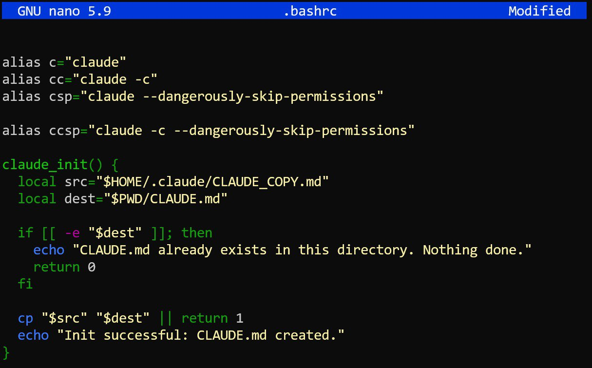
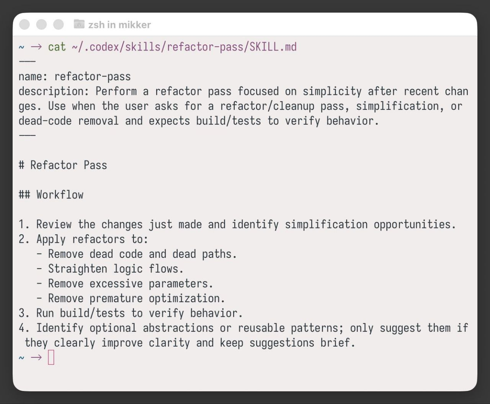

# Claude Code Helpers

Simple bash aliases and functions to make working with Claude Code more convenient.

Code: https://github.com/alexeygrigorev/.claude/[^3]

## The Problem

I have many libraries and projects that I work on across different devices - my main computer and my tablet. I used to share code snippets and commands via Telegram, but that was inconvenient. When switching devices, I had to dig through messages to find the right command.

A better solution emerged: create a GitHub repository for all my Claude Code configuration and sync it across devices. Everything I need is now in one place, accessible from any device, and automatically synchronized.

## Repository Structure

The `.claude` repository contains:
- `commands/` - Custom slash commands for Claude Code
- `skills/` - Custom skills for Claude Code
- `.bashrc` - Claude-related aliases and functions
- `CLAUDE.md` - Project-specific instructions for Claude

To set up symlinks from the repo to your home directory:

cd ~/git/.claude
ln -sf "$(pwd)/skills" ~/.claude/skills
ln -sf "$(pwd)/commands" ~/.claude/commands

Or use the install script:

./install.sh

## Aliases

These shortcuts make it faster to invoke Claude Code from the terminal:

```bash
alias c="claude"
alias cc="claude -c"
alias csp="claude --dangerously-skip-permissions"
alias ccsp="claude -c --dangerously-skip-permissions"
```

## Initialization Function

A helper function to initialize a new project with a Claude configuration file:

```bash
claude_init() {
  local src="$HOME/.claude/CLAUDE_COPY.md"
  local dest="$PWD/CLAUDe.md"

  if [[ -e "$dest" ]]; then
    echo "CLAUDe.md already exists in this directory. Nothing done."
    return 0
  fi

  cp "$src" "$dest" || return 1
  echo "Init successful: CLAUDe.md created."
}
```

This function copies a master Claude configuration file to the current directory, avoiding duplication and ensuring consistent configuration across projects[^1].

<figure>
  
  <figcaption>The bash configuration file with aliases and the claude_init function</figcaption>
  <!-- These helpers are added to .bashrc for quick access -->
</figure>

## Slash Commands

The repository includes several custom slash commands that automate common workflows. These commands can be used across all projects and devices - changes to the commands are automatically synchronized.

### Release Command

Automates the Python library release process. Previously, I did this manually with some automation:
1. Run tests
2. Bump version number
3. Run build
4. Push to TestPyPI
5. Verify everything works
6. Push to PyPI
7. Create GitHub release with notes
8. Clean up build artifacts

The `/release` command uses GitHub CLI to automate all of this[^4].

Key features:
- Checks for Makefile with publish targets first
- Falls back to manual process if no Makefile
- Creates GitHub release with auto-generated notes from git log
- Uploads binaries to the release
- Cleans up build artifacts afterwards

The command also generates release notes by looking at commits since the last tag, which I previously left empty or filled manually. This saves time and provides better documentation[^5].

### init-library Command

Initializes a new Python library with a consistent structure. This was created after analyzing all my existing libraries (minsearch, toyaikit, jackson, gitsource) to find common patterns[^6].

The command creates:
- Proper project structure with package directory, tests, CI workflows
- pyproject.toml with correct build configuration (hatchling)
- Makefile with standard targets (test, setup, shell, publish-build, publish-test, publish, publish-clean)
- __version__.py file for version management
- .github/workflows/test.yml for CI
- Standard .gitignore and .python-version files

The structure is designed to work with the `/release` command - libraries initialized this way follow the expected format for automated releases[^7].

### create-github-repo Command

When working in a directory and deciding something is ready to publish to GitHub, this command handles the creation process[^8].

Previously required:
1. Going to GitHub website manually
2. Creating the repository
3. Running git commands (which I often had to Google or ask ChatGPT for)
4. Pushing to remote

The `/create-github-repo` command asks for the repository name and handles everything via GitHub CLI. It supports:
- Using current folder name
- Suggested name based on codebase analysis
- Custom name
- Public or private visibility
- Immediate push or setup only

## Why Global Commands?

Instead of maintaining these commands in each individual repository, keeping them globally in `.claude` means:
- Changes propagate automatically to all devices
- Single source of truth for all projects
- Commands work identically everywhere
- Easy to update and improve workflow[^9]

## Subagents

For subagents - specialized agents for tasks like research workflows and verification - see the dedicated [Subagents](subagents.md) article[^10].

## Skills

### Refactor Pass Skill

A skill for performing a refactoring pass focused on simplicity after recent changes. This is useful when the user asks for a refactor, cleanup pass, simplification, or dead-code removal and expects build/tests to verify behavior.

The workflow:
1. Review the changes just made and identify simplification opportunities
2. Apply refactors to:
   - Remove dead code and dead paths
   - Straighten logic flows
   - Remove excessive parameters
   - Remove premature optimization
3. Run build/tests to verify behavior
4. Identify optional abstractions or reusable patterns (only suggest if they clearly improve clarity)

This skill should be added to the Claude configuration to handle post-coding cleanup efficiently.

<figure>
  
  <figcaption>The refactor-pass skill definition showing the workflow for simplification after code changes</figcaption>
  <!-- This skill can be added to Claude Code configuration for automated cleanup passes -->
</figure>

### Fetch YouTube Skill

A new skill that fetches YouTube video transcripts. This was needed for the Data Engineering Zoomcamp - Bruin company prepared videos for module 5, and I wanted to make a transcript of that module to create a retro video. So I created a new skill for it and tested it right away. It works great[^13][^14].

Code: https://github.com/alexeygrigorev/.claude/tree/main/skills/fetch-youtube[^13]

The collection of skills will keep growing over time[^14].

## Safety Hooks

Hooks in Claude Code can prevent dangerous operations. A useful stop hook from AIHero.dev prevents Claude Code from running dangerous git commands[^11].

The hook intercepts commands like `git push --force` and asks for confirmation before executing. This prevents accidental force pushes and other destructive git operations.

## Sources

- [20260123_135217_AlexeyDTC_msg532_photo.md](../inbox/used/20260123_135217_AlexeyDTC_msg532_photo.md)
- [20260122_182057_AlexeyDTC_msg413_photo.md](../inbox/used/20260122_182057_AlexeyDTC_msg413_photo.md)

[^1]: [20260123_135217_AlexeyDTC_msg532_photo.md](../inbox/used/20260123_135217_AlexeyDTC_msg532_photo.md)
[^2]: [20260122_182057_AlexeyDTC_msg413_photo.md](../inbox/used/20260122_182057_AlexeyDTC_msg413_photo.md)
[^3]: [20260207_133114_AlexeyDTC_msg1090.md](../inbox/used/20260207_133114_AlexeyDTC_msg1090.md) - GitHub repository link
[^4]: [20260207_133739_AlexeyDTC_msg1093_transcript.txt](../inbox/used/20260207_133739_AlexeyDTC_msg1093_transcript.txt) - Release workflow
[^5]: [20260207_133836_AlexeyDTC_msg1094_transcript.txt](../inbox/used/20260207_133836_AlexeyDTC_msg1094_transcript.txt) - Release notes automation
[^6]: [20260207_133954_AlexeyDTC_msg1096_transcript.txt](../inbox/used/20260207_133954_AlexeyDTC_msg1096_transcript.txt) - Library analysis
[^7]: [20260207_135040_AlexeyDTC_msg1099_transcript.txt](../inbox/used/20260207_135040_AlexeyDTC_msg1099_transcript.txt) - Init and release relationship
[^8]: [20260207_135254_AlexeyDTC_msg1101_transcript.txt](../inbox/used/20260207_135254_AlexeyDTC_msg1101_transcript.txt) - GitHub repo creation
[^9]: [20260207_133907_AlexeyDTC_msg1095_transcript.txt](../inbox/used/20260207_133907_AlexeyDTC_msg1095_transcript.txt) - Global command benefits
[^10]: [20260210_152205_AlexeyDTC_msg1293_transcript.txt](../inbox/used/20260210_152205_AlexeyDTC_msg1293_transcript.txt) - Subagents for research workflow
[^11]: [20260211_053127_AlexeyDTC_msg1371.md](../inbox/used/20260211_053127_AlexeyDTC_msg1371.md) - Safety hooks reference
[^12]: [20260211_045044_AlexeyDTC_msg1367_photo.md](../inbox/used/20260211_045044_AlexeyDTC_msg1367_photo.md) - Refactor pass skill
[^13]: [20260213_180159_AlexeyDTC_msg1641.md](../inbox/used/20260213_180159_AlexeyDTC_msg1641.md) - YouTube skill link
[^14]: [20260213_180241_AlexeyDTC_msg1643_transcript.txt](../inbox/used/20260213_180241_AlexeyDTC_msg1643_transcript.txt) - YouTube skill description
