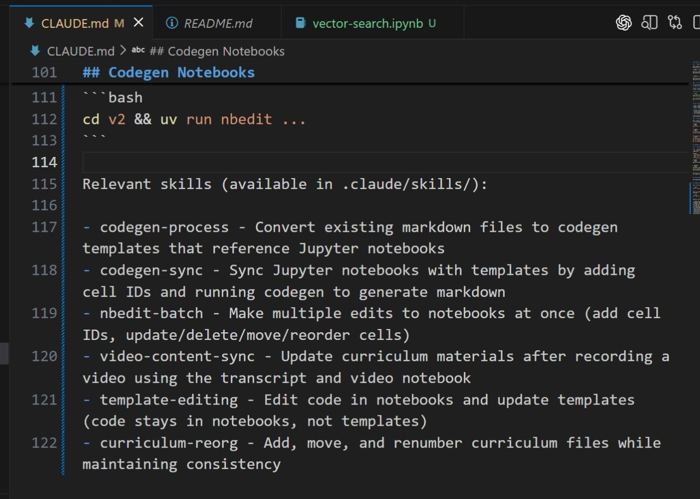

# Claude Skills vs AGENTS.md

When working with AI coding agents like Claude Code, there are two main approaches to providing context and instructions: skills files and markdown configuration files. The choice between these approaches affects how reliably the agent follows instructions.

## Skills Approach

Skills are packages of prompts, tools, and documentation that an agent can invoke on demand. The idea is that the agent recognizes when it needs specific help and invokes the appropriate skill.

Problems with skills:
- The agent doesn't always invoke skills when it should
- Requires the agent to make a decision about whether to use a skill
- Without explicit instructions to use skills, they provide no improvement over having no documentation at all
- Even with explicit instructions, skill invocation is unreliable[^1]

## AGENTS.md / CLAUDE.md Approach

AGENTS.md (or CLAUDE.md for Claude Code) is a markdown file in the project root that provides persistent context to the coding agent. Whatever you put in this file is available to the agent on every turn, without the agent needing to decide to load it.

Vercel's testing found that AGENTS.md significantly outperformed skills:
- Baseline (no docs): 53% pass rate
- Skills (default): 53% pass rate (no improvement)
- Skills with explicit instructions: 79% pass rate
- AGENTS.md with docs index: 100% pass rate[^1]

## Personal Experience with Claude Code

In practice, Claude Code often needs explicit prompting to use skills. When working with the agent, it frequently requires being told to use specific skills rather than recognizing when to invoke them automatically[^2].

Additionally, over time the agent tends to forget what's written in skills and needs reminders. This creates friction in the workflow[^2].

The solution that works better is to write important instructions directly in CLAUDE.md:
- Critical workflows and patterns go in CLAUDE.md
- Skills are referenced from CLAUDE.md when needed
- This uses more context but produces better results
- The agent has the important information always available[^2]

<figure>
  
  <figcaption>Adding relevant skills directly to CLAUDE.md helps Claude use them consistently</figcaption>
  <!-- This shows how to document available skills in the project configuration -->
</figure>

## Why Passive Context Works Better

The AGENTS.md approach works better for several reasons:
- No decision point - the agent doesn't need to decide whether to look up information
- Consistent availability - content is in the system prompt for every turn
- No ordering issues - no sequencing decisions about when to read docs vs explore project[^1]

## Practical Recommendations

- Put important instructions in CLAUDE.md, not just in skills
- Use skills for action-specific workflows that users explicitly trigger
- Accept that this uses more context in exchange for better behavior
- Reference skills from CLAUDE.md so the agent knows they exist[^2]

## Sources

- [20260128_170632_AlexeyDTC_msg621_transcript.txt](../inbox/raw/20260128_170632_AlexeyDTC_msg621_transcript.txt)
- [20260128_181537_AlexeyDTC_msg623_photo.md](../inbox/raw/20260128_181537_AlexeyDTC_msg623_photo.md)
- [AGENTS.md outperforms skills in our agent evals - Vercel](https://vercel.com/blog/agents-md-outperforms-skills-in-our-agent-evals)

[^1]: [AGENTS.md outperforms skills in our agent evals - Vercel](https://vercel.com/blog/agents-md-outperforms-skills-in-our-agent-evals)
[^2]: [20260128_170632_AlexeyDTC_msg621_transcript.txt](../inbox/raw/20260128_170632_AlexeyDTC_msg621_transcript.txt)
