# How to Do Evals in 2026
## A tool-agnostic framework for evaluating AI agents

Across all 4,894 AI engineering job descriptions that I collected for the [AI Engineering Field Guide](https://github.com/alexeygrigorev/ai-engineering-field-guide), evaluation consistently comes up as the number one skill that AI Engineers must have.

It also appears in interview questions. In interviews, you'll definitely hear something like "how do you evaluate a RAG pipeline?" or "how do you measure agent performance?". If you don't include evals in your home assignment, it's a red flag.

Why is it such an important skill? Because it's hard, and it matters. 

It's easy to build an agent these days. I show how to do it in my ["AI Hero: 7-Day AI Agents Crash-Course"](https://aishippinglabs.com/courses/aihero). You need to get an OpenAI key, take any agentic framework, define the instructions and the tools, and that's it. You have an agent.

But this agent will break in so many ways. It will:

- Give a wrong answer
- Confidently hallucinate a plausible answer
- Finish without giving any answer
- Get into a loop and call the same tool over and over again
- Exhaust the context
- Call a tool with invalid arguments

That's just the tip of the iceberg. To make sure this agent works reliably, you need to test and evaluate it. 

Also, without evaluations, you're blind. You don't know how the agent is performing. You also can't really change anything: every change you introduce may break the system in many ways, including the areas where you least expect it.

Agent evaluation is not simple. It takes a lot of time to understand the problem, get input from real users, and gather the right data. It's not something you can just delegate to Claude and forget about it.

That's what makes evals such an important part of AI Engineering. 

In this article, I will tell you about my approach to evaluations:

- Start manually by "vibe-checking" the system, but also collect logs as early as possible
- Create a tool for labelling the logs and put together a gold standard dataset
- Create a judge that's aligned with our judgement 
- Break the agent like a QA engineer
- Get more data by generating it synthetically
- Start collecting data from real users
- Monitor your system with online evaluation
- Always refine your gold standard dataset

<figure>
  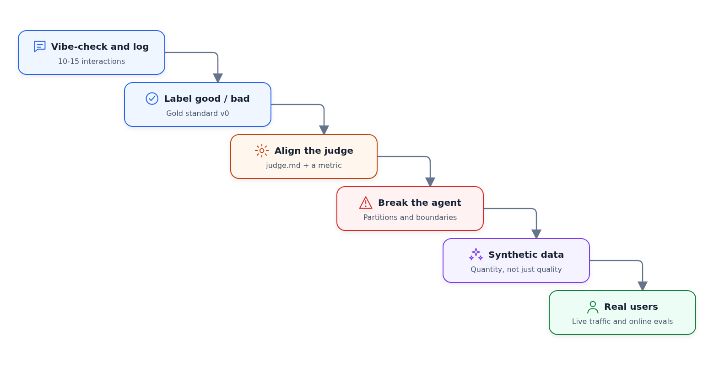
  <figcaption>The stages, in the order I go through them. Each one adds new cases to the gold standard dataset</figcaption>
</figure>

Let's get into details.

## Collecting the Gold Standard Dataset

You have an agent. What's next?

There's nothing wrong with "vibe-checking" it: you poke it, ask questions you want it to answer, and look at the results. If they aren't good, you figure out how to fix it.

But already at this step you can be a bit more organized and start logging what the agent is doing. When you ask a question and see the answer, make sure they are saved somewhere. You do a few vibe-checking sessions, and you already have 10-15 logged records.

Now you can systematically look at these logs and classify each record into

- "good": the answer is what you expect
- "bad": the answer is not what you wanted to see

To help me do it, I usually vibe-code a small labelling tool.

<figure>
  
  <figcaption>The labelling tool for the "version 0" of the gold standard dataset</figcaption>
</figure>

This gives you a "version 0" of the gold standard dataset - the dataset you will use for evaluating your system (sometimes it's also called the "ground truth" dataset).

Don't delegate this step to coding assistants. It's only a few examples, so you can go through them relatively quickly. But this way, you will get a lot of insights into how your agent is behaving, what's working and what isn't.


## Judge alignment

Once you manually labelled 10-15 examples, it's time to start automating it. 

I use coding assistants for that:

- Ask the assistant to analyze the logs and classify the examples into good or bad.
- See if the results match yours. If they don't, ask the agent to explain its decision - maybe you missed something, or the agent didn't have enough context.
- Iterate until you both agree.
- At the end of the session, ask the agent to create a judge.md file that describes the classification rules.
- Read this file carefully to see that the rules are generic and not specific to the examples you have in the dataset. 

<figure>
  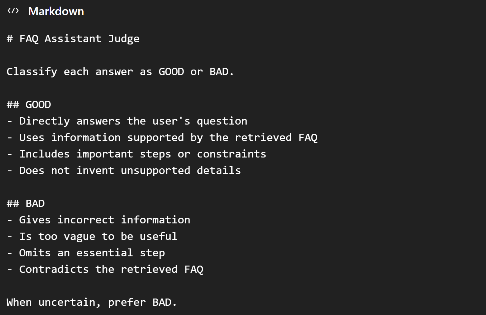
  <figcaption>An example of a judge.md file with generic classification rules</figcaption>
</figure>

We just created a judge - a system that evaluates our agent. 

Now we need to test that using judge.md alone is sufficient:

- Start a new session
- Ask to start a subagent which reads judge.md and classifies the records in your dataset
- If something is off, ask the agent to change judge.md
- Iterate until you both align on what's good and bad

This process is called "alignment" - we align the judge with what we think is good or bad.

It's the same as training a binary classifier that predicts your decisions. But instead of weights, you have a judge.md file. (And it's also helpful to have a train-test split here too! But later, when you have more data.)

At this point, you also get a metric - the fraction of good examples. Now if you change something in your agent, you can re-run the judge and make sure this metric doesn't go down.


<figure>
  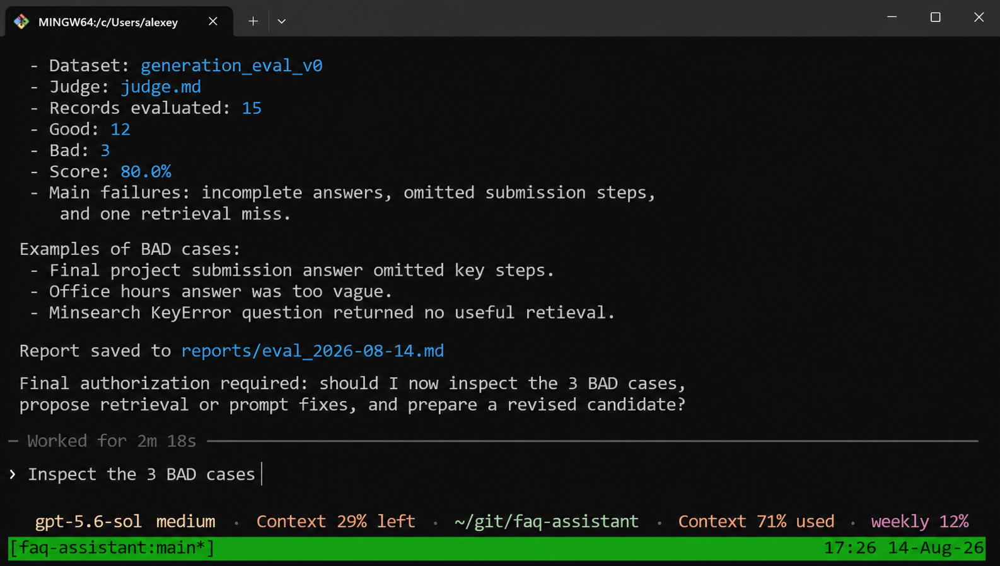
  <figcaption>Codex running the evaluation: 12 good, 3 bad, 80% score</figcaption>
</figure>


## Breaking the agent

We have the initial version of our gold standard dataset. But it's not enough. Now we want to find cases that break our system.

QA engineers have been breaking software for many decades. For coming up with cases that should derail our agent, we can borrow some concepts from their frameworks.

### 1. Equivalence partitions

The first step is [equivalence partitioning](https://www.ministryoftesting.com/software-testing-glossary/equivalence-partitioning).
You divide the input space into groups where inputs within each group should produce similar behavior.

If we have a RAG agent that answers questions about our docs, it could be:

- Questions about topics in the documentation,
- Questions about relevant topics but not in the documentation,
- Questions about irrelevant topics,
- Ambiguous questions,
- Questions in different languages

Once you come up with a list of groups, come up with 2-3 questions from each group. You can ask AI to help you with the entire process.

### 2. Boundary testing

The next concept is [boundary testing](https://www.ministryoftesting.com/software-testing-glossary/boundary-testing).

We already have some questions from the previous step, but we can be even more aggressive in our testing.

After defining the partitions, QA engineers would test the boundaries of each partition. We can do the same.

For a RAG agent, come up with queries that:

- Exactly match a document that we have in our database (easy case),
- Are semantically related but use different words (typical case),
- Are semantically related to multiple documents (ambiguous case),
- Are completely off-topic (boundary case).

<figure>
  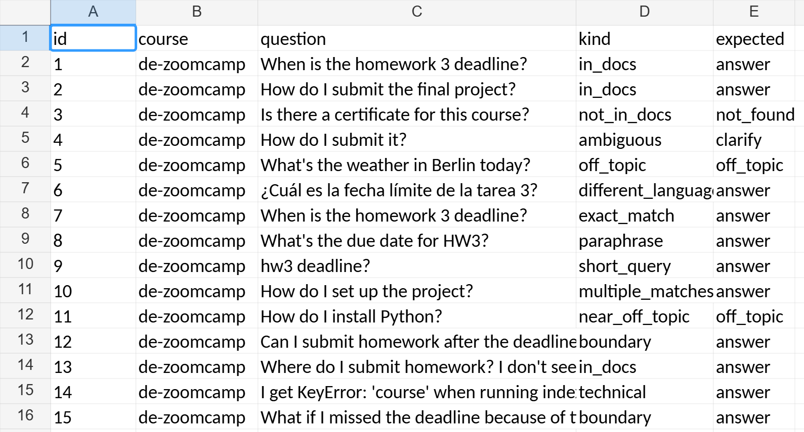
  <figcaption>Test questions from equivalence partitions and boundary testing, tagged by kind and expected outcome</figcaption>
</figure>

## Further alignment 

This way you can easily add 30-40 more questions to your gold standard dataset. 

Let's take all the data we have, and run it against our agent. Then use the judge to classify the output.

We already have a tool that we created earlier for manual evaluation. At this point, I adjust this tool to also support checking the output of the judge. For each record, I just decide whether I "agree" or "disagree" with the judge. I find it more convenient than labelling the new logs as "good" or "bad". 

<figure>
  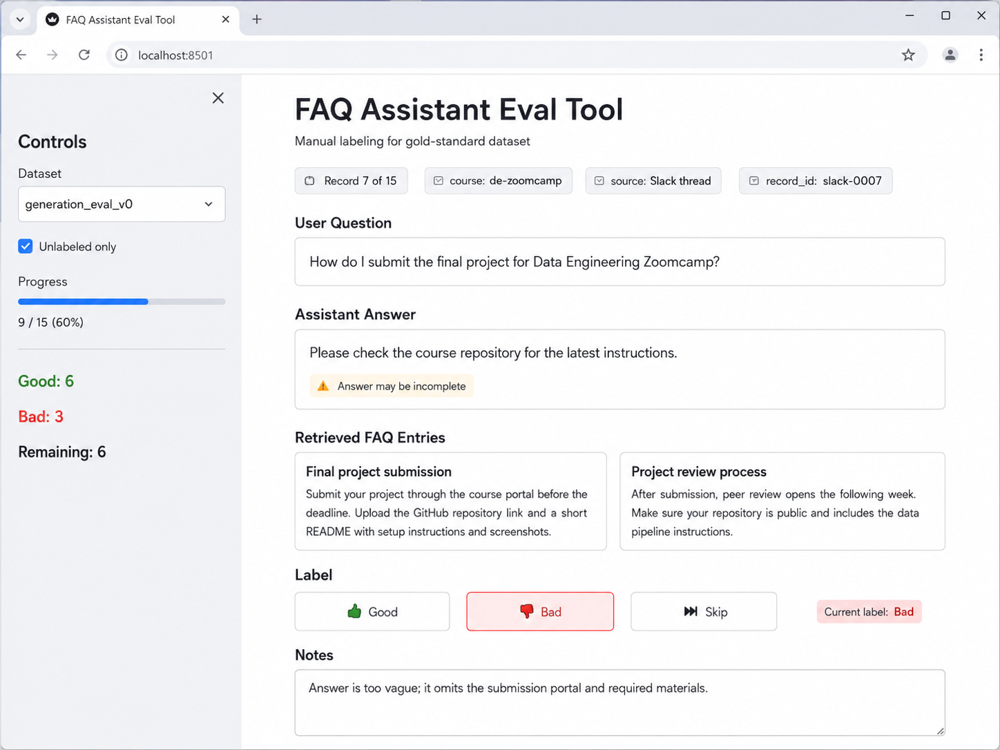
  <figcaption>The labelling tool adjusted for checking the judge's output: agree or disagree</figcaption>
</figure>

If we have many "disagree" cases, tune the judge following the same process as before. We will never have 100% alignment, so we don't need to be too strict about it, but the judge should be correct most of the time.

## Using the Judge to improve your agent

Now we have a fully automated process that:

1. Runs the agent against our data
2. Runs the judge against the output of step 1
3. Outputs a metric - the fraction of "good" results

<figure>
  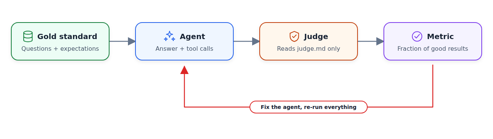
  <figcaption>The automated evaluation pipeline: dataset, agent, judge, metric - then fix and re-run</figcaption>
</figure>

Because it's automated, we can use it to improve our agent. You can ask the coding assistant to do it. 

I recommend following the [implementer-tester pattern](https://alexeyondata.substack.com/p/ai-native-development-specifications) for that:

- Define the implementer subagent that modifies the agent
- Define the judge subagent that uses judge.md to evaluate the output
- Iterate until your "good" ratio is acceptable

<figure>
  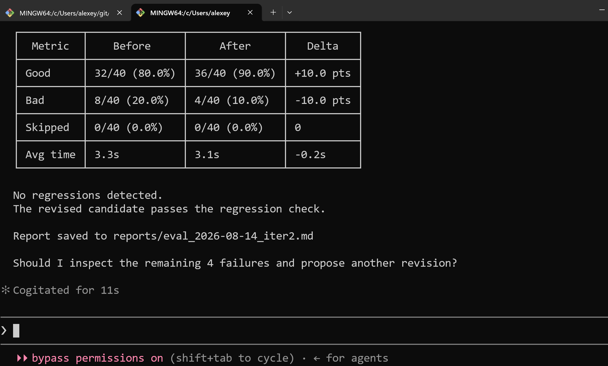
  <figcaption>The implementer-tester loop: one session changes the agent, the other one evaluates it</figcaption>
</figure>

## Synthetic data

So far we focused on the quality of our gold standard dataset. In this section, I want to talk about the quantity.

Quantity is also important because agents are non-deterministic. Even if the agent works properly on our small dataset, it will break when we get more traffic - just because of probability and statistics. When you expose your agent to a bigger number of inputs, things will break: with more repetitions, you increase the chances of something going wrong. That's why you want quantity here.

We can generate a lot more data using AI. Open your AI assistant, ask it to analyze your code, describe to it your target users, and then tell it to generate questions that these users are likely to ask.

For a RAG system, you can:

- Take a document from your knowledge base
- Ask AI to come up with 5 questions based on this document
- Do it for all documents

You will end up with a lot of questions. You can keep all of them, or take a sample.

<figure>
  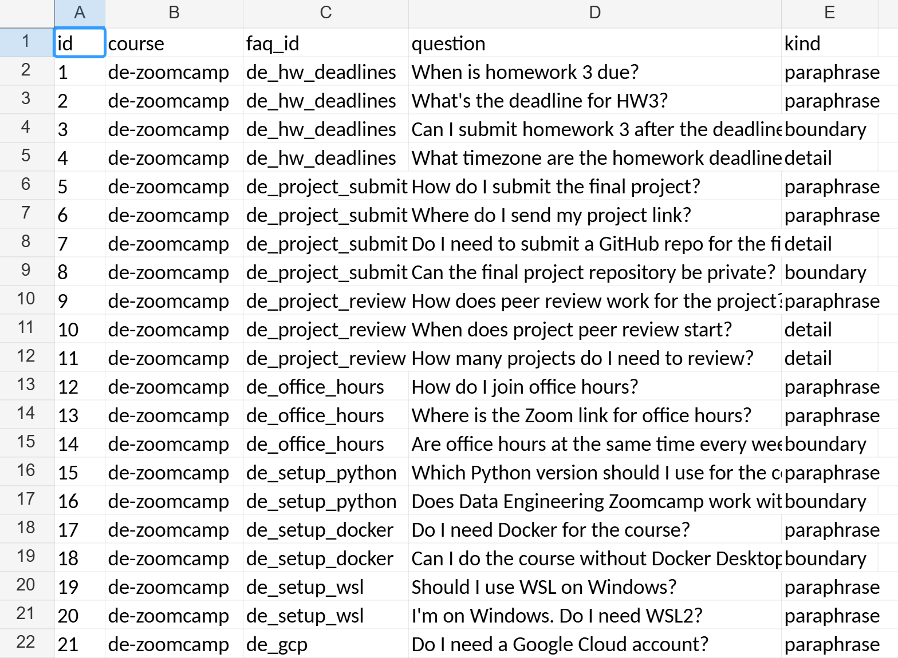
  <figcaption>Generating synthetic questions from a document in the knowledge base</figcaption>
</figure>

Then follow the same process: run your agent against this data and then use the judge to evaluate the results. 

This way you will probably run into many different problems:

- The agent will loop without stopping and exhaust the context
- It won't follow the instructions and do something that it shouldn't
- A tool will break and your agent won't finish the task

And many others. You don't know in advance what you'll get, which is why you want to expose the agent to a wide variety of inputs. 

Once you identify the scenarios where your agent breaks or doesn't perform well, add them to your gold standard dataset. 

Then you can fix the agent, and re-run the whole evaluation set to make sure you don't introduce any regressions.

## Start testing on real users as soon as possible

We have evaluated our agent on 50-60 cases, and it's good enough to give us some confidence that it's working okay. But we need more.

Now it's time to put it in front of real users:

- Invite people for user testing sessions to check your system
- If you plan to integrate it into an existing product, include it in a small subset of the traffic
- If it's a small personal project, ask your friends and family to test it. 
- If it's a course project, ask your classmates to play with it. 
- Share it on social media. 

Make sure you're collecting the logs (be direct with the user about what you're collecting) and use this for adding new cases into the gold standard dataset.

Add +1/-1 buttons. This way, the users can give you explicit feedback, and if somebody dislikes the answer, you should inspect it.  

<figure>
  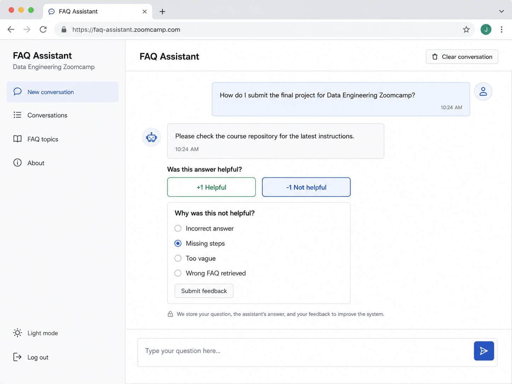
  <figcaption>The deployed agent in front of real users, with feedback buttons under every answer</figcaption>
</figure>


## Online evaluation

We have a system for offline evaluations: we run the agent against our dataset and we use the judge to score the output to see how well it behaves.

It's okay, but it's not scalable. Instead, we want to run it continuously: every time somebody uses our agent, we react in real time - save the logs, evaluate them, and display the results on the dashboard.

We can't really continue using our coding agent for that, so we'll need to create a stand-alone judge. 

It will give you a real-time view of your agent's quality: the fraction of good results on live traffic, new failure modes as they appear, and a constant stream of fresh cases you can add to your gold standard dataset.

<figure>
  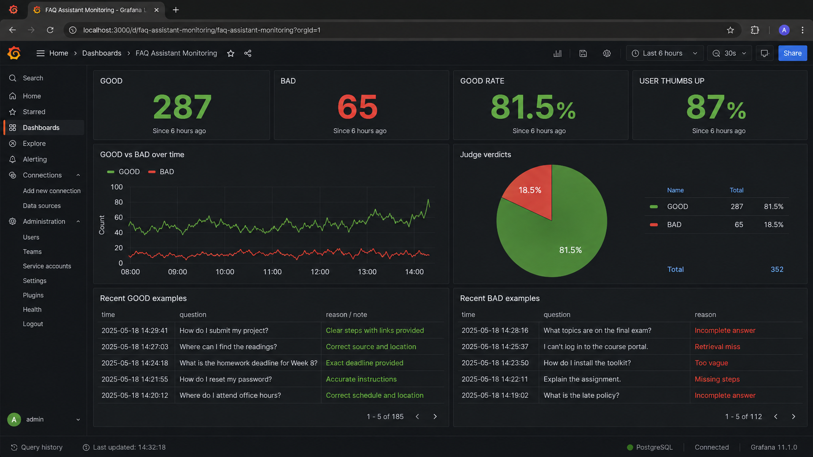
  <figcaption>Online evaluation dashboard: judge verdicts on live traffic in real time</figcaption>
</figure>

Periodically inspect bad results, and if you see something new, add these cases to your gold standard dataset. Also sample the good results to make sure they are actually good. 

For inspecting this live traffic I also often use coding assistants. I take a sample of the data, save it locally and ask them to go through these cases with me.


## Multiple judges

We started with a GOOD/BAD evaluation, but I didn't really explain what it means.

In reality, we usually have multiple judges, each evaluating the agent from a different angle:

- Task completion: the agent actually solved the user's problem
- Relevance/Correctness: the answer is relevant/correct
- Groundedness: the claims in the answer are supported by the documents in the knowledge base
- Completeness: the answer includes all the required information 
- Following instructions: the agent follows the instructions correctly
- Trajectory optimality: the sequence of tool calls the agent used to complete the task is an optimal one 

<figure>
  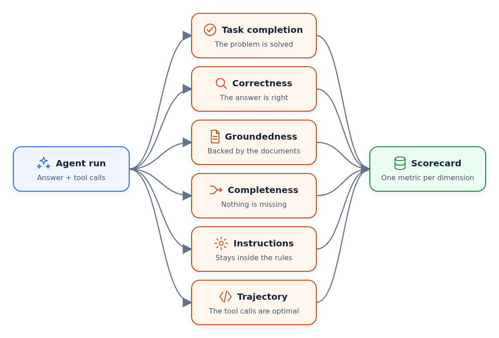
  <figcaption>One agent run, several judges, one metric per dimension</figcaption>
</figure>

There are other criteria too that you can consider for your application. 

But I usually recommend starting with one judge and then adding others as your system matures.


## The agent evaluation checklist

As a summary for this article, I wanted to give you a checklist that you can use next time you work on a new agent.

```
Gold standard dataset:

- [ ] Vibe-check the agent and log 10-15 interactions
- [ ] Label results as "good" or "bad" yourself
- [ ] Define equivalence partitions and test cases within each
- [ ] Include boundary cases (exact match, paraphrase, multiple matching documents, off-topic)
- [ ] Generate synthetic questions

The judge:

- [ ] judge.md describes the classification rules in generic terms, not specific to your examples
- [ ] The judge runs as a subagent that reads only judge.md
- [ ] Check the judge's answers with "agree" or "disagree"
- [ ] Use the fraction of "good" results as your metric
- [ ] Add more judges as your system matures

Improving the agent:

- [ ] The evaluation pipeline is automated: run the agent, run the judge, get the metric
- [ ] Each time you make a change, run the full evaluation set to catch regressions

Online evaluation:

- [ ] Put the agent in front of real users
- [ ] Collect user feedback
- [ ] Score online traffic with a stand-alone judge, show results on a dashboard
- [ ] Inspect bad results periodically, add new failing cases to the eval dataset
```


If you want to learn more about building AI Agents, I teach that in my course [AI Engineering Buildcamp: From RAG to Agents](https://maven.com/alexey-grigorev/from-rag-to-agents). In the course, I also cover evaluation in a lot of detail with real code, real tools, and real agents.

The next cohort starts September 21. You can use code "SUBSTACK" to get 20% off. See you there!
