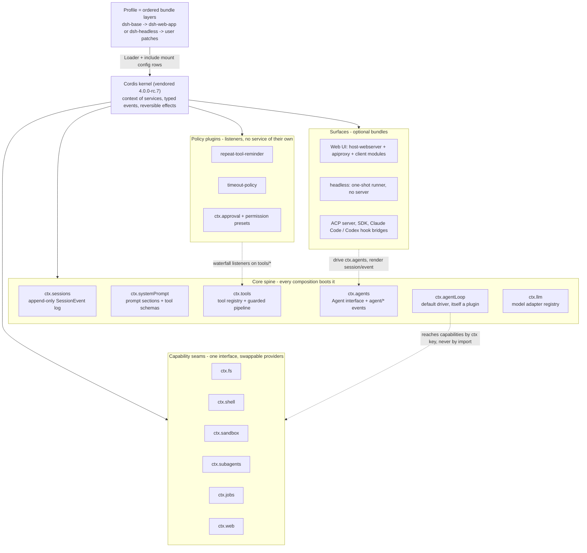
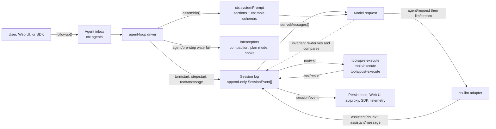

# DeepSeek Harness: architecture research notes

Reference material for the dsh article. Everything below was checked against a clone of [deepseek-ai/deepseek-harness](https://github.com/deepseek-ai/deepseek-harness) at `master` (August 2026). Measured counts: 234 `package.json` files under `packages/`, 256 across the whole workspace, about 247k lines of `.ts`/`.tsx` in `packages/` plus `apps/` excluding tests, 546k counting every `.ts` in the repo. The draft's "250 packages" holds; "495k lines" depends on method, so "roughly half a million lines of TypeScript" is safer.

Two diagrams follow, both meant to be lifted directly: one for the composition structure, one for the data flow through a turn.

## Diagram 1: what the kernel holds

## Diagram 2: how one turn moves through the log

## Walkthrough

### The kernel is vendored Cordis

Cordis is not a dependency, it is source-vendored into `vendor/` and renamed into the `@deepseek-ai` scope, pinned at 4.0.0-rc.7 from `cordiverse/cordis` commit `56b3d4f`. Source: [vendor/README.md](https://github.com/deepseek-ai/deepseek-harness/blob/master/vendor/README.md). The kernel is small - `vendor/cordis/src` is nine files, with `service.ts` holding the base class that registers an instance under a `ctx.<key>` and unregisters it when the owning fiber unloads. Source: [vendor/cordis/src/service.ts](https://github.com/deepseek-ai/deepseek-harness/blob/master/vendor/cordis/src/service.ts).

The five ideas: a plugin implements Service, a context is a repository of services addressed by key, dependencies are declared with `inject` rather than boot ordering, communication is typed events with four dispatch modes (`emit`, `waterfall`, `parallel`, `serial`), and every registration is a reversible effect. Source: [docs/cordis-primer.md](https://github.com/deepseek-ai/deepseek-harness/blob/master/docs/cordis-primer.md).

### Profiles and bundles compose the tree

A profile is a named stack of bundles in `$DSH_HOME/profiles/<name>`; a bundle is an npm package whose manifest points at a `cordis.patch.yml`. Layers apply to an empty entry list: each bundle in order, then the profile patch, then the home patch, then any `--patch` overlay. Source: [docs/architecture.md](https://github.com/deepseek-ai/deepseek-harness/blob/master/docs/architecture.md) and [packages/boot/app-boot/README.md](https://github.com/deepseek-ai/deepseek-harness/blob/master/packages/boot/app-boot/README.md).

`dsh-base` is one `insert:` list of config rows - `llm`, `session`, `agent`, `tools`, `sandbox-local`, `agent-loop`, `repeat-tool-reminder` and the rest, each addressable by id. Its header note is worth quoting: "Row order carries no load semantics (activation is service-availability driven)." Source: [packages/bundle/base/cordis.patch.yml](https://github.com/deepseek-ai/deepseek-harness/blob/master/packages/bundle/base/cordis.patch.yml).

### The spine, and why the loop is swappable

Six packages under `packages/core` form what the docs call the spine: `session`, `system-prompt`, `tools`, `agent`, `agent-loop`, `scope`. The split that matters is `agent` versus `agent-loop`: `agent` owns the interface and the `agent/*` event vocabulary, `agent-loop` is one concrete driver. Extension plugins depend on `agent` and never on `agent-loop`, which is what keeps the loop replaceable. Source: [docs/subsystems/core.md](https://github.com/deepseek-ai/deepseek-harness/blob/master/docs/subsystems/core.md).

### The log is the source, and an invariant enforces it

`deriveMessages()` walks surface-marked events and projects model history, cached per node and rebuilt when a compaction `replace` bumps the generation counter. Source: [packages/core/session/src/index.ts](https://github.com/deepseek-ai/deepseek-harness/blob/master/packages/core/session/src/index.ts) (the method is around line 726).

The enforcement is concrete, not aspirational. A prepended global `llm/stream` listener re-derives history at dispatch time and fails when it diverges from the outgoing request: `JSON.stringify(options.messages) !== JSON.stringify(expected)` raises "log-reconstruction desync". It also checks the request is frozen, carries a live session id, and matches the folded request header. Source: [packages/core/agent-loop/src/invariant.ts](https://github.com/deepseek-ai/deepseek-harness/blob/master/packages/core/agent-loop/src/invariant.ts). In the driver, the request is built from `assembly.tools`, the rendered system prompt, and `this.session.deriveMessages()`. Source: [packages/core/agent-loop/src/agent.ts](https://github.com/deepseek-ai/deepseek-harness/blob/master/packages/core/agent-loop/src/agent.ts).

### Tool schemas reach the model through the prompt registry

The tool registry declares `static inject = ['systemPrompt']` and registers `ctx.systemPrompt.tools(context => this.wireSchemas(context.scope))`, so the model-visible tool set is recomputed per assembly and per scope rather than being a fixed list. Source: [packages/core/tools/src/index.ts](https://github.com/deepseek-ai/deepseek-harness/blob/master/packages/core/tools/src/index.ts).

That is also why the published catalog is generated by booting. The generator mounts each tool plugin on a real Cordis context and reads `ctx.tools.schemas()`, "because a tool schema is not statically knowable (runtime-spread enums, concatenated descriptions, config-driven names, raw-JSON-Schema MCP tools)". A completeness guard globs `packages/*/tool-*` and fails if a package is missing from the boot manifest. Sources: [docs/tool-catalog.md](https://github.com/deepseek-ai/deepseek-harness/blob/master/docs/tool-catalog.md) and [scripts/gen-tool-catalog.ts](https://github.com/deepseek-ai/deepseek-harness/blob/master/scripts/gen-tool-catalog.ts). Execution then runs through three waterfalls with guards and approval between them. Source: [docs/tool-execution-pipeline.md](https://github.com/deepseek-ai/deepseek-harness/blob/master/docs/tool-execution-pipeline.md).

### Seams, sandbox, sub-agents

A seam is a service definition, a provider, and a consumer. Because filesystem and subprocess providers share one execution world, repointing them moves bash, PTY, and LSP together. Source: [docs/capability-seams.md](https://github.com/deepseek-ai/deepseek-harness/blob/master/docs/capability-seams.md).

Correction for the draft: E2B is not a `ctx.sandbox` backend. `ctx.sandbox` is the process-confinement seam, and `dsh-sandbox-local` supplies Linux bwrap/Landlock, macOS Seatbelt, and a Windows ACL restricted-token backend, reporting enforcement as `full` or `partial`. Source: [docs/subsystems/sandbox.md](https://github.com/deepseek-ai/deepseek-harness/blob/master/docs/subsystems/sandbox.md). The Landlock self-restrict-then-exec launcher is native code in `native/landlock-run/`, shipped as a three-package npm family with per-platform optional dependencies. Source: [native/README.md](https://github.com/deepseek-ai/deepseek-harness/blob/master/native/README.md). E2B is a separate experimental composition implementing `ctx.fs` and `ctx.subprocess` over a remote Linux sandbox, in no shipped bundle. Source: [packages/e2b/README.md](https://github.com/deepseek-ai/deepseek-harness/blob/master/packages/e2b/README.md).

Sub-agents are the one seam where several named providers coexist in a single context: in-process spawn, in-process fork, ACP, Codex, Claude Code, and the dsh SDK. The registered tool name is load-time config, which is why the base bundle loads `tool-subagent` twice and the model sees both `subagent` and `subagent_fork`. Source: [docs/subsystems/subagent.md](https://github.com/deepseek-ai/deepseek-harness/blob/master/docs/subsystems/subagent.md).

### Guards are listeners, not services

`repeat-tool-reminder` sits on `tools/post-execute`, keys chains per live Agent in a `WeakMap`, counts consecutive identical calls (deep key-sorted arguments), fires at `[3, 5, 8]`, excludes `todo_write`, counts denied calls, and never vetoes. Source: [packages/guard/repeat-tool-reminder/README.md](https://github.com/deepseek-ai/deepseek-harness/blob/master/packages/guard/repeat-tool-reminder/README.md). The timeout guard is a single zero-config `tools/execute` around-listener that reads each tool's own declared `timeoutMs` and returns a structured `TOOL_TIMEOUT` result. Note the naming mismatch: the directory is `packages/guard/timeout-policy`, the npm name is `@deepseek-ai/dsh-tool-call-timeout-policy`. Source: [packages/guard/timeout-policy/README.md](https://github.com/deepseek-ai/deepseek-harness/blob/master/packages/guard/timeout-policy/README.md).

### The Web UI is a bundle, not a core

`dsh-host-webserver` is a plain `node:http` route registry that "knows no harness concepts"; every feature route is registered by another plugin. Source: [docs/subsystems/web-server.md](https://github.com/deepseek-ai/deepseek-harness/blob/master/docs/subsystems/web-server.md). `host-apiproxy` subscribes to `session/event` and pushes frames to the browser, and `packages/sdk/server` does the same for SDK consumers - that is the concrete meaning of "render from the log". Sources: [packages/host/apiproxy/src/api-proxy.ts](https://github.com/deepseek-ai/deepseek-harness/blob/master/packages/host/apiproxy/src/api-proxy.ts) and [packages/sdk/server/src/server.ts](https://github.com/deepseek-ai/deepseek-harness/blob/master/packages/sdk/server/src/server.ts). The headless bundle "mounts no Host, HTTP server, Web runtime, or browser plugin". Source: [packages/bundle/headless/cordis.patch.yml](https://github.com/deepseek-ai/deepseek-harness/blob/master/packages/bundle/headless/cordis.patch.yml).

## Notes for the rewrite

Postmortems live at [docs/postmortem/](https://github.com/deepseek-ai/deepseek-harness/tree/master/docs/postmortem) - there are four, 0001 to 0004. 0003 is the GUI feedback-loop one the draft describes; 0004 covers Landlock partial-enforcement notices misclassifying child failures.

[VERIFY: the draft's "reportedly 100,000 stars in days". The GitHub API reports 182,838 stars and 20,080 forks on 2026-08-22, with the repo created 2026-08-13. Attach a timestamp to whichever figure the article uses.]
