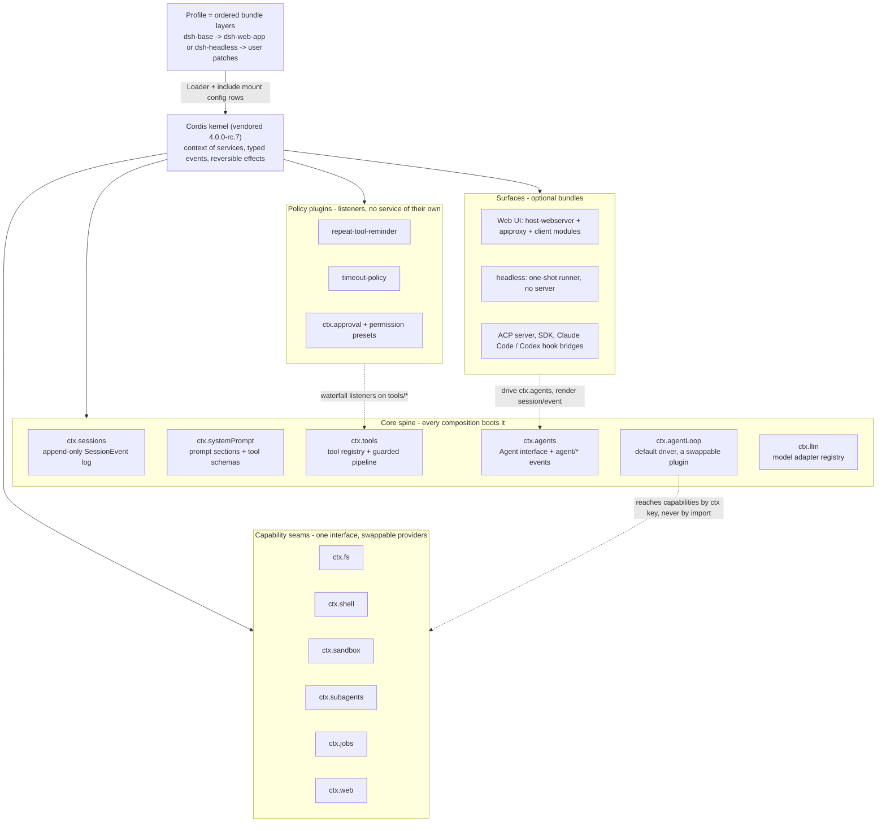
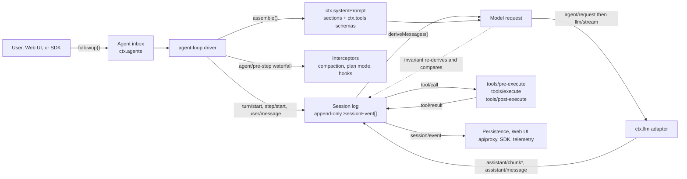

On August 13, DeepSeek made [DeepSeek-V4-Pro](https://api-docs.deepseek.com/news/news260813/) generally available and put [DeepSeek Harness](https://github.com/deepseek-ai/deepseek-harness) on GitHub as an open-source agent runtime. The repo calls it dsh.

Nine days later the repository had 182,880 stars and 20,084 forks. I checked those numbers on August 22. The [Hacker News launch thread](https://news.ycombinator.com/item?id=49285244) hit 740 points and 309 comments. On r/LocalLLaMA, [the launch thread](https://www.reddit.com/r/LocalLLaMA/comments/1vnb66j/deepseek_harness_is_up/) split between people praising the architecture and people calling the star count fake.

I cloned the repository and read the source, and this post explains what dsh actually does and how it's put together.

The size depends on how you measure it. Skipping tests, there are about 247,000 lines of `.ts` and `.tsx` under `packages/` and `apps/`. Counting every `.ts` file in the tree gives 546,000. The workspace holds 256 packages, all MIT-licensed.

## Everything is a plugin

The pitch in the README is that everything is a plugin. DeepSeek puts it more bluntly in the [architecture doc](https://github.com/deepseek-ai/deepseek-harness/blob/master/docs/architecture.md), with "no privileged core to patch". The model adapter, the tool registry, the session log and the agent loop are all replaceable from configuration.

The composition kernel is [Cordis](https://github.com/cordiverse/cordis), whose design comes out of an [academic paper](https://github.com/cordiverse/paper) on spatiotemporal composability. dsh doesn't depend on Cordis as a package. The source is vendored into [`vendor/`](https://github.com/deepseek-ai/deepseek-harness/blob/master/vendor/README.md) and renamed into the `@deepseek-ai` scope, at version 4.0.0-rc.7 from commit `56b3d4f`.

The kernel is small, only nine files under `vendor/cordis/src`, and [the primer in the repo](https://github.com/deepseek-ai/deepseek-harness/blob/master/docs/cordis-primer.md) boils the design down to a few ideas:

- A plugin implements a service and registers under a `ctx.<key>`.
- A context is a repository of those services, addressed by key.
- Dependencies are declared with `inject` instead of boot ordering.
- Communication happens through typed events, with `emit`, `waterfall`, `parallel` and `serial` dispatch.
- Every registration is a reversible effect, so unloading a plugin undoes it.

## Running it

Starting dsh takes one command:

```bash
npx @deepseek-ai/dsh web
```

That launches a browser UI on port 3080.

Composition happens through profiles and bundles. A profile is a named stack of bundles in `$DSH_HOME/profiles/<name>`, and `web` and `headless` ship as templates. A bundle is an npm package whose manifest points at a `cordis.patch.yml` file.

The layers stack onto an empty entry list. Each bundle applies in order, then the profile patch, then the home patch, then any `--patch` overlay.

The base bundle shows what that looks like. [`dsh-base`](https://github.com/deepseek-ai/deepseek-harness/blob/master/packages/bundle/base/cordis.patch.yml) is one `insert:` list of config rows, each naming a plugin and addressable by id. Row order has no load semantics, because activation is driven by service availability.

To see the exact plugin tree your machine boots, dump it:

```bash
dsh --profile web --dump-config
```

Any row it prints can be replaced by your own patch.

## The plugin tree

The loader applies the layers and produces this tree.



Six packages under `packages/core` form what the [core doc](https://github.com/deepseek-ai/deepseek-harness/blob/master/docs/subsystems/core.md) calls the spine:

- `session` holds the append-only event log
- `system-prompt` assembles prompt sections and tool schemas
- `tools` is the registry plus the guarded execution pipeline
- `agent` owns the `Agent` interface and the `agent/*` event vocabulary
- `agent-loop` is the default driver behind that interface
- `scope` handles scoping

Around the spine sit the capability seams. A seam is one service definition, one provider and one consumer, described in [capability-seams.md](https://github.com/deepseek-ai/deepseek-harness/blob/master/docs/capability-seams.md). Filesystem and subprocess providers share a single execution world, so repointing them moves bash, PTY and LSP together.

The guards own no service at all. They're listeners on the tool pipeline, so they can be added or removed on their own.

dsh ships the Web UI as a bundle rather than a core. [`dsh-host-webserver`](https://github.com/deepseek-ai/deepseek-harness/blob/master/docs/subsystems/web-server.md) is a plain `node:http` route registry that "knows no harness concepts", and every feature route gets registered by some other plugin. The [headless bundle](https://github.com/deepseek-ai/deepseek-harness/blob/master/packages/bundle/headless/cordis.patch.yml) mounts none of it.

## One turn through the session log

The second diagram follows a single turn from the user's message to the model and back.



Every session is an append-only log of typed `SessionEvent` records. The model's history gets derived from that log on demand by [`deriveMessages()`](https://github.com/deepseek-ai/deepseek-harness/blob/master/packages/core/session/src/index.ts), which walks the surface-marked events and caches the projection per node. A compaction bumps a generation counter and the projection rebuilds.

The invariant behind this is "model-visible means logged", and it's enforced at runtime rather than only documented. A prepended global `llm/stream` listener in [`invariant.ts`](https://github.com/deepseek-ai/deepseek-harness/blob/master/packages/core/agent-loop/src/invariant.ts) re-derives history at dispatch time and compares it to the outgoing request. When `JSON.stringify(options.messages)` differs from the re-derived version, it raises a "log-reconstruction desync" error. The same listener checks that the request is frozen and holds a live session id.

One mechanism then covers a lot of ground. Compaction becomes a derivation instead of a destructive edit of a transcript, and forking, resume, transcript rendering and telemetry replay all read the same stream.

The turn machinery is equally explicit. A step is one model request plus the tool calls it triggers, and a turn is zero or more steps. Interception happens through waterfall events, where `agent/pre-step` decides what the model sees, `tools/pre-execute` guards every call, and `llm/stream` intercepts the model stream. Plugins attach to those events without importing the loop package.

Even the model-visible tool set is recomputed per assembly and per scope. The [tool registry](https://github.com/deepseek-ai/deepseek-harness/blob/master/packages/core/tools/src/index.ts) declares `static inject = ['systemPrompt']` and registers a callback with the prompt instead of a fixed list.

## The tool catalog

The published [tool catalog](https://github.com/deepseek-ai/deepseek-harness/blob/master/docs/tool-catalog.md) is generated by booting the harness. The generator mounts each tool plugin on a real Cordis context and reads `ctx.tools.schemas()`. Runtime-spread enums and config-driven names make a schema impossible to know statically. A completeness guard globs `packages/*/tool-*` and fails when a package is missing from the boot manifest.

The shipped set covers the expected tools, from `bash` and `read` through `glob`, `grep` and `web_fetch`.

Past those, the catalog gets more interesting:

- Background jobs (`job_list`, `job_output`, `kill`) that unify background shell runs, PTY sends and subagents under one controller
- `goal` and `schedule` tools with explicit human authority gates for creating or editing goals
- `ralph`, a fixed workflow that spawns one fresh structured child agent per round, taking only an objective and a round cap
- `run_code`, a Code Mode transport where a program calls tools through bindings that re-enter the guarded pipeline
- `cordis_*` tools, opt-in and VM-sandboxed, that let the agent define and mount new plugins at runtime
- Hook bridges for Claude Code and Codex, plus an Agent Client Protocol server

Several sub-agent providers coexist in a single context, which happens on no other seam. dsh ships in-process spawn and fork alongside ACP, Codex, Claude Code and the dsh SDK, [all on `ctx.subagents`](https://github.com/deepseek-ai/deepseek-harness/blob/master/docs/subsystems/subagent.md). Through the last three, dsh can run the commercial agents as its own sub-agents.

## Guards, sandboxing and postmortems

[`repeat-tool-reminder`](https://github.com/deepseek-ai/deepseek-harness/blob/master/packages/guard/repeat-tool-reminder/README.md) sits on `tools/post-execute` and watches for consecutive identical calls, with arguments canonicalized and deep key-sorted. At 3, 5 and 8 repeats it injects an escalating reminder telling the model to change approach, and it never blocks the call. The counter includes denied calls, and `todo_write` is excluded so bookkeeping doesn't reset it.

The [timeout guard](https://github.com/deepseek-ai/deepseek-harness/blob/master/packages/guard/timeout-policy/README.md) attaches one zero-config around-listener to `tools/execute`. It reads each tool's own declared `timeoutMs` and returns a structured `TOOL_TIMEOUT` result.

Process confinement lives on the `ctx.sandbox` seam, and the shipped provider is `dsh-sandbox-local`. [It supplies](https://github.com/deepseek-ai/deepseek-harness/blob/master/docs/subsystems/sandbox.md) Linux bwrap and Landlock, macOS Seatbelt, and a Windows ACL restricted-token backend. The Landlock self-restrict-then-exec launcher is [native code](https://github.com/deepseek-ai/deepseek-harness/blob/master/native/README.md), shipped as per-platform npm packages.

E2B is in the repo too, on different seams. [`packages/e2b`](https://github.com/deepseek-ai/deepseek-harness/blob/master/packages/e2b/README.md) is an experimental composition implementing `ctx.fs` and `ctx.subprocess` over a remote Linux sandbox, and no shipped bundle loads it.

The team also publishes [four postmortems](https://github.com/deepseek-ai/deepseek-harness/tree/master/docs/postmortem), numbered 0001 to 0004. Number 0003 is the one I keep going back to.

A web agent was asked to change the GUI theme. It edited the source, launched a bare Vite dev server, saw HTTP 200 and declared success. The browser showed a white screen, because the boot manifest only gets injected by the real host. The agent rebuilt, launched a second server on another port, verified that one, and reported a URL the user wasn't looking at.

The writeup cites its evidence by sequence number from the persisted event log, at 30939, 31865 and 34309. The root cause it names is that the GUI had no model-visible identity, no canonical URL and no runtime mode. The fixes include a managed `$DSH_WEB_URL` environment variable and a rule that tests must be able to fail for the reported mechanism.

That same log makes outside diagnosis possible. One user traced 3.5-second hangs on trivial commands to a prompt-string mismatch between the terminal and the persistent bash tool. One [changed line](https://x.com/alamin_ai_/status/2089335178426560585) dropped latency to 158ms.

## Compared with Claude Code, Codex CLI and opencode

Launch coverage keeps calling dsh an open-source rival to Claude Code. I read the docs and source of the other three to see where the architectures actually differ.

[Claude Code](https://code.claude.com/docs/en/hooks) has the richest documented extension surface of the four, with around 30 named hook events. `PreToolUse` can block a call, rewrite the tool input through `updatedInput`, or return a permission decision, and `PostToolBatch` can stop the run before the next model request. Sessions are conventional, with transcripts stored in plaintext under `~/.claude/projects/` for 30 days by default. The CLI's implementation isn't published, and the model family is Claude only.

[Codex CLI](https://github.com/openai/codex) ships as Apache-2.0 Rust. Its [protocol doc](https://github.com/openai/codex/blob/main/codex-rs/docs/protocol_v1.md) defines the engine as something any UI can drive over two queues. Its session model is closer to dsh than most comparisons admit. `codex-rs/rollout` writes append-only JSONL records, each with a timestamp and an ordinal. A comment in the rollout source notes that resume uses the same item decoder as projection.

The two mechanisms run in opposite directions. Codex logs the items it sends rather than deriving them, and `policy.rs` filters which ones get persisted at all. Its `CompactedItem` has a `replacement_history` field, so compaction swaps history out. dsh's invariant re-derives history from the log instead, which keeps the pre-compaction state reachable from the running structure.

[opencode](https://opencode.ai/docs/plugins/) moved repos recently, from `sst/opencode` to [`anomalyco/opencode`](https://github.com/anomalyco/opencode), which matters if you reference a fixed source path. It runs as a headless HTTP server with an OpenAPI 3.1 spec, and model support runs to 75-plus providers through the AI SDK and Models.dev.

opencode derives history too, through machinery that gets little attention. [`CONTEXT.md`](https://github.com/anomalyco/opencode/blob/dev/CONTEXT.md) defines Session History as the projected conversation for a provider turn, after applying the active compaction and Context Epoch cutoffs. Messages live in a SQLite table with a `seq` column, and `session/history.ts` selects rows from the latest compaction forward. The durable rows are messages, so non-message state needs the parallel Context Epoch and Context Snapshot machinery. dsh gets the same property from one event vocabulary.

People on r/LocalLLaMA picked dsh up on day one because it takes any OpenAI-compatible provider. One user [reports](https://www.reddit.com/r/LocalLLaMA/comments/1vpv12b/qwen_38_27b_with_dshdeepseek_harness_is_amazing/) running Qwen 3.8 27B against dsh on a single RTX 3090 over long sessions without goal drift.

Here's what I'd actually decide on:

- Whether you need to change turn semantics or only constrain them. Blocking a command or injecting context works in all four. Retrying differently, or compacting by a different rule, means a fork everywhere except dsh.
- How exactly you need to reconstruct what the model saw. dsh closes that gap by construction, at the cost of an event vocabulary shipped at version zero.
- Whether isolation is your problem or your platform's. Codex ships Seatbelt, Landlock, bubblewrap and a Windows path, Claude Code has no native Windows, opencode has no sandbox, and dsh has the Landlock launcher.

## Owning the loop

The distinction that gets flattened in launch coverage is whether the loop's own decision logic is addressable. All four harnesses are configurable, so configurability doesn't separate them.

Claude Code's extension points are numerous and genuinely powerful. Every one of them attaches to a named moment inside a loop that stays closed. Anthropic's own code decides how context gets assembled each step, what compaction does to the transcript, and when a turn is finished. The Agent SDK gives you that same loop, and the documented alternative is the Client SDK, where you implement the tool loop yourself.

Codex is open core, so you can read every line of the loop. It has a real extension seam in `codex-rs/ext/extension-api`, a Rust trait registry with contributors for context, tools, turn input and turn lifecycle. The host builds that registry at startup from crates linked into the binary, so there's no runtime path for mounting your own contributor. Contributing to a turn also isn't the same as replacing it.

In dsh the loop is a row in the tree. `core/agent` owns the `Agent` interface, the live registry and the `agent/*` events on `ctx.agents`, while `core/agent-loop` is the default driver on `ctx.agentLoop`. DeepSeek states the separation as a rule: extension plugins depend on `agent` and never on `agent-loop`. Agent creation goes through a factory seam registered with `setFactory`. A replacement driver with different turn, retry or compaction semantics registers the same way.

dsh ships exactly one loop today. [`capability-seams.md`](https://github.com/deepseek-ai/deepseek-harness/blob/master/docs/capability-seams.md) calls `ctx.agentLoop` "the one concrete loop plugin", and the only other consumer it lists is an example package. I couldn't find a third-party loop anywhere.

So the gain is narrower than the design suggests. Extensions bind to the `agent` interface instead of the loop package, so the shipped loop can be rewritten without breaking them. A fork also doesn't have to be a fork of everything.

The closed loop has an advantage here too. One team can profile and regression-test a loop end to end. That's a defensible reason why Claude Code's turn behaviour feels more finished than anything in the open field.

## My read on dsh

dsh is the most carefully structured open harness I've read. It's also nine days old, and almost nothing in it has been exercised by anyone outside DeepSeek.

The repo states its own caveats:

- developer preview status, with breaking changes guaranteed
- a session event format at version zero, with no compatibility promise
- a `BENCHMARK.md` that fits in two sentences

There are no independent benchmarks of the harness. DeepSeek ran it in minimal mode behind its [V4-Flash code agent numbers](https://api-docs.deepseek.com/updates/), which doesn't separate the harness from the model.

The skepticism about the stars is fair. The [launch thread on r/LocalLLaMA](https://www.reddit.com/r/LocalLLaMA/comments/1vnb66j/deepseek_harness_is_up/) collected it directly, with "bots for sure" and "stars have been meaningless ever since AI agents". The [HN thread](https://news.ycombinator.com/item?id=49285244) spent most of its energy on TypeScript and memory footprint rather than on the architecture.

What I'll watch is whether the postmortems keep coming, because 0003 was written in the repo's first week.

Here's what I'd take from the repo even without running it:

- Deriving model history from an append-only event log, with an invariant that fails the request when the derivation diverges. Compaction, forking, replay and auditability come out of one mechanism.
- Waterfall interception at `pre-step`, `pre-execute` and the model stream, so policy lives beside the loop instead of inside it.
- Guards that inject an escalating reminder instead of blocking, which leaves the decision with the model and keeps the audit trail readable.
- A tool catalog generated by booting each plugin, so the published docs can't drift away from the code.

My own daily runtime is OpenClaw, and reading dsh hasn't changed that. It did change how I think about context handling in my own agents, and I'll write about what I'm changing in a future newsletter. Subscribe to follow along.
