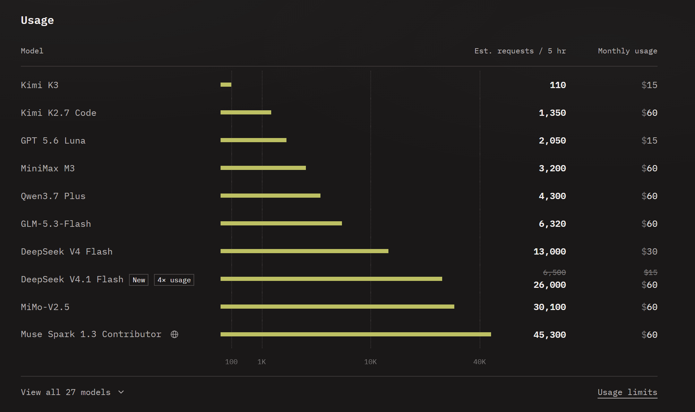

I recenly tweeted in X that we have access to so many tokens that I'm running out of ideas what to build.

https://x.com/Al_Grigor/status/2096543638687756663

At DataTalks.Club we're running AI Dev Tools Zoomcamp and people are asking me where they can get access to coding agents for free or without paying a lot of money. So I figured that I should write a post and share what I use.

While I do recommend getting a paid Codex or Claude subscription and use it for the course, there are some other providers that can get you a lot of tokens for less money or even for free. 

In this post, I'll share some of them. We'll cover

- Free coding plans
- Cheap coding plans
- Current promotions

Let's go

## Free coding plans

There are multiple platforms that currently offer free coding plans. 

One of them is Tencent. They recently released Hy3 and offers a free tier through its [WorkBuddy](https://www.workbuddy.ai/) and [CodeBuddy](https://www.codebuddy.ai/) assistants. It's not available in Germany, so I couldn't try it - but maybe it'll work for you.

Another one is [OpenCode Zen](https://opencode.ai/zen). They have a variety of models absolutely for free. One of these models is Muse 3 from Meta. 

articles/claw-drafts/llm-zen-free.png

The full name for this model is "Muse Spark 1.3 Contributor Free". The "contributor" part here means that you're "contributing" your data to meta, so they can use it to improve their model. That's why it's free - you pay for it with your data.

For me it's not a concern. It's quite a powerful model, it feels like Opus 5 level. I can have one or two heavy coding sessions with Muse 3 in OpenCode Zen for free.

Once I hit the limits, I can stay in OpenCode and switch the session to OpenCode Go - their coding plan.

## Affordable coding plans

[OpenCode Go](https://opencode.ai/go) costs $10 per month. For this $10 you get a lot. Specifically, you get the same Muse 3 Contributor, although withiht the "free" part. 

Again, it's a contributor model, so meta is subsidizing 90% of the cost - at least this is what they say. And you can get a lot done with this model. Combine it with 1-2 free sessions from OpenCode Go, and you'll get 5+ hours of work per day with this plan.

And there are other models, like DeepSeek V4.1 Flash, which currently offers 75% discount (i.e. 4x more usage).

I used to recommend GitHub Copilot as the first coding plan. Not anymore - now it's OpenCode Go.

TODO list alternatives... 
 

## Cheap API access 

So far we talked about coding plans. Instead, you can pay for API calls yourself and plug any API LLM platform to your coding agent. 

If you do that directly with OpenAI or Anthropic and put $5 into your account, they will disappear before you can say "hello" to your coding agent.

But if you use [DeepSeek's V4 Flash](https://api-docs.deepseek.com/quick_start/pricing) during off-peak hours, you'll be getting mullions of tokens, which is enough to do multiple coding sessions. 

Also, OpenRouter

## Current promotions

I really like Z.ai. I have used them since September last year though their API, and I've been using their plan since December. Now they are regularly giving away 300 million tokens for glm-5.3-flash if you use their Zcode harness. Tihs promotion is typically timed for a weekend and most people can't spend so many tokens.

Additionally, they run a promo that all Z.ai coding plan subscribers get unlimited tokens from 5pm to 3am CET. (TODO find link) Well, they are rate-limited, but I don't hit these limites unless I run 20+ agents in paralel. 

articles/claw-drafts/llm-zai-glm53-flash.png

that plus 300m tokens plus their quota reduction if you use Zcode - that combined gives you a lot of tokens. 

One minus of Zcode is it's GUI only. There's no terminal app. But I figured out how to connect it to Codex, so I can now use ZCode from my terminal. https://github.com/alexeygrigorev/codex-zcode/

