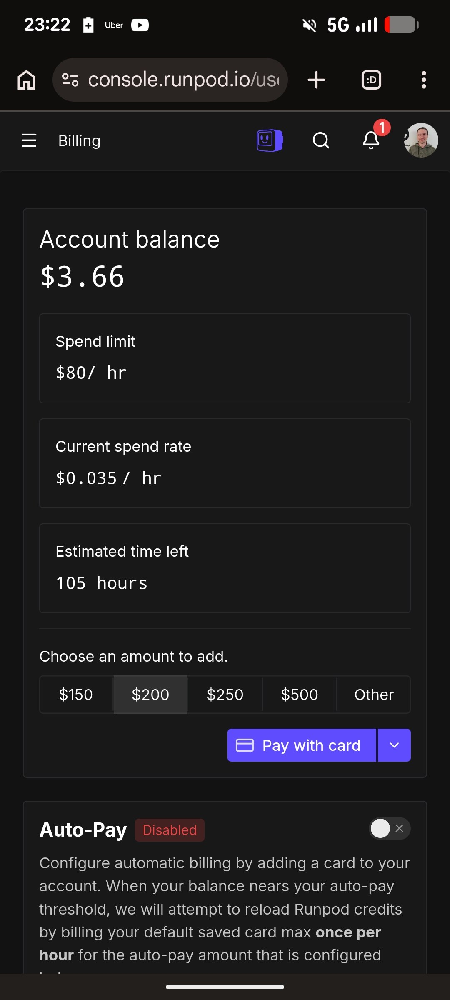
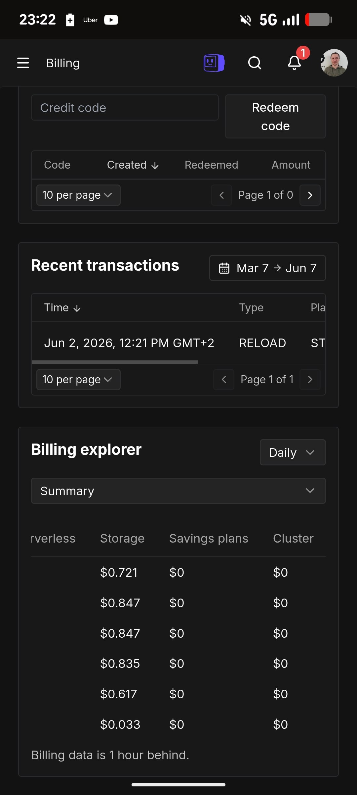

# Cloud Cost Reminders: Delete Storage, Not Just Compute

A reminder when using GPU and serverless cloud platforms: don't forget to delete storage too.[^1]

When you spin a pod down on RunPod, the compute stops billing, but the storage volume attached to it can keep costing money until you delete it explicitly. It is easy to delete the pod, assume you are done, and keep paying for the leftover storage.

<figure>
  
  <figcaption>RunPod console - account balance and current spend rate. Deleting the pod is not enough; the storage volume bills separately.[^1]</figcaption>
  <!-- The screenshot the reminder was attached to - shows the RunPod billing view -->
</figure>

<figure>
  
  <figcaption>Modal's billing explorer breaks daily spend into serverless, storage, savings plans, and cluster - a per-category view that makes it easy to spot storage you forgot about[^2]</figcaption>
  <!-- Shows a billing dashboard that separates storage from compute, reinforcing the point -->
</figure>

## Sources

[^1]: [20260607_212252_AlexeyDTC_msg4465_photo.md](../inbox/used/20260607_212252_AlexeyDTC_msg4465_photo.md) - RunPod billing screenshot with the caption "RunPod: don't forget to delete storage too"
[^2]: [20260607_212252_AlexeyDTC_msg4466_photo.md](../inbox/used/20260607_212252_AlexeyDTC_msg4466_photo.md) - Modal billing explorer screenshot showing daily spend split into serverless, storage, savings plans, and cluster
