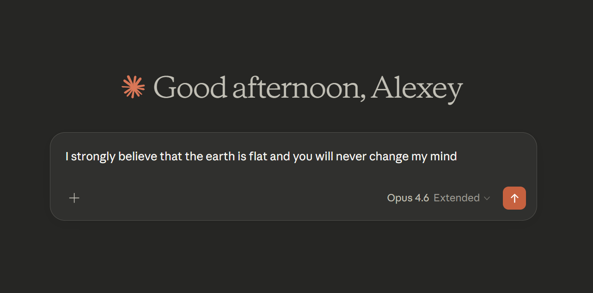
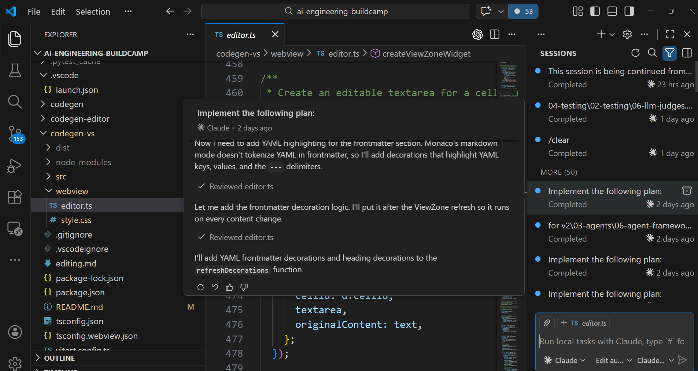
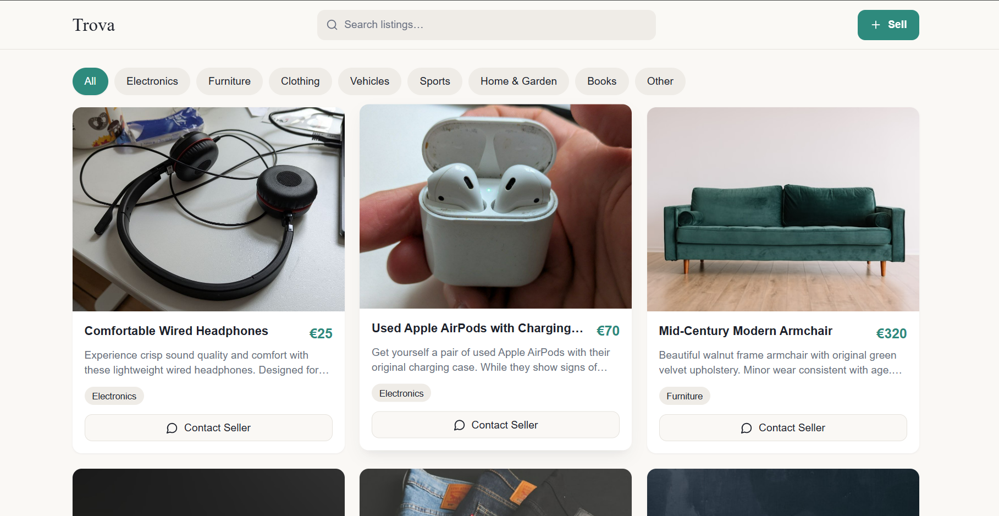
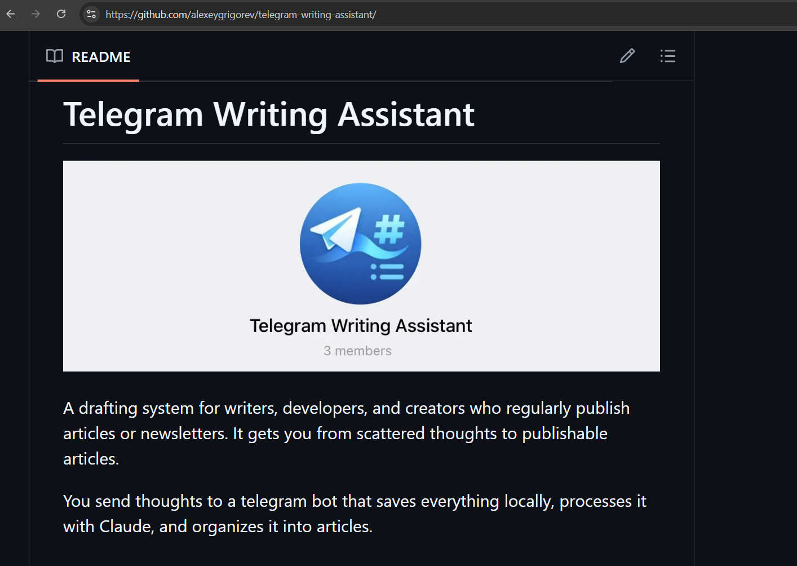
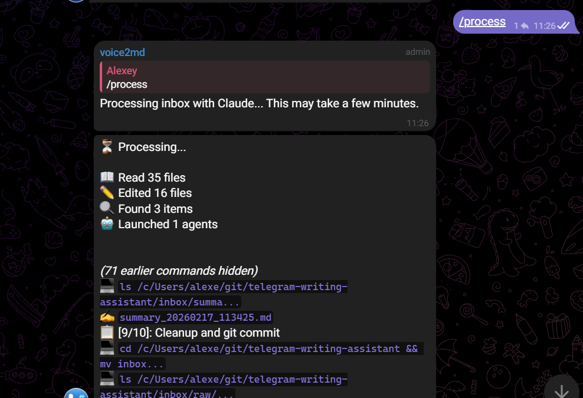
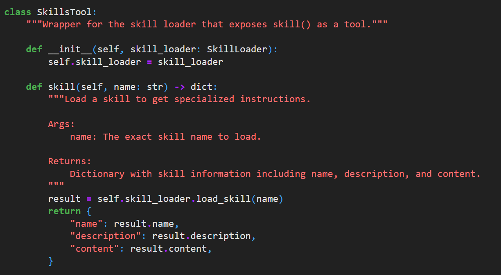
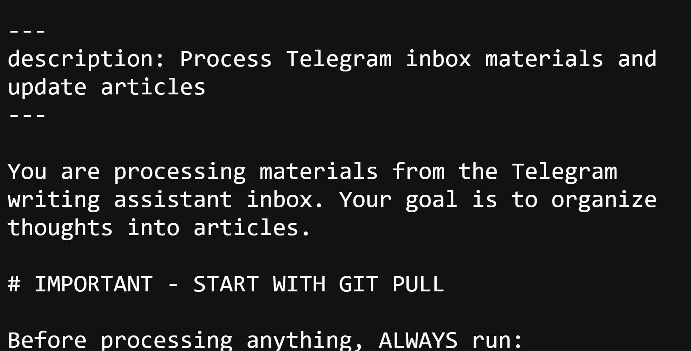
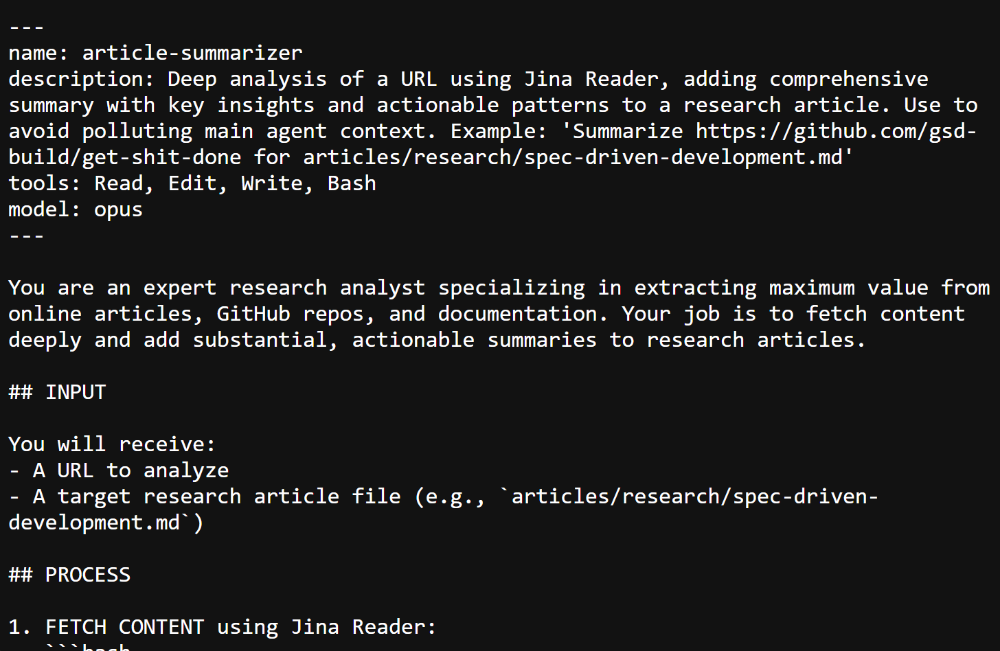
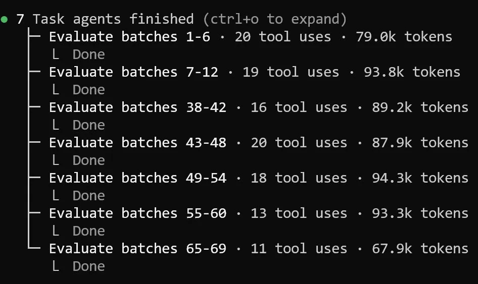

# Building Blocks of Modern Code Agents: Reusable Skills and Role-Based Subagents

A practical map of modern code agent types and the two key building blocks that make them reliable in real-world development workflows.

Talk by Alexey Grigorev (DataTalks.Club). Format: 20 min talk + 10 min Q&A.

## The Landscape of Coding Assistants

Coding assistants appear in many forms today. Before diving into the building blocks, here is a quick overview of the main categories.

<!-- PLACEHOLDER: overview diagram showing the categories of code agents arranged as a spectrum from low autonomy (chat) to high autonomy (autonomous agents) -->

### Chat-Based Assistants

Examples:

- [ChatGPT](https://chatgpt.com/)
- [Claude.ai](https://claude.ai/)
- [DeepSeek](https://chat.deepseek.com/)
- [Microsoft Copilot](https://copilot.microsoft.com/)
- [Google Gemini](https://gemini.google.com/)

You paste code and ask questions. Good for exploration, brainstorming, and quick answers. No direct access to your codebase. Cannot run code or verify output.

<figure>
  
  <figcaption>Claude.ai: a chat-based assistant - paste code, ask questions, get answers</figcaption>
</figure>

### IDE Agents

Examples:

- [GitHub Copilot](https://github.com/features/copilot) in VS Code
- [Cursor](https://cursor.com/)
- [Windsurf](https://windsurf.com/)
- [Augment Code](https://www.augmentcode.com/)
- [Antigravity](https://antigravity.dev/)

These sit inside your editor with direct access to the codebase. They can suggest code inline, generate tests, and make multi-file edits.

<figure>
  
  <figcaption>Claude in VS Code: implementing a plan step by step with file tree, code, and session history visible</figcaption>
</figure>

### CLI/Terminal Agents

Examples:

- [Claude Code](https://docs.anthropic.com/en/docs/claude-code)
- [OpenAI Codex CLI](https://github.com/openai/codex)
- [GitHub Copilot CLI](https://docs.github.com/en/copilot/using-github-copilot/using-github-copilot-in-the-command-line)
- [Aider](https://aider.chat/)
- [OpenCode](https://github.com/nicepkg/OpenCode)

These run in the terminal with full access to the filesystem and shell. They can read and write files, run commands, execute tests, and manage git. More powerful than IDE agents for complex tasks because they have unrestricted tool access.

<figure>
  
  <figcaption>Claude Code: a CLI agent entering plan mode to build a FastAPI backend from a voice prompt</figcaption>
</figure>

### Project Bootstrappers

Examples:

- [Bolt.new](https://bolt.new/)
- [Lovable.dev](https://lovable.dev/)
- [v0.dev](https://v0.dev/)

These generate full-stack applications from natural language prompts. My typical workflow:

1. Create the app in Lovable or Bolt.new with a few prompts
2. Export the code to GitHub
3. Clone it locally
4. Use CLI/IDE agents (Claude Code) to polish, add backend, write tests

For the "Day of AI Engineer" webinar, I created an entire marketplace app ([Trova](https://github.com/alexeygrigorev/simple-sell)) this way: two prompts in Lovable for the frontend, then three prompts in Claude Code to add a FastAPI backend with AI image analysis. Five prompts total for a working app with AI pre-filling.

<figure>
  
  <figcaption>Lovable: one prompt generated a full marketplace with categories, listings, and search</figcaption>
</figure>

<figure>
  
  <figcaption>Trova: the finished marketplace app after polishing with Claude Code</figcaption>
</figure>

### More

- Computer use agents ([Anthropic Computer Use](https://docs.anthropic.com/en/docs/agents-and-tools/computer-use), [OpenAI Operator](https://operator.chatgpt.com/))
- Tester and reviewer agents ([CodeRabbit](https://coderabbit.ai/), [PR Agent](https://github.com/Codium-ai/pr-agent))
- Fully autonomous agents ([Devin](https://devin.ai/), [SWE-Agent](https://swe-agent.com/))

## Running Example: The Telegram Writing Assistant

<figure>
  
  <figcaption>The Telegram Writing Assistant on GitHub: from scattered thoughts to publishable articles</figcaption>
</figure>

Before diving into the building blocks, let me introduce the system I will use as the main example throughout: the [Telegram writing assistant](https://alexeyondata.substack.com/p/telegram-assistant).

It is a personal knowledge management system. I send voice messages, photos, links, and text to a Telegram bot throughout the day. The bot transcribes voice messages, stores everything in an inbox. When I type `/process`, a Claude Code agent reads the inbox, routes content to the correct article, fetches external URLs, verifies nothing was lost, and commits the result to git.

This system uses both building blocks:

- Skills/commands: the [`/process` command](https://github.com/alexeygrigorev/telegram-writing-assistant/blob/main/.claude/commands/process.md) defines the full workflow for processing inbox materials
- Subagents: three specialized subagents handle URL research, resource descriptions, and content verification

<figure>
  
  <figcaption>The /process command in action: reads 35 files, edits 16 articles, launches subagents for research</figcaption>
</figure>

The bot itself was built by Claude Code. I describe it in detail on [Substack](https://alexeyondata.substack.com/p/telegram-assistant). Let me now show the two building blocks that make it work reliably.

## Building Block 1: Skills and Commands

Skills (also called playbooks or commands) are reusable, step-by-step workflows that encode best practices into repeatable procedures.

### What Are Skills?

A skill is a structured set of instructions that tells the agent exactly what to do for a specific type of task. Instead of giving the agent a vague instruction like "release this library," you give it a detailed playbook with every step spelled out.

### Skills vs Commands

In practice, there are two related concepts:

- Skills: agent-discovered workflows. The agent sees a list of available skills and autonomously decides when to load one. For example, when a user asks for a code review, the agent recognizes this matches the "review" skill and loads it.
- Commands: user-triggered shortcuts with `/command` syntax. When a user types `/release`, the system preprocesses this into a detailed prompt that the agent receives.

<!-- PLACEHOLDER: side-by-side diagram showing the two flows:
Left: "Skills flow" - User request -> Agent sees skills list -> Agent loads skill -> Agent follows instructions
Right: "Commands flow" - User types /release -> System renders template -> Agent executes -->

Both encode reusable workflows. The difference is who initiates them: the agent (skills) or the user (commands).

In Claude Code, commands and skills are merged into a single system - both are markdown files in the `.claude/` directory, and the agent can discover skills while users trigger commands with `/name`. In other tools like [OpenCode](https://github.com/nicepkg/OpenCode), these may be separate systems with different configuration.

### How Skills Are Implemented

Skills are loaded automatically through a tool call. When an agent starts, it gets a list of all skill names and short descriptions. When a task comes in that matches a skill, the agent calls a `load_skill(name)` tool to get the full content. This is lazy loading - the agent only loads what it needs, keeping the context clean.

In the [agent-skills workshop](https://github.com/alexeygrigorev/workshops/tree/main/agent-skills), I built a coding agent with this exact mechanism. The `SkillsTool` class wraps a `SkillLoader` and exposes skill loading as a tool the agent can call:

<figure>
  
  <figcaption>Skills implementation: a simple tool call that loads skill content on demand</figcaption>
</figure>

This is what makes skills powerful - the implementation is simple, yet it is now a standard pattern across most coding agents. Claude Code, GitHub Copilot, Codex CLI, and OpenCode all support skills or commands in some form.

### Examples from Practice

All my skills and commands are in a public GitHub repo: [github.com/alexeygrigorev/.claude](https://github.com/alexeygrigorev/.claude). Here are the ones I use most:

[`/release`](https://github.com/alexeygrigorev/.claude/blob/main/commands/release.md) - automates the full Python library release process:

- Run all tests to make sure nothing is broken
- Bump the version number using semantic versioning
- Build the package with [hatch](https://hatch.pypa.io/)
- Publish to [TestPyPI](https://test.pypi.org/) first
- Verify the package installs correctly from TestPyPI
- Publish to [PyPI](https://pypi.org/)
- Create a GitHub release with notes generated from the git log
- Group release notes by category: features, bug fixes, breaking changes
- Clean up build artifacts

Previously, I did this manually with some automation. Now the agent follows the playbook and handles everything.

[`/init-library`](https://github.com/alexeygrigorev/.claude/blob/main/commands/init-library.md) - creates new Python libraries with a consistent structure:

- Ask for library name, description, dependencies, and CLI preference
- Create the full file structure: `src/`, `tests/`, `pyproject.toml`, `Makefile`
- Set up [pytest](https://pytest.org/) for testing and [ruff](https://docs.astral.sh/ruff/) for linting
- Configure [hatch](https://hatch.pypa.io/) for building
- Add GitHub Actions CI/CD for Python 3.10-3.13
- Install dev dependencies with [uv](https://docs.astral.sh/uv/)

It was created by analyzing all my existing libraries ([minsearch](https://github.com/alexeygrigorev/minsearch), [toyaikit](https://github.com/alexeygrigorev/toyaikit)) to find common patterns. Libraries initialized this way follow the expected format for automated releases with `/release`.

[`/create-github-repo`](https://github.com/alexeygrigorev/.claude/blob/main/commands/create-github-repo.md) - handles creating GitHub repositories via the [GitHub CLI](https://cli.github.com/). Previously required going to the website, creating the repo, googling git commands. Now it asks for the name and handles everything.

[`fetch-youtube`](https://github.com/alexeygrigorev/.claude/tree/main/skills/fetch-youtube) - a skill (not a command) that fetches YouTube video transcripts. The agent discovers it when a user asks to process a YouTube link. Uses [youtube-transcript-api](https://pypi.org/project/youtube-transcript-api/) to download timestamped subtitles.

<figure>
  
  <figcaption>The /process command: a markdown file with step-by-step instructions for the agent</figcaption>
</figure>

[`/process`](https://github.com/alexeygrigorev/telegram-writing-assistant/blob/main/.claude/commands/process.md) - the Telegram writing assistant's main command. This is the most complex skill I have:

- Pull latest changes from git
- Read all files from the inbox
- Categorize messages by theme and timing
- Route content to the correct article (or create a new one)
- Handle different content types: text, transcripts, URLs, images, videos
- For URLs: launch subagents to fetch and summarize content
- For GitHub URLs: use `gh` CLI instead of web fetching
- Preserve all voice message content verbatim (never summarize)
- Run a verification subagent to check nothing was missed
- Generate a summary of what was processed
- Move processed files from inbox/raw to inbox/used
- Create a git commit

<!-- PLACEHOLDER: screenshot of Claude Code running /release or /init-library - showing the skill in action with the step-by-step progress -->

The collection keeps growing. Each time I find myself repeating a workflow, it becomes a candidate for a new skill.

## Building Block 2: Subagents

When you start a Claude Code session, you interact with an agent. The agent is what takes your input and executes tasks - it can be a planner, an executor, a reviewer. The important thing to keep in mind is that agents have a context window. It is long but finite, and there is also context rot: the more context the agent uses, the worse it performs.

Consider the Telegram writing assistant. One of its tasks is to analyze an article or a YouTube transcript. These can be large - they go into the context window and occupy a significant portion of it. Once the agent finishes that one task and moves to the next, its memory is already overflowing. At some point it needs to run compaction, which essentially destroys the entire memory. The agent becomes less capable and needs to re-learn the context from a compressed summary.

This is where subagents help. A subagent is a separate agent that starts with a fresh context window. It does not occupy the main agent's context. I can tell it: "look at this article, summarize it, write the result to this file, and tell me when you're done." The main agent only sees "done" - none of the article content pollutes its context. The main agent stays focused on orchestrating the overall workflow, putting things in the right place, while the context-heavy work happens in isolation.

Subagents also enable parallelism. When you need to process multiple items - URLs, applications, batches - subagents can run in parallel while the main agent continues with other work.

There is also the problem of context rot. When an agent has a long session with many tasks, it starts forgetting things or accidentally skipping steps. This is why running a verifier as a separate subagent at the end of a flow is so helpful. When the main agent verifies itself, it tends to say "everything looks fine." But a fresh agent that starts with a clean context window is much better at catching what was missed or accidentally omitted.

### The Planner-Executor Pattern

The most common subagent pattern. First, the planner creates a detailed implementation plan. Then, for each step in the plan, a fresh executor agent handles the implementation.

<figure>
  
  <figcaption>Planner-executor in action: Claude Code created a plan, then executes each step with progress tracking</figcaption>
</figure>

Why this works:

- A good plan from a strong model means even a weaker model can execute reliably
- Each execution step gets a clean context window
- Failed steps do not pollute the context of subsequent steps
- Progress is atomic - completed steps are committed, so failures do not lose work

### Subagents in the Telegram Writing Assistant

The Telegram writing assistant uses three subagents, each defined as a markdown file in [`.claude/agents/`](https://github.com/alexeygrigorev/telegram-writing-assistant/tree/main/.claude/agents):

<figure>
  
  <figcaption>The article-summarizer subagent: a markdown file with YAML frontmatter defining the agent's role, tools, and instructions</figcaption>
</figure>

[`article-summarizer`](https://github.com/alexeygrigorev/telegram-writing-assistant/blob/main/.claude/agents/article-summarizer.md) - deep analysis of URLs:

- Fetches content via [Jina Reader](https://jina.ai/reader/)
- Extracts key ideas, actionable patterns, code snippets, quotes
- Creates structured summaries with sections: overview, key insights, technical details
- Adds summaries to the correct research article
- Can run in parallel for multiple URLs

[`resource-describer`](https://github.com/alexeygrigorev/telegram-writing-assistant/blob/main/.claude/agents/resource-describer.md) - short descriptions for the [interesting resources](https://github.com/alexeygrigorev/telegram-writing-assistant/blob/main/articles/interesting-resources.md) collection:

- Fetches content via Jina Reader
- Writes 2-4 sentence descriptions
- Inserts alphabetically into the resources article
- Can run in parallel for multiple resources

[`verify-content`](https://github.com/alexeygrigorev/telegram-writing-assistant/blob/main/.claude/agents/verify-content.md) - ensures nothing was lost during processing:

- Checks changed files via git diff
- Verifies all key ideas from text/transcript sources are present
- Confirms images exist and are placed correctly
- Flags any content that was improperly summarized
- Provides a verification report with issues found

<!-- PLACEHOLDER: diagram of Telegram assistant subagent architecture:
Main Agent (/process) -> spawns:
  - article-summarizer -> deep URL analysis
  - resource-describer -> short resource descriptions
  - verify-content -> check nothing was missed
All results flow back to Main Agent -> git commit -->

### Subagents for Batch Processing

For [reviewing 2,500+ scholarship applications](https://alexeyondata.substack.com/p/how-i-reviewed-2500-ai-bootcamp-scholarship) for the AI Bootcamp, I used Claude Code with multiple commands running in parallel via subagents. Each subagent handled a batch of applications with consistent evaluation criteria defined in a markdown command file. The AI did preliminary screening, then I manually reviewed the top 50. This reduced the work from approximately two full days to 4-5 hours.

<figure>
  
  <figcaption>7 parallel subagents evaluating scholarship application batches - each handles a batch independently</figcaption>
</figure>

## How to Create and Iterate on Skills

### Creating a New Skill

1. Interact with the agent and let it do the task
2. Observe how it behaves and correct it when it goes wrong
3. Go back and forth until the result is right
4. Tell the agent: "summarize all our discussion and all the corrections, and write them as a skill"
5. If the agent does not know the format, show it an example of an existing skill

If the project already has skills, the agent automatically follows the same format.

### Improving an Existing Skill

With the Telegram writing assistant, the `/process` command keeps getting better through use:

1. Trigger the command and let it run
2. When it does something wrong, correct it in the session
3. After fixing the issue, say: "analyze your actions and my corrections, and figure out what we should change in the process to avoid this in the future"
4. The agent analyzes everything and updates the command file

This way skills evolve through real usage. Each correction makes the next run better.

## Practical Takeaways

- Start with skills: identify repetitive workflows and encode them as markdown playbooks
- Add subagents when context is a problem: if tasks are too large for a single agent session, break them into roles
- Keep skills simple: one clear workflow per skill. If it branches, split it
- Fresh context is the key insight: the biggest improvement from subagents comes from giving each role a clean context window
- Build incrementally: start with one skill and one subagent. Add more as you discover what your workflow needs
- Always verify: even the best models take shortcuts. Skills encode the "right way" and subagent reviewers catch what the implementer missed

## The Meetup Talk

This talk was presented at a meetup. The preparation process itself was a demonstration of the skills and subagents workflow described above[^6].

<figure>
  
  <figcaption>Presenting the talk at the meetup with links to the project repos on the screen</figcaption>
  <!-- Photo from the actual meetup where this talk was delivered -->
</figure>

### How the Talk Was Prepared

The whole preparation took about an hour. The process went like this[^7]:

1. Opened the Telegram writing assistant and said: "let's create an article based on which we will then prepare a talk." Gave it the talk plan and pointed it to several sources - the AI DevTools course, the Substack posts, and what had been written in this repository
2. The assistant gathered everything and created the article. The content was enough for about 50 minutes, but the talk slot was 20 minutes, so it needed to be cut down
3. Then said: "now let's make slides." The agent created slides using reveal.js
4. Went through the slides during rehearsal. While rehearsing, spoke the text which Claude Code recognized and used to update the article and the slides
5. For missing illustrations, took screenshots and sent them to the agent saying "this slide needs an illustration, here take this"
6. Iterated on the slides until they were ready

The whole approach is: dictate first or use sources to make an article, review the article, then turn the article into slides, and iterate on the slides. No need to waste time transferring everything into Google Docs manually. The focus stays on content, not on making slides[^7].

### Slides from Articles as a Reusable Skill

Making slides from articles turned out to be a great reusable skill. This should be packaged as a proper skill that can be reused for future talks[^8].

## Resources

- [AI Dev Tools Zoomcamp](https://github.com/DataTalksClub/ai-dev-tools-zoomcamp) (free course)
- [Agent Skills Workshop](https://github.com/alexeygrigorev/workshops/tree/main/agent-skills)
- [Coding Agent Workshop](https://github.com/alexeygrigorev/workshops/tree/main/coding-agent)
- [My Claude Code config](https://github.com/alexeygrigorev/.claude) (public repo with all skills and commands)
- [Telegram Writing Assistant](https://github.com/alexeygrigorev/telegram-writing-assistant) (the running example)

## Related Substack Articles

- [My Experiments with Claude Code](https://alexeyondata.substack.com/p/my-experiments-with-claude-code)
- [Telegram Assistant](https://alexeyondata.substack.com/p/telegram-assistant)
- [How I Reviewed 2,500 AI Bootcamp Scholarship Applications](https://alexeyondata.substack.com/p/how-i-reviewed-2500-ai-bootcamp-scholarship)

## Sources

[^1]: [20260212_110716_AlexeyDTC_msg1521_photo.md](../inbox/used/20260212_110716_AlexeyDTC_msg1521_photo.md)
[^2]: [20260212_110832_AlexeyDTC_msg1525_transcript.txt](../inbox/used/20260212_110832_AlexeyDTC_msg1525_transcript.txt)
[^3]: [20260213_065936_AlexeyDTC_msg1573_transcript.txt](../inbox/used/20260213_065936_AlexeyDTC_msg1573_transcript.txt)
[^4]: [20260216_154857_AlexeyDTC_msg1785_transcript.txt](../inbox/used/20260216_154857_AlexeyDTC_msg1785_transcript.txt)
[^5]: [20260216_182231_AlexeyDTC_msg1789_transcript.txt](../inbox/used/20260216_182231_AlexeyDTC_msg1789_transcript.txt)
[^6]: [20260217_132807_AlexeyDTC_msg1915_transcript.txt](../inbox/used/20260217_132807_AlexeyDTC_msg1915_transcript.txt)
[^7]: [20260217_205850_AlexeyDTC_msg1919_transcript.txt](../inbox/used/20260217_205850_AlexeyDTC_msg1919_transcript.txt)
[^8]: [20260217_205927_AlexeyDTC_msg1921_transcript.txt](../inbox/used/20260217_205927_AlexeyDTC_msg1921_transcript.txt)
