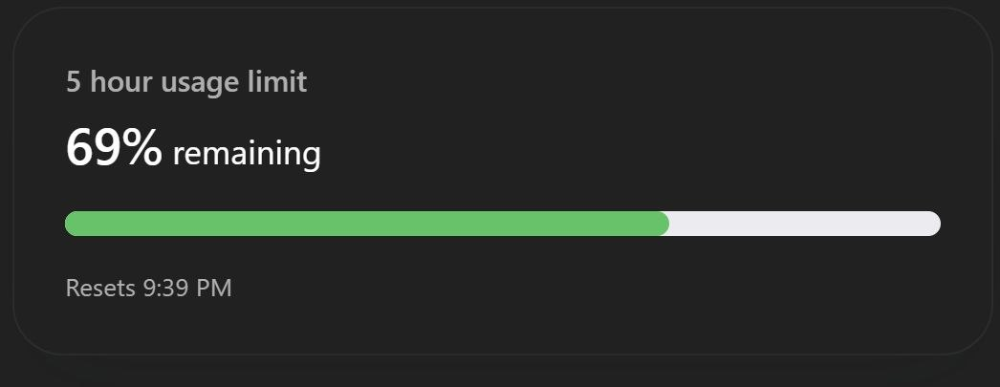
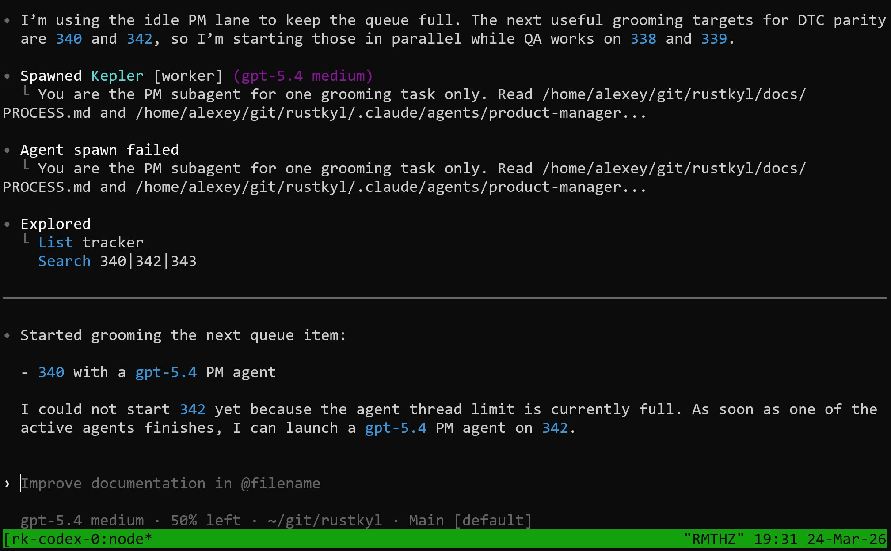
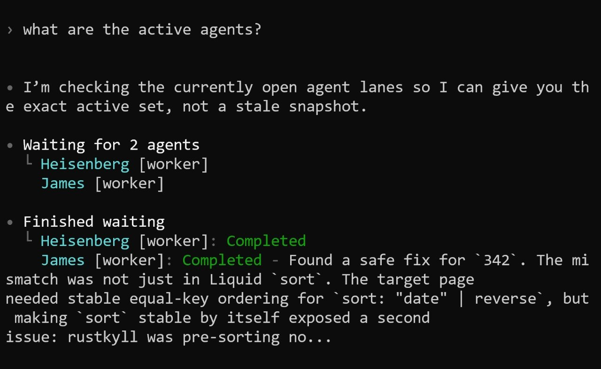

# Trying OpenAI Codex as a Claude Code Alternative

## Claude Code Usage Limits Getting Worse

Last week I hit the Claude Code weekly limit for the first time ever. I was doing a lot of things, and there was some kind of promotion where they doubled the usage amount, but I still ran out. I started looking at alternatives[^1].

Then something new happened. Today I was preparing the AI Hero course to upload it to the AI Shipping Labs platform. I took markdown documents, threw them in, and asked the agent to split one large file into several smaller files. My session usage jumped from 80% straight to 100%. That has never happened before on such a simple task[^1].

<figure>
  
  <figcaption>Claude Code session at 100% - hit the limit on a simple file-splitting task</figcaption>
  <!-- Screenshot of Claude Code plan usage limits dashboard showing current session at 100% used with 14 minutes until reset -->
</figure>

Many people are experiencing the same issue. I got a lot of replies on Twitter from people with the same problem. There is a [GitHub issue](https://github.com/anthropics/claude-code/issues/16157) where people are complaining about usage limits in Claude Code[^2]. Seems like bugs on Anthropic's side[^1].

I also tried OpenCode again and liked it - nice minimalist interface. But I could not find a way to run long sessions on it either[^1].

## First Impressions of Codex

I have been using Codex for several days now. Overall I like it. It has a nice minimalist interface[^1].

<figure>
  
  <figcaption>Codex usage limits - still 69% remaining while Claude Code was already at 100%</figcaption>
  <!-- Screenshot of Codex usage tracker showing a 5-hour limit with 69% remaining -->
</figure>

I am testing Codex on RustKill, which is my Jekyll replacement project. It handles the work well enough. The code quality is fine - the direction of what it does is correct[^5].

The best part is that I do not feel the limits on Codex at all, even though my plan is $20, not $10[^5].

## Agent Workflow in Codex

My agent process with multiple subagents works in Codex. I can spawn worker agents and have them work on tasks in parallel[^1][^3].

<figure>
  
  <figcaption>Codex managing multiple agents - spawning workers for parallel task grooming</figcaption>
  <!-- Terminal screenshot showing Codex spawning worker agents with gpt-5.4, managing task queue for items 340 and 342, hitting agent thread limits -->
</figure>

## No Task Widget

The main thing missing in Codex is a convenient task widget like Claude Code has. I cannot see which agents are currently running and which are not. I have to explicitly ask "what are the active agents?" to get a status update[^3].

<figure>
  
  <figcaption>Have to ask Codex manually for agent status - no automatic visibility</figcaption>
  <!-- Screenshot showing the user explicitly asking for active agent status, Codex checking and reporting that Heisenberg and James workers have completed -->
</figure>

In Claude Code, the todo widget lets me run long sessions. I add a task to the todo list that says "take the next task" and make sure there is always a task to take the next task. This way the orchestrator keeps going through the queue automatically[^1].

To be honest, in Claude Code the todo widget has not been working well lately either. Since they rolled out the 1 million token context window, something broke. The todo widget stopped working as well as it used to[^1].

In Codex I have not found this pattern yet. I need more babysitting - I have to ask "what's the status, did the agents finish?" and manually prompt it to continue[^3].

## Auto-Continue Behavior

In Claude Code, when an agent finishes its work, the orchestrator automatically wakes up. If the orchestrator was idle and waiting for a response, it gets a ping that the subagent completed and immediately picks up the next task[^5].

In Codex I have not noticed this behavior. The orchestrator does not auto-continue when agents finish. This is less convenient because I have to manually check and prompt it[^5].

All of this should be fixable with a custom orchestrator that launches different sessions - some with Codex, some with Claude Code, and so on[^3].

## The Bigger Picture: Provider-Independent Orchestrator

This experience reinforces my idea of building a program that allows seamless switching between LLM providers. The concept is an orchestrator that has access to several providers and picks any available model for each task. If one provider hits limits, it switches to another[^1].

I want a stricter todo list system, and I want to be less dependent on any specific LLM. The limits are getting tighter, and a tool that lets me seamlessly switch from one provider to another could be valuable. I plan to discuss this in the Friday newsletter[^1].

Another thought: I could also look into using multiple accounts in Claude Code to jump from one to another when limits hit. But that is more of a stream-of-consciousness idea[^1].

## Sources

[^1]: [20260324_182110_AlexeyDTC_msg3068_transcript.txt](../inbox/used/20260324_182110_AlexeyDTC_msg3068_transcript.txt)
[^2]: [20260324_183452_AlexeyDTC_msg3072.md](../inbox/used/20260324_183452_AlexeyDTC_msg3072.md)
[^3]: [20260325_095005_AlexeyDTC_msg3076_transcript.txt](../inbox/used/20260325_095005_AlexeyDTC_msg3076_transcript.txt)
[^4]: [20260325_095257_AlexeyDTC_msg3078_photo.md](../inbox/used/20260325_095257_AlexeyDTC_msg3078_photo.md)
[^5]: [20260325_095434_AlexeyDTC_msg3080_transcript.txt](../inbox/used/20260325_095434_AlexeyDTC_msg3080_transcript.txt)
