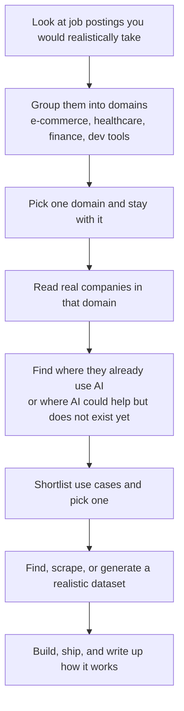

# Coming Up with Project Ideas

This is a recurring conversation[^12]. People regularly ask me how to pick a project to build, and I keep giving the same answer. It comes up in the workshops and webinars I run. It comes up with AI Shipping Labs members trying to choose what to work on or how to make progress. And it comes up with course students (both in the free zoomcamps and inside AI Shipping Labs) where not everyone has a clear idea of what to build[^12].

A big part of what I care about across all my courses is that people finish a project, because the courses focus on practice and practice is projects[^12]. In AI Engineering Buildcamp in particular, where I have closer contact with students, I want a higher percentage of each cohort to ship something real[^7][^12]. This article is part of a framework I'm building for that, and since I think it's useful outside the course too, I'm sharing it here[^12].

## A catalog of 150 ideas

The first step I took was to collect more than 150 project ideas and group them into categories[^1][^2][^3][^13]. The pool came from what students asked to build, from scholarship applications, from office-hours conversations, and from older course material. It's a real menu, not random brainstorming.

For many students, the menu is enough. You skim through, something clicks, and you go build it[^13].

With 150 options, some people hit choice paralysis - too many possibilities, no obvious way to narrow them down[^13]. So this article is the other half. Not another idea list, but a framework for picking one from scratch, for anyone who wants to decide what to build without relying on someone else's list[^13].

## Three kinds of projects

Before picking an idea, pick the kind of project you're building[^13].

There are three kinds I see most often:

- Portfolio project - built to help you get hired or win clients
- Course project - built to finish a course and practice the whole engineering loop
- Project for yourself - built because you personally want the thing to exist

These categories overlap[^13]. If one project falls into all three, even better. If it only fits two or one, that's fine too[^13]. But the selection criteria are different for each, so pick the main goal before you pick the idea.

## Cap the time

No matter which of the three you're building, put a cap on how much time you'll spend on it[^14]. A finished project that you kept short teaches you more than a perfect project that drags on for weeks - most of the learning is in shipping and explaining it afterwards.

If you're also trying to learn a new technology, combine goals[^14]. Pick a project where the technology you want to learn fits the problem, and let the project ground the learning. That's more motivating than tutorials, and it means you don't have to add a separate "learn X" item on top of the project.

The order matters though: pick the problem first, then pick the technology that fits. If you start with "I want to use RAG" and then hunt for a problem, you end up with a project shaped around the technology instead of around the user[^4].

## Portfolio projects

A portfolio project has one job: make it easy for a hiring manager or client to say yes to a conversation. To do that, the project has to solve a recognizable problem, show real engineering quality rather than just prompting, and make the tradeoffs easy to explain. You want something you can point to in a README and talk through in an interview.

Hiring managers don't spend a lot of time looking. Recruiters often move on after a minute or two, and hiring managers usually have five or ten minutes before an interview to scan your GitHub. They want to see immediately what the project does, why it exists, and whether it's close to production - tests, evaluation, CI/CD, a deployment link[^8].

That changes how I'd pick a portfolio project. I wouldn't start with random brainstorming.

The process looks more like an algorithm[^14]:

Too many options cause choice paralysis, and targeting one domain means you can also talk fluently about it in interviews. The dataset doesn't have to be the company's real data, but it does have to feel believable for that domain.

This approach also makes the project much easier to talk about. You can say which domain you chose, which companies you looked at, which workflow you focused on, and why your dataset is realistic - instead of "I built a RAG thing with LangChain".

## Course projects

Course projects work differently. A course project doesn't have to be the one you're remembered for[^15]. You just need something that fits the course and lets you practice the whole engineering loop.

In Buildcamp, a strong course project takes you through five steps[^4][^15]:

1. Identify a real problem
2. Build a simple proof of concept
3. Improve the code and add tests
4. Add monitoring and collect usage data
5. Evaluate how well it works

That's the reason the course pushes project work into week 1 instead of saving it for the end[^4][^5]. A course project needs to be small enough to start on day one, and structured enough that you can keep improving it week by week.

The common mistake here is choosing something too big or too vague, and then spending weeks stuck on scoping instead of building. If you can start a repo in week 1 and already have something running that you can test, monitor, and evaluate, you're in good shape.

Some Buildcamp examples that fit well as course projects[^15]:

- Bug Report Telegram Bot: takes voice messages, classifies them across repositories, structures them, evaluates bug quality, and opens GitHub issues, with deployment and monitoring in the loop[^2]
- AI Engineering Job Market Explorer: uses job-listing data to suggest what skills to learn next and what companies match a profile[^2]
- Medical Chart Generator: transcribes a patient-doctor conversation and turns it into a structured chart[^2]
- Documentation Chatbot with Handoff: answers support questions from grounded documentation and hands off to a human when confidence is low[^3]

The first Buildcamp cohort ran a demo day where students shipped end-to-end agents following this build-test-monitor-evaluate loop[^11][^16]:

- A cybersecurity disclosure tracker that ingests SEC filings into Elasticsearch and resolves subsidiaries back to parent companies
- A client-satisfaction analyzer over Stack Exchange data, with an orchestrator agent routing queries between MongoDB (unstructured) and Neo4j (graph)
- A habit-builder grounded in Huberman Lab transcripts and medical publications, using Faster Whisper, Qdrant, and query rewriting to improve retrieval
- An intelligent Gmail agent that fetches mail via the Gmail API, indexes it in Elasticsearch, and exposes a Streamlit chat interface to fight email fatigue

## Projects for yourself

Projects for yourself come from everyday friction[^15]. For me, these are often the best starting point. The user is obvious (it's you), the feedback loop is short, and the first version can stay small and still be useful.

My own projects of this kind almost always start the same way. I'm already working on something real, I notice something annoying, suboptimal, or missing, and I build a small tool that removes the friction[^9]. I'm not usually trying to invent a project from zero - I'm already in the middle of some other workflow, I hit a pain point, and the next project is the tool that fixes it[^9].

Half of this newsletter is made up of write-ups of exactly these kinds of projects[^15][^16].

A few recent ones:

- dirdotenv: loads environment variables automatically when you enter a project directory, because direnv uses its own `.envrc` format and my tools already rely on `.env`[^9]
- ssh-auto-forward: terminal-side automatic port forwarding from remote servers, because VS Code does it automatically but there was no terminal equivalent[^9]
- nobook: use plain `.py` files with block markers as Jupyter notebooks, because `.ipynb` JSON files don't diff, test, or integrate well with AI tools[^9]
- Microphone Booster: a Windows app that fixes quiet USB-C microphones, because Windows doesn't provide useful boost controls for those devices[^9]
- Bot Master: a systemd daemon and separate TUI client that keeps my Telegram bots running and restarts crashed ones with exponential backoff[^9]
- Telegram writing assistant: takes voice notes, photos, and links sent into a Telegram chat and turns them into markdown articles committed to a GitHub repo, built because the chat I used as a brain dump had become unmanageable[^10]

One thing that helps is keeping a running note of small annoyances. Most of them won't become projects. A few will turn into exactly the kind of small, useful, finishable tool that's worth building - and those also make good portfolio pieces later, because you can tell a concrete story about the problem and the fix.

## Narrowing down from an idea

Even once you know which kind of project you're doing, an idea isn't a project yet. You still need to narrow it down to something you can start this week. The trap most people fall into is technology-first thinking ("I want to build an agent" or "I want to use RAG") which makes it hard to tell when you're done, and easy to over-engineer the thing before you've even written a useful version[^4].

The way I get past that is to force myself to answer five questions in a few sentences each:

- Who is the user?
- What is the input?
- What is the output?
- What is the smallest useful version?
- How will I know it works?

If I can't answer those cleanly, the project is still too vague and I keep going.

Once I can answer them, I check the idea against the type of project I'm building:

- For a portfolio project, does it show the kind of work I want to be hired for?
- For a course project, can I test it, monitor it, and evaluate it over several weeks?
- For a project I'm doing for myself, will I actually use it in my own life soon?

After that, I start. The first rough repo and README teach me more than another hour of browsing idea lists.

The Buildcamp "From Idea to Submission" material splits this into three situations based on where you're starting from[^5]:

- If you already have an idea, run a quick fit check and submit it
- If you have a vague idea, talk it through until it fits in two or three sentences
- If you have no idea yet, browse examples for inspiration, then use an interview-style prompt to pull problems out of your own life

That last path uses the project-idea brainstorming prompt from the Buildcamp gist[^6], paired with a fit-check prompt. One helps you generate candidate ideas, the other helps you reject weak ones.

## The capstone bar

For Buildcamp capstones, the standard is fairly simple[^4]. Solve a real problem that someone cares about. Use data or inputs you can get without heroic effort. Leave a clear path to testing, monitoring, and evaluation from the start.

RAG and agents can help, and some projects genuinely need them. They aren't the centerpiece, though. Don't bolt them on just to make the project sound more advanced[^4].

The same bar works outside the course too. A project that solves a real problem with honest data and can be tested, monitored, and evaluated is far more valuable than a showier project that can't be.

And if you're planning to talk about this project in interviews later, the field guide makes one thing clear: hiring managers can tell the difference between a course you followed step by step and something you built yourself[^8]. A project you genuinely owned (where you chose the problem, scoped it, hit real issues, and fixed them) gives you something to talk about for the whole interview, because you lived through it.

## If you're still stuck

If after all of this you still don't have an idea, stop reading idea lists for a moment and try this instead. For the next two days, keep a short note called "annoying things" and write down repetitive workflows, frustrations, and delays as they happen. Then pick one item that feels both useful and finishable, write a one-paragraph project card for it, and start version 1.

You don't need the perfect idea. You need a real problem, a small scope, and a reason to start now.

## Sources

[^1]: [Project Ideas for Your AI Capstone](../../ai-engineering-buildcamp/v2/01-foundation/07-project-work/03-cohort-1-project-ideas.md)
[^2]: [Cohort 2 Project Ideas](../../ai-engineering-buildcamp/v2/01-foundation/07-project-work/04-cohort-2-project-ideas.md)
[^3]: [Other Project Ideas](../../ai-engineering-buildcamp/v2/01-foundation/07-project-work/05-other-project-ideas.md)
[^4]: [Project Work overview](../../ai-engineering-buildcamp/v2/01-foundation/07-project-work/01-section-overview.md)
[^5]: [From Idea to Submission](../../ai-engineering-buildcamp/v2/01-foundation/07-project-work/02-from-idea-to-submission.md)
[^6]: [Project Ideas: Prompts for Getting Unstuck](../../ai-engineering-buildcamp/gist-prompts/00-project-ideas.md)
[^7]: [20260423_182032_AlexeyDTC_msg3559_transcript.txt](../inbox/used/feedback/20260423_182032_AlexeyDTC_msg3559_transcript.txt)
[^8]: [AI Engineering Field Guide - Portfolio](https://github.com/alexeygrigorev/ai-engineering-field-guide/blob/main/portfolio/README.md)
[^9]: [5 Useful Utilities I Built with AI Coding Assistants](https://alexeyondata.substack.com/p/5-useful-utilities-i-built-with-ai)
[^10]: [Telegram Writing Assistant](https://alexeyondata.substack.com/p/telegram-assistant)
[^11]: [5 Ideas for AI Agents (AI Bootcamp Demo Day)](https://alexeyondata.substack.com/p/5-ideas-for-ai-agents-and-openais)
[^12]: [20260423_183850_AlexeyDTC_msg3565_transcript.txt](../inbox/used/20260423_183850_AlexeyDTC_msg3565_transcript.txt)
[^13]: [20260423_184156_AlexeyDTC_msg3567_transcript.txt](../inbox/used/20260423_184156_AlexeyDTC_msg3567_transcript.txt)
[^14]: [20260423_184259_AlexeyDTC_msg3569_transcript.txt](../inbox/used/20260423_184259_AlexeyDTC_msg3569_transcript.txt)
[^15]: [20260423_185520_AlexeyDTC_msg3571_transcript.txt](../inbox/used/20260423_185520_AlexeyDTC_msg3571_transcript.txt)
[^16]: [20260423_185630_AlexeyDTC_msg3573.md](../inbox/used/20260423_185630_AlexeyDTC_msg3573.md)
