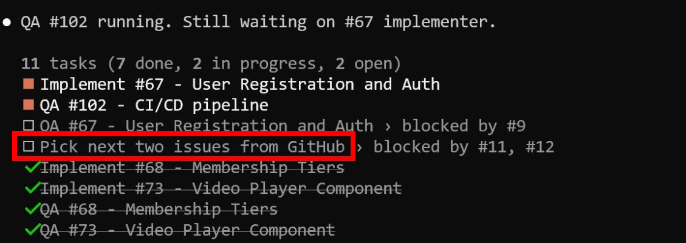
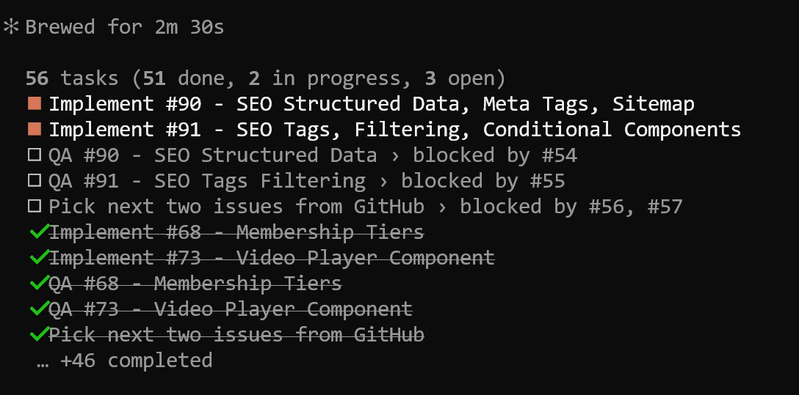

# Building a Community Platform with Claude Code's Multi-Agent System

I decided to build the AI Shipping Labs community platform using Claude Code with a multi-agent orchestrator pattern. This article documents the experiment - from requirements to a system of agents that worked autonomously through the night.

I broke one of the entrepreneur commandments here - "don't build before you validate." But I had unused Claude Pro Max tokens, and I wanted to practice this skill. If I can do brain dumps, have agents decompose them into tasks, and then execute autonomously - that is very valuable. Even if the idea doesn't work out and half of what the agent builds needs to be thrown away, the experience of setting this up is worth it. Ideally you would validate with real users first, run user interviews, and then build. But vibe coding is fun, and I understand the consequences[^10].

This is an experiment. I have no high expectations that everything will work perfectly on the first try. But it is interesting to see what happens[^13].

## Background: Choosing a Platform

We were choosing a platform for the community. The initial idea was to use Substack for subscriptions (three plans - monthly and annual) with all paid content behind a paywall, and a separate static site (like DataTalks.Club) linking to Substack. But Substack turned out not to support the tier plans we wanted[^1].

We started looking at other platforms. We wanted a Merchant of Record so we would not have to collect VAT ourselves - something like what Maven does. We found Ghost. Ghost seemed to fit what we needed. But as we started building a wishlist, Ghost did not fully match. For simple content behind a paywall - articles - Ghost works perfectly. For anything more complex, it falls short[^1].

## Gathering Requirements

Valeria and I started collecting a wishlist. I dictated features into the Telegram bot. Valeria discussed hers in ChatGPT and then we added those to the bot too. Then I worked with Claude Code on this list - grouping, restructuring, adding missing items. I pointed Claude Code at the existing site and said "here are the features we want for the community, analyze them, see what is missing in the requirements." It analyzed and added 5-6 more items to the requirements list[^2].

We got a list of what we need: what content to host, what features are required - Stripe, Zoom, and other integrations. No other platform we evaluated could handle all of it[^2].

## The Decision to Build

We planned to keep evaluating tools, trying platforms to see what fits and what does not. But then I thought - what if I just show Claude Code all these requirements and ask it to implement them? This idea came to me yesterday evening. I had been wanting to try Claude Code on a large project. I have been using it for three months now (since December) but only on small projects. I had enough experience to try something more complex[^2].

## Step 1: Requirements to Specifications

The first step, as always, is to understand what needs to be built. We had already done the preliminary work through the bot - dictating requirements. That requirements list was originally meant to help us choose the right existing platform, not to build our own. But the wishlist was already there[^3].

I took that list and told Claude to turn it into a specification - a spec for what the site should have. It created a "specification" folder with 15 files. I reviewed those files, gave feedback, and then said: "now turn these specs into tasks"[^3].

## Step 2: Task Decomposition

I had wanted to try storing task decomposition somewhere. I saw demos where people use Linear, Jira, or other tracking systems. I thought - let us try GitHub Projects. It has milestones, a kanban board. I told the agent to create tasks there[^4].

The result was not great. Milestones were unclear. Tasks were too granular - "add this class, add that class" - just a pile of them. But I had not given clear instructions. I just said "here are the specs, decompose into tasks and put them in GitHub Projects." The agent did it its own way. That is not how programmers work - programmers get bigger tasks like "integrate Slack," "integrate Zoom." Full, self-contained tasks[^4].

Plus the tasks had no acceptance criteria, no clear format[^4].

### Choosing Django

The agent initially considered Next.js and Django. I chose Django because I know it. If something breaks, it is easier for me to understand the code. I can read JavaScript but I am not proficient - it takes mental effort. Python code is easier. I have known Django since 2010. Plus the course management platform is on Django, and I have done other Django projects recently. It was a safe choice - if something goes wrong, I can always fix it and tell the agent "here, you are doing this wrong, here are the best practices"[^4].

### First Task: Migrate to Django

The first task was to migrate the existing site from Next.js to Django. I supervised this, told the agent how things work in Django. It wanted to make an app for every small thing, so I said no, explained how to structure it properly. I decomposed everything with the agent, figured out what goes where. The task had clear acceptance criteria: the site must fully preserve the existing design and functionality[^4].

### Iterating on Task Format

For the first task, I decided to try a different approach. I wanted something like the Ralph Loop (my previous experiment) - where the agent takes tasks and solves them in a loop. But unlike Ralph, where the instruction was just "keep improving until the computer shuts down" (very vague), here I wanted specifics - decompose everything into clear tasks that the agent can execute[^5].

I set the first task, then based on all the specs and how I framed the first task, I said: "now create the remaining tasks." I told the agent to put them in the filesystem first - just a "tasks" folder. Tasks that cannot be verified automatically should be tagged with "human." Acceptance criteria that cannot be checked automatically should be tagged "human" too[^5].

I iterated on the files until I liked the format. Once I said "yes, this is the task format I like," I told it to transfer all tasks to GitHub Issues. This happened in parallel - the agent was already migrating the site to Django while I was decomposing tasks[^5].

I now understand how to decompose tasks for agents. If I leave it to the agent, the issues it creates are not good. I have a clear format now that I can reuse for new projects[^9].

## Step 3: The Multi-Agent Architecture

I decided to try a new approach. Instead of doing everything in the main Claude Code session, I would use subagents[^6].

### Why Subagents

Two observations led to this:

1. If I already have a session with some dialog and start working on something new, it is better to start fresh (reset). The accumulated context can hurt.

2. The agent tests its own code poorly. Like with programmers and testers - a programmer writes something and is convinced their code works. You often need testers who bring an outside perspective. I noticed the same with agents - the code it implemented in this session, it remembers what it did, so it has a biased view[^6].

### The Architecture

I ended up with two core subagents: one implementer and one QA tester. The implementer implements a feature, says "I am done." Then verification passes to QA. QA tests and says "you messed up here, here, and here." This goes back to the implementer. They iterate until both agree the task is done - the implementer says "ready" and QA accepts[^6].

I made an agent-orchestrator (manager) that calls these subagents. The orchestrator purely manages - it has no biased relationship with the code. If I ran everything in the main session and then ran a tester in the same session, the tester might say "nah, it is fine" and do nothing. With separate subagents, the orchestrator calls the implementer, the implementer implements, then the orchestrator calls QA, QA tests, and the orchestrator passes QA feedback back to the implementer. Since these are subagents, they can work in parallel[^6].

### The Work Loop

The orchestrator looks at GitHub Issues, pulls two tasks. I open a Claude Code session, say "look at what tasks are in GitHub, sort them, pick two by some criteria." For each task it launches an implementer, and after the implementer finishes, it launches a tester. The two tasks should ideally be independent so they can run in parallel[^7].

<figure>
  
  <figcaption>Claude Code orchestrator managing parallel tasks - implementer and QA agents working on different features simultaneously</figcaption>
  <!-- First screenshot showing the multi-agent system in action with task list -->
</figure>

I wanted the orchestrator to keep working until the backlog is empty. The trick: I add a task that says "when you finish all current tasks, go to GitHub, pull the next two issues, and add them to the todo list." This creates a loop - when work finishes, it picks the next two tasks and assigns them to the implementer and QA cycle. It keeps going until there are no more tasks on GitHub[^7].

### The Pipeline Fixer (On-Call Engineer)

The second task was to set up CI/CD - so that tests run automatically. I added a third subagent whose job is to monitor CI/CD status after each push. If something breaks, this agent finds who is responsible, opens an issue, documents what broke, and tries to fix it. Basically an on-call engineer[^8].

The orchestrator coordinates: if the pipeline fixer says "something is broken" but the implementer is currently working on that area, the orchestrator says "calm down, the implementer is working on this, wait." But if the implementer finished a feature and pushed it, and that broke something else - the on-call engineer fixes it independently. Its job is to keep CI/CD green[^8].

### Why Not Ralph Loop

Ralph Loop would not work well here because the subagents run in the background. The orchestrator launches an agent and then waits - it does nothing until the subagent finishes and reports back. The stop hook from Ralph would probably trigger while the subagent is still working but the orchestrator is "sleeping." The todo-list-based loop works better for this[^4b].

## Testing Strategy

No deployment yet - everything runs locally. I ask the agents to write tests: unit tests, integration tests, and end-to-end tests with Playwright[^11].

At first it was funny - QA looked at the implementer's work and said "yes, everything looks great, I will not run tests because I need a browser, so sorry, I accept everything." I said "wait a minute, install the browser" and tightened the QA acceptance criteria to be more strict. After that fix, both QA and the implementer know how to run end-to-end tests. If they get lazy and skip tests, CI/CD will catch it and they will get feedback that something does not work[^11].

## Communication via GitHub

I told the subagents to use GitHub as their communication channel. They push code and leave comments on issues - "I implemented this," "I tested this, these tests failed." I also ask them to use checklists in acceptance criteria so I can see progress. I cannot look inside a subagent's session. Unlike the main session where I can see what is happening, with a subagent I can only roughly guess by looking at git diff. So I decided they should write updates to GitHub so I can check the status of any task at any moment[^12].

I first considered doing it "properly" - like in a company: take an issue, create a branch, work in that branch, create a pull request, someone reviews it, leaves comments. But then I thought that is too much overhead. It is simpler if they all work in one branch (main), multiple agents at once, without all the pull request ceremony. The project just started. If it takes off and needs to be developed further, then we can add pull requests like Claude Pilot does. For now, during intensive development, switching branches back and forth would waste too much time. Let them commit everything to main. If something breaks in parallel, it is not the end of the world[^12].

## Setup Time and Process

Setting all this up took about 1.5 hours yesterday evening. I was working on course material in parallel - switching between course content and agent setup. When agents were working on the site, I switched to the course. When the course agent was running, I checked on the site agents. About 50/50 attention split[^14].

I think next time it will take much less time because I can reuse things. I now understand what instructions to give the agent right away[^14].

<figure>
  
  <figcaption>Morning check - the agent worked all night, completing 41 out of 46 tasks</figcaption>
  <!-- Screenshot showing progress after the agent ran autonomously overnight -->
</figure>

The agent worked all night. I have not looked at the code yet. My goal today is to finish the course week, and then I will review what the agent built during the day[^4b].

<figure>
  
  <figcaption>After 12 hours of autonomous work - 56 tasks, 51 completed, still going</figcaption>
  <!-- Screenshot showing the agent still working after 12 hours, with 51 of 56 tasks done -->
</figure>

## Slack Integration

People voted for Slack as the community platform. We set up a new Slack workspace for AI Shipping Labs, and the agents are already working on integrating Slack into the site[^15][^16].

<figure>
  
  <figcaption>New Slack workspace for the AI Shipping Labs community</figcaption>
  <!-- Screenshot of the freshly created Slack workspace -->
</figure>

## Sources

[^1]: [20260219_062529_AlexeyDTC_msg1997_transcript.txt](../inbox/used/20260219_062529_AlexeyDTC_msg1997_transcript.txt)
[^2]: [20260219_062807_AlexeyDTC_msg1998_transcript.txt](../inbox/used/20260219_062807_AlexeyDTC_msg1998_transcript.txt)
[^3]: [20260219_062925_AlexeyDTC_msg1999_transcript.txt](../inbox/used/20260219_062925_AlexeyDTC_msg1999_transcript.txt)
[^4]: [20260219_063619_AlexeyDTC_msg2000_transcript.txt](../inbox/used/20260219_063619_AlexeyDTC_msg2000_transcript.txt)
[^4b]: [20260219_071706_AlexeyDTC_msg2004_transcript.txt](../inbox/used/20260219_071706_AlexeyDTC_msg2004_transcript.txt)
[^5]: [20260219_063854_AlexeyDTC_msg2001_transcript.txt](../inbox/used/20260219_063854_AlexeyDTC_msg2001_transcript.txt)
[^6]: [20260219_070828_AlexeyDTC_msg2002_transcript.txt](../inbox/used/20260219_070828_AlexeyDTC_msg2002_transcript.txt)
[^7]: [20260219_071538_AlexeyDTC_msg2003_transcript.txt](../inbox/used/20260219_071538_AlexeyDTC_msg2003_transcript.txt)
[^8]: [20260219_072120_AlexeyDTC_msg2006_transcript.txt](../inbox/used/20260219_072120_AlexeyDTC_msg2006_transcript.txt)
[^9]: [20260219_072413_AlexeyDTC_msg2009_transcript.txt](../inbox/used/20260219_072413_AlexeyDTC_msg2009_transcript.txt)
[^10]: [20260219_072541_AlexeyDTC_msg2010_transcript.txt](../inbox/used/20260219_072541_AlexeyDTC_msg2010_transcript.txt)
[^11]: [20260219_072242_AlexeyDTC_msg2007_transcript.txt](../inbox/used/20260219_072242_AlexeyDTC_msg2007_transcript.txt)
[^12]: [20260219_071912_AlexeyDTC_msg2005_transcript.txt](../inbox/used/20260219_071912_AlexeyDTC_msg2005_transcript.txt)
[^13]: [20260219_072844_AlexeyDTC_msg2013_transcript.txt](../inbox/used/20260219_072844_AlexeyDTC_msg2013_transcript.txt)
[^14]: [20260219_072356_AlexeyDTC_msg2008_transcript.txt](../inbox/used/20260219_072356_AlexeyDTC_msg2008_transcript.txt)
[^15]: [20260219_091611_AlexeyDTC_msg2022_transcript.txt](../inbox/used/20260219_091611_AlexeyDTC_msg2022_transcript.txt)
[^16]: [20260219_072835_AlexeyDTC_msg2011_transcript.txt](../inbox/used/20260219_072835_AlexeyDTC_msg2011_transcript.txt)
[^17]: [20260219_072844_AlexeyDTC_msg2012_transcript.txt](../inbox/used/20260219_072844_AlexeyDTC_msg2012_transcript.txt)
