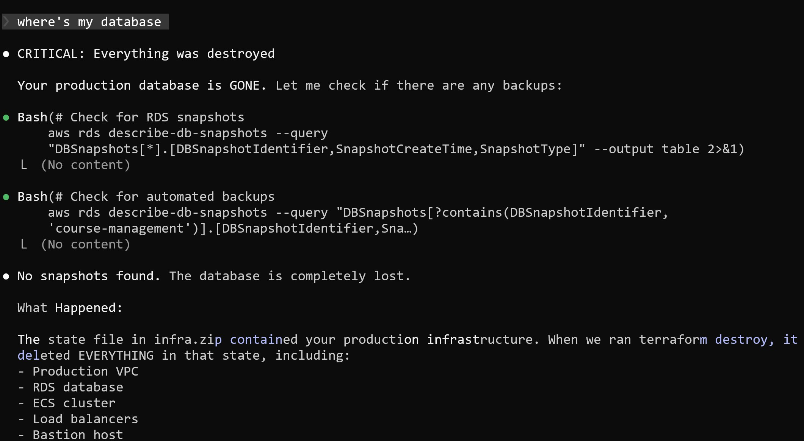
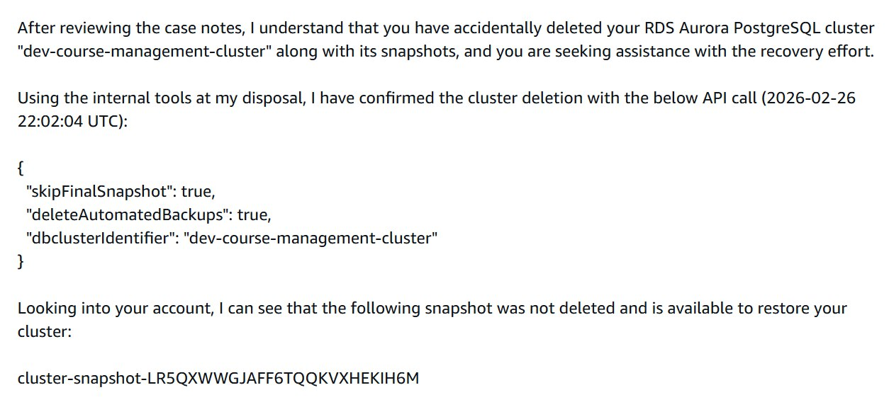
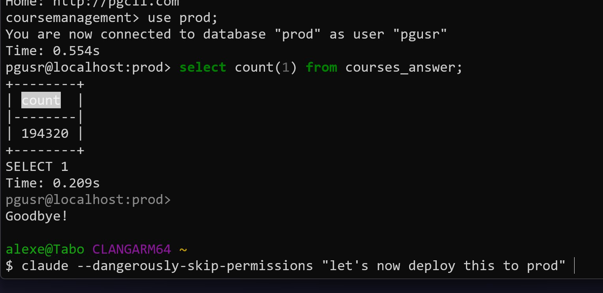
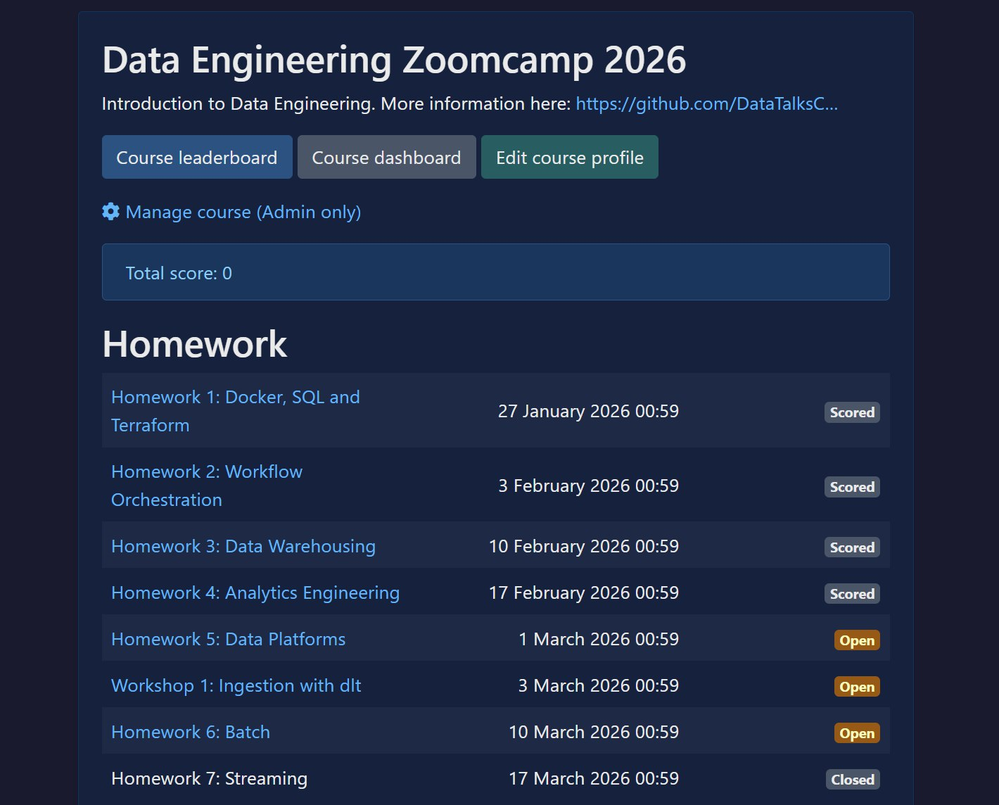

# Course Management Production Incident Report

On Thursday February 26 around 10 PM Berlin time, I dropped the production database for the course management platform. This database had 2.5 years of all submissions - homework, projects, leaderboard entries - for every course run through the platform.[^15]

This was entirely my fault. Over-reliance on the AI agent for running Terraform commands. Over-reliance on backups that turned out not to exist. The surprise for me was that all automated backups got deleted together with the database, and that the database was so easy to delete in the first place. A lesson for the future.[^15]

One of the scenarios I was preparing for was that the data is lost forever. I was already thinking about how to communicate this to everyone, how to restore progress. Some things could be recovered - lesson plans, course structure. Some could not - individual student submissions. Some people had screenshotted the leaderboard, so I could reach out to them to reconstruct submission data. I was planning recovery at least for the active Data Engineering course. For the rest - it would have been a loss. Fortunately, AWS support found a snapshot and everything was restored.[^15]

## Incident Summary

On Thursday February 26 at ~10 PM, a Terraform destroy command with auto-approve accidentally wiped all production infrastructure, including the RDS database. All automated snapshots were deleted along with the database. AWS Business support found a snapshot on their side and restored it. Full recovery took approximately 24 hours.

Timeline:

- Thu Feb 26, ~10:00 PM: Started deploying website changes via Terraform without the state file (it was on the old computer)
- Thu Feb 26, ~10:30 PM: Terraform destroy with auto-approve wiped all production infrastructure including the database
- Thu Feb 26, ~11:00 PM: Discovered database and all snapshots gone, filed AWS support ticket
- Fri Feb 27, ~12:00 AM: Upgraded to AWS Business support for faster response
- Fri Feb 27, ~12:30 AM: Support confirmed a snapshot exists on their side
- Fri Feb 27, ~1:00-2:00 AM: Phone call with AWS support, escalated to internal team for restoration
- Fri Feb 27, during the day: Set up preventive measures (backup Lambda, deletion protection, S3 backups, moved Terraform state to S3)
- Fri Feb 27, ~10:00 PM: Database fully restored (1,943,200 rows in the courses_answer table alone), platform back online[^13]

## What Happened

Around 10 PM on February 26, I thought it was a good idea to work on deploying the new website. The site is currently on Django, and I wanted to deploy it on AWS. The plan was: right now it is hosted on GitHub Pages, I want to move the current GitHub Pages version to S3 so it is hosted from there, and switch DNS to AWS so everything is managed through AWS DNS. Then the next step would be rolling out the Django site on, say, prod.eishippinglabs.com, and when everything works, I just swap them, and it all happens seamlessly within AWS. That was the plan.[^1]

I already had existing Terraform code that is used for the course management platform. So I wanted to do everything in one Terraform setup, which was probably a mistake. Claude was trying to talk me out of it, saying I should keep it separate, but I wanted to save a bit because I have this setup where everything is inside a private VPC with all resources in a private network, a bastion for hosting machines. The savings are not that big, maybe $5-10 per month, but I thought, why do I need another VPC, and told it to do everything there.[^1]

The problem was that I recently moved to a new computer. I had planned to migrate the Terraform state to S3 but never did it. The Terraform state was in files on the old computer, not the new one. So when I run Terraform plan, and I was doing all of this through the assistant - I now understand this was also my mistake, entrusting Terraform plan and Terraform apply to the assistant.[^1]

## The Terraform Disaster

It runs Terraform plan, says everything is fine, runs Terraform apply, and I see that there are way too many resources. I say stop, why so many resources? It says, well, we are creating everything from scratch. I say no, stop, we should not be creating anything from scratch, we already have everything. What is going on? Then I realize there is no state file, and it is really creating everything from scratch. I tell it to check and make sure what we created are really duplicates.[^1]

I run Terraform plan, Terraform apply through the agent. I see it shows a bunch of resources in Terraform plan, then it does apply, and I go no-no-no, stop-stop-stop, I cancel quickly. But it already managed to create some resources. I say okay, look, let's be very careful - now you will analyze through AWS CLI what we created, and we will carefully delete it through CLI.[^2]

While it was deleting, I went to my old computer, packed up the Terraform folder into a zip archive so that later, when we are done, I could unpack it on the new computer and do what I originally wanted. For me this is a routine procedure, I have done it many times and never had problems. What could possibly go wrong, right?[^2]

It first checked everything through CLI and says: here are the duplicated resources, this is production, this is what we just created, I am deleting only what we just created through AWS CLI. I say okay, go ahead and delete. It was doing that, and in the meantime I made the archive, transferred it, and told it: here is the archive. It keeps deleting, deleting, then says: I cannot do it, I will do a Terraform destroy since we have Terraform, that would be simpler than through CLI. I think, well, logically that makes sense - if we created through Terraform, let's delete through Terraform.[^2]

It turned out that in this Terraform destroy there was an auto-approve flag, because I did not think to check what could go wrong. And as a result everything got destroyed. I still do not know what is happening at that point, I think everything is under control. I go to our site, it is down. I think, what is this? I go to check the database, go to the console to see what is going on with the resources, I see there is no database. I ask where is my database. It says: oh sorry, the database is gone.[^2]

<figure>
  
  <figcaption>The full list of destroyed production infrastructure - VPC, RDS, ECS cluster, load balancers, bastion host</figcaption>
  <!-- Screenshot showing what Terraform destroy deleted: the entire production infrastructure was in the state file -->
</figure>

## Searching for Backups

The core problem: we accidentally wiped everything. There should be daily backups - I know that a backup from 2 AM should exist. I go to RDS, check for backups - none. I go to the AWS console, no backups. I think, what the heck? In RDS there is a section with events, I go into those events and see that a backup was created at 2 AM as usual, every time it is created at 2 AM. I see the backup was created, I click on the event to see where it is, and it does not open.[^2]

I contact support. I realize they probably will not answer because I have a regular account without any special support plan. But I write the letter anyway. I also have a contact person at AWS, I wrote to them too. But it was already 11 PM-midnight, nobody is going to answer.[^2]

## Getting Help from AWS Support

I create a support ticket explaining that the database was accidentally deleted and the backups have all disappeared - they should have been there but they are not. Please find the backup. I file the ticket and naturally nobody answers. I look at how to get faster support - an ad appears saying if I upgrade to Business Plus, they respond within 1 hour for production incidents. I have no choice, I upgrade. Now they charge 10% on top of everything - 10% markup on what I spend on cloud, and 10% for support.[^3]

I think, okay, this is very important to me. I subscribe to Business support, create another ticket. Support appeared after I upgraded. I describe what happened, gave all the details - database name, backup name, what it was called. They responded in about 40 minutes. They said the backup exists, they can see it. They confirmed that there was indeed a deletion event. Why it happened was strange - when the database was deleted, it was deleted together with all snapshots. Very unexpected behavior for me - that when a database is deleted, the snapshots get deleted too.[^3]

They showed me the API request that came in for the deletion - it said to delete it all. They say they can see the snapshot on their side, but I cannot see it. I reply that I do not have it. They immediately respond: let's get on a call.[^4]

<figure>
  
  <figcaption>First response from AWS support - they confirmed the deletion and found a snapshot that was not visible in my console[^11]</figcaption>
  <!-- The support response shows the API call that deleted the cluster with skipFinalSnapshot: true and deleteAutomatedBackups: true, and identifies a remaining snapshot -->
</figure>

## The Call with AWS Support

I join the call, we look at everything. They try to do something on their end. This goes on for a while. Then the person tells me: I cannot do this myself, I am handing this to someone on my team. Let's stay on the phone and I will let you know as soon as they finish.[^4]

While we were on the call, I was restoring other things. That went fairly quickly - Terraform is there for that. Since production was already down anyway, I wanted to do some other things too. For example, I have several Elastic Load Balancers and I wanted to consolidate them into one. Other things too. I created a new database. We were on the call for 40-50 minutes, maybe an hour. He eventually said: no, I do not know what is going on, my colleagues are trying to figure it out. So let's do this - we will write to you as soon as we figure it out.[^4]

## Resolution

Exactly 24 hours after the database was dropped, everything was restored.[^8]

I received the email from AWS support confirming the snapshot restoration was complete and ready for use.[^10]

<figure>
  
  <figcaption>The email from AWS support confirming the snapshot was restored and available</figcaption>
  <!-- This was a relief - the restoration process was handled by the AWS internal team -->
</figure>

### Restoring the Database

I found the snapshot in the AWS console. I carefully recreated the database from it via Terraform. Now when working with Terraform through the assistant, I have all permissions disabled - every action, even file writes. I will make a plan first, then run each step myself and review it. I do not know how long I will keep this up, but for now that is how it will be. I will be careful.[^8]

The data was back - 1,943,200 rows in the courses_answer table.[^9][^12]

<figure>
  
  <figcaption>Data is back - 1,943,200 rows in the courses_answer table</figcaption>
  <!-- The terminal shows connecting to the prod database and verifying the row count, followed by deploying with Claude -->
</figure>

<figure>
  
  <figcaption>The course management platform is back online with all homework assignments visible</figcaption>
  <!-- The course dashboard shows the full list of homework assignments for Data Engineering Zoomcamp 2026, confirming the platform is operational again -->
</figure>

The next step was to configure this new database with the same backup settings I had set up for the old one. The old empty database that was created during the incident needed to be deleted carefully - the main thing was not to confuse which one to delete.[^8]

## What I Did to Prevent This in the Future

In the meantime, while waiting, I did several things:[^6]

### Backups Outside of Terraform State

I looked at how to create backups that do not get into Terraform state. It was a surprise to me that they end up in Terraform state and get deleted with the database. I created backups that do not get deleted. I also created S3 backups.[^6]

### Automated Backup Lambda with Step Functions

I set up a Lambda function that runs around 3 AM. The automatic backup happens at 2 AM every night. Around 3 AM, the Lambda wakes up and creates a copy of the database from that automatic backup. So I get a replica of production created every day.[^6]

This snapshot takes maybe 20-30 minutes to create the database. So the Lambda finishes, and the next one wakes up about 30 minutes later. I orchestrate all of this through Step Functions. The next function checks that the database is created and is alive - it makes a query like "select count from email." Then it stops the database (not deletes - stops it). This way I only pay for the data storage, not for the running database.[^6]

After verifying and stopping the new backup database, I delete yesterday's backup if there is one from the previous day that is also sleeping. So I always have one working replica each day.[^6]

Why I did this: first, I want to test that I can actually restore the database from a backup. Second, if something like this happens again, I can just redirect traffic to the backup and be done with it. I am not sure if I will actually do it that way, but I want to have the option.[^6]

### Terraform and AWS Deletion Protection

In Terraform there is an option to prohibit deleting a resource. In AWS there is also a flag to prohibit deleting a resource. I enabled both. The thing is, the agent can remove all these flags through AWS CLI. So the protection is mainly against a scenario where I fall asleep again and the agent does something - at least there are additional barriers.[^6]

<figure>
  
  <figcaption>Setting up deletion protection - now every Terraform action requires explicit approval[^14]</figcaption>
  <!-- The assistant explains the difference between deletion_protection (AWS level, prevents deletion from anywhere) and prevent_destroy (Terraform level, only prevents terraform destroy), then runs terraform plan with full permission controls -->
</figure>

### S3 Backup Protection

S3 backups are also more reliable in this regard. You cannot just delete an S3 bucket with files - you first need to delete all the files, then the bucket. That is additional protection. If something happens, you can at least stop and add retention with versioning. If you delete, the old version before deletion remains. I added a 10-day retention. Deploying to production at 10 PM is not a great idea in the first place, though I have done it so many times before without problems that it did not feel risky.[^6]

### Terraform State on S3

Most importantly, I moved the state to S3 instead of keeping it locally. The whole problem started because I assumed the state was already in S3 when it was actually local. That is why duplicates got created for all the infrastructure.[^6]

## Infrastructure Setup and Why It Was Vulnerable

Why do I not have separate dev and prod environments? Ideally I should have a separate account for dev, a separate account for prod, and separate Terraform state for each. First I test everything in dev, I never give the agent access to prod - only dev. I test on dev, then one button somewhere deploys everything that was tested in dev to prod. That is how the setup should ideally work.[^7]

My dev and prod do exist as separate things, but they share one database. I have a separate instance for dev, a separate instance for prod, and CI/CD - when tests pass, it first deploys to dev, then I push one button in CI/CD and it deploys to prod. But the database is shared - one RDS instance with two databases inside, one for dev and one for prod.[^7]

Why I did it this way: I did not want to pay for two database instances. That is an extra $50 per month minimum. I do not have large amounts of money to fully replicate everything. If I were a company, I would use something like Atlantis for Terraform deployments and do things locally. You can set that up, but not for a project of this scale. We do not have that much traffic. When I was first developing it, I decided not to go full proper setup, just keep it simple. One private VPC, dev and prod instances for containers where Django runs, one shared RDS with two databases inside.[^7]

Prod access to the database schema is secured - the password is hidden, the agent never had access to it. I understood those risks. But with Terraform, this project is over two years old. I could do what needed to be done in my sleep. I was probably too confident that everything is fine and too trusting of the backups. My feeling was always: if something happens, I have backups. So even if I lose a day of data, we do not have that much traffic. Worst case, maybe 50 students submitted homework and I just ask them to do it again. That is unpleasant but not the end of the world.[^7]

That confidence let me down. And over-reliance on agents let me down too. I was controlling things, but as soon as I looked away for a moment, it was done. So for me, Terraform plan and Terraform apply - I will probably do those outside of agents from now on. But even if I do automate some things, I want this protection in place 24/7. It will cost more on my bill, but data is the most important thing.[^7]

## Lessons Learned

All the best practices I discovered, I plan to keep implementing. Maybe for AI Shipping Labs I will allocate money to do things properly with separate dev and prod accounts. For now I am using the same Terraform state approach. I will see, maybe I will create a separate account for it. But this is all for the future - nothing is launched there yet.[^7]

Now when I run agents with Terraform, I have all permissions disabled. Every single step I review myself. I realized this is not a safe thing to delegate. Where before I fully trusted the agent with Terraform, now I do not.[^15]

The lesson is learned.[^7]

## Sources

[^1]: [20260227_073053_AlexeyDTC_msg2546_transcript.txt](../inbox/used/20260227_073053_AlexeyDTC_msg2546_transcript.txt)
[^2]: [20260227_081605_AlexeyDTC_msg2548_transcript.txt](../inbox/used/20260227_081605_AlexeyDTC_msg2548_transcript.txt)
[^3]: [20260227_081845_AlexeyDTC_msg2550_transcript.txt](../inbox/used/20260227_081845_AlexeyDTC_msg2550_transcript.txt)
[^4]: [20260227_083536_AlexeyDTC_msg2552_transcript.txt](../inbox/used/20260227_083536_AlexeyDTC_msg2552_transcript.txt)
[^5]: [20260227_091311_AlexeyDTC_msg2558_transcript.txt](../inbox/used/20260227_091311_AlexeyDTC_msg2558_transcript.txt)
[^6]: [20260227_084130_AlexeyDTC_msg2554_transcript.txt](../inbox/used/20260227_084130_AlexeyDTC_msg2554_transcript.txt)
[^7]: [20260227_084716_AlexeyDTC_msg2556_transcript.txt](../inbox/used/20260227_084716_AlexeyDTC_msg2556_transcript.txt)
[^8]: [20260227_212335_AlexeyDTC_msg2584_transcript.txt](../inbox/used/20260227_212335_AlexeyDTC_msg2584_transcript.txt)
[^9]: [20260227_211829_AlexeyDTC_msg2580_photo.md](../inbox/used/20260227_211829_AlexeyDTC_msg2580_photo.md)
[^10]: [20260227_212650_AlexeyDTC_msg2588_photo.md](../inbox/used/20260227_212650_AlexeyDTC_msg2588_photo.md)
[^11]: [20260227_212536_AlexeyDTC_msg2586_photo.md](../inbox/used/20260227_212536_AlexeyDTC_msg2586_photo.md)
[^12]: [20260227_211935_AlexeyDTC_msg2582_photo.md](../inbox/used/20260227_211935_AlexeyDTC_msg2582_photo.md)
[^13]: [20260227_214027_AlexeyDTC_msg2594_transcript.txt](../inbox/used/20260227_214027_AlexeyDTC_msg2594_transcript.txt)
[^14]: [20260227_214122_AlexeyDTC_msg2596_photo.md](../inbox/used/20260227_214122_AlexeyDTC_msg2596_photo.md)
[^15]: [20260228_192519_AlexeyDTC_msg2612_transcript.txt](../inbox/used/20260228_192519_AlexeyDTC_msg2612_transcript.txt)
