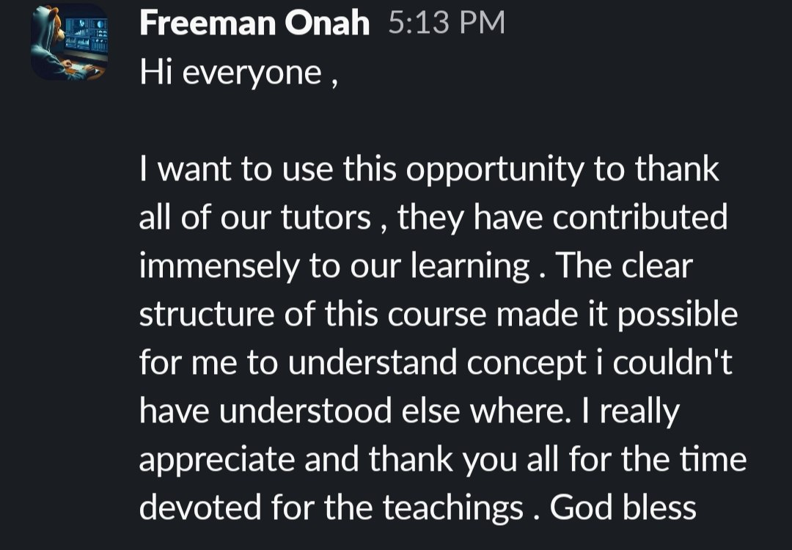

# Data Engineering Zoomcamp Testimonials

Testimonials from Data Engineering Zoomcamp participants, collected in one place[^1].

## Anonymous

A massive thank you to @Alexey Grigorev and the entire DataTalks.Club team! This bootcamp was a game-changer. It helped me unlock new skills in my core domain and shifted how I approach complex problems. The supportive, cohort-based environment is incredibly effective. I'm looking forward to applying these "new neural pathways" to my future projects and seeing where this knowledge takes me![^2]

## Freeman Onah

Hi everyone, I want to use this opportunity to thank all of our tutors, they have contributed immensely to our learning. The clear structure of this course made it possible for me to understand concepts I couldn't have understood elsewhere. I appreciate and thank you all for the time devoted to the teachings. God bless[^3].

<figure>
  
  <figcaption>Freeman Onah's testimonial in the course chat</figcaption>
  <!-- Original screenshot of the testimonial as sent by the participant -->
</figure>

## Evgeniia

Hi everyone! I just wanted to say a huge thank you to the whole teaching team for all the time, effort, and energy you put into this Zoomcamp. It is clear how much work went into organizing everything and preparing the materials[^4].

Overall, I found the course incredibly valuable. Some parts can feel challenging (especially for beginners without coding experience) but that's also what pushes you to think deeper and keep exploring beyond the lessons[^4].

The Spark and Flink modules felt a bit surface-level at times, but they gave me a strong push to continue learning on my own. The Kestra module was a highlight: great videos, clear explanations, and practical examples, though debugging during the final project was tricky (because of generic trace logs, limited docs), but I'm rooting for Kestra's continued growth, it feels like a product with a lot of potential[^4].

This was a genuinely great learning experience, and I'm grateful for everything you created. Wishing the whole team lots of success and inspiration for future cohorts - you're doing something truly valuable![^4]

## Sources

[^1]: [20260430_161159_AlexeyDTC_msg3782.md](../inbox/used/20260430_161159_AlexeyDTC_msg3782.md)
[^2]: [20260430_161208_AlexeyDTC_msg3784.md](../inbox/used/20260430_161208_AlexeyDTC_msg3784.md)
[^3]: [20260430_161231_AlexeyDTC_msg3786_photo.md](../inbox/used/20260430_161231_AlexeyDTC_msg3786_photo.md)
[^4]: [20260430_161255_AlexeyDTC_msg3788.md](../inbox/used/20260430_161255_AlexeyDTC_msg3788.md)
