# Approaching Design with AI as a Non-Designer

You can usually tell when a website was created by AI. It tends to happen with "one-shot designs": you tell the coding assistant to create a website, and when you open it, you can see right away that it's AI-generated.[^9]

A lot of the time that is completely fine. For a simple website, one-shot is more than enough, and it's way better than I could ever design myself.

The problems start when you don't want something generic. There are thousands of websites now that all look the same. In writing we have markers like "delve" or excessive bold formatting that give away AI-generated prose. In design there are similar elements you notice immediately.[^9]

One-shot designs also get hard to use. They tend to grow overly complex, with elements not always where I'd expect them. And it compounds: as you keep building on top, each new page brings elements that don't match the rest, until the whole thing becomes messy.[^9]

I am not a designer. I do not claim to be one, and I never liked front-end or design work. But since I build many user-facing tools now, both web and mobile, I want to make sure they look nice and clean, with elements placed logically.

This article is about how I approach designing with AI as a non-designer - how I use AI tools to get something that looks pleasant and not generic, instead of AI slop.[^9]

## The design elements that give AI away

When I say a project has design elements characteristic of AI, I mean specific habits I keep running into and correcting.

The most obvious one is the layout I think of as typical AI design: the feature grid where every cell has an icon, a title, a short blurb, and the border highlights on the left.[^25]

<figure>
  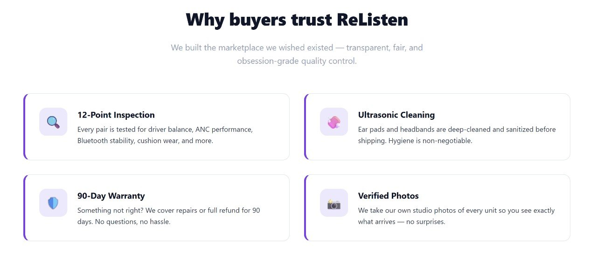
  <figcaption>Typical AI design - the icon-title-blurb feature grid</figcaption>
  <!-- The generic feature-grid pattern the user points at as the characteristic AI look -->
</figure>

Another is button placement. AI likes to cram the action buttons tightly on the right, the way they show up here, as if the page had no room for them. I have to correct it and give them space underneath instead.[^22]

<figure>
  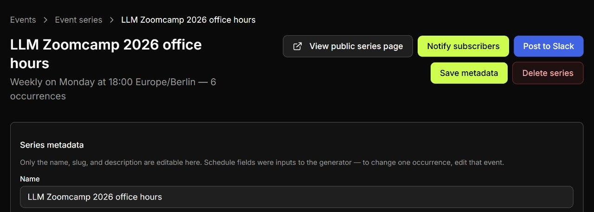
  <figcaption>The buttons get crammed on the right by default - I give them room underneath</figcaption>
  <!-- Concrete example of the button-placement tic the user keeps correcting -->
</figure>

The same happens with layout. AI tends to reach for column layouts even where they are not necessary, which crowds everything together and makes the UI too dense.[^23][^24]

<figure>
  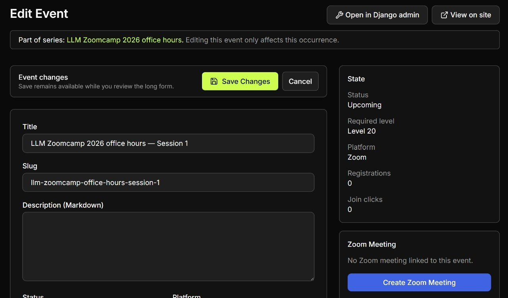
  <figcaption>Columns that make the layout too dense</figcaption>
  <!-- First example of the dense-column tic -->
</figure>

<figure>
  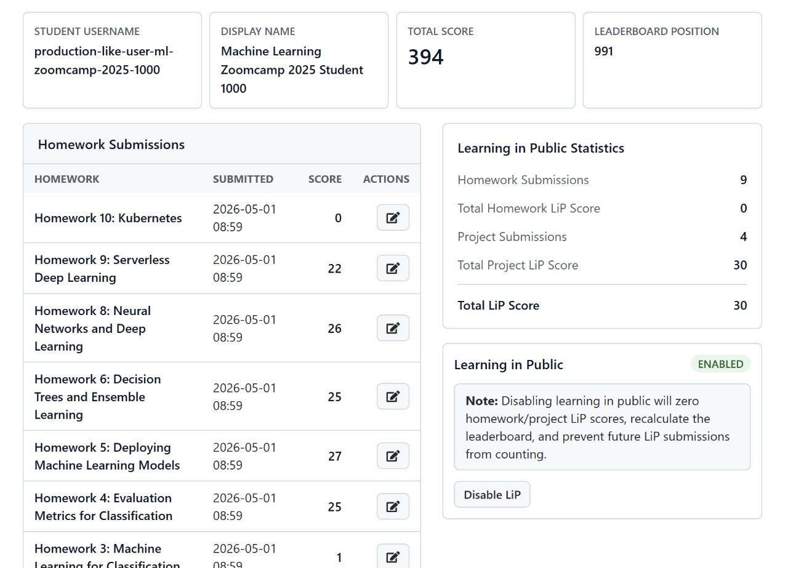
  <figcaption>Another page where the columns crowd the layout</figcaption>
  <!-- Second example of the same dense-column tic -->
</figure>

## My own designs are not much better

I am not a designer, and you can see it in the things I have built myself. When I need to design something, it comes out functional but not sleek. Take the main DataTalks.Club website - I put it together in 2020, and it did the job, but it is plainly not the work of a designer.

<figure>
  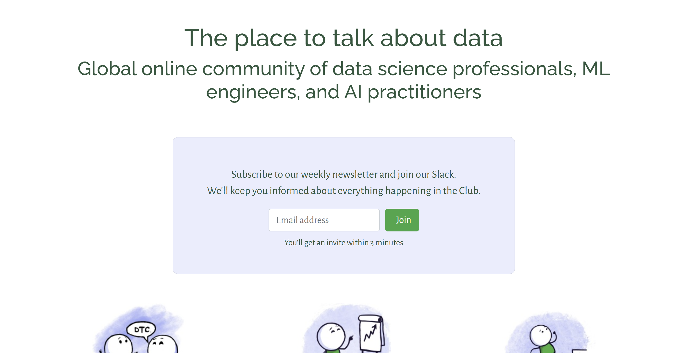
  <figcaption>The main DataTalks.Club website I built in 2020 - functional, but clearly not the work of a designer</figcaption>
  <!-- The user's own pre-AI design work, establishing the non-designer baseline before the redesign story -->
</figure>

The course management platform was the same story. I built it to replace the mess I had before - Google Forms, spreadsheets, and a pile of custom Python scripts that had become very hard to manage. The platform just replicated the process I already had, but made it easier to run. I started it in 2023 and launched the first course on it in January 2024, building it the only way I knew how: with Django and Bootstrap, the tools I already had, and AI helping along the way. It worked and had all the functionality, but it looked like this.[^14]

<figure>
  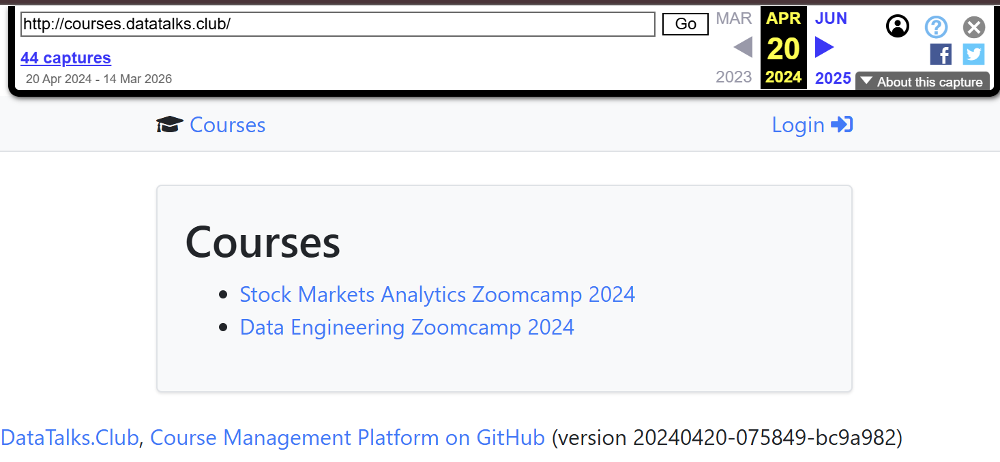
  <figcaption>The first version of the course management platform (<a href="https://web.archive.org/web/20240420184858/http://courses.datatalks.club/">Wayback Machine</a>) - functional, the same plain look</figcaption>
  <!-- The CMP before the redesign, the starting point for the story that follows -->
</figure>

For a long time that was fine. The platform did its job, and styling was never the priority.

## The Tailwind migration issue

That changed in November 2024, when one of the students filed an issue: migrate the site to Tailwind. I never had time to deal with it, so for a while I left it sitting.[^12]

That issue is [github.com/DataTalksClub/course-management-platform/issues/76](https://github.com/DataTalksClub/course-management-platform/issues/76).[^13]

I had heard Tailwind was a more modern system than Bootstrap, but I did not know it myself. There had been attempts to submit a redesign from other people, and I did not like them - they were overloaded. Still, it was probably time to try. I already had Codex Pro, or whatever it is called, and I probably still had tokens left, and I had been clearing the platform's issues for a long time, so I latched onto this one. As an experiment, I just threw it at Codex and said: get to work, migrate all of this to Tailwind, show me what comes out. It did the migration, but I did not really like the result. So I started thinking about how I could approach this better.[^14][^15]

## The turning point: ChatGPT can generate designs

Around that time, GPT Image 2 came out, and for me it was a turning point. On Twitter people started posting images of screenshots with the caption "this is not a screenshot". The point is that this part of GPT became really good at generating designs. It can essentially reproduce any design. You can tell it to generate a WhatsApp window or a Telegram window, and it does it easily.[^10]

As an illustration of how well ChatGPT generates screenshots: I just sent it a screenshot of my own Telegram and said I wanted the same conversation, but with Elon Musk. It reproduced it. I do not think the screenshot itself will surprise anyone now, but the point is that GPT Image 2 is genuinely very good. It can generate great images, including screenshots and designs, and it can come up with a design that looks beautiful.[^11]

<figure>
  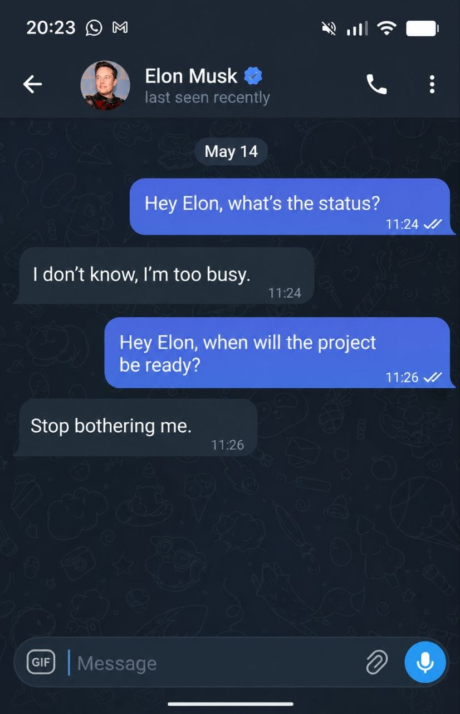
  <figcaption>A generated screenshot - I sent ChatGPT a screenshot of my Telegram and asked for the same conversation with Elon Musk.</figcaption>
  <!-- Concrete proof of how well the image model reproduces a real app's look, which is the foundation of the whole mockup-first approach -->
</figure>

So the obvious next thought was: instead of describing the redesign to a coding agent in words, what if I showed it a picture?

## Mockup first, then code

The approach I landed on was different from how I usually do front-end work. First, I asked ChatGPT to generate how the site should look. Then, based on those mockups - based on the image - I did the layout.[^4]

After several iterations I got something fairly cute, something I liked. Then I told the agent: okay, here is our design idea, here is the desktop version, here is the mobile version, I want everything in this same style. It produced something similar, and I liked it.[^15]

So the loop is:

1. Describe to ChatGPT what kind of site I want and what should be on it
2. ChatGPT generates a mockup image of how the site should look
3. Hand that image to a code agent and ask it to implement the layout based on the picture

The mockup acts as the spec. Instead of describing the layout in words, the agent has the picture to match.

One thing I noticed while iterating with GPT-5: when you generate images, after a while it forgets about the screenshots you gave it. The first screenshot will not necessarily produce something similar, and that is fine. The idea is that when you ask ChatGPT to generate a screenshot or a design, you are just setting the direction - roughly how you want it to look. It will not look like the final product. You are using it to point the way, not to ship the exact pixels.[^15]

## Generating mockups per page

I asked ChatGPT to generate every photo. First I gave it a description of what was on the site, and then for each page I asked it to generate a web version and a mobile version.[^7]

I iterated on the pictures until I got something I liked. The course dashboard and the homework page each went through their own loop of "make it look like this, change that" until the mockup matched what I had in mind.

<figure>
  
  <figcaption>One of the ChatGPT mockups for the course dashboard page - homework list with status pills and a projects section</figcaption>
  <!-- Shows what a generated mockup looks like before it goes to the code agent -->
</figure>

<figure>
  
  <figcaption>Mobile version of the homework page mockup - I asked ChatGPT for both desktop and mobile per page</figcaption>
  <!-- Shows that the per-page mockup loop produced both web and mobile variants -->
</figure>

## Choosing a design system

After playing with the mockups, I noticed a different problem: there was no consistent system. I had heard from designers I used to work with that they have design systems - reusable components and rules about how things should be laid out on a page.[^16]

So I told Codex: what if we pick a design system now? We have these mockups and a rough sense of where we are going, but the pages are all different and there is no single style. Let's make a design style. Codex said yes, we can make a design style, but what if we choose one that already exists? I said that was a great idea and asked it to think about which design system would suit us best. It proposed several, and in the end we chose GitHub.[^16]

I cannot say it turned out to be a copy of GitHub - if you look, it is not. But some things are traceable. The idea was that we took GitHub as a basis, took some of its design decisions (how buttons should look, how components should look), and prepared a design guidelines document. That document is how the agents should make decisions when they design a page.[^16]

<figure>
  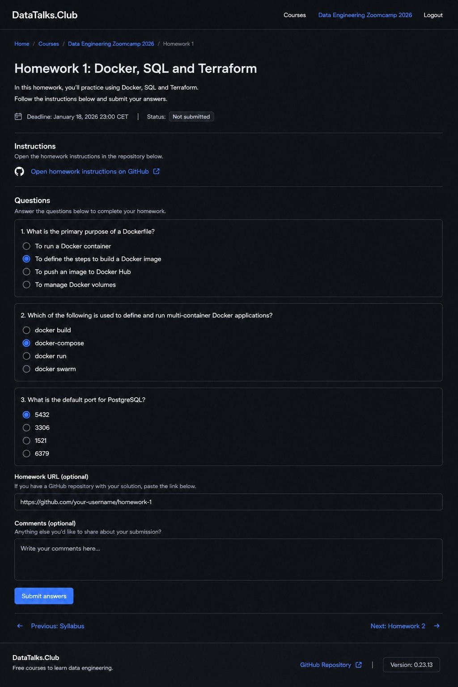
  <figcaption>A dark-theme variant from the iteration loop - one of the style directions explored before the code agent picked up the final look</figcaption>
  <!-- Shows that iteration also covered different style directions, not just layout -->
</figure>

## Polishing the details in code

That was not the end of it - there was still a lot of work. But things were already better. From there I could open each page and say: I do not like this here, move this over there, too much padding here, too little there. Overall I liked the direction we were moving in, and what was left was only the details.[^20]

So how did I reach that direction? By generating the mockups first, then asking the agent to pick a design reference (GitHub in this case), then having it compose a design system specifically for our platform based on the best practices of existing companies, and only then opening each page to move elements around so it looked nice.[^20]

You can't make those pointwise changes through the mockup generator, because if you ask the screenshot tool to move a single element it redoes the whole screenshot. Targeted edits are very hard through a generator like that. The mockup sets the direction; the agent implements it; then you polish in code.[^8]

So the workflow that emerged is:

1. Generate mockups to fix the rough style direction.
2. Have the code agent build a site that more or less matches the mockup.
3. Have the agent pick a design reference and write a design-guidelines doc from it.
4. Polish the small details directly in the code.

<figure>
  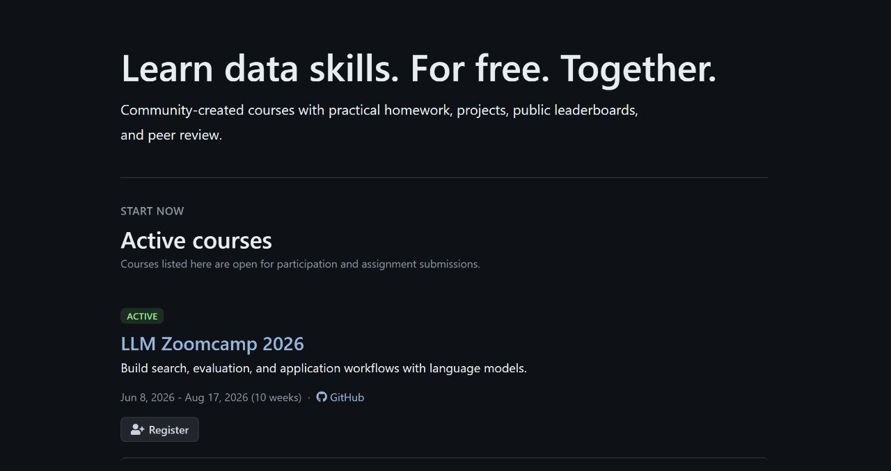
  <figcaption>The course management site after the redesign, with LLM Zoomcamp 2026 highlighted under Active courses</figcaption>
  <!-- The end result of the workflow on the original project - clean and consistent -->
</figure>

I have not finished the redesign - there is actually still a lot to change and many places I do not like. But the point is that the direction is there, the general look is one I like, and the design guidelines exist. What remains is to sit down and finish all the pages. The public pages already look more or less fine. What I still have to work on are the non-public pages of the course management platform. Overall I really like how it looks now - clean and neat.[^17]

## Applying the approach to other projects

Because I liked this approach so much, I started using it for other things, so that the code does not come out looking awful and the design is not an eyesore.[^17]

For the web I will not go into detail. The key point is that you do not even need screenshots. You can just tell the agent in the project: let's make a design system, which design system would suit our project best? The agent will propose some options, you pick one, and then you say: now let's document this. That alone already helps a lot - the interfaces it creates will be better and will need fewer changes.[^17]

With a screenshot it is even better, because you yourself will have an understanding of where the elements should go. The agent does not have to decide that, and you do not have to spend a long time moving everything around afterward. But screenshots generate slowly and moving individual elements through them is hard, so they are mostly there to set the direction. The agent implements it, and then you finish it off, saying what to change, where to put things, and what to fix.[^17]

## Applying it to an Android app: Pocket Shell

I started trying this approach on other apps too. Right now I am working on an app that lets me manage agents from my phone. I call it Pocket Shell. As soon as I reached the first level of functionality that more or less worked, the interface was so-so. I did the same thing: I said, look, here is our interface, I do not like it, I want to change it, let's pick a style. What helped was the same loop - I went to ChatGPT, said this is how I see it, let's implement this, and the implementation brought the interface closer to what I wanted.[^18]

<figure>
  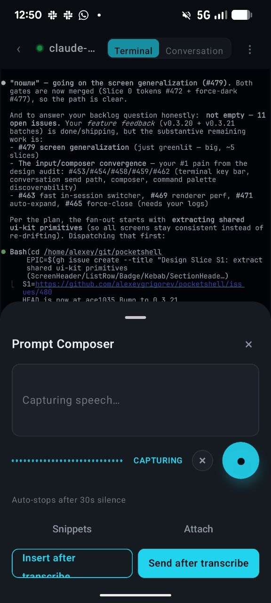
  <figcaption>How Pocket Shell looked before - the agent conversation screen[^21]</figcaption>
  <!-- The starting point on the Android app, before applying the mockup-first approach -->
</figure>

<figure>
  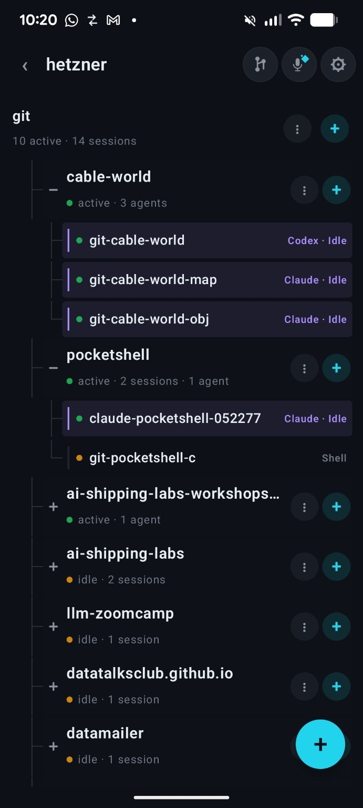
  <figcaption>How Pocket Shell looked before - the projects list</figcaption>
  <!-- The other "before" screen the user explicitly paired with the conversation view -->
</figure>

This took many iterations. The problem specifically with Android is feedback speed. For the web you can change something, reload the page, and immediately see the result - or, with Vite, even without a reload you see the elements move on screen in real time as you tell the agent what to change. With Android there is none of that.[^18]

What helped was a screenshot tool that lets you take a picture of any screen, so you do not have to go through the long fiddling with building an APK. It just produces a picture, and from that picture you can iterate much faster than before.[^18]

I had never written Android before, but now there was a need. The best part is that the things that work for web design also work for Android. My approach is the same: I generate some initial image myself to roughly figure out how it should look. Talking with ChatGPT helps me understand how I want the interface to look. It generates an image, I throw that image to the agents and say "implement this here", they implement it, and then I start moving the picture, the buttons, and so on, to get what I want.[^18]

<figure>
  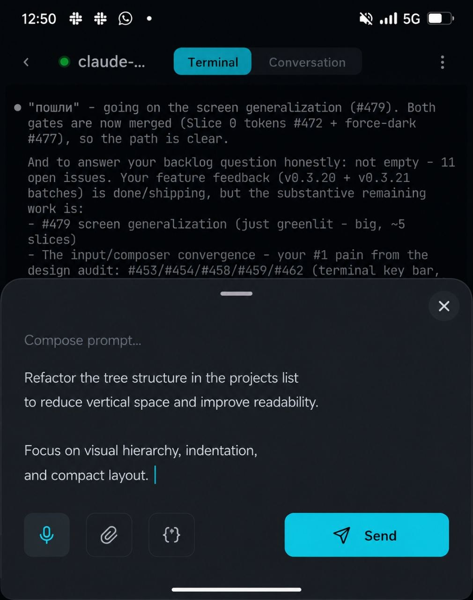
  <figcaption>What I arrived at with ChatGPT after many iterations - the conversation screen mockup. <a href="https://chatgpt.com/s/m_6a270e24c37c8191ae0bd71fd2170434">The generation</a>.</figcaption>
  <!-- The generated target for the conversation screen - not the final product, just the direction -->
</figure>

<figure>
  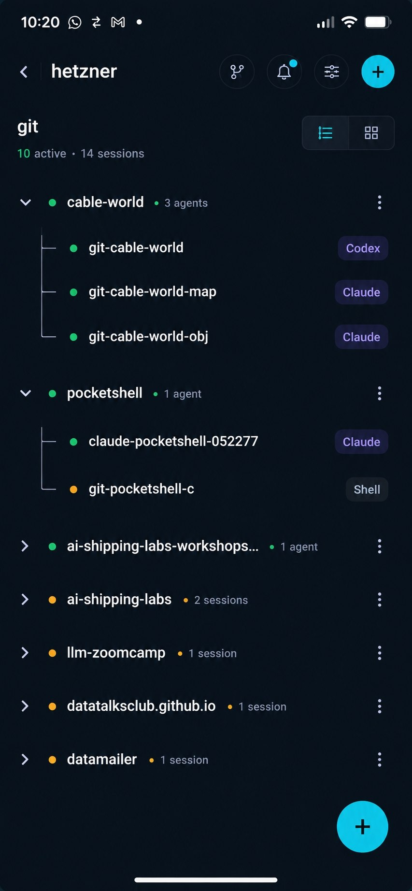
  <figcaption>What I arrived at with ChatGPT for the projects list - cleaner hierarchy, more compact rows</figcaption>
  <!-- The generated target for the projects list, paired with the conversation mockup -->
</figure>

These mockups are not the final result - they are what I arrived at with ChatGPT to set the direction.[^19]

From there the code agent implemented the changes, and I polished from the picture - for example, refactoring the tree structure in the projects list to reduce vertical space and improve readability, focusing on visual hierarchy, indentation, and a compact layout.[^18]

<figure>
  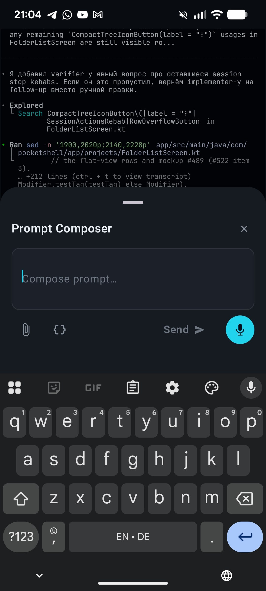
  <figcaption>The coding agent working through the implementation details after the mockup set the direction</figcaption>
  <!-- Illustrates the "agent implements, then you polish in code" step on the Android app -->
</figure>

<figure>
  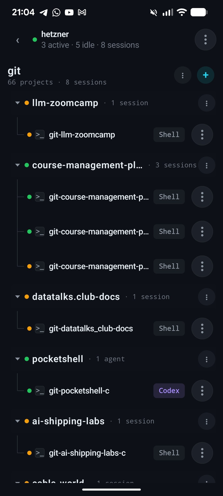
  <figcaption>The result now - still room for improvement (like removing the dots from everywhere), but this is the current state</figcaption>
  <!-- The implemented result on Android, closing the before/mockup/after arc -->
</figure>

## Why this beats one-shotting it

Both problems from the start of this article come from the same move: handing the whole design to AI in one shot and accepting what comes back. This approach splits that move apart.

Generating a mockup first deals with the visual half. I decide what the page should look like and hand the agent a picture to match, so it does not fall back on the feature grid, the buttons on the right, or the dense columns. I am the one setting the direction, not the model - which is also what keeps it from looking like every other one-shot site.

The design system deals with the other half - the part where everything rots as you keep building on it. Once there is a guidelines document, every new page follows the same rules, so the site stays consistent instead of drifting into a mess one screen at a time.

And none of this is specific to the DTC platform, or even to the web. The same loop took an Android app I had no idea how to design and made it into something I would actually want to use. I am still not a designer. But this is how I get a result that looks pleasant and not generic, instead of slop.

## Sources

[^4]: [20260519_082455_AlexeyDTC_msg4175_transcript.txt](../inbox/used/20260519_082455_AlexeyDTC_msg4175_transcript.txt) - voice note on the mockup-first approach
[^7]: [20260519_085055_AlexeyDTC_msg4202_transcript.txt](../inbox/used/20260519_085055_AlexeyDTC_msg4202_transcript.txt) - voice note on asking ChatGPT for web and mobile versions of each page and iterating on the pictures
[^8]: [20260519_085551_AlexeyDTC_msg4204_transcript.txt](../inbox/used/20260519_085551_AlexeyDTC_msg4204_transcript.txt) - voice note on Codex turning the mockups into the site, then polishing small things in code with a style-guidelines doc
[^9]: [20260608_181334_AlexeyDTC_msg4469_transcript.txt](../inbox/used/20260608_181334_AlexeyDTC_msg4469_transcript.txt) - voice note framing the article: AI slop, being a non-designer, and his approach to design
[^10]: [20260608_181425_AlexeyDTC_msg4471_transcript.txt](../inbox/used/20260608_181425_AlexeyDTC_msg4471_transcript.txt) - voice note on GPT Image 2 generating designs and screenshots ("this is not a screenshot")
[^11]: [20260608_183324_AlexeyDTC_msg4485_transcript.txt](../inbox/used/20260608_183324_AlexeyDTC_msg4485_transcript.txt) - voice note on the generated Elon Musk screenshot example
[^12]: [20260608_181650_AlexeyDTC_msg4473_transcript.txt](../inbox/used/20260608_181650_AlexeyDTC_msg4473_transcript.txt) - voice note on the long-standing Tailwind migration issue
[^13]: [20260608_181745_AlexeyDTC_msg4475.md](../inbox/used/20260608_181745_AlexeyDTC_msg4475.md) - link to the Tailwind migration issue
[^14]: [20260608_182129_AlexeyDTC_msg4477_transcript.txt](../inbox/used/20260608_182129_AlexeyDTC_msg4477_transcript.txt) - voice note on the platform's Bootstrap history and throwing the issue at Codex as an experiment
[^15]: [20260608_183015_AlexeyDTC_msg4479_transcript.txt](../inbox/used/20260608_183015_AlexeyDTC_msg4479_transcript.txt) - voice note on generating designs with GPT-5, mockups setting direction, and it forgetting screenshots over time
[^16]: [20260608_183015_AlexeyDTC_msg4479_transcript.txt](../inbox/used/20260608_183015_AlexeyDTC_msg4479_transcript.txt) - voice note on choosing a design system, picking GitHub as a reference, and writing design guidelines
[^17]: [20260608_183601_AlexeyDTC_msg4487_transcript.txt](../inbox/used/20260608_183601_AlexeyDTC_msg4487_transcript.txt) - voice note on the unfinished state, applying the approach to other projects, and the design-system-without-screenshots variant
[^18]: [20260608_183921_AlexeyDTC_msg4489_transcript.txt](../inbox/used/20260608_183921_AlexeyDTC_msg4489_transcript.txt) - voice note on applying the approach to the Pocket Shell Android app and the screenshot-tool feedback loop
[^19]: [20260608_184726_AlexeyDTC_msg4503_transcript.txt](../inbox/used/20260608_184726_AlexeyDTC_msg4503_transcript.txt) - voice note that the Pocket Shell mockups are what he arrived at with ChatGPT, not the final result
[^20]: [20260608_183151_AlexeyDTC_msg4481_transcript.txt](../inbox/used/20260608_183151_AlexeyDTC_msg4481_transcript.txt) - voice note on opening each page to move elements and how the direction was achieved (mockups, design reference, design system, then polishing)
[^21]: [20260608_184455_AlexeyDTC_msg4497_transcript.txt](../inbox/used/20260608_184455_AlexeyDTC_msg4497_transcript.txt) - voice note: "these two pictures are how the app looked" (the Pocket Shell before screens), then he sent the ChatGPT-generated versions
[^22]: [20260609_072934_AlexeyDTC_msg4513_photo.md](../inbox/used/20260609_072934_AlexeyDTC_msg4513_photo.md) - screenshot with caption: AI likes to put these buttons on the right, so he corrects it to move them under
[^23]: [20260609_073226_AlexeyDTC_msg4515_photo.md](../inbox/used/20260609_073226_AlexeyDTC_msg4515_photo.md) - screenshot with caption: columns that sometimes make the UI too dense
[^24]: [20260609_073226_AlexeyDTC_msg4516_photo.md](../inbox/used/20260609_073226_AlexeyDTC_msg4516_photo.md) - screenshot: another page with the dense-column layout
[^25]: [20260609_074637_AlexeyDTC_msg4519_photo.md](../inbox/used/20260609_074637_AlexeyDTC_msg4519_photo.md) - screenshot with caption: typical AI design (the feature grid)
