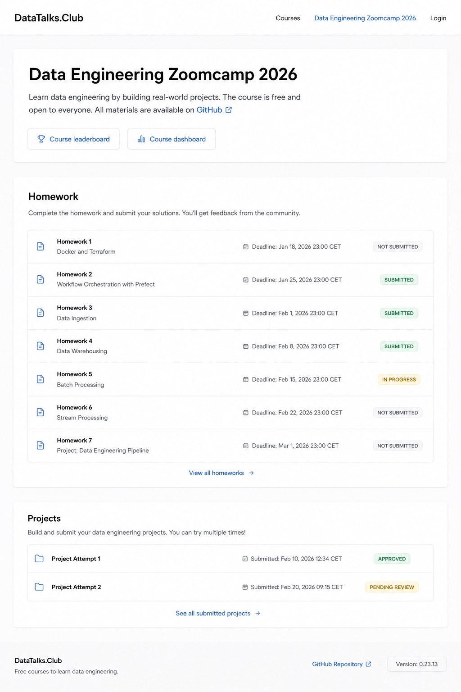
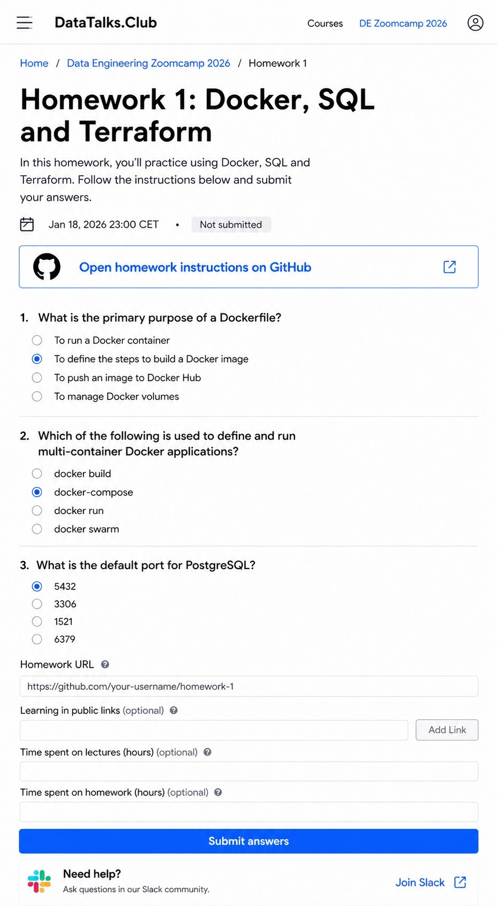

# Redesigning the DataTalks.Club Course Platform with ChatGPT Mockups

The design on the DataTalks.Club courses site is much nicer now.[^1][^2][^3] I want to write a post about how I got there, because the approach was different from how I usually do front-end work.[^6]

<figure>
  
  <figcaption>The course management site after the redesign, with LLM Zoomcamp 2026 highlighted under Active courses</figcaption>
  <!-- The end result the post is about - shown up front so the reader sees what the workflow produced -->
</figure>

## Mockup first, then code

I used an interesting approach. First, I asked ChatGPT to generate how the site should look. Then, based on those mockups - based on the image - I did the layout.[^4]

ChatGPT now generates great screenshots. I can say: I want a site in this format, with this content, please make me a mockup. It does that very well, and the result looks beautiful.[^5]

So the loop is:

1. Describe to ChatGPT what kind of site I want and what should be on it
2. ChatGPT generates a mockup image of how the site should look
3. Hand that image to a code agent and ask it to implement the layout based on the picture

The mockup acts as the spec. Instead of describing the layout in words, the agent has the picture to match.

## Generating mockups per page

I asked ChatGPT to generate every photo. First I gave it a description of what was on the site, and then for each page I asked it to generate a web version and a mobile version.[^7]

I iterated on the pictures until I got something I liked. The course dashboard and the homework page each went through their own loop of "make it look like this, change that" until the mockup matched what I had in mind.

<figure>
  
  <figcaption>One of the ChatGPT mockups for the course dashboard page - homework list with status pills and a projects section</figcaption>
  <!-- Shows what a generated mockup looks like before it goes to the code agent -->
</figure>

<figure>
  
  <figcaption>Mobile version of the homework page mockup - I asked ChatGPT for both desktop and mobile per page</figcaption>
  <!-- Shows that the per-page mockup loop produced both web and mobile variants -->
</figure>

## From mockup to code

After the mockups were generated, Codex turned them into the site. Not everything was perfect, so I made small fixes directly in the code from what we got - move this here, change that, this padding is too big, this one is too small.[^8]

You can't make those pointwise changes through the mockup generator, because if you ask the screenshot tool to move a single element it redoes the whole screenshot. Targeted edits are very hard through a generator like that.

So the workflow that emerged is:

1. Generate mockups to fix the rough style direction.
2. Have the code agent build a site that more or less matches the mockup.
3. Write a style-guidelines doc (I'll try to find the prompt I used to set the guidelines).
4. Polish the small details directly in the code.

<figure>
  
  <figcaption>A dark-theme variant from the iteration loop - one of the style directions explored before the code agent picked up the final look</figcaption>
  <!-- Shows that iteration also covered different style directions, not just layout -->
</figure>

## What I ran it on

I used this approach to refresh the DataTalks.Club course management platform. I had a team of Codex agents working on moving the site to Tailwind and updating the visuals. The mockup-first step is what got the design itself moving - once ChatGPT produced a mockup I liked, the code agents had a concrete target to reproduce.

## Sources

[^1]: [20260519_082455_AlexeyDTC_msg4172.md](../inbox/used/20260519_082455_AlexeyDTC_msg4172.md) - "by the way, the design on the courses site has become nicer"
[^2]: [20260519_082455_AlexeyDTC_msg4173.md](../inbox/used/20260519_082455_AlexeyDTC_msg4173.md) - "should make a post about this"
[^3]: [20260519_082455_AlexeyDTC_msg4174.md](../inbox/used/20260519_082455_AlexeyDTC_msg4174.md) - "I mean a Substack article"
[^4]: [20260519_082455_AlexeyDTC_msg4175_transcript.txt](../inbox/used/20260519_082455_AlexeyDTC_msg4175_transcript.txt) - voice note on the mockup-first approach
[^5]: [20260519_082455_AlexeyDTC_msg4176_transcript.txt](../inbox/used/20260519_082455_AlexeyDTC_msg4176_transcript.txt) - voice note on ChatGPT generating clean mockups from a description
[^6]: [20260519_082512_AlexeyDTC_msg4182_transcript.txt](../inbox/used/20260519_082512_AlexeyDTC_msg4182_transcript.txt) - voice note asking for a new article about the course management platform UI redesign
[^7]: [20260519_085055_AlexeyDTC_msg4202_transcript.txt](../inbox/used/20260519_085055_AlexeyDTC_msg4202_transcript.txt) - voice note on asking ChatGPT for web and mobile versions of each page and iterating on the pictures
[^8]: [20260519_085551_AlexeyDTC_msg4204_transcript.txt](../inbox/used/20260519_085551_AlexeyDTC_msg4204_transcript.txt) - voice note on Codex turning the mockups into the site, then polishing small things in code with a style-guidelines doc
