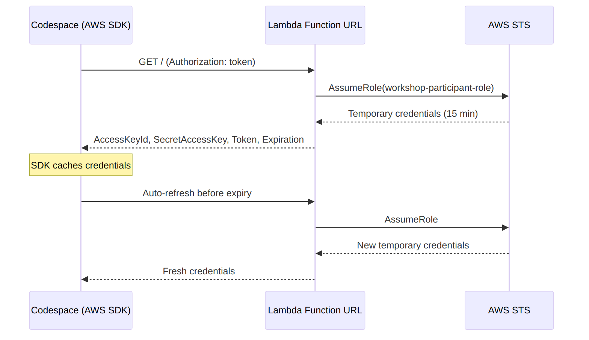

# Exasol Workshop Infrastructure Setup

Preparing for a Tuesday workshop with Exasol. The main challenge is that everyone needs the same infrastructure, and some participants will come without their own AWS account. They need to create their own Exasol Personal instance, which requires AWS access.

The project is open source: [aws-credentials-vending-machine](https://github.com/alexeygrigorev/aws-credentials-vending-machine)[^5].

## Risk of giving out AWS keys

Giving AWS keys directly to workshop participants is risky. They could use the keys to create EC2 instances, mine bitcoin, or do anything else. The key could also leak.

## Instance-profile mechanism outside AWS

I want to replicate the AWS instance profile mechanism but outside of AWS, for use with GitHub Codespaces.

With instance profiles, if something happens, the key cannot leak. Even if someone gets onto the machine, they can only do what is available from that machine. The keys are temporary and have a short lifespan - something like 5-10 minutes.

The solution uses a Lambda function that issues temporary credentials by creating temporary sessions. The AWS CLI requests a key first, then uses it, and stores everything locally. This is essentially the same mechanism as instance profiles, just not tied to EC2 instances.

## How It Works

The trick is using `AWS_CONTAINER_CREDENTIALS_FULL_URI` - an environment variable that all AWS SDKs already support natively. Normally this is used by ECS containers to get credentials, but it works anywhere. Point it at a Lambda function URL and every AWS SDK call automatically fetches and refreshes credentials from that endpoint. No custom client code is needed.

The system has a few components:

- A Lambda function that validates a bearer token and calls STS AssumeRole to return 15-minute temporary credentials
- A CloudFormation template that sets up the Lambda, the workshop participant IAM role (with EC2, S3, VPC permissions), and the function URL
- A token rotation script that generates a new token, updates the stack, encrypts the token, and commits it to the workshop repo
- A workshop starter repo (as a git submodule) with a DevContainer setup for participants

The Lambda function URL is publicly accessible (no IAM auth on the URL). Security relies on the bearer token check inside the Lambda code. This is necessary because the ECS credential protocol sends a simple HTTP GET with a bearer token, not IAM-signed requests.

## DevContainers and Codespaces

Everything is set up in DevContainers so that when participants create a Codespace, all the necessary settings are already there. Participants just need to press a button and everything works.

To get AWS access from the Codespace, two things are needed: a URL and a token.

## Token Security

The token should not be published openly on the internet - someone could find the repository, use the token, and get access to start mining bitcoin.

Encrypt the token and store it in the repository in encrypted form. The decryption key (passphrase) is given to participants during the workshop session. At the start of the workshop, participants are told to clone the repository, go to settings, and create a secret with the passphrase.

This minimizes the damage window. During the workshop, people could potentially misuse the access, but the window is only 1.5 hours. The probability of malicious hackers attending a workshop to mine bitcoin instead of learning is quite low.

On top of that, the Exasol team will monitor the account status and shut down any suspicious activity.

## Participant Setup Flow

The participant experience is straightforward:

1. Set the `WORKSHOP_PASSPHRASE` as a personal GitHub Codespaces secret (one-time setup)
2. Open a Codespace from the workshop starter repo
3. On container start, a `.bashrc` hook decrypts the token using the passphrase and sets the credential environment variables
4. All AWS SDK calls (boto3, AWS CLI) automatically hit the Lambda URL and get temporary credentials

The `.bashrc` hook runs on every shell open, not just at container creation. This means credentials work even if the Codespace is stopped and restarted.

For token rotation, there is a single script that handles the full lifecycle - generate a new random token, update the AWS stack, encrypt the token with the passphrase, update `devcontainer.json`, commit, and push. This makes it practical to rotate before every workshop[^5].

## Credential Flow

The Codespace uses the AWS SDK to request temporary credentials from the Lambda function. The Lambda calls AWS STS to assume a workshop participant role and returns short-lived credentials (15 minutes). The SDK caches these credentials and auto-refreshes them before expiry[^2][^3].

<figure>
  
  <figcaption>Credential flow: Codespace requests temporary AWS credentials via Lambda, which calls STS to assume a workshop participant role</figcaption>
  <!-- Rendered from the mermaid diagram I drew, showing the full request-response cycle for temporary credential issuance and auto-refresh -->
</figure>

## Workshop Results

The workshop ran successfully. The temporary credential system worked as planned - participants got AWS access from Codespaces without receiving direct AWS keys. After the workshop, the Lambda function is simply disabled, cutting off all access[^2][^3].

A separate video recording is being prepared since the live workshop recording did not come out well. This can be shared in the newsletter[^4].

## Sources

[^1]: [20260306_162155_AlexeyDTC_msg2776_transcript.txt](../inbox/used/20260306_162155_AlexeyDTC_msg2776_transcript.txt)
[^2]: [20260311_192843_AlexeyDTC_msg2818_transcript.txt](../inbox/used/20260311_192843_AlexeyDTC_msg2818_transcript.txt)
[^3]: [20260311_192913_AlexeyDTC_msg2822_transcript.txt](../inbox/used/20260311_192913_AlexeyDTC_msg2822_transcript.txt)
[^4]: [20260311_192843_AlexeyDTC_msg2819_transcript.txt](../inbox/used/20260311_192843_AlexeyDTC_msg2819_transcript.txt)
[^5]: [20260312_042909_AlexeyDTC_msg2840.md](../inbox/used/20260312_042909_AlexeyDTC_msg2840.md)
