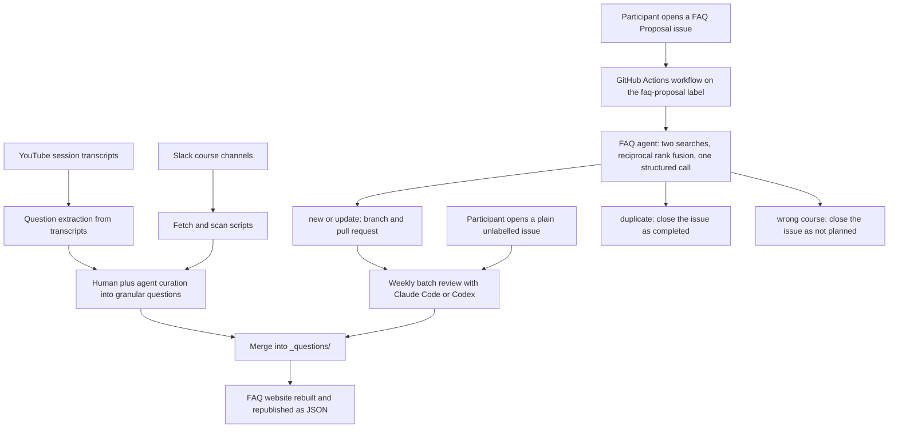
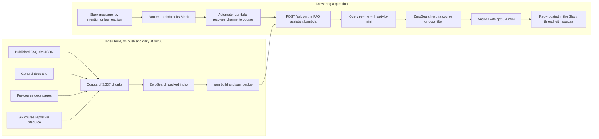
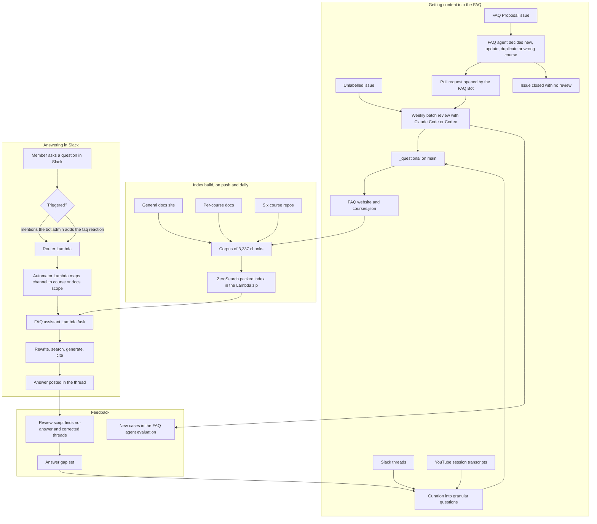

# Taking Over the FAQ Assistant: How the Whole Process Works Now

This is a continuation of [From Google Docs to an Automated FAQ System for DataTalks.Club Courses](https://alexeyondata.substack.com/p/from-google-docs-to-an-automated). Things have changed since that article, and I want to write a full article about how the whole process works now. In this post I want to tell you what I did and how everything works for me at the moment[^2].

It is also a continuation of [Building and Maintaining a Slack Moderation Bot for an 88k-Member Community](https://alexeyondata.substack.com/p/building-and-maintaining-a-slack). Automator, the Slack bot from that article, already existed. I did not build a new bot for the FAQ - I used the existing infrastructure to add a new thing on top of it[^9].

The previous FAQ assistant was maintained by Alex Litvinov, who I wrote about in that article. Periodically things happened and I had to pull Alex in and ask him to fix them. That was inconvenient. In the end Alex and I agreed that I can take this project on myself and start moving it onto different infrastructure - DataTalks.Club infrastructure - so that it is easier for me to solve whatever problems come up without involving Alex[^2].

The post has two parts, matching the two parts of the system[^3]:

1. The part that automates filling the FAQ with new questions
2. The RAG itself - the retrieval side, and the Slack bot that answers with it

There is a bit of RAG in the first part too[^3].

The split is also a split across two repositories. [DataTalksClub/faq](https://github.com/DataTalksClub/faq) holds the FAQ content in `_questions/`, the GitHub-issue-to-pull-request agent, and the website. [DataTalksClub/faq-assistant](https://github.com/DataTalksClub/faq-assistant) [^11] holds the Slack answering bot that runs on Lambda, the search index build, and the retrieval evaluations.

## What it used to take

Before the handover, the assistant was a long-running Slack Bolt app in socket mode, hosted on Fly.io. Retrieval went through Milvus, running locally for development and on Zilliz Cloud in production - across two different Zilliz accounts, selected by an environment flag, with four separate collections and four separate query engines, one per course, routed by Slack channel id.

Ingestion had three readers: the FAQ from GitHub, Slack history, and YouTube transcripts. Each course had its own ingest entrypoint, each running on its own weekly cron through a Docker image built by another workflow. The video ids were maintained by hand inside those scripts, so every new session meant a code change.

The runtime path touched OpenAI for generation, Cohere for reranking, HuggingFace embeddings, Upstash Redis as an embeddings cache, and LangSmith for feedback logging. On top of that it cost money, Alex paid for it, and it periodically ran out of credit and had to be topped up. He was the one paying, and I was not sure that was fine in the long term[^10].

That is the "before" picture. Everything below is what replaced it.

## Part 1: How questions get into the FAQ

### Source one: people creating issues

The first source for adding to the FAQ is people. Anyone can create an issue. I already wrote about this in the previous issue, but the general process is that the issue goes through something RAG-like, and then automation takes over[^3].

Concretely, there is an issue template called FAQ Proposal which auto-labels the issue and asks for the course through a dropdown. A workflow fires on issue creation, gated on that label. It parses the course, question and answer out of the issue body, and the agent builds a search index over that one course's existing entries. It searches twice - once with the question alone, once with the full question and answer proposal - fuses the two result lists with reciprocal rank fusion, and then makes a single structured call that returns one of four actions: new, update, duplicate, or wrong course, along with a rationale, the section, a filename slug and an order.

The workflow branches on the action. New and update create a branch, commit as the FAQ Bot account, and open a pull request that closes the issue. Duplicate closes the issue as completed. Wrong course closes it as not planned.

I process the results with Claude Code or Codex - with assistants. A skill shows me the pull request, and I decide what to do with it: merge it or not[^3].

### Source two: issues that ignore the contribution guide

Some course participants, instead of studying the contribution guide and creating an issue with the right tag and the right format, just create an issue in the FAQ with a plain description. I process those as well[^4].

These carry no label, so the workflow never fires on them. They get handled by hand in the same batch pass as the pull requests.

### Source three: Slack

The third source I take from Slack[^4]. There are two paths into it, and neither of them goes through the FAQ Proposal agent.

The first path is proactive mining. A skill drives a fetcher that pulls a course channel's history for a time window, including thread replies - most of the real question and answer traffic lives in replies rather than in root messages. The channel comes from the course metadata file, so the skill only needs a course name. It keeps a small log file with the date of the last run per course, and computes the window from that with a deliberate one-day overlap, because a gap would silently drop messages. The export lands as paired JSON and markdown in a scratch directory that is never committed.

Selection is me plus the agent reading the export. There is no scoring and no classifier. The rules that matter are about granularity: each candidate has to be one independently answerable question, questions that cover several dimensions get split even when they came from a single thread, and no umbrella entries. Candidates get presented and resolved one at a time. A question does not have to recur to be worth adding.

The second path is reactive, and it runs from the answering side rather than the content side. A review script scans the course channels for threads where the bot was triggered, and flags two failure modes: the bot replied with its "I could not find this" fallback, or the bot answered and then I replied afterwards. Both mean the FAQ is missing something. The instructor follow-up in the thread is the correct answer, and it becomes a new FAQ entry.

Either way the result is a direct commit to `main` in the FAQ repo. There is no pull request and no second reviewer for Slack-sourced entries - the curation is the review.

### Source four: YouTube sessions

The fourth source is the sessions we run on YouTube: course launch streams, pre-course question and answer sessions, module streams, workshops[^7].

This is transcript-based, but it is the opposite of what the old bot did with YouTube. The old system chunked transcripts into a vector index and retrieved raw snippets with a timestamped deep link. What happens now is extraction: the transcript gets read for the questions participants actually asked during the session, and each one comes out as a question, an answer, the timestamp in the video, and the verbatim transcript quote that supports it. Sessions where nobody asked anything produce nothing.

The extracted set then gets curated by hand and written into `_questions/` as ordinary FAQ entries. The Stock Markets Analytics course got 67 entries this way, from the 2024 and 2025 cohort module streams, the pre-launch question and answer sessions, and the time-series workshop. The AI Dev Tools launch stream produced 7.

There is one detail I like here: the launch and pre-course streams being mined this way are the same videos the old bot used to index as raw transcript chunks. The same material, turned from a retrieval liability into curated content.

This source is the least automated of the four. It runs at launch time, as a batch, with throwaway tooling rather than a committed script or workflow.

### The batch flow

The flow now looks like this[^4]:

1. A course participant creates an issue
2. The automation creates a pull request from that issue
3. Once a week or once every two weeks I do a batch and process them
4. For each pull request, Codex or Claude Code tells me whether everything is fine, whether the category or the section needs to be changed, whether anything in the pull request needs fixing, and also whether this case can be added to the evaluation set and why

Correcting an answer is no longer a manual edit followed by a manual test run. The agent takes the correction, fixes the content, commits it to the right repositories, and reports back what it changed and what it verified[^1].

<figure>
  
  <figcaption>An Automator run correcting the certificate requirement in the FAQ</figcaption>
  <!-- Concrete example of the correction workflow described above: a correction goes in, the agent commits it across the faq and faq-assistant repos and reports the test results -->
</figure>

The run in the screenshot corrected a clarification about certificate requirements: the certificate requires completing the capstone project and the required peer reviews, homework is not required, and the evaluation case was reclassified as incomplete with the corrected expectation. It produced two commits - `09c95d5` in the faq repo clarifying the LLM peer review requirement, and `353810d` in the faq-assistant repo correcting the certificate evaluation expectation. Validation ran 45 assistant tests, 39 FAQ unit tests, and 26 FAQ integration tests, all passing, with nothing pushed[^1].

### What the automation is allowed to do on its own

The asymmetry is worth stating explicitly, because it drives what the evaluation optimises for.

The agent can close an issue with no review at all. Duplicate and wrong-course decisions take effect immediately. Everything the agent writes, on the other hand, arrives as a pull request that I look at before merging, and the bot never commits to `main`. Reviewing happens strictly one item at a time, with explicit approval before editing, merging or closing - no bulk operations.

For the Slack and YouTube sources the curation happens before anything is written, and then the commit goes straight to `main`. When an assistant does the writing, publishing is still a step I have to approve.

### Part 1 as a diagram



### Evaluating the FAQ agent

I want this agent to work well, and for that you obviously need a reliable evaluation set[^3].

How I composed it: we took all the issues and pull requests. If I changed something in a pull request, that means the agent did something wrong. So we identified several special cases - not the frequent, general ones - and for each of these cases found several representative examples. That is how the evaluation set was made[^3].

The evaluation set is built in an interesting way. The issues have already been merged, so if a question is already in our dataset then, with the agent working correctly, it will always come out as a duplicate. So what we do instead: we take the record, take our data, take the issue that was created, remove that record, and check that the agent then makes the right decision[^3].

In the runner this is a leave-one-out setup. It copies the course directory to a temporary directory, deletes the markdown files matching the case's target document plus any explicitly hidden documents, and builds the agent over the reduced corpus - while keeping the course catalog complete, so wrong-course detection still works. Duplicate cases run against the full index instead, which is the mirror image of the same test.

The cases are hand-written Python dataclasses rather than data files, and the case id carries meaning: a positive id is the real GitHub issue number, a negative id is a synthetic case. They come from listing all issues with the `faq-proposal` label, plus correction commits - commits where a human had to fix the bot's output after a merge. There are currently 61 cases in the agent evaluation: 38 expecting a new entry, 10 duplicates, 7 wrong-course, 4 not-wrong-course and 2 updates.

A separate retrieval-only evaluation sits underneath it, with 73 cases, 55 real and 18 synthetic. It runs in a couple of seconds because it involves no LLM call. Not all 73 get scored - cases whose target document has since left the corpus are skipped, which currently leaves 53. On those it records recall@5 of 0.849 and MRR@5 of 0.836.

For every case whose expected action is not wrong-course, the runner prepends an implicit not-wrong-course check. So the whole suite doubles as the false-positive budget, not just the cases written for it. The recorded result there is zero false positives, measured when the suite had 51 cases and 44 of them carried the implicit check. The suite has grown to 61 cases and 54 implicit checks since, and that figure has not been re-measured.

The evaluations do not run in CI in either repository. That is deliberate - they cost money and they are noisy.

I want to keep the evaluation set maximally lean - I want representative cases in there, so I try not to add everything that comes along. But in some cases genuinely new and interesting cases come up that really do need to be added[^4].

### What the evaluation optimises for

Some mistakes are not fatal. If the category is chosen wrong, that is easy to fix, and I do it through Claude Code[^3].

The bad decisions are the other ones: when the agent decides the course is wrong, or in some cases when the pull request does not even fire and never gets created. Those are the worst outcomes. The evaluation is aimed at reducing those cases - false positives where no pull request gets created - to zero. That is the main target[^3].

In the end I chose `gpt-5.4-nano`, because that is the one that helped achieve this result[^3]. The workflow deliberately passes no model argument - the default in `rag_agent.py` is the single source of truth, so production and the evaluations cannot drift apart.

The model comparison behind that choice: across 84 observations, wrongly-closed valid proposals were 15 for `gpt-5-nano`, 12 for `gpt-5.4-nano` and 9 for `gpt-5.6-luna`. On wrong-course recall the numbers were 13 of 35, 7 of 35 and 27 of 35, with zero false positives out of 20 in all three. `gpt-5.4-nano` costs $0.20 per million input tokens and $1.25 per million output tokens, and a full suite run costs around $0.27 against around $1.30 for luna.

`gpt-5.6-luna` looks like the obvious winner on wrong-course recall and was still rejected: its failures on correct-new cases more than double, and they land as updates that silently rewrite good entries. The old `gpt-5-nano` had a different problem - 5 of 7 wrong-course cases flipped between new and wrong-course on byte-identical input.

### Choosing the section

Sections are defined per course in a metadata file as a list of id, name and an optional comment. The comment gets injected into the prompt along with the section list, and the prompt tells the agent to give the comment more weight than the search results when choosing a section. There are 74 sections across 6 courses, 42 of them with a comment. Because the course comes from a dropdown on the issue form and only that one course is loaded, the agent's real choice set on any given run is 9 to 18 sections.

The most useful thing the evaluation surfaced here was about the catch-all section. The intuitive worry is that an agent will dump everything into `misc`. The opposite happened. With `misc` carrying no comment, the agent placed entries correctly 5 times out of 5 everywhere else, but could not use `misc` when `misc` was the right answer - it sent a cross-cutting "Python 3.13 breaks sklearn" question to `module-5` five times out of five. Adding a scoping comment to `misc` took those cases from 10 out of 15 to 15 out of 15. An undescribed section does not attract entries, it repels them.

The comments earn their keep in other ways too. The Data Engineering `workshop-1-dlthub` comment says that questions about dlt go there and not to confuse dlt with dbt, because they are different tools. The `module-7` comment says not to name specific tools like Kafka, PyFlink, Spark Streaming or Redpanda in the section name, because the course's streaming stack changes between cohorts.

## Part 2: Retrieval and automatic replies

The second part is the retrieval itself, the RAG. I did a lot here, because the process Alex had was not so much complex as something I wanted to simplify as much as possible[^5].

Alex handed over all the info and the whole project, and I started thinking about how to deploy it. There was vector search, ingestion from Slack, ingestion from YouTube - a lot of things. The project turned out to be quite complex. There were grounds for that: some historical reasons, and some things just ended up that way over time[^5].

I wanted to simplify it as much as possible. I wanted a serverless architecture, with everything deployed on Lambda[^5].

### Dropping the extra sources

Everything that appears in Slack I curate, and everything that appears on YouTube we curate too. When we have a course launch I add some things to Slack, and many things we add to our documentation. We now have a documentation site where all of this is written down[^5].

So there is no need to index the videos - we already have all of it available in prepared form. I spent quite a lot of effort on curating the YouTube course data, so the need for the other sources falls away[^5].

This is exactly the trade in source four above. The curation work is what buys the right to drop a whole ingestion pipeline.

### Dropping the vector database

Second, I removed the vector database. The retrieval could be improved with it, but it is a lot of hassle. On the course I teach that you need to process this data, and there is a lot to process: you have to store embeddings somewhere, you need a service to store them, and if you compute those embeddings you need somewhere to compute them. In short, serverless does not fit[^5].

For the vector database part, I decided I would probably just use a free option if I needed one at all. We do not strictly need a vector database here - plain text search is enough for this case[^10].

### Why MinSearch did not fit either

Third, MinSearch does not quite fit on Lambda. MinSearch was originally a library written for educational purposes, and only later turned out to be useful more broadly - it is the small search library behind my [RAG workshops and courses](https://alexeyondata.substack.com/p/minsearch-the-small-search-library). Because it was written for educational purposes it uses scikit-learn internally, which in turn pulls in NumPy and SciPy, and there is a dependency on Pandas as well - all heavy libraries[^14]. Those libraries are in every data scientist's standard set, but if we are talking about deploying to Lambda, a lot of problems appear with how to do that at all. It is not a trivial process, you need to use Docker, and in short it becomes very difficult[^5].

### ZeroSearch

So I decided to replace MinSearch. I asked Claude Code or Codex - I do not remember which - to rewrite it completely into zero-dependency Python. I already had an implementation of this inverted-index search in MinSearch, something similar, and we implemented it[^6].

The result is [ZeroSearch](https://github.com/alexeygrigorev/zerosearch): a library with absolutely no dependencies[^12].

The constraint that produced it did not actually come from Lambda. It came from Cloudflare Workers, and from the [Cloudflare Workers Vectorize Agent](https://aishippinglabs.com/workshops/2026-06-17-cloudflare-workers-vectorize-agent) workshop I ran in AI Shipping Labs[^13]. After that workshop I decided to try porting the FAQ assistant to Cloudflare, and that is how ZeroSearch appeared[^14].

What I wanted was a small replacement that runs on Lambda and, as far as possible, would also run on Cloudflare, so it could be done for free. Cloudflare has limits, and I ran into them quickly[^10].

Cloudflare Workers has a particular limitation. Everything there is actually written in JavaScript, and the Python layer is still in beta - it practically does not support any additional libraries. So if you want to write something, you have to write it in pure Python. That was one of the main constraints I noticed[^14].

So I rewrote MinSearch as pure Python, with zero dependencies - zero dependency leading to zero search, hence ZeroSearch[^12]. I decided to try the rewrite, and it basically worked out fine. Now my portfolio of search libraries has one more entry[^14].

There is one shared dependency, because I now have three libraries for search - ZeroSearch, MinSearch and [SQLiteSearch](https://alexeyondata.substack.com/p/how-i-built-sqlitesearch-a-lightweight) - and a common part with stemming appeared across them. I extracted that common stemming part into a separate library, and it is optional for ZeroSearch, for when stemming is needed[^6].

ZeroSearch is made exactly for environments like Lambda, which I love, where you need a minimum of dependencies[^6].

The dependency claim is literal. The `pyproject.toml` of ZeroSearch declares an empty dependency list with the comment "Intentionally empty: standard library only". The only optional extra is `stemming = ["stemlite>=0.1.0"]`, and stemlite itself is also standard library only. Stemlite exists precisely because minsearch, ZeroSearch and SQLiteSearch all needed to normalise words the same way without each carrying its own copy or pulling in a heavyweight NLP stack. It is imported lazily, and only when a stemmer is requested by name.

The Cloudflare port is not where it ended up running. The assistant now runs on Lambda instead, but the library the constraint produced is what made the Lambda deployment simple too.

### Benchmarks

I benchmarked all of this[^6]. There are two separate benchmark efforts, and they answer two different questions.

The first is a speed benchmark inside the ZeroSearch repo, which measures ZeroSearch against its own previous version - the working tree against a git ref - across a search-path optimisation. The dataset is Simple English Wikipedia, sampled to 1,000 and 10,000 articles, with queries sampled from article titles. It records build time, peak memory, serialized artifact size, and search latency at average, median and p95, plus queries per second.

| Sample | Version | Build | Peak memory | Avg search | p95 | QPS |
|--------|---------|-------|-------------|------------|-----|-----|
| 1,000 docs | before | 1.095 s | 51.1 MB | 0.087 ms | 0.337 ms | 11,478 |
| 1,000 docs | after | 1.106 s | 59.3 MB | 0.063 ms | 0.224 ms | 15,791 |
| 10,000 docs | before | 8.277 s | 338.3 MB | 0.875 ms | 2.693 ms | 1,142 |
| 10,000 docs | after | 8.531 s | 371.2 MB | 0.345 ms | 1.467 ms | 2,897 |

Average search latency improved 2.5x on the 100-query run and 1.9x on a longer 100,000-query run, with p95 improving 1.8x to 1.9x. Build time is unchanged, because this was a search-path change and not a build change. The cost is about 1.5 MB more on disk and 33 MB more peak memory during the build. The 10,000-document index has 392,806 vocabulary terms and 3,462,657 postings.

The rankings themselves are identical before and after - matched to a 1e-12 tolerance with zero mismatches, checked across 100 Simple Wikipedia queries, 9,845 unique queries from the long run, and the entire FAQ assistant evaluation corpus.

One methodology detail is worth keeping. Earlier versions of that table timed the index build under `tracemalloc`, which traces every allocation and slowed the build by roughly 4x - an 8.5 second build was being reported as 34 seconds. Build memory is now measured in a separate, untimed run. The same trap showed up in the Node port benchmark, where it made Node look 8x faster than Python when the real gap is 1.8x.

The second benchmark is a relevance benchmark, and it belongs to the evaluation of the automatic replies further down.

### Keeping the index fresh

Then I started thinking about what to do with updating the index. If a record in the FAQ changes, the search needs to reflect it in real time, right away[^6].

The main idea is that I want it to update as fast as possible. So every time an update happens, I completely rebuild the index and push it to Lambda - I deploy a new Lambda[^6].

There is one deploy workflow with three triggers: a push to `main` touching the source, config or build scripts; a daily schedule at 08:00 to pick up new FAQ, docs and repository content; and a manual dispatch. Every run rebuilds the corpus from the live sources, builds the index, and deploys. Push deploys and scheduled deploys are therefore identical, and neither the corpus nor the index is ever committed to git.

The run installs uv, sets up Python 3.14 - which has to match the Lambda runtime, because the index is tagged with the Python version - runs the tests, rebuilds the corpus, compiles the config, builds the index, runs a handler smoke test, then takes AWS credentials via OIDC and runs `sam build` and `sam deploy`.

There is no incremental update path at all. A full rebuild every time is what makes the freshness guarantee simple.

The deployment is a zip-based Lambda through AWS SAM: Python 3.14 on arm64, 256 MB, a 30 second timeout, in eu-west-1. No Docker anywhere - which was the whole point of dropping the scikit-learn stack. The index ships inside the zip rather than from S3. The build step installs ZeroSearch into the artifacts directory, copies the application package in, and copies the `search-index.zsx` file in next to it:

```make
build-FaqWorkerFunction:
	uv pip install --target "$(ARTIFACTS_DIR)" zerosearch==0.4.0
	cp -r src/faq_assistant "$(ARTIFACTS_DIR)/faq_assistant"
	cp artifacts/search/search-index.zsx "$(ARTIFACTS_DIR)/search-index.zsx"
```

S3 is only involved as SAM's ordinary upload bucket. Nothing is fetched from S3 at runtime. The handler loads the index once per container as a module-level lazy singleton.

The corpus comes from four sources: the Slack-curated FAQ pulled from the published site JSON, the general documentation site, per-course documentation pages, and six course GitHub repositories read through the `gitsource` library. That is 3,337 chunk records, about 5.3 MB of JSON, producing an index file of roughly 8 MB. Chunks are 1,800 characters with 150 characters of overlap, and retrieval returns 6 results by default with a minimum score of 0.2.

The runtime dependency list really is just ZeroSearch. The OpenAI call uses `urllib` from the standard library, the structured models are hand-rolled, and there is no pydantic and no requests.

### Fast index loading

I also optimised ZeroSearch so that loading the index happens as fast as possible[^6].

This is a separate piece of work from the search-path optimisation above. When `fit()` runs, it compacts the `Counter` scaffolding into flat `array` buffers in a CSR-style postings layout, and `save` and `load` serialize that packed form through `marshal`, with magic bytes, a format version, a Python version guard and array item-size guards. A prebuilt index then loads in milliseconds instead of re-tokenizing the corpus on startup, and the ranking is bit-identical to the previous format.

The reported figures are about 15 ms to load the packed index at cold start versus about 520 ms for a fresh `fit()`. These are observed numbers rather than benchmark output - unlike the search-path numbers above, there is no checked-in benchmark that measures index load time yet.

### How this hangs off Automator

None of this needed a new Slack bot. Automator already handles the Slack side for the whole 88k-member workspace, so the FAQ assistant plugs into it as one more thing it can do[^9].

The chain is three Lambdas. Slack events go to a router Lambda through API Gateway, which acknowledges within Slack's three-second budget and asynchronously invokes the Automator Lambda. Automator decides what the event means, and for FAQ events it makes a plain HTTP POST to the FAQ assistant's `/ask` endpoint - a Lambda function URL, authenticated with a shared secret header. The request carries the question, a scope, and a course. The response carries the rewritten query, the answer, the sources, and a usage record.

Nothing is imported across the boundary, and no Slack credentials live on the FAQ assistant side. Automator owns Slack; the assistant owns retrieval and generation.

Two things trigger a run.

The first is mentioning the bot. Any user in any channel Automator is in can tag it, and the answer goes into that message's thread - a mention inside a thread answers in the thread, a top-level mention starts one.

The second is newer, and it is the one I like more. I can now trigger the FAQ reaction on a message from someone who did not mention the bot at all, and have the bot help them anyway[^7]. Someone posts a question in a course channel without tagging anything, I add the `:faq:` emoji to it, and the bot reads that message and answers it in the thread. The reaction path is admin-gated - reactions from other users are dropped before they reach the handler.

That emoji used to do something much dumber. Until June it was a static post that pasted a link to the course FAQ page. The same commit that added mention handling turned it into an actual answer.

The bot posts the answer directly in the thread as a normal public message. There is no draft queue and no approval step - once triggered, the reply goes out. If retrieval comes back with nothing above the score threshold, the bot says it could not find this in the course materials and points to the instructors, and it still posts that.

### Answering outside the course channels

The other new thing is that this works outside the course channels too, where it uses the documentation only[^7].

The mechanism is a channel-to-course mapping. Automator resolves the Slack channel id to a channel name, then looks that name up in a course map. If the channel is one of the six course channels, the request goes out with scope `course` and that course id, and retrieval filters to that course's own materials plus the course-agnostic general docs. If the channel is not in the map, the request goes out with scope `docs`, and retrieval filters to the general docs only.

The scope also picks the system prompt and the fallback wording. In a course channel, a question the bot cannot answer gets pointed at the instructors. Outside, it gets pointed at the community managers.

<figure>
  
  <figcaption>A docs-scope answer outside the course channels - the question was never addressed to the bot</figcaption>
  <!-- Shows both new capabilities at once: the reply was triggered on a message that did not mention the bot, and because the channel is not a course channel the answer is built from the documentation only, which is why the single cited source is [docs] Activities -->
</figure>

The question in that thread - when do the next courses start - is not a course question at all, and there is no course FAQ entry that answers it. The answer comes out of the documentation: the courses section, the main events page, the Luma subscription and the Google calendar. The single citation under it is `[docs] Activities`, which is the docs-only filter doing its job[^8].

One structural note worth flagging: that channel-to-course mapping now exists in both repositories, once in Automator's config and once in the assistant's config. Production only reads Automator's copy - the assistant's copy is used by the Slack review script to know which channels to scan - but the two can drift, and the channel names in them already differ.

### Part 2 as a diagram



### Evaluating the automatic replies

This is a different system from the FAQ agent, so it gets a different evaluation. The FAQ agent evaluation asks whether a proposed entry got the right decision. This one asks whether a real question from Slack finds the right entry.

There is also another way I build the evaluation set: I go into Slack and look at the answers I corrected. The automation fired, and after that I or someone else added something to the answer. Those are exactly the ones that go into the evaluation set - answers that are not very good and need improving. It is implicit feedback[^6].

### The retrieval ground truth

The ground truth set is built from real Slack threads. Around 9,900 exported threads across the course channels get filtered down to genuine answered questions - a question mark, between 25 and 400 characters, at least one reply, not an announcement or a link dump, not posted by staff - and then sampled with a fixed seed to 130 records: 60 Data Engineering, 40 Stock Markets Analytics, 30 AI Dev Tools.

Relevance is pooled rather than hand-labelled from scratch. The pool is the union of what ZeroSearch returns on the raw question, what minsearch returns on the raw question, and what ZeroSearch returns on a neutral rewrite. An LLM judge then marks which pooled candidates actually answer the question, under a deliberately strict instruction: include an entry only if on its own it specifically answers this question, most questions have one or two correct entries, return nothing if the question is vague. The average query ends up with 2.82 relevant documents and a pool of about 36 candidates.

### The retrieval evaluation

The sweep runs hit rate and MRR at k of 1, 3 and 5, over eight query-rewrite variants and two engines, ZeroSearch and minsearch. The production variant is not a copy of the production prompt - the evaluation imports the actual prompt constant from the answering module, so the two cannot drift apart. Retrieval goes through the same search function production calls.

The latest recorded ZeroSearch numbers, on the 130-query set:

| Variant | hit@1 | hit@3 | hit@5 | MRR@5 |
|---------|-------|-------|-------|-------|
| verbatim | 0.277 | 0.500 | 0.585 | 0.400 |
| production | 0.300 | 0.500 | 0.577 | 0.411 |
| current | 0.308 | 0.492 | 0.569 | 0.406 |
| raw | 0.239 | 0.469 | 0.554 | 0.359 |
| light | 0.285 | 0.423 | 0.508 | 0.362 |
| keywords | 0.246 | 0.415 | 0.500 | 0.342 |
| expansion | 0.215 | 0.323 | 0.462 | 0.295 |
| minimal | 0.223 | 0.315 | 0.392 | 0.275 |

The best minsearch configuration lands at hit@5 0.586 and MRR@5 0.419, on a slightly earlier 128-query version of the same set. So ZeroSearch is not worse than minsearch on real queries, and it is noticeably more robust to aggressive rewriting: minsearch collapses to around 0.33 on the most compressed rewrite variant, while ZeroSearch holds around 0.39.

The finding underneath that is the interesting one. Rewriting the question helps, but how you rewrite matters more than whether you rewrite. The winning variants distill a chatty Slack message down to keywords while preserving exact error messages, tool names, commands and filenames. Over-compressing, or adding synonyms, makes things worse - because it drops the exact tokens keyword search depends on.

The answering side uses `gpt-5.4-mini` for the answer and `gpt-4o-mini` for the query rewrite, with the cheaper rewrite model validated in exactly this sweep.

### The answer-gap set and the feedback loop

Alongside the retrieval ground truth there is a much smaller, hand-curated set of real questions the bot got wrong end to end. Six records so far, all from LLM Zoomcamp, all triggered by the `:faq:` reaction: three incomplete answers, two where the bot found nothing, one that was outright incorrect. Each record keeps the verbatim bot answer, the instructor's correct answer, and the id of the FAQ entry that eventually closed the gap.

It is kept separate from the retrieval ground truth on purpose. These are content gaps - the answer was not in the corpus at all, so they would fail the pooled-judgment filter by construction.

The loop that feeds it is the reactive Slack path from source three, run in reverse: the review script finds the failures, the failures get curated into the gap set, the missing content gets written as FAQ entries in the FAQ repo, and then a verification script reads the drafted markdown straight out of the FAQ repo, builds the exact corpus record ingestion would build, splices it into the current corpus, and reports the production retrieval rank before and after for every gap. It prints how many of the questions now retrieve their new entry in the production top five.

Publishing order matters there, and it is easy to get wrong: the FAQ repo goes first, because the assistant rebuilds its corpus from the published FAQ site. Deploy the assistant too early and it ships against stale content until the next daily rebuild reconciles it.

### What is not evaluated

There is no LLM judge on answer quality. Nothing scores faithfulness, helpfulness or correctness of a generated answer, and nothing judges live production answers - the judge only ever runs offline, to build the ground truth and to verify a gap got filled.

What stands in for it is assertion-based. A dozen integration tests run against the real API and assert on behaviour rather than wording: an unanswerable course question has to report that it found nothing and point at the instructors while still citing all three kinds of source, an unanswerable non-course question has to point at the community managers instead, answers have to contain real links rather than "see the page", and answers must not contain meta phrases like "according to the context". A smoke test additionally checks that no cited source id is outside the retrieved set, which is the anti-hallucinated-citation check.

The evaluations here do not run in CI either. Unit tests run in CI; the deploy workflow runs unit tests plus a fully stubbed handler smoke test, deliberately stubbed because the live corpus is rebuilt daily and drifts, so asserting that a specific topic answers above the score threshold would turn a content change into a spurious deploy failure.

Every request also emits a structured usage log line - scope, course, models, number of results, latency, tokens and cost - so the running cost of the thing is observable without any extra service.

## The full picture

Here are both parts in one diagram, from where a question comes in to where the answer goes back out.



Reading that end to end: a question shows up somewhere - a GitHub issue, a Slack thread, a live session - and gets turned into a curated FAQ entry, either by an agent that opens a pull request I review or by curation that commits directly. The FAQ website republishes as JSON. A build job pulls that JSON together with the docs site, the per-course docs and six course repositories into a corpus of about 3,300 chunks, packs it into a ZeroSearch index, and ships the index inside the Lambda zip - on every relevant push and once a day regardless.

On the other side, a member asks something in Slack. Either they tag the bot, or I put the `:faq:` emoji on their message. Automator works out which course channel they are in, or that they are not in one, and asks the assistant Lambda with the matching scope. The assistant rewrites the query, searches the packed index with a course or docs filter, generates an answer with the retrieved chunks, and Automator posts it back in the thread with its sources.

Then the loop closes. Answers I had to correct, and questions the bot could not answer at all, get scanned out of Slack and become new FAQ entries - which flow back through the same build and are retrievable the next morning at the latest. Pull requests I had to fix become new cases in the agent evaluation.

Two evaluations sit across it: one on the agent that decides what goes into the FAQ, one on the retrieval that gets it back out. Neither runs in CI, both run on real cases that came from real mistakes.

The whole runtime is three Lambdas, one search library with no dependencies, and no database of any kind.

## Sources

[^1]: [20260715_101244_AlexeyDTC_msg4773_photo.md](../inbox/used/20260715_101244_AlexeyDTC_msg4773_photo.md)
[^2]: [20260730_220026_AlexeyDTC_msg4805_transcript.txt](../inbox/used/20260730_220026_AlexeyDTC_msg4805_transcript.txt)
[^3]: [20260730_220553_AlexeyDTC_msg4807_transcript.txt](../inbox/used/20260730_220553_AlexeyDTC_msg4807_transcript.txt)
[^4]: [20260730_220745_AlexeyDTC_msg4809_transcript.txt](../inbox/used/20260730_220745_AlexeyDTC_msg4809_transcript.txt)
[^5]: [20260730_221538_AlexeyDTC_msg4811_transcript.txt](../inbox/used/20260730_221538_AlexeyDTC_msg4811_transcript.txt)
[^6]: [20260730_222124_AlexeyDTC_msg4813_transcript.txt](../inbox/used/20260730_222124_AlexeyDTC_msg4813_transcript.txt)
[^7]: [20260730_224406_AlexeyDTC_msg4819.md](../inbox/used/20260730_224406_AlexeyDTC_msg4819.md)
[^8]: [20260730_224452_AlexeyDTC_msg4821_photo.md](../inbox/used/20260730_224452_AlexeyDTC_msg4821_photo.md)
[^9]: [20260731_090241_AlexeyDTC_msg4823_transcript.txt](../inbox/used/20260731_090241_AlexeyDTC_msg4823_transcript.txt)
[^10]: [20260619_085045_AlexeyDTC_msg4605_transcript.txt](../inbox/used/20260619_085045_AlexeyDTC_msg4605_transcript.txt)
[^11]: [20260619_085722_AlexeyDTC_msg4609.md](../inbox/used/20260619_085722_AlexeyDTC_msg4609.md)
[^12]: [20260619_085722_AlexeyDTC_msg4610.md](../inbox/used/20260619_085722_AlexeyDTC_msg4610.md)
[^13]: [20260619_090525_AlexeyDTC_msg4621.md](../inbox/used/20260619_090525_AlexeyDTC_msg4621.md)
[^14]: [20260619_090642_AlexeyDTC_msg4623_transcript.txt](../inbox/used/20260619_090642_AlexeyDTC_msg4623_transcript.txt)
