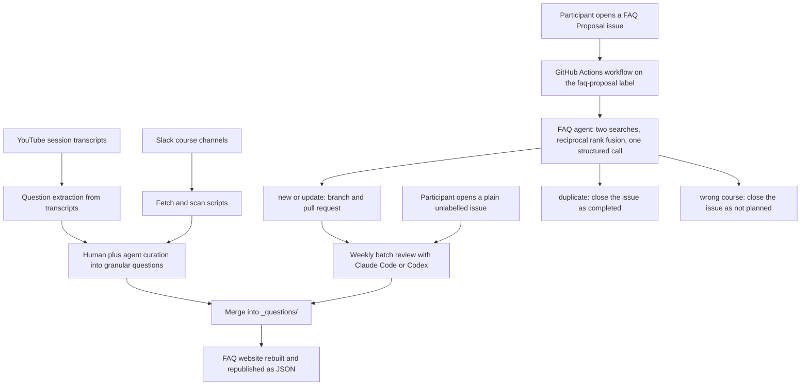
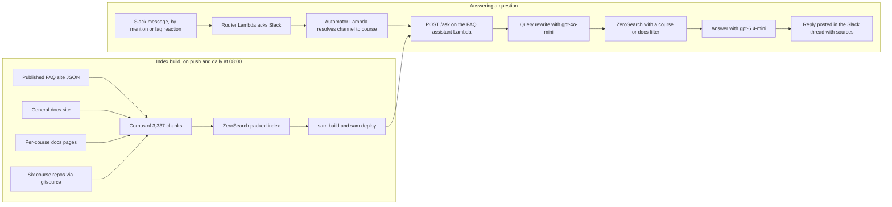
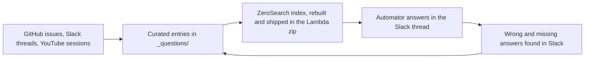

# Taking Over the FAQ Assistant: How the Whole Process Works Now

Recently I ran a workshop on [tailoring your CV for AI engineering roles](https://aishippinglabs.com/workshops/tailor-cv-ai-engineering), using my own CV as the example. Part of that workshop was the projects section, and one of the projects I listed there was this FAQ assistant.

So this article is the follow-up to that one line. If I use the CV to apply for AI engineering roles, a hiring team can open this and see what the project actually involved. You can do the same with your own projects. A line on a CV earns you a click, and this is the kind of page the click should lead to.

I wrote about this system before, in [From Google Docs to an Automated FAQ System for DataTalks.Club Courses](https://alexeyondata.substack.com/p/from-google-docs-to-an-automated). Things have changed since that article, so here I want to tell you what I did and how everything works for me at the moment[^2].

It's also a continuation of [Building and Maintaining a Slack Moderation Bot for an 88k-Member Community](https://alexeyondata.substack.com/p/building-and-maintaining-a-slack). Automator, the Slack bot from that article, already existed, so I didn't build a new bot for the FAQ. I used the existing infrastructure and added a new thing on top of it[^9].

Alex Litvinov maintained the previous FAQ assistant, and I wrote about him in that article. Periodically things happened and I had to pull Alex in and ask him to fix them, which was inconvenient for both of us. In the end Alex and I agreed that I'd take the project on myself and move it onto DataTalks.Club infrastructure. That way I can solve whatever problems come up without involving Alex[^2].

I split the post in two, matching the two parts of the system[^3]:

1. Filling the FAQ with new questions automatically
2. The RAG side - retrieval, and the Slack bot that answers with it

There's a bit of RAG in the first part too[^3].

That split also runs across two repositories. [DataTalksClub/faq](https://github.com/DataTalksClub/faq) holds the FAQ content in `_questions/`, the GitHub-issue-to-pull-request agent, and the website. [DataTalksClub/faq-assistant](https://github.com/DataTalksClub/faq-assistant) [^11] holds the Slack answering bot that runs on Lambda, the search index build, and the retrieval evaluations.

## The setup I inherited

Before the handover, the assistant ran as a long-running Slack Bolt app in socket mode, hosted on Fly.io. Retrieval went through Milvus, running locally for development and on Zilliz Cloud in production, across two different Zilliz accounts selected by an environment flag. There were four separate collections and four separate query engines, one per course, routed by Slack channel id.

Ingestion had three readers - the FAQ from GitHub, Slack history, and YouTube transcripts. Each course had its own ingest entrypoint, each running on its own weekly cron through a Docker image built by another workflow. The video ids were maintained by hand inside those scripts, so every new session meant a code change.

At runtime it touched OpenAI for generation, Cohere for reranking and HuggingFace embeddings. It also used Upstash Redis as an embeddings cache and LangSmith for feedback logging. On top of that it cost money, Alex paid for it, and it periodically ran out of credit and had to be topped up. I wasn't sure that was fine in the long term[^10].

That's the before picture, and everything below is what replaced it.

## Part 1: How questions get into the FAQ

### Source one: people creating issues

The first source is people: anyone can create an issue. I wrote about this in the previous article, but roughly, the issue goes through something RAG-like and then automation takes over[^3].

Concretely, an issue template called FAQ Proposal auto-labels the issue and asks for the course through a dropdown. A workflow fires on issue creation, gated on that label. It parses the course, question and answer out of the issue body, and the agent builds a search index over that one course's existing entries.

The agent searches twice, once with the question alone and once with the full question and answer proposal. It fuses the two result lists with reciprocal rank fusion, then makes a single structured call. The call returns one of four actions - new, update, duplicate or wrong course. Along with it come a rationale, the section, a filename slug and an order.

The workflow branches on the action. New and update create a branch, commit as the FAQ Bot account, and open a pull request that closes the issue. Duplicate closes the issue as completed. Wrong course closes it as not planned.

I process the results with Claude Code or Codex - with assistants. A skill shows me the pull request, and I decide what to do with it: merge it or not[^3].

### Source two: issues that ignore the contribution guide

Some course participants skip the contribution guide and create an issue with a plain description, no tag and no format. I process those as well[^4].

They have no label, so the workflow never fires on them. I handle them by hand in the same batch pass as the pull requests.

### Source three: Slack

The third source I take from Slack[^4]. There are two paths into it, and neither of them goes through the FAQ Proposal agent.

The first path is proactive mining. A skill drives a fetcher that pulls a course channel's history for a time window, including thread replies. Replies matter, because most of the real question and answer traffic lives there rather than in root messages.

The channel comes from the course metadata file, so the skill only needs a course name. It keeps a small log file with the date of the last run per course and computes the window from that. The window has a deliberate one-day overlap, so that a gap can't silently drop messages. The export is written as paired JSON and markdown into a scratch directory that we never commit.

Selection is me plus the agent reading the export, with no scoring and no classifier. The rules that matter are about granularity. Each candidate has to be one independently answerable question, and there are no umbrella entries. Questions that cover several dimensions get split, even when they came from a single thread. We present and resolve candidates one at a time, and a question doesn't have to recur before I add it.

The second path is reactive, and it runs from the answering side rather than the content side. A review script scans the course channels for threads where the bot was triggered and flags two failure modes. Either the bot replied with its "I couldn't find this" fallback, or the bot answered and then I replied afterwards. Both mean the FAQ is missing something, so the instructor follow-up in the thread becomes a new FAQ entry.

Either way it ends as a direct commit to `main` in the FAQ repo. There's no pull request and no second reviewer for Slack-sourced entries, because the curation is the review.

### Source four: YouTube sessions

Fourth, we run sessions on YouTube - course launch streams, pre-course question and answer sessions, module streams and workshops[^7].

This works from transcripts, but it's the opposite of what the old bot did with YouTube. The old system chunked transcripts into a vector index and retrieved raw snippets with a timestamped deep link. Now we extract instead, reading the transcript for the questions participants actually asked during the session. Each one comes out as a question, an answer, the timestamp in the video and the verbatim transcript quote that supports it. Sessions where nobody asked anything produce nothing.

I then curate the extracted set by hand and write it into `_questions/` as ordinary FAQ entries. The Stock Markets Analytics course got 67 entries this way. They came from the cohort module streams in 2024 and 2025, the pre-launch question and answer sessions, and the time-series workshop. The AI Dev Tools launch stream produced 7.

There's one detail I like here. The launch and pre-course streams we mine this way are the same videos the old bot used to index as raw transcript chunks. Same material, turned from a retrieval liability into curated content.

Of the four sources, this one is the least automated. I run it at launch time, as a batch, with throwaway tooling rather than a committed script or workflow.

### The batch flow

In practice it runs like this[^4]:

1. A course participant creates an issue
2. The automation creates a pull request from that issue
3. Once a week or once every two weeks I do a batch and process them
4. For each pull request, Codex or Claude Code tells me whether everything is fine, whether the category or the section needs to be changed, whether anything in the pull request needs fixing, and also whether this case can be added to the evaluation set and why

Correcting an answer is no longer a manual edit followed by a manual test run. The agent takes the correction, fixes the content, commits it to the right repositories and reports back what it changed and what it verified[^1].

<figure>
  
  <figcaption>An Automator run correcting the certificate requirement in the FAQ</figcaption>
  <!-- Concrete example of the correction workflow described above: a correction goes in, the agent commits it across the faq and faq-assistant repos and reports the test results -->
</figure>

The run in the screenshot corrected a clarification about certificate requirements. The certificate requires completing the capstone project and the required peer reviews, and homework isn't required. The agent also reclassified the evaluation case as incomplete with the corrected expectation.

It produced two commits: `09c95d5` in the faq repo clarifies the LLM peer review requirement, and `353810d` in the faq-assistant repo corrects the certificate evaluation expectation. Validation ran 45 assistant tests, 39 FAQ unit tests and 26 FAQ integration tests, all passing, with nothing pushed[^1].

### The asymmetry in what gets reviewed

I built the evaluation around one asymmetry, so let me state it explicitly.

The agent can close an issue with no review at all, and duplicate and wrong-course decisions take effect immediately. Everything the agent writes, by contrast, arrives as a pull request that I look at before merging, and the bot never commits to `main`. I review strictly one item at a time, approving explicitly before editing, merging or closing, with no bulk operations.

For the Slack and YouTube sources the curation happens before anything is written, and then the commit goes straight to `main`. When an assistant does the writing, publishing is still a step I have to approve.

### Part 1 as a diagram

The whole content side fits in one picture, from a question arriving to an entry going live on the FAQ website.



### Evaluating the FAQ agent

I want this agent to work well, and for that you obviously need a reliable evaluation set[^3].

How I composed it: we took all the issues and pull requests. If I changed something in a pull request, that means the agent did something wrong. So we identified several special cases rather than the frequent, general ones, and for each of them found several representative examples. That's how the evaluation set was made[^3].

We build the evaluation set in an interesting way. The issues have already been merged, so if a question is already in our dataset, a correctly working agent will always come out with duplicate. So we do something else instead. We take our data and the issue that was created, remove the matching record, and check that the agent then makes the right decision[^3].

In the runner this is a leave-one-out setup. It copies the course directory to a temporary directory and deletes the markdown files matching the case's target document, plus any explicitly hidden documents. Then it builds the agent over the reduced corpus. We keep the course catalog complete, so wrong-course detection still works. Duplicate cases run against the full index instead, which is the mirror image of the same test.

The cases are hand-written Python dataclasses rather than data files, and the case id means something. A positive id is the real GitHub issue number, and a negative id is a synthetic case. They come from listing all issues with the `faq-proposal` label, plus correction commits. Those are commits where a human had to fix the bot's output after a merge. The agent evaluation currently has 61 cases - 38 expecting a new entry, 10 duplicates, 7 wrong-course, 4 not-wrong-course and 2 updates.

A separate retrieval-only evaluation sits under it, with 73 cases, 55 real and 18 synthetic. It runs in a couple of seconds because it involves no LLM call. Not all 73 get scored, because we skip cases whose target document has since left the corpus, which currently leaves 53. On those it records recall@5 of 0.849 and MRR@5 of 0.836.

For every case that doesn't expect wrong-course, the runner prepends an implicit not-wrong-course check. So the whole suite doubles as the false-positive budget, not just the cases written for it. It recorded zero false positives, measured when the suite had 51 cases and 44 of them included the implicit check. The suite has grown to 61 cases and 54 implicit checks since, and we haven't re-measured that figure.

The evaluations don't run in CI in either repository, and that's deliberate, because they cost money and they're noisy.

I want to keep the evaluation set maximally lean, with representative cases in there, so I try not to add everything that comes along. But sometimes a genuinely new and interesting case comes up that does need to be added[^4].

### The mistakes that matter

Some mistakes aren't fatal: a wrong category is easy to fix, and I do it through Claude Code[^3].

The other mistakes hurt more. The agent decides the course is wrong, or the workflow doesn't even fire and the pull request never gets created. Those are the worst outcomes, and the evaluation aims to reduce them to zero. False positives where no pull request gets created are the main target[^3].

In the end I chose `gpt-5.4-nano`, because that's the one that helped achieve this result[^3]. The workflow deliberately passes no model argument. The default in `rag_agent.py` is the only place the model gets set, so production and the evaluations can't drift apart.

Look at the model comparison behind that choice. Across 84 observations, wrongly-closed valid proposals were 15 for `gpt-5-nano`, 12 for `gpt-5.4-nano` and 9 for `gpt-5.6-luna`. On wrong-course recall the numbers were 13 of 35, 7 of 35 and 27 of 35. All three had zero false positives out of 20.

`gpt-5.4-nano` costs $0.20 per million input tokens and $1.25 per million output tokens. A full suite run costs around $0.27, against around $1.30 for luna.

`gpt-5.6-luna` looks like the obvious winner on wrong-course recall, and I still rejected it. Its failures on correct-new cases more than double, and they arrive as updates that silently rewrite good entries. The old `gpt-5-nano` had a different problem: 5 of 7 wrong-course cases flipped between new and wrong-course on byte-identical input.

### Choosing the section

We define sections per course in a metadata file, as a list of id, name and an optional comment. The comment goes into the prompt along with the section list. The prompt tells the agent to weight the comment above the search results when choosing a section.

There are 74 sections across 6 courses, 42 of them with a comment. The course comes from a dropdown on the issue form and only that one course gets loaded. So the agent's real choice set on any given run is 9 to 18 sections.

The most useful thing the evaluation surfaced here was about the catch-all section. The intuitive worry is that an agent will dump everything into `misc`, but the opposite happened. With no comment on `misc`, the agent placed entries correctly 5 times out of 5 everywhere else, and still couldn't use `misc` when `misc` was the right answer. It sent a cross-cutting "Python 3.13 breaks sklearn" question to `module-5` five times out of five.

Adding a scoping comment to `misc` took those cases from 10 out of 15 to 15 out of 15. An undescribed section doesn't attract entries, it repels them.

The comments earn their keep in other ways too. The Data Engineering `workshop-1-dlthub` comment says that questions about dlt go there, and warns not to confuse dlt with dbt, since they're different tools. The `module-7` comment says not to name specific tools like Kafka, PyFlink, Spark Streaming or Redpanda in the section name. The course's streaming stack changes between cohorts.

## Part 2: Retrieval and automatic replies

Now the retrieval side, the RAG. I did a lot here, because the process Alex had wasn't so much complex as something I wanted to simplify as much as possible[^5].

Alex handed over all the info and the whole project, and I started thinking about how to deploy it. There was vector search, ingestion from Slack, ingestion from YouTube - a lot of things. The project turned out to be quite complex. There were grounds for that: some historical reasons, and some things just ended up that way over time[^5].

I wanted to simplify it as much as possible. I wanted a serverless architecture, with everything deployed on Lambda[^5].

### Dropping the extra sources

Everything that appears in Slack I curate, and everything that appears on YouTube we curate too. When we have a course launch I add some things to Slack, and many things we add to our documentation. We now have a documentation site where we write it down[^5].

So there's no need to index the videos, because we already have the content in prepared form. I spent quite a lot of effort on curating the YouTube course data, and that removes the need for the other sources[^5].

This is exactly the trade in source four above. The curation work is what buys the right to drop a whole ingestion pipeline.

### Dropping the vector database

Second, I removed the vector database. It could improve retrieval, but it's a lot of hassle. On the course I teach that you need to process this data, and there's a lot to process. You have to store embeddings somewhere, which means a service to store them, and if you compute those embeddings you need somewhere to compute them. In short, serverless doesn't fit[^5].

For the vector database part, I decided I'd probably just use a free option if I needed one at all. We don't strictly need one here, because plain text search is enough for this case[^10].

### MinSearch did not fit either

Third, MinSearch doesn't quite fit on Lambda. I originally wrote it for educational purposes, and only later it turned out to be useful more broadly. It's the small search library behind my [RAG workshops and courses](https://alexeyondata.substack.com/p/minsearch-the-small-search-library).

Because it was written for teaching, it uses scikit-learn internally. That in turn pulls in NumPy and SciPy, and there's a dependency on Pandas as well[^14]. Those are all heavy libraries. Every data scientist has them in their standard set, but deploying them to Lambda brings a lot of problems. It isn't a trivial process, you need Docker, and in short it becomes difficult[^5].

### ZeroSearch

So I decided to replace MinSearch. I asked one of the assistants to rewrite it completely into zero-dependency Python, and I don't remember whether it was Claude Code or Codex. I already had something similar in MinSearch, an implementation of this inverted-index search, and we built on that[^6].

That gave me [ZeroSearch](https://github.com/alexeygrigorev/zerosearch), a library with absolutely no dependencies[^12].

The constraint that produced it didn't actually come from Lambda. It came from Cloudflare Workers, and from the [Cloudflare Workers Vectorize Agent](https://aishippinglabs.com/workshops/2026-06-17-cloudflare-workers-vectorize-agent) workshop I ran in AI Shipping Labs[^13]. After that workshop I decided to try porting the FAQ assistant to Cloudflare, and that's how ZeroSearch appeared[^14].

I wanted a small replacement that runs on Lambda and, as far as possible, also runs on Cloudflare, so I could do it for free. Cloudflare has limits, and I ran into them quickly[^10].

Cloudflare Workers has a particular limitation. Everything there actually gets written in JavaScript, and the Python layer is still in beta, so it practically doesn't support any additional libraries. If you want to write something, you have to write it in pure Python. That was one of the main constraints I noticed[^14].

So I rewrote MinSearch as pure Python, with zero dependencies - zero dependency leading to zero search, hence ZeroSearch[^12]. I decided to try the rewrite, and it worked out fine. Now my portfolio of search libraries has one more entry[^14].

One dependency is shared across all of them. I now have three libraries for search - ZeroSearch, MinSearch and [SQLiteSearch](https://alexeyondata.substack.com/p/how-i-built-sqlitesearch-a-lightweight). A common part with stemming appeared across them, so I extracted it into a separate library. For ZeroSearch it's optional, and you only pull it in when you need stemming[^6].

ZeroSearch is made exactly for environments like Lambda, where you need a minimum of dependencies, and those are the environments I like working in[^6].

The dependency claim is literal. The `pyproject.toml` of ZeroSearch declares an empty dependency list with the comment "Intentionally empty: standard library only". The only optional extra is `stemming = ["stemlite>=0.1.0"]`, and stemlite is also standard library only.

Stemlite exists because minsearch, ZeroSearch and SQLiteSearch all needed to normalise words the same way. Without it each one would keep its own copy or pull in a heavyweight NLP stack. ZeroSearch imports it lazily, and only when you request a stemmer by name.

The Cloudflare port isn't where it ended up running. The assistant now runs on Lambda instead, but the library that constraint produced is what made the Lambda deployment simple too.

### Benchmarks

I benchmarked the search[^6], and there are two separate benchmark efforts, answering two different questions.

The first one runs inside the ZeroSearch repo and measures speed. It compares the working tree against a git ref, so ZeroSearch is measured against its own previous version, across a search-path optimisation. It runs on Simple English Wikipedia at sample sizes of 1,000 and 10,000 articles. Queries come from article titles. It records build time, peak memory and serialized index size, plus queries per second and search latency at average, median and p95.

| Sample | Version | Build | Peak memory | Avg search | p95 | QPS |
|--------|---------|-------|-------------|------------|-----|-----|
| 1,000 docs | before | 1.095 s | 51.1 MB | 0.087 ms | 0.337 ms | 11,478 |
| 1,000 docs | after | 1.106 s | 59.3 MB | 0.063 ms | 0.224 ms | 15,791 |
| 10,000 docs | before | 8.277 s | 338.3 MB | 0.875 ms | 2.693 ms | 1,142 |
| 10,000 docs | after | 8.531 s | 371.2 MB | 0.345 ms | 1.467 ms | 2,897 |

On the 100-query run, average search latency improved 2.5x. The longer 100,000-query run improved 1.9x, and p95 improved 1.8x to 1.9x.

Build time is unchanged, because this was a search-path change rather than a build change. The cost is about 1.5 MB more on disk and 33 MB more peak memory during the build.

The 10,000-document index holds 392,806 vocabulary terms and 3,462,657 postings.

The rankings are identical before and after, matched to a 1e-12 tolerance with zero mismatches. We checked that across 100 Simple Wikipedia queries, 9,845 unique queries from the long run and the entire FAQ assistant evaluation corpus.

One methodology detail matters here. Earlier versions of that table timed the index build under `tracemalloc`, which traces every allocation and slowed the build by roughly 4x. An 8.5 second build was being reported as 34 seconds. We now measure build memory in a separate, untimed run. The same trap showed up in the Node port benchmark, where it made Node look 8x faster than Python when the real gap is 1.8x.

The second benchmark measures relevance, and it belongs to the evaluation of the automatic replies further down.

### Keeping the index fresh

Then I started thinking about what to do with updating the index. If a record in the FAQ changes, the search needs to reflect it in real time, right away[^6].

I want it to update as fast as possible. So every time an update happens, I completely rebuild the index and deploy a new Lambda with it[^6].

One deploy workflow has three triggers. A push to `main` touching the source, config or build scripts fires it. A daily schedule at 08:00 fires it too, to pick up new FAQ, docs and repository content, and I can also dispatch it by hand.

Every run rebuilds the corpus from the live sources, builds the index, then ships it. Push deploys and scheduled deploys are therefore identical, and we never commit the corpus or the index to git.

The run installs uv and sets up Python 3.14, which has to match the Lambda runtime because the index is tagged with the Python version. Then it runs the tests, rebuilds the corpus, compiles the config, builds the index and runs a handler smoke test. Finally it takes AWS credentials via OIDC and runs `sam build` and `sam deploy`.

There's no incremental update path at all. A full rebuild every time is what makes the freshness guarantee simple.

We deploy a zip-based Lambda through AWS SAM - Python 3.14 on arm64, 256 MB, a 30 second timeout, in eu-west-1. There's no Docker anywhere, which was the whole point of dropping the scikit-learn stack. The index ships inside the zip rather than from S3.

The build step installs ZeroSearch into the artifacts directory, copies the application package in, and copies the `search-index.zsx` file in next to it:

```make
build-FaqWorkerFunction:
	uv pip install --target "$(ARTIFACTS_DIR)" zerosearch==0.4.0
	cp -r src/faq_assistant "$(ARTIFACTS_DIR)/faq_assistant"
	cp artifacts/search/search-index.zsx "$(ARTIFACTS_DIR)/search-index.zsx"
```

S3 is only involved as SAM's ordinary upload bucket, and nothing is fetched from it at runtime. The handler loads the index once per container as a module-level lazy singleton.

The corpus comes from four sources. We pull the curated FAQ from the published site JSON. To that we add the general documentation site, the per-course documentation pages, and six course GitHub repositories read through the `gitsource` library.

That's 3,337 chunk records, about 5.3 MB of JSON, producing an index file of roughly 8 MB. Chunks are 1,800 characters with 150 characters of overlap, and retrieval returns 6 results by default with a minimum score of 0.2.

The runtime dependency list is just ZeroSearch. The OpenAI call uses `urllib` from the standard library, I wrote the structured models by hand, and there's no pydantic and no requests.

### Fast index loading

I also optimised ZeroSearch so that loading the index happens as fast as possible[^6].

That's separate work from the search-path optimisation above. When `fit()` runs, it compacts the `Counter` scaffolding into flat `array` buffers in a CSR-style postings layout. `save` and `load` then serialize that packed form through `marshal`, with magic bytes, a format version, a Python version guard and array item-size guards. A prebuilt index loads in milliseconds instead of re-tokenizing the corpus on startup, and the ranking is bit-identical to the previous format.

Loading the packed index at cold start takes about 15 ms, against about 520 ms for a fresh `fit()`. These are observed numbers rather than benchmark output. Unlike the search-path numbers above, there's no checked-in benchmark that measures index load time yet.

### Hanging it off Automator

None of this needed a new Slack bot. Automator already handles the Slack side for the whole 88k-member workspace, so the FAQ assistant plugs into it as one more thing it can do[^9].

The chain is three Lambdas. Slack events go to a router Lambda through API Gateway, which acknowledges within Slack's three-second budget and asynchronously invokes the Automator Lambda. Automator works out what the event means. For FAQ events it makes a plain HTTP POST to the FAQ assistant's `/ask` endpoint, a Lambda function URL authenticated with a shared secret header.

The request holds the question, a scope and a course. The response comes back with the rewritten query, the answer, the sources and a usage record.

Nothing is imported across the boundary, and no Slack credentials live on the FAQ assistant side. Automator owns Slack, and the assistant owns retrieval and generation.

Two things trigger a run.

The first is mentioning the bot. Any user in any channel Automator is in can tag it, and the answer goes into that message's thread. A mention inside a thread answers in the thread, and a top-level mention starts one.

The second is newer, and it's the one I like more. I can now trigger the FAQ reaction on a message from someone who didn't mention the bot at all. The bot then helps them anyway[^7].

Someone posts a question in a course channel without tagging anything. I add the `:faq:` emoji to it, and the bot answers in the thread. The reaction path is admin-gated, so reactions from other users get dropped before the handler sees them.

That emoji used to do something much dumber. Until June it was a static post that pasted a link to the course FAQ page. The same commit that added mention handling turned it into an actual answer.

The bot posts the answer directly in the thread as a normal public message. There's no draft queue and no approval step, so once triggered, the reply goes out. If retrieval comes back with nothing above the score threshold, the bot says it couldn't find this in the course materials. It refers the person to the instructors, and it still posts that.

### Answering outside the course channels

This also works outside the course channels, where the bot uses the documentation only[^7].

It works through a channel-to-course mapping. Automator resolves the Slack channel id to a channel name, then looks that name up in a course map.

If the channel is one of the six course channels, the request goes out with scope `course` and that course id. Retrieval then filters to that course's own materials plus the course-agnostic general docs. If the channel isn't in the map, the request goes out with scope `docs`, and retrieval filters to the general docs only.

The scope also picks the system prompt and the fallback wording. In a course channel, a question the bot can't answer sends the person to the instructors. Outside, it sends them to the community managers.

<figure>
  
  <figcaption>A docs-scope answer outside the course channels - the question was never addressed to the bot</figcaption>
  <!-- Shows both new capabilities in one screenshot: the reply was triggered on a message that never mentioned the bot, and because the channel sits outside the course channels the answer comes from the documentation only, which is why the single cited source is [docs] Activities -->
</figure>

Someone in that thread asked when the next courses start. That isn't a course question at all, and no course FAQ entry answers it. The answer comes out of the documentation - the courses section, the main events page, the Luma subscription and the Google calendar. The single citation under it reads `[docs] Activities`, which is the docs-only filter doing its job[^8].

That channel-to-course mapping now exists in both repositories, once in Automator's config and once in the assistant's config. Production only reads Automator's copy, and the Slack review script uses the assistant's copy to know which channels to scan. The two can drift, and the channel names in them already differ.

### Part 2 as a diagram

The retrieval side splits into a build that runs on a schedule and an answering path that runs per message.



### Evaluating the automatic replies

The answering bot works differently from the FAQ agent, so it gets a different evaluation. The FAQ agent evaluation asks whether a proposed entry got the right decision. This one asks whether a real question from Slack finds the right entry.

There's also another way I build the evaluation set. I go into Slack and look at the answers I corrected. The automation fired, and after that I or someone else added something to the answer. Those are exactly the ones that go into the evaluation set, the answers that weren't good enough and need improving. It's implicit feedback[^6].

### The retrieval ground truth

We build the ground truth set from real Slack threads. We take around 9,900 exported threads across the course channels and filter them down to genuine answered questions. A thread qualifies if it has a question mark and runs between 25 and 400 characters. It also needs at least one reply, and it can't be an announcement, a link dump or a staff post. Then a fixed seed samples 130 records out of that: 60 Data Engineering, 40 Stock Markets Analytics, 30 AI Dev Tools.

We pool relevance rather than label everything from scratch. The pool combines what ZeroSearch returns on the raw question, what minsearch returns on the raw question, and what ZeroSearch returns on a neutral rewrite.

An LLM judge then marks which pooled candidates actually answer the question, under a deliberately strict instruction. It includes an entry only if that entry on its own specifically answers the question. It's told that most questions have one or two correct entries, and it returns nothing if the question is vague. The average query ends up with 2.82 relevant documents and a pool of about 36 candidates.

### The retrieval evaluation

The sweep runs hit rate and MRR at k of 1, 3 and 5, over eight query-rewrite variants and two engines, ZeroSearch and minsearch. The production variant isn't a copy of the production prompt. The evaluation imports the actual prompt constant from the answering module, so the two can't drift apart. Retrieval goes through the same search function production calls.

The latest recorded ZeroSearch numbers, on the 130-query set:

| Variant | hit@1 | hit@3 | hit@5 | MRR@5 |
|---------|-------|-------|-------|-------|
| verbatim | 0.277 | 0.500 | 0.585 | 0.400 |
| production | 0.300 | 0.500 | 0.577 | 0.411 |
| current | 0.308 | 0.492 | 0.569 | 0.406 |
| raw | 0.239 | 0.469 | 0.554 | 0.359 |
| light | 0.285 | 0.423 | 0.508 | 0.362 |
| keywords | 0.246 | 0.415 | 0.500 | 0.342 |
| expansion | 0.215 | 0.323 | 0.462 | 0.295 |
| minimal | 0.223 | 0.315 | 0.392 | 0.275 |

The best minsearch configuration reaches hit@5 0.586 and MRR@5 0.419, on a slightly earlier 128-query version of the same set. So ZeroSearch isn't worse than minsearch on real queries, and it's noticeably more robust to aggressive rewriting. On the most compressed rewrite variant minsearch collapses to around 0.33, while ZeroSearch holds around 0.39.

The interesting finding sits under that. Rewriting the question helps, but how you rewrite matters more than whether you rewrite. The winning variants distill a chatty Slack message down to keywords while preserving exact error messages, tool names, commands and filenames. Over-compressing, or adding synonyms, makes things worse, because it drops the exact tokens keyword search depends on.

The answering side uses `gpt-5.4-mini` for the answer and `gpt-4o-mini` for the query rewrite, with the cheaper rewrite model validated in exactly this sweep.

### Answer gaps and the feedback loop

Alongside the retrieval ground truth I curate a much smaller set myself, holding real questions the bot got wrong end to end. Six records so far, all from LLM Zoomcamp and all triggered by the `:faq:` reaction. Three were incomplete answers, two found nothing, and one was outright incorrect. Each record keeps the verbatim bot answer, the instructor's correct answer, and the id of the FAQ entry that eventually closed the gap.

I keep it separate from the retrieval ground truth on purpose. These are content gaps: the answer wasn't in the corpus at all, so they would fail the pooled-judgment filter by construction.

The reactive Slack path from source three feeds it, run in reverse. The review script finds the failures and I curate them into the gap set. The missing content then gets written as FAQ entries in the FAQ repo.

Then a verification script reads the drafted markdown straight out of the FAQ repo and builds the exact corpus record ingestion would build. It splices that into the current corpus and reports the production retrieval rank before and after for every gap. It prints how many of the questions now retrieve their new entry in the production top five.

Publishing order matters there, and it's easy to get wrong. The FAQ repo goes first, because the assistant rebuilds its corpus from the published FAQ site. Deploy the assistant too early and it ships against stale content until the next daily rebuild reconciles it.

### The gaps in the evaluation

There's no LLM judge on answer quality. Nothing scores faithfulness, helpfulness or correctness of a generated answer, and nothing judges live production answers. The judge only ever runs offline, to build the ground truth and to verify a gap got filled.

Assertions replace it, and a dozen integration tests run against the real API, asserting on behaviour rather than wording.

An unanswerable course question has to report that it found nothing and send the person to the instructors. It still has to cite all three kinds of source. An unanswerable non-course question has to send them to the community managers instead. Answers have to contain real links rather than "see the page", and they must not contain meta phrases like "according to the context". A smoke test additionally checks that no cited source id is outside the retrieved set, which is the anti-hallucinated-citation check.

The evaluations here don't run in CI either. Unit tests do, and the deploy workflow runs unit tests plus a fully stubbed handler smoke test. It's deliberately stubbed, because the live corpus gets rebuilt daily and drifts. Asserting that a specific topic answers above the score threshold would turn a content change into a spurious deploy failure.

Every request also emits a structured usage log line. It records the scope and course, the models, the number of results and the latency, plus tokens and cost. That makes the running cost observable without any extra service.

## The full picture

Here are both parts in one diagram, from where a question comes in to where the answer goes back out.



Read that end to end. A question shows up somewhere, in a GitHub issue, a Slack thread or a live session, and gets turned into a curated FAQ entry. Either an agent opens a pull request I review, or curation commits it directly. The FAQ website republishes as JSON.

A build job pulls that JSON together with the docs site, the per-course docs and six course repositories into a corpus of about 3,300 chunks. It packs that into a ZeroSearch index and ships the index inside the Lambda zip, on every relevant push and once a day regardless.

On the other side, a member asks something in Slack. Either they tag the bot, or I put the `:faq:` emoji on their message. Automator works out which course channel they're in, or that they aren't in one, and asks the assistant Lambda with the matching scope. The assistant rewrites the query, searches the packed index with a course or docs filter and generates an answer from the retrieved chunks. Automator posts it back in the thread with its sources.

Then the loop closes on both sides. Answers I had to correct, and questions the bot couldn't answer at all, get scanned out of Slack and become new FAQ entries. They flow back through the same build and are retrievable the next morning at the latest. Pull requests I had to fix become new cases in the agent evaluation.

Two evaluations sit across it: one on the agent that decides what goes into the FAQ, one on the retrieval that gets it back out. Neither runs in CI, both run on real cases that came from real mistakes.

The whole runtime is three Lambdas, one search library with no dependencies, and no database of any kind.

## Sources

[^1]: [20260715_101244_AlexeyDTC_msg4773_photo.md](../inbox/used/20260715_101244_AlexeyDTC_msg4773_photo.md)
[^2]: [20260730_220026_AlexeyDTC_msg4805_transcript.txt](../inbox/used/20260730_220026_AlexeyDTC_msg4805_transcript.txt)
[^3]: [20260730_220553_AlexeyDTC_msg4807_transcript.txt](../inbox/used/20260730_220553_AlexeyDTC_msg4807_transcript.txt)
[^4]: [20260730_220745_AlexeyDTC_msg4809_transcript.txt](../inbox/used/20260730_220745_AlexeyDTC_msg4809_transcript.txt)
[^5]: [20260730_221538_AlexeyDTC_msg4811_transcript.txt](../inbox/used/20260730_221538_AlexeyDTC_msg4811_transcript.txt)
[^6]: [20260730_222124_AlexeyDTC_msg4813_transcript.txt](../inbox/used/20260730_222124_AlexeyDTC_msg4813_transcript.txt)
[^7]: [20260730_224406_AlexeyDTC_msg4819.md](../inbox/used/20260730_224406_AlexeyDTC_msg4819.md)
[^8]: [20260730_224452_AlexeyDTC_msg4821_photo.md](../inbox/used/20260730_224452_AlexeyDTC_msg4821_photo.md)
[^9]: [20260731_090241_AlexeyDTC_msg4823_transcript.txt](../inbox/used/20260731_090241_AlexeyDTC_msg4823_transcript.txt)
[^10]: [20260619_085045_AlexeyDTC_msg4605_transcript.txt](../inbox/used/20260619_085045_AlexeyDTC_msg4605_transcript.txt)
[^11]: [20260619_085722_AlexeyDTC_msg4609.md](../inbox/used/20260619_085722_AlexeyDTC_msg4609.md)
[^12]: [20260619_085722_AlexeyDTC_msg4610.md](../inbox/used/20260619_085722_AlexeyDTC_msg4610.md)
[^13]: [20260619_090525_AlexeyDTC_msg4621.md](../inbox/used/20260619_090525_AlexeyDTC_msg4621.md)
[^14]: [20260619_090642_AlexeyDTC_msg4623_transcript.txt](../inbox/used/20260619_090642_AlexeyDTC_msg4623_transcript.txt)
