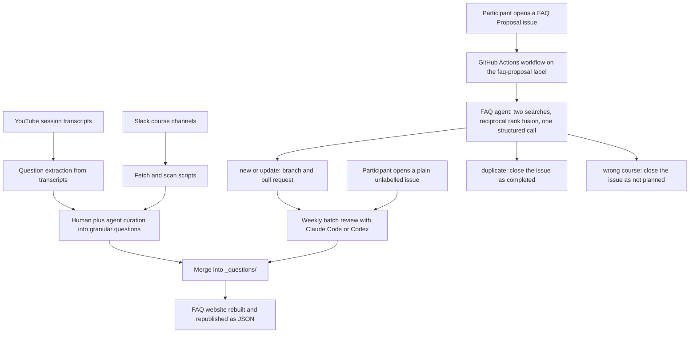
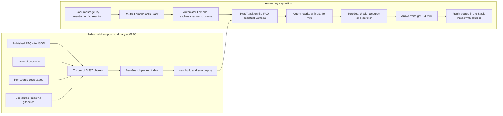
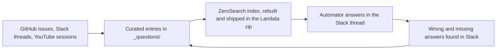

Recently I ran a workshop on [tailoring your CV for AI engineering roles](https://aishippinglabs.com/workshops/tailor-cv-ai-engineering), using my own CV as the example. There, I added a "projects" section in my CV, and included the FAQ Assistant as one of the projects.

FAQ assistnat is the system that we use in DataTalks.Club to help thousands of our students find the answers to their questions faster.

There are two components of this system:

- FAQ curation: adding data to the FAQ dataset. Students can contibute questions, but I also can get them from Slack and from youtube videos. This is the dataset with the FAQ data that I also often use in courses. It lives in [DataTalksClub/faq](https://github.com/DataTalksClub/faq)
- FAQ retrieval: using the assistant in Slack to answer questions from the students. It lives in  [DataTalksClub/faq-assistant](https://github.com/DataTalksClub/faq-assistant) that runs on Lambda.

In this article, I want to describe this project in more detail:

- include all the decisions I made and explain why I made them.
- describe the articture of this application,
- how the data flows trhough the systme
- all the data sources  

My plan is to later include the link to this article to my CV, so if I decide to use it to apply for AI engineering roles, a hiring team can read it and see what the project actually involved.
I see it as a part of learning in public and sharing what I learned. (include the link to the learnign in public post).

You can also use it as an example for describing your own projects, even if you don't include them in your CV. If you decide to use it as a template, make sure to tag me on social media!

## FAQ Assistant 

I already wrote about the FAQ assistant in [From Google Docs to an Automated FAQ System for DataTalks.Club Courses](https://alexeyondata.substack.com/p/from-google-docs-to-an-automated). But some thigns changed since I published it.

Occasionally the <bot-name> breaks down. When it happens, I have to pull Alex Livinov in (he's the bot maintainer) and ask him to fix the issues. Sometimes it would be handing an expired key, or sometimes it's fixing a small bug.

Two months ago his OpenAI account run out of money, so I had to ping him. I always felt bad that he uses his own money to pay for the project, so I again suggested that I take it over and we run it in the DataTalks.Club infra. Typically he'd decline it, but his time he agreed.

This is the setup Alex used:

- OpenAI for the bot (RAG)
- Fly.io for hosting
- Vector search via Milvus, running on Zilliz Cloud in production across two different Zilliz accounts. There are four separate collections and four separate query engines, one per course channel.
- Data is ingested from three sources: the FAQ dataset from GitHub, Slack history, and YouTube transcripts. Each course had its own ingest entrypoint, each running on its own cron job in github actions.
- Youtube videos for courses are ingested manually.
- Cohere for reranking and HuggingFace embeddings
- Upstash Redis as an embeddings cache
- LangSmith for feedback logging

This setup makes a lot of sense, but I couldn't just port it easily to the DataTalks.Club infra. I wanted to use in combination with the [Au-Tomator Slack Bot](https://github.com/DataTalksClub/au-tomator-lambda) that I described in [Building and Maintaining a Slack Moderation Bot for an 88k-Member Community](https://alexeyondata.substack.com/p/building-and-maintaining-a-slack). 

The Au-Tomator bot runs on Serverless - on AWS Lambda. It's been running for years now and I never had to pay for it. It was always under the free tier for AWS lambda usage. And when I have to pay for it, it would be minimal

So I wanted to run the FAQ bot on Serverless too. I'll describe the architecture I came up with later in the article, but for now I want to talk about the dataset for that bot: the FAQ datset. The decisions I made about architecture were influenced by the dataset and its content, so we should talk about it first. 

## Part 1: The FAQ Dataset

I maintain the FAQ dataset in https://datatalks.club/faq. We host the website via GitHub pages and the data is in git in the [DataTalksClub/faq](https://github.com/DataTalksClub/faq) repository.

Previously it lived in a bunch of Google Docs. It was frequently vandalized, so I had to manually roll it back. Plus I was spending a lot of time on curating it, so I wanted to automate some parts of it with coding agents. Usign coding agents in google docs is quite problematic. It's much better when it's a bunch of markdown files in your file system. I described the migration process in [From Google Docs to an Automated FAQ System for DataTalks.Club Courses](https://alexeyondata.substack.com/p/from-google-docs-to-an-automated).

Now with AI assistants I spend less time maintaining this dataset, can keep it clear and up-to-date.

There are multiple sources of questions:

- The questions that people contributed via Githib 
- Dicussions in Slack
- Q&A videos on YouTube

## User-Contributed FAQ Records

Anyone who's taking our course can contribute to the FAQ dataset. Previously it was via a Google doucment, and now by submitting a GitHub issue.

This is how it works now:

- You submit an issue, specifyong the question, the course and your answer
- A script runs via GitHub actions: it indexes the entire dataset using minsearch
- Then we search twice: with the questions alone, and with both question and answer combined. Then we combine the two results with reciprocal rank fusion 
- Next, we do a RAG variation: we send the retrieved results to OpenAI, and get back strucured output with one of the decisions: new, update, duplicate or wrong course.
- If it's new and update, we create a branch, commit the file, and open a pull request.
- If it's a duplicate or wrong course, we close the issue.

## FAQ Record Evaluation

When the first version of the script was created, we didn't have any evaluation set. It was doing fine and I mostly relied on my gut feeling to make sure it worked okay.

But as more people started using it, it started making more incorrect decisions. So I finally had to take care of the evals. Otherwise I'd risk breaking the whole thing with any next change I make. 

For creating the evaluation dataset I used historical data: I analyzed the issues where I needed to correct the submissions after the script worked, and selected cases that are quite different from each other. I wanted to have a representative set of cases that would test the system from different angles. 

That includes:

- item 1
- item 2
- ...

Not all decisions made by the script are equal. If the agent makes a mistake in a NEW or UPDATE decision, it's easy to correct, and I use AI assistants to help me with that.

But if the decision is DUPLICATE or WRONG_COURSE, the PR will never be created, and the issue will be closed. In this case, I will not even have a chance to review them. Thus, a mistake in this case is more expensive, so I had to make sure that these cases don't happen very often.

There's also a problem with collecting the evals data from historical decisions. The FAQ data is constantly changing, so we have to use a "leave-one-out" setup.

When the script decides that something is NEW and we later use it in the evals, it's no longer NEW: the item was already merged into the dataset. So if we run it with the new issue using the updated version of the dataset, it will say DUPLICATE instead of NEW.

In order to properly test it the NEW cases, we therefore need to remove the record from our dataset. So if we have 200 records, and the record D is the one we added, we remove the D and test this case agaist the remainint 199 records.

Right now I have 61 case:

- 38 expecting a new entry
- 10 duplicates
- 7 wrong-course
- 4 not-wrong-course
- 2 updates

I eventually switched from gpt-4o-mini to gpt-5.4-nano, because it didn't have any false positives in the important cases, and it wasn't as flaky - the eval runs produced consistent results with this version.

Most of the corrections I made manually for the new records was because the model would choose a wrong section for the FAQ entry, so these 38 cases also test that. Now it's selecting the correct section in X cases (it was Y previously). 

In addition to testing the whole flow, I have a retrieval-only evaluation set. This is the part where I only test the search component of the flow, so there are no calls to LLMs

TODO: desribe it better. and remove the skipped ones

I also don't really undestand why we need the separate search flow

## Bulk Reviewing

I usually let the PRs accumulate and process them every two weeks.

For that, I use AI assistants. I have a skill (link it) that lets me go through each PR and merge it as is, or fix it if it's not correct. 

<figure>
  
  <figcaption>An Automator run correcting the certificate requirement in the FAQ</figcaption>
  <!-- Concrete example of the correction workflow described above: a correction goes in, the agent commits it across the faq and faq-assistant repos and reports the test results -->
</figure>

If I come across an interesting error, I ask the assistatnt to add it to our evals set. I don't try to fix it immediately. I wait till we have a few more cases, then I ask the assistant to see what we can do to fix these issues, and make sure that our model not only does ebtter on them, but also we introduce no regression on the previous cases. 

If some cases can't be fixed easily, I don't sweat over it. I want to keep the  system for adding new questions simple. I don't want to have a huge prompt that covers all possible corner cases. This means that sometimes a case I add stays there as a case that fails. 

Some course participants skip the contribution guide and create an issue with a plain description. There's no tag and they don't follow the format, so the automation doesn't work. 

I process these issues in my biweekly sessions. The agent uses a process similar to what I described above (with indexing the dataset). Most of these issues are closed as a duplicates though. 

## Other Sources: Slack and YouTube

When we're running our courses, our Slack is very active. Course participants are asking questions and helping each other. In many cases, these discussions are worth saving in the FAQ datset. 

For that I regularly go though all the Slack threads. I ask my AI assistant to go though each thread following the similar process. If something is new, it adds this information as new records.

Also, for each course I run a few live YouTube sessions, for example:

- pre-course Q&A session
- course launch streams
- occasional office hours 

I get the tracript and use AI assistnat to extract potential Q&A candidtates. If there's something new, I add it to the FAQ dataset directly. 

## Part 1 Overview

## Part 2: Retrieval and the Slack Bot

Now back to the retrieval side. This dataset is used as the main data source for the Slack bot. 

When you mention @Au-Tomator (my bot) or @<bot-name> from Alex, both would perform RAG:

- Use search to fetch the candidate FAQ records 
- Pass them to OpenAI 
- Return the answer from the LLM and post it in the thread as a reply 

The original FAQ bot has a lot of moving parts though. Most of them are not straightforward to deploy to the serverless environment:

- ingestion from Slack
- ingestion from YouTube
- vector search

So I decided to simplify it.

Previously, the system would index all Slack threads, and chunk all the YouTube videos and index them too. Now I extract the important information from these sourcs and put it directly to the FAQ dataset, so I can drop both Slack and YouTube, and focus only on the FAQ dataset. 

TODO: I also didn't mention a new datasource: https://datatalks.club/docs/
I don't know where. But every year I do the same intro in the launch streams when I start a course. Insetead of repeating the same information over and over again, I'd rather have a Q&A session and have course participants ask me questions. So what I did was taking all the youtube videos we had, all the slack messages, and having AI assistants analyze all that and come up with a documentation website. Then I used this as a source too

Second, I removed the vector database. I know that it improves retrieval, but at the cost of having to maintain more infra. I want to keep the setup very lean, and if the bot is sometimes not right, I can simply correct it.

## Zerosearch

However, even with text search via minsearch, the deploy to AWS Lambda wasn't trivial. I originally created minsearch to teach retrieval and RAG in my workshops and courses. I wrote about it in [Minsearch: The Small Search Library Behind My RAG Workshops and Courses](https://alexeyondata.substack.com/p/minsearch-the-small-search-library).

Because I created it for teaching, my main goal to make it easy to implement and undestand the code, so it uses Scikit-Learn and Pandas for that. These libraries are quite heavy already, bti they also pull in NumPy and SciPy internally too. Every data scientist has these libraries in their standard setup, but for serverless they are quite heavy. Together, they take X mb of space, and have a lot of platform-dependent binaries. 

So I decided to replace minsearch with a zero-dependency search engine written entirely in pure-Python. I called it [zerosearch](https://github.com/alexeygrigorev/zerosearch). It has only one optional dependency - [stemlite](https://github.com/alexeygrigorev/stemlite), which is a stemmer I use across all my small serach libraries (zerosearch, minsearch and [SQLiteSearch](https://alexeyondata.substack.com/p/how-i-built-sqlitesearch-a-lightweight)). 

I can use zerosearch in the usual AWS Lambda setup with just a Zip archive, so I don't need to worry about Docker containers. This is how I eventually deployed the Slack bot that I use for retrieval and since then I used zerosearch in AWS Lambda in a few other projects. 

Another challenge - the library depends on Pydantic, which is also fine for a traditional setup, but heavy for serverless. So I ... (todo: finish it).

## Keeping the index fresh

Then I started thinking about what to do with updating the index. If a record in the FAQ changes, the search needs to reflect it.

Alex solved that by pulling in data using a daily cron job. But I wanted to do this as soon as the data in FAQ changes.

Almost all my projects have a CI/CD workflow: when I push to main, the code change is propogated to a live environment. I usually use it for code changes, but for this project I did the same for data changes too.

When a push happens, I re-build the whole index, and push it together with the source code in Lambda. It's quite small: it's 8 mb total.

Once it's deployed, the lambda loads the local updated index, and can serve the fresh data.

## FAQ Assistant Retrieval Evaluation

I replaced vector search with text search, but I wanted to make sure I can squeeze the absolute best from text search. So I needed to have a proper evaluation set to make it possible. 

I build the ground truth dataset for this part from real Slack threads:

- Get a slack dump with all the course data
- Take all 9,900 slack threads 
- Filder them down to keep actual questions

At the end, I had a sample of 130 records:

- 60 for Data Engineering Zoomcamp
- 40 Stock Markets Analytics
- 30 AI Dev Tools

For each of the questions, I found and marked the correct documents in the index. 

Then I evaluate hit-rate and MRR at k=1,3,5.

Once I had this dataset, I could start experimenting with search optimizing.

I tried multiple options:

- Taking raw question as is
- Keyword expansion
- Different variants of query rewriting

The winning option distill a chatty Slack message down to keywords while preserving exact error messages, tool names, commands and filenames.

Over-compressing, or adding synonyms, makes things worse, because it drops the exact tokens keyword search depends on.

For query rewriting I use `gpt-4o-mini` because it's fastest and cheapest, but for the actual generation I rely on `gpt-5.4-mini`. 

## FAQ Assistant Generation Evaluation

In the previous part I explained how I evaluate search. I also evaluate generation separately. 

I built the evaluation usign implicit feedback that I collect from Slack. When a bot answers a question, and I or somebody else later in the thread corrects it or add something extra, it means that the bot couldn't answer the question properly. 

These are the examples I collect and include in the evaluation set.

So far it's not large and has a few cases like

- the answer from the bot is incomplete
- the answer is incorrect
- the search doesn't find anything

Most of the time the way to fix these problems is not tuning the prompt, but going back to the FAQ dataset and seeing why a record wasn't retrieved, or why it didn't contain the correct information. 

Then I'd fix the record, re-run evaluation to make sure these cases are handled now, and re-deploy the bot. 

## Deploying with Au-Tomator

I already use Au-Tomator to help me with Slack management. I wanted use the existing setup, not create a new Slack bot.

I already have two Lambdas for Au-Tomator. I described them in ...:

- The router: routes and filters slack events. It also makes sure we acknowledge the reqest from slack quickly withing 3 second (requirement from slack)
- The automator: ...

And I added the third one:

- The FAQ assistant: ... 

Now when you mention the bot, it first goes to the automator, and automator sends it to the FAQ assistant. The assistant only gives the answer, and then au-tomator handles posting the response to Slack. 

As a bonus, now with this setup, I can trigger the FAQ assistant with `:faq:` reaction. Previously this reaction would only post a message to the SLack thread saying "Go cehck the FAQ"

Now it actually checks the FAQ and generates the answer.

And also, now it could answer questions outside of the course slack channels too.

<figure>
  
  <figcaption>A docs-scope answer outside the course channels - the question was never addressed to the bot</figcaption>
  <!-- Shows both new capabilities in one screenshot: the reply was triggered on a message that never mentioned the bot, and because the channel sits outside the course channels the answer comes from the documentation only, which is why the single cited source is [docs] Activities -->
</figure>

### Part 2 as a diagram

## The full picture

Here are both parts in one diagram, from where a question comes in to where the answer goes back out.

TODO simplify that, use a list or something 

Read that end to end. A question shows up somewhere, in a GitHub issue, a Slack thread or a live session, and gets turned into a curated FAQ entry. Either an agent opens a pull request I review, or curation commits it directly. The FAQ website republishes as JSON.

A build job pulls that JSON together with the docs site, the per-course docs and six course repositories into a corpus of about 3,300 chunks. It packs that into a ZeroSearch index and ships the index inside the Lambda zip, on every relevant push and once a day regardless.

On the other side, a member asks something in Slack. Either they tag the bot, or I put the `:faq:` emoji on their message. Automator works out which course channel they're in, or that they aren't in one, and asks the assistant Lambda with the matching scope. The assistant rewrites the query, searches the packed index with a course or docs filter and generates an answer from the retrieved chunks. Automator posts it back in the thread with its sources.

Then the loop closes on both sides. Answers I had to correct, and questions the bot couldn't answer at all, get scanned out of Slack and become new FAQ entries. They flow back through the same build and are retrievable the next morning at the latest. Pull requests I had to fix become new cases in the agent evaluation.

Two evaluations sit across it: one on the agent that decides what goes into the FAQ, one on the retrieval that gets it back out. Neither runs in CI, both run on real cases that came from real mistakes.

The whole runtime is three Lambdas, one search library with no dependencies, and no database of any kind.
