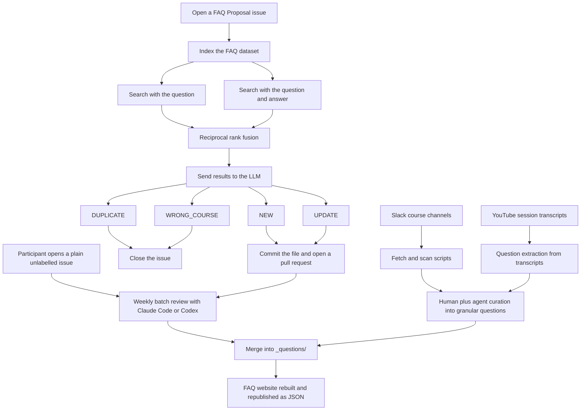
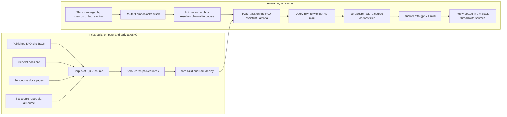
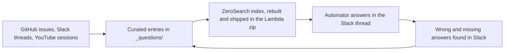

Recently I ran a workshop on [tailoring your CV for AI engineering roles](https://aishippinglabs.com/workshops/tailor-cv-ai-engineering), using my own CV as the example. There, I added a "projects" section in my CV, and included the FAQ Assistant as one of the projects.

FAQ assistant is the system that we use in DataTalks.Club to help thousands of our students find the answers to their questions faster.

There are two components of this system:

- FAQ curation: building the FAQ dataset from student contributions, Slack discussions, and YouTube transcripts. It lives in [DataTalksClub/faq](https://github.com/DataTalksClub/faq).
- FAQ retrieval: the Slack bot that answers students' questions using this dataset. It lives in [DataTalksClub/faq-assistant](https://github.com/DataTalksClub/faq-assistant) and runs on AWS Lambda.

In this article, I want to describe these components and the entire project in more detail:

- the data sources and how they become the FAQ dataset
- the architecture and how data flows through it
- the decisions I made and why I made them
- how I evaluate each part of the system

## ZoomcampQABot

Yes, I already wrote about the FAQ assistant in [From Google Docs to an Automated FAQ System for DataTalks.Club Courses](https://alexeyondata.substack.com/p/from-google-docs-to-an-automated).

In that article, I described the bot `ZoomcampQABot` developed by Alex Litvinov. When it ocassionally breaks down, I have to pull in Alex and ask him to fix the issue. Sometimes it would be handling an expired key, or sometimes it's fixing a small bug.

Two months ago his OpenAI account ran out of money, so the bot stopped working, and I pinged him again. I always felt bad that he uses his own money to pay for the project, so I offered to take it over and run it in the DataTalks.Club infra. Typically he'd decline it, but this time he agreed.

This is the setup Alex uses:

- OpenAI for generating the answers
- Fly.io for hosting
- HuggingFace for embeddings
- Milvus for vector search, running on Zilliz Cloud in production, with four collections and query engines
- Cohere for reranking
- Upstash Redis as an embeddings cache
- LangSmith for feedback logging

The data comes from three sources:

- the FAQ dataset from GitHub
- Slack history
- YouTube transcripts

Each course has a separate ingest entrypoint on its own cron job in GitHub Actions. YouTube videos are pulled in manually.

This setup makes a lot of sense, but I couldn't just port it easily to the DataTalks.Club infra. I wanted to use it in combination with the [Au-Tomator Slack Bot](https://github.com/DataTalksClub/au-tomator-lambda) that I described in [Building and Maintaining a Slack Moderation Bot for an 88k-Member Community](https://alexeyondata.substack.com/p/building-and-maintaining-a-slack).

The Au-Tomator bot runs on Serverless - on AWS Lambda. It's been running for years now and I never had to pay for it. It was always under the free tier for AWS Lambda usage. And when I have to pay for it, it would be minimal. So I wanted to run the FAQ bot on Serverless too.

I'll describe the architecture I came up with later in the article. For now I want to talk about the dataset for that bot: the FAQ dataset. The decisions I made about architecture were influenced by the dataset and its content, so we should talk about it first.

## Part 1: The FAQ Dataset

I maintain the FAQ dataset in https://datatalks.club/faq. We host the website via GitHub pages and the data is in git in the [DataTalksClub/faq](https://github.com/DataTalksClub/faq) repository.

Previously it lived in a bunch of Google Docs. Google Docs is convenient, but this approach had a few problems:

- It was frequently vandalized, so I had to manually roll it back.
- I wanted to automate some parts of dataset curation with AI, but using AI asssitants in Google Docs is not trivial.

Eventually I moved away from Google Docs to a bunch of markdown files. I described the migration process in [From Google Docs to an Automated FAQ System for DataTalks.Club Courses](https://alexeyondata.substack.com/p/from-google-docs-to-an-automated).

Now with AI assistants I spend less time maintaining this dataset, and I can keep it clean and up-to-date.

There are multiple sources of questions for the FAQ dataset:

- The questions that people contributed via GitHub
- Discussions in Slack
- Q&A videos on YouTube

## FAQ Automation: User-Contributed FAQ Records

Anyone can contribute to the FAQ dataset:

- You [submit an issue](https://github.com/DataTalksClub/faq/blob/main/CONTRIBUTING.md), specifying the question, the course and your answer.
- A GitHub Actions workflow indexes the entire dataset with minsearch.
- It searches twice - on the question alone, and on the question and answer together - and combines the two results with reciprocal rank fusion.
- It sends the results to OpenAI, which returns a structured decision: `NEW`, `UPDATE`, `DUPLICATE` or `WRONG_COURSE`.
- For `NEW` or `UPDATE`, it commits the file and opens a pull request.
- For `DUPLICATE` or `WRONG_COURSE`, it closes the issue.

## FAQ Automation Evaluations

When the first version of the script was created, we didn't have any evaluation set. I mostly relied on my gut feeling as it was okay for some time. But as more people started using it, the number of incorrect decisions incresed. So I needed to improve it. Naturally, I didn't want to fix it blindly and just hope for the best: I needed a proper evaluation framework.

For creating it, I used those incorrect decisions. I analyzed the issues where I needed to manually adjust the result, and focused on the cases that were different from each other.

Not all decisions made by the script are equal. If the agent makes a mistake in a `NEW` or `UPDATE` decision, it's easy to correct. I use AI assistants to help me with that.

But if the decision is `DUPLICATE` or `WRONG_COURSE`, the PR will never be created, and the issue will be closed. In this case, I will not even have a chance to review them. Thus, a mistake in this case is way more expensive, so I had to make sure that these cases don't happen very often.

There's also a problem with collecting the evals data from historical decisions. The FAQ data is constantly changing, so we have to use a "leave-one-out" setup.

When the script decides that something is `NEW` and we later use it in the evals, it's no longer `NEW`: the item was already merged into the dataset. So if we run it with the new issue using the updated version of the dataset, it will say `DUPLICATE` instead of `NEW`.

In order to properly test the `NEW` cases, we therefore need to remove the record from our dataset. So if we have 200 records, and the record D is the one we added, we remove the D and test this case against the remaining 199 records.

Right now I have 61 cases:

- 38 expecting `NEW`
- 10 expecting `DUPLICATE`
- 7 expecting `WRONG_COURSE`
- 4 not expecting `WRONG_COURSE`
- 2 expecting `UPDATE`

I eventually switched from gpt-4o-mini to gpt-5.4-nano, because it didn't have any false positives in the important cases, and it wasn't as flaky - the eval runs produced consistent results with this version.

Most of the corrections I made manually for the new records were because the model would choose a wrong section for the FAQ entry, so these 38 cases also test that. It now picks the right section for most of them, and the per-case results are tracked in the eval suite in the repo.

In addition to testing the whole flow, I have a retrieval-only evaluation set.
I use this part to test that duplicate detection works correctly. This part is less interesting, so I'll skip it. You can read more about it in the [project's README](https://github.com/DataTalksClub/faq/#retrieval).

## Bulk Reviewing

I usually let the PRs accumulate and process them every two weeks.

For that, I use AI assistants. I have a [custom skill](https://github.com/DataTalksClub/faq/tree/main/.claude/skills/clear-backlog) that lets me go through each PR and merge it as is, or fix it if it's not correct.

<figure>
  
  <figcaption>An Automator run correcting the certificate requirement in the FAQ</figcaption>
  <!-- Concrete example of the correction workflow described above: a correction goes in, the agent commits it across the faq and faq-assistant repos and reports the test results -->
</figure>

If I come across an interesting error, I ask the assistant to add it to our evals set. I don't try to fix it immediately. I wait till we have a few more cases, then I ask the assistant to see what we can do to fix these issues, and make sure that our model not only does better on them, but also we introduce no regression on the previous cases.

If some cases can't be fixed easily, I don't sweat over it. I want to keep the  system for adding new questions simple. I don't want to have a huge prompt that covers all possible corner cases. This means that sometimes a case I add stays there as a case that fails. 

Some course participants skip the contribution guide and create an issue with a plain description. There's no tag and they don't follow the format, so the automation doesn't work. 

I process these issues in my biweekly sessions. The agent uses a process similar to what I described above (with indexing the dataset). Most of these issues are closed as a duplicates though. 

## Other Sources: Slack and YouTube

When we're running our courses, our Slack is very active. Course participants are asking questions and helping each other. In many cases, these discussions are worth saving in the FAQ dataset.

For that I regularly go through all the Slack threads. I ask my AI assistant to go through each thread following a similar process. If something is new, it adds this information as new records.

Also, for each course I run a few live YouTube sessions, for example:

- pre-course Q&A session
- course launch streams
- occasional office hours

I get the transcript and use AI assistant to extract potential Q&A candidates. If there's something new, I add it to the FAQ dataset directly.

## Part 1 Overview

## Part 2: Retrieval and the Slack Bot

Now back to the retrieval side. This dataset is used as the main data source for the Slack bot. 

When you mention @Au-Tomator (my bot) or @ZoomcampQABot from Alex, both would perform RAG:

- Use search to fetch the candidate FAQ records 
- Pass them to OpenAI 
- Return the answer from the LLM and post it in the thread as a reply 

The original FAQ bot has a lot of moving parts though. Most of them are not straightforward to deploy to the serverless environment:

- ingestion from Slack
- ingestion from YouTube
- vector search

So I decided to simplify it.

Previously, the system would index all Slack threads, and chunk all the YouTube videos and index them too. Now I extract the important information from these sources and put it directly to the FAQ dataset, so I can drop both Slack and YouTube, and focus only on the FAQ dataset.

There's one more source I added: the [docs site](https://datatalks.club/docs/). Every year I do the same intro in the launch streams when I start a course. Instead of repeating the same information over and over again, I'd rather have a Q&A session and have course participants ask me questions. So what I did was take all the YouTube videos we had, all the Slack messages, and have AI assistants analyze all that and come up with a documentation website. Then I used this as a source too.

Second, I removed the vector database. I know that it improves retrieval, but at the cost of having to maintain more infra. I want to keep the setup very lean, and if the bot is sometimes not right, I can simply correct it.

## Zerosearch

However, even with text search via minsearch, the deploy to AWS Lambda wasn't trivial. I originally created minsearch to teach retrieval and RAG in my workshops and courses. I wrote about it in [Minsearch: The Small Search Library Behind My RAG Workshops and Courses](https://alexeyondata.substack.com/p/minsearch-the-small-search-library).

Because I created it for teaching, my main goal was to make it easy to implement and understand the code, so it uses Scikit-Learn and Pandas for that. These libraries are quite heavy already, but they also pull in NumPy and SciPy internally too. Every data scientist has these libraries in their standard setup, but for serverless they are quite heavy. Together they take well over 100 MB, and they have a lot of platform-dependent binaries.

So I decided to replace minsearch with a zero-dependency search engine written entirely in pure-Python. I called it [zerosearch](https://github.com/alexeygrigorev/zerosearch). It has only one optional dependency - [stemlite](https://github.com/alexeygrigorev/stemlite), which is a stemmer I use across all my small search libraries (zerosearch, minsearch and [SQLiteSearch](https://alexeyondata.substack.com/p/how-i-built-sqlitesearch-a-lightweight)).

I can use zerosearch in the usual AWS Lambda setup with just a Zip archive, so I don't need to worry about Docker containers. This is how I eventually deployed the Slack bot that I use for retrieval and since then I used zerosearch in AWS Lambda in a few other projects.

Another challenge was Pydantic - fine for a traditional setup, but heavy for serverless. Pydantic v2 ships a compiled Rust core, so importing it isn't free: every cold start has to load that native extension and build the model schemas, and the wheels add several megabytes to the package. On a Lambda behind a Slack bot, cold starts happen often, so that import tax shows up in the latency of real messages - and the compiled binary brings back the same platform-dependent packaging problem I was trying to leave behind with minsearch.

So I removed it (and `requests` too), hand-rolling the structured models and calling OpenAI through the standard library instead.

## Keeping the index fresh

Then I started thinking about what to do with updating the index. If a record in the FAQ changes, the search needs to reflect it.

Alex solved that by pulling in data using a daily cron job. But I wanted to do this as soon as the data in FAQ changes.

Almost all my projects have a CI/CD workflow: when I push to main, the code change is propagated to a live environment. I usually use it for code changes, but for this project I did the same for data changes too.

When a push happens, I re-build the whole index, and push it together with the source code in Lambda. It's quite small: it's 8 MB total.

Once it's deployed, the lambda loads the local updated index, and can serve the fresh data.

## FAQ Assistant Retrieval Evaluation

I replaced vector search with text search, but I wanted to make sure I can squeeze the absolute best from text search. So I needed to have a proper evaluation set to make it possible. 

I built the ground truth dataset for this part from real Slack threads:

- Get a Slack dump with all the course data
- Take all 9,900 Slack threads
- Filter them down to keep actual questions

At the end, I had a sample of 130 records:

- 60 for Data Engineering Zoomcamp
- 40 Stock Markets Analytics
- 30 AI Dev Tools

For each of the questions, I found and marked the correct documents in the index. 

Then I evaluate hit-rate and MRR at k=1,3,5.

Once I had this dataset, I could start experimenting with search optimization.

I tried multiple options:

- Taking raw question as is
- Keyword expansion
- Different variants of query rewriting

The winning option distills a chatty Slack message down to keywords while preserving exact error messages, tool names, commands and filenames.

Over-compressing, or adding synonyms, makes things worse, because it drops the exact tokens keyword search depends on.

For query rewriting I use `gpt-4o-mini` because it's fastest and cheapest, but for the actual generation I rely on `gpt-5.4-mini`. 

## FAQ Assistant Generation Evaluation

In the previous part I explained how I evaluate search. I also evaluate generation separately. 

I built the evaluation using implicit feedback that I collect from Slack. When a bot answers a question, and I or somebody else later in the thread corrects it or add something extra, it means that the bot couldn't answer the question properly.

These are the examples I collect and include in the evaluation set.

So far it's not large and has a few cases like

- the answer from the bot is incomplete
- the answer is incorrect
- the search doesn't find anything

Most of the time the way to fix these problems is not tuning the prompt, but going back to the FAQ dataset and seeing why a record wasn't retrieved, or why it didn't contain the correct information. 

Then I'd fix the record, re-run evaluation to make sure these cases are handled now, and re-deploy the bot. 

## Deploying with Au-Tomator

I already use Au-Tomator to help me with Slack management. I wanted to use the existing setup, not create a new Slack bot.

I already have two Lambdas for Au-Tomator. I described them in [Building and Maintaining a Slack Moderation Bot for an 88k-Member Community](https://alexeyondata.substack.com/p/building-and-maintaining-a-slack):

- The router: routes and filters Slack events. It also makes sure we acknowledge the request from Slack quickly within 3 seconds (a requirement from Slack)
- The automator: the moderation bot itself, which handles all the other Slack events

And I added the third one:

- The FAQ assistant: rewrites the question, searches the index, generates the answer, and returns it to the automator

Now when you mention the bot, it first goes to the automator, and the automator sends it to the FAQ assistant. The assistant only gives the answer, and then the automator handles posting the response to Slack.

As a bonus, now with this setup, I can trigger the FAQ assistant with `:faq:` reaction. Previously this reaction would only post a message to the Slack thread saying "Go check the FAQ"

<figure>
  
  <figcaption>Before the migration, the :faq: reaction just dropped a static 'check the FAQ' link - no answer was generated</figcaption>
  <!-- The old behavior: the reaction fires a canned reply and the member is left to go read the FAQ themselves. This is what the new setup replaces with a generated answer -->
</figure>

Now it actually checks the FAQ and generates the answer.

And also, now it could answer questions outside of the course Slack channels too.

<figure>
  
  <figcaption>A docs-scope answer outside the course channels - the question was never addressed to the bot</figcaption>
  <!-- Shows both new capabilities in one screenshot: the reply was triggered on a message that never mentioned the bot, and because the channel sits outside the course channels the answer comes from the documentation only, which is why the single cited source is [docs] Activities -->
</figure>

### Part 2 as a diagram

## The full picture

Here are both parts in one diagram, from where a question comes in to where the answer goes back out.

Following the diagram end to end:

- A question shows up somewhere - a GitHub issue, a Slack thread, or a live session - and becomes a curated FAQ entry, either through an agent's pull request that I review, or a direct commit.
- A build job turns the FAQ into a ZeroSearch index, together with the docs site and the course repos - about 3,300 chunks in total - and ships that index inside the Lambda zip, on every push and once a day.
- When someone asks something in Slack, Automator works out the course scope, asks the assistant, and posts the answer back in the thread with its sources.
- Anything the bot got wrong or couldn't answer gets pulled back out of Slack as a new FAQ entry, and is searchable again by the next morning.

Two evaluations sit across all of this: one on the agent that decides what goes into the FAQ, one on the retrieval that gets it back out. Neither runs in CI - both run on real cases that came from real mistakes.

The whole runtime is three Lambdas, one zero-dependency search library, and no database.
