FAQ assistant is the system that we use in DataTalks.Club to help thousands of our students find the answers to their questions faster.

There are two components:

- FAQ curation: building the FAQ dataset from student contributions, Slack discussions, and YouTube transcripts. It lives in [DataTalksClub/faq](https://github.com/DataTalksClub/faq).
- FAQ retrieval: the Slack bot that answers students' questions using this dataset. It lives in [DataTalksClub/faq-assistant](https://github.com/DataTalksClub/faq-assistant) and runs on AWS Lambda.


In this article, I want to describe these components and the entire project in more detail:

- the data sources and how they become the FAQ dataset
- the architecture and how data flows through it
- the decisions I made and why I made them
- how I evaluate each part of the system

## ZoomcampQABot

Yes, I already wrote about the FAQ assistant in [From Google Docs to an Automated FAQ System for DataTalks.Club Courses](https://alexeyondata.substack.com/p/from-google-docs-to-an-automated).

In that article, I described the `ZoomcampQABot` bot developed by Alex Litvinov. When it ocassionally breaks down, I have to pull in Alex and ask him to fix the issue. Sometimes it would be handling an expired key, or sometimes it's fixing a small bug.

Two months ago his OpenAI account ran out of money, so the bot stopped working. I had to ping Alex again. I always felt bad that he uses his own money to pay for the project, so I offered to take it over and run it in the DataTalks.Club infra. Typically he'd decline it, but this time he agreed.

This is the setup `ZoomcampQABot` uses:

- OpenAI for generating the answers
- Fly.io for hosting
- HuggingFace for embeddings
- Milvus for vector search, running on Zilliz Cloud in production, with four collections and query engines
- Cohere for reranking
- Upstash Redis as an embeddings cache
- LangSmith for feedback logging

The data comes from three sources:

- the FAQ dataset from GitHub
- Slack history
- YouTube transcripts

Each course has a separate ingest entrypoint on its own cron job in GitHub Actions. YouTube videos are pulled in manually.

This setup makes a lot of sense, but I couldn't just port it easily to the DataTalks.Club infra. I wanted to use it in combination with the [Au-Tomator Slack Bot](https://github.com/DataTalksClub/au-tomator-lambda) that I described in [Building and Maintaining a Slack Moderation Bot for an 88k-Member Community](https://alexeyondata.substack.com/p/building-and-maintaining-a-slack).

The Au-Tomator bot runs on Serverless - on AWS Lambda. It's been running for years now and I never had to pay for it: it was always under the free tier for AWS Lambda usage. And when I have to pay for it, I expect it to be minimal. So I wanted to run the FAQ bot on Serverless too.

So I had to redesign the Slack bot. I'll describe the result later in the article, but now I'll cover the main data source: the FAQ dataset. This dataset influenced many architectural decisions in the assistant, so I want to talk about it first.

## Part 1: The FAQ Dataset

The FAQ dataset is [open for everyone](https://datatalks.club/faq). We host the website via GitHub pages and the data is in the [DataTalksClub/faq](https://github.com/DataTalksClub/faq) repository.

Previously it lived in a bunch of Google Docs. It was convenient, but this approach had a few problems:

- It was frequently vandalized, so I had to manually roll the documents back.
- I wanted to automate the curation with AI, but using AI in Google Docs is not trivial.

Eventually I moved the data to a bunch of markdown files. I described the migration process in [From Google Docs to an Automated FAQ System for DataTalks.Club Courses](https://alexeyondata.substack.com/p/from-google-docs-to-an-automated).

Now with AI assistants I spend a lot less time maintaining this dataset, and I can keep it clean and up-to-date.

There are multiple sources of questions for the FAQ dataset:

- The questions that people contributed via GitHub
- Discussions in Slack
- Q&A videos on YouTube


## FAQ Automation: User-Contributed FAQ Records

Anyone can contribute to the FAQ dataset:

- You [submit an issue](https://github.com/DataTalksClub/faq/blob/main/CONTRIBUTING.md), specifying the question, the course and your answer.
- A GitHub Actions workflow indexes the entire dataset with minsearch.
- It then searches twice - on the question alone, and on the question and answer together - and combines the two results with reciprocal rank fusion.
- It sends the results to OpenAI, which returns a structured decision: `NEW`, `UPDATE`, `DUPLICATE` or `WRONG_COURSE`.
- For `NEW` or `UPDATE`, it opens a pull request.
- For `DUPLICATE` or `WRONG_COURSE`, it closes the issue.

<figure>
  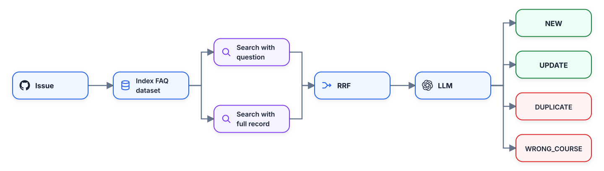
  <figcaption>How a user-contributed FAQ issue is classified and handled</figcaption>
  <!-- The workflow searches the FAQ in two ways, combines the rankings, and asks the LLM to classify the contribution before opening a pull request or closing the issue -->
</figure>

## FAQ Automation Evaluations

When the first version of the script was created, we didn't have any evaluation set. I mostly relied on my gut feeling. But as more people started using it, the number of incorrect decisions incresed. I needed to improve it. Naturally, I didn't want to fix it blindly and just hope for the best: I needed a proper evaluation framework.

For creating it, I used those incorrect decisions. I analyzed the issues where I needed to manually adjust the result, and focused on the cases that were sufficiently different from each other.

Not all decisions made by the script are equal. If the agent makes a mistake in a `NEW` or `UPDATE` decision, it's easy to correct. I use AI assistants to help me with that.

But if the decision is `DUPLICATE` or `WRONG_COURSE`, the PR will never be created, and the issue will be closed. In this case, I will not even have a chance to review them. Thus, a mistake in this case is way more expensive. Which means, I had to give these cases more importance in the eval set to make sure that these cases don't happen often.

There's also a problem with collecting the evals data from historical decisions. The FAQ data is constantly changing, so we have to use a "leave-one-out" setup.

When the script decides that something is `NEW` and we later use it in the evals, it's no longer `NEW`: the item was already merged into the dataset. So if we run it with the same issue again, it will say `DUPLICATE` instead of `NEW`.

In order to properly test the `NEW` cases, we therefore need to remove the record from our dataset. So if we have 200 records, and the record `D` is the one we added, we remove the `D` and test this case against the remaining 199 records.

<figure>
  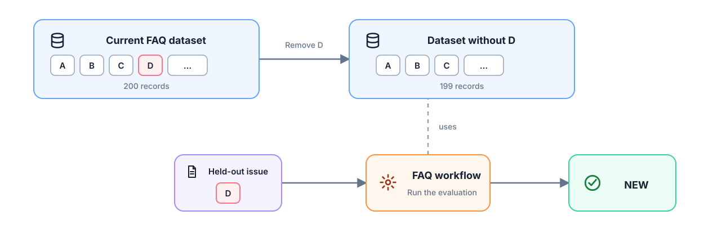
  <figcaption>Leave-one-out evaluation for a historical NEW decision</figcaption>
  <!-- Record D must be removed from the current dataset before replaying its original issue; otherwise the evaluator sees the already-merged record and returns DUPLICATE -->
</figure>

When I analyzed all my past corrections, the most common error turned out to be incorrect section placement. For example, instead of placing a record about projects in the "Project" section, it would place it in "General". My eval set also tests for that.

Right now I have 61 cases:

- 38 expecting `NEW`
- 10 expecting `DUPLICATE`
- 7 expecting `WRONG_COURSE`
- 4 not expecting `WRONG_COURSE`
- 2 expecting `UPDATE`

In addition to testing the whole flow, I have a retrieval-only evaluation set.
I use this part to test that duplicate detection works correctly. This part is less interesting, so I'll skip it. You can read more about it in the [project's README](https://github.com/DataTalksClub/faq/#retrieval).

<figure>
  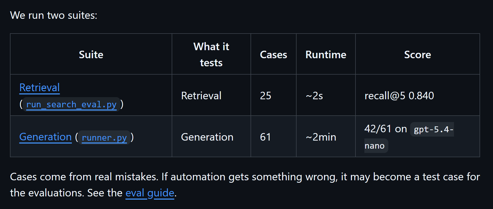
  <figcaption>The retrieval and generation evaluation suites</figcaption>
  <!-- The two suites test different layers of the automation: fast search quality and slower end-to-end classification with an LLM -->
</figure>


## Bulk Reviewing

I usually let the PRs accumulate and process them every two weeks.

For that, I use AI assistants. I have a [custom skill](https://github.com/DataTalksClub/faq/blob/main/.claude/skills/clear-backlog/SKILL.md) that lets me go through each PR and merge it as is, or fix it if it's not correct.

<figure>
  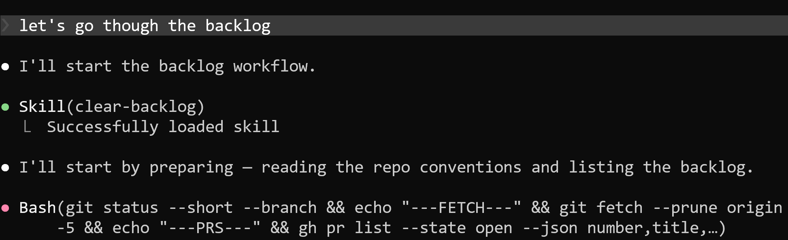
  <figcaption>Starting a bulk FAQ review with the clear-backlog skill</figcaption>
  <!-- The skill prepares the review session by loading the repository conventions and fetching the open pull requests that need decisions -->
</figure>

If I come across an interesting error, I ask the assistant to add it to our evals set. I don't try to fix it immediately. I wait till we have a few more cases, then I ask the assistant to see if there are simple ways to fix them.

If some cases can't be fixed easily, I don't sweat over it. I just let it sit in the evals with a FAIL status. I don't want the system prompt to grow too large and handle all the corner cases. But I do want to know that these corner cases exist.


## Other Sources: Slack and YouTube

Our Slack is very active. Course participants are asking questions and helping each other. In many cases, these discussions are worth saving in the FAQ dataset.

<figure>
  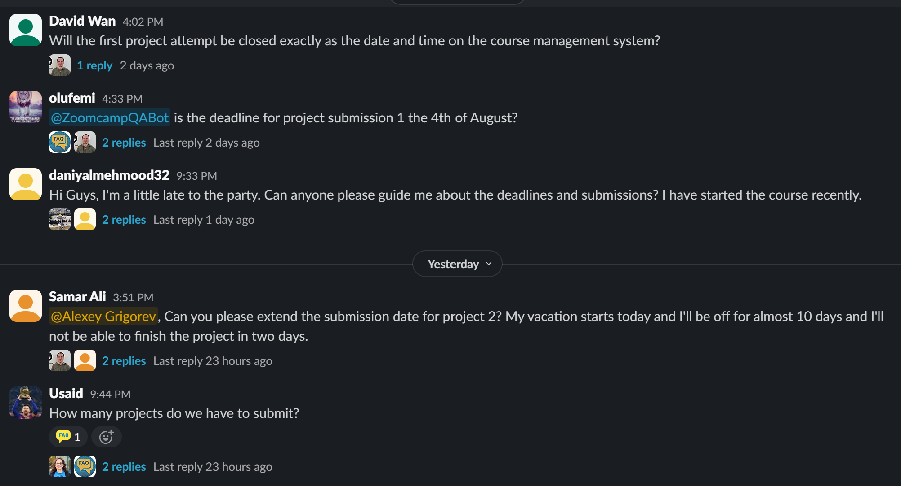
  <figcaption>Recurring deadline and submission questions in the LLM Zoomcamp Slack</figcaption>
  <!-- Repeated course questions in active Slack channels are useful candidates for durable FAQ records -->
</figure>

For that I regularly go through all the Slack threads. I ask my AI assistant to go through each thread, and if something is useful, it's saved as a new record.

Also, for each course I run a few live YouTube sessions, for example:

- pre-course Q&A session
- course launch streams
- occasional office hours

I get the transcript and use AI assistant to extract potential Q&A candidates. If there's something new, it also goes to the dataset.


## Part 1 Overview

The main focus of the first part is the dataset curation.

I review all the PRs that our FAQ automation creates in batches, and use AI to turn Slack discussions and YouTube videos into focused FAQ records.

<figure>
  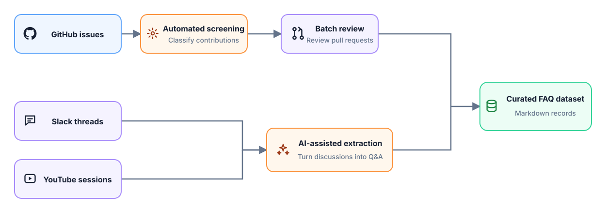
  <figcaption>Three sources, two curation paths, and one FAQ dataset</figcaption>
  <!-- Part 1 at a glance: structured GitHub contributions and extracted knowledge from Slack and YouTube converge in the same curated Markdown dataset -->
</figure>


Now let's go back to the retrieval side. This FAQ dataset is used as the main data source for the Slack bot.

## Part 2: Slack Bot

When you mention `@Au-Tomator` (my bot) or `@ZoomcampQABot` from Alex, both would perform RAG:

- Use search to fetch the candidate FAQ records
- Pass them to OpenAI
- Return the answer from the LLM and post it in the thread as a reply

`ZoomcampQABot` has a lot of moving parts though. Most of them are not straightforward to deploy to the serverless environment. So I decided to simplify it.

The first thing I dropped was indexing Slack threads and YouTube videos. I already extract this information and put it directly to the FAQ dataset, so this part is not needed anymore.

Second, I removed the vector database. I know that it improves retrieval, but at the cost of having to maintain more infra. I want to keep the setup very lean. If the bot is sometimes not right, it's not a huge problem: I and other community members can simply correct it in Slack.


## Zero-Dependency Serverless Deployment

My to-go search library for text search is minsearch. I wrote about it in [Minsearch: The Small Search Library Behind My RAG Workshops and Courses](https://alexeyondata.substack.com/p/minsearch-the-small-search-library).

However, deploing minsearch to AWS Lambda isn't trivial. When I created this library, my focus was on teaching the concepts, not on deploying it to serverless environments. Internally, it users Scikit-Learn and Pandas, and these libraries in turn pull in numpy and scipy. Normally, everyone working with data already has these libraries in their standard setup. But for Lambda, they are too heavy and take well over the 50 MB limit.

So I decided to replace minsearch with a zero-dependency search engine written entirely in pure-Python. I called it [zerosearch](https://github.com/alexeygrigorev/zerosearch). It has only one optional dependency - [stemlite](https://github.com/alexeygrigorev/stemlite), which is a stemmer I use across all my small search libraries (zerosearch, minsearch and [SQLiteSearch](https://alexeyondata.substack.com/p/how-i-built-sqlitesearch-a-lightweight)).


<figure>
  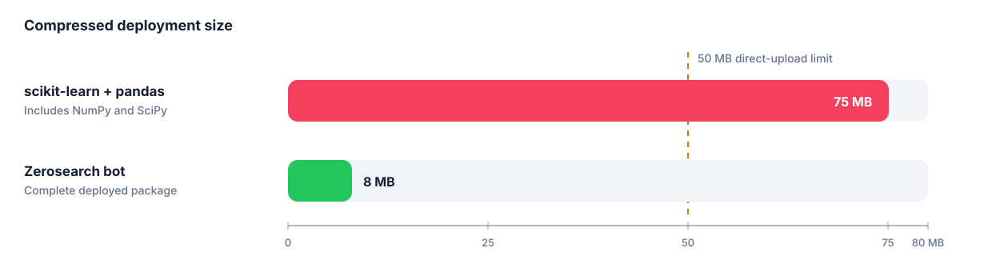
  <figcaption>The scientific Python stack exceeds Lambda's direct-upload limit; the Zerosearch deployment fits comfortably</figcaption>
  <!-- The scientific stack measurement uses compressed CPython 3.12 manylinux x86-64 wheels and includes transitive dependencies. Pydantic is intentionally excluded because its serverless problem is the compiled Rust core and cold-start overhead, not crossing the 50 MB limit by itself -->
</figure>

Another challenge was Pydantic. We typically use for structured output, and it works fine in usual environments, but it's not trivial to get it right for Lambda. It has a compiled Rust core, and you need to make sure the binaries that you send package into your Lambda deployment are compatible. Plus, loading the binaries core and building the model schemas adds to the cold start time.

So I removed it along with `requests` and did all the calls to OpenAI using only the standard library.

## Keeping the Index Fresh

Then I started thinking about what to do with updating the index. If a record in the FAQ changes, the search needs to reflect it. Alex solved that by pulling in data using a daily cron job. But I wanted to do this as soon as the data in FAQ changes.

Almost all my projects have a CI/CD workflow: when I push to main, the code change is propagated to a live environment. I usually use it for code changes, but for this project I did the same for data changes too.

When a push happens, I re-build the whole index, and push it together with the source code in Lambda. It's quite small: it's 8 MB total.

Once it's deployed, the lambda loads the local updated index, and can serve the fresh data.

<figure>
  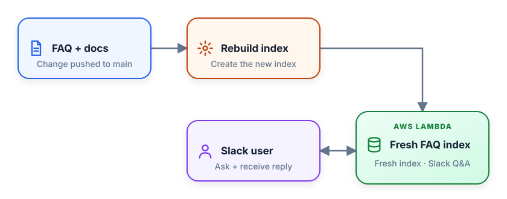
  <figcaption>Every push rebuilds and deploys the index used by subsequent Slack requests</figcaption>
  <!-- The upper path refreshes the deployed index; the lower path shows the user exchanging questions and replies with the same Lambda -->
</figure>


## FAQ Assistant Retrieval Evaluation

I replaced vector search with text search, and used zerosearch to make it fast and work well in Serverless. But it would still lose to vector search in terms of retrieval quality.

How can I make sure I squeeze the absolute best from text search? For that I needed to have a proper evaluation set.

I built the ground truth dataset from real Slack threads:

- Get a Slack dump with all the course channels
- Take all the Slack threads (9,900 of them)
- Filter them down to keep actual questions

At the end, I had a sample of 130 records:

- 60 for Data Engineering Zoomcamp
- 40 Stock Markets Analytics
- 30 AI Dev Tools

For each of the questions, I found and marked the correct documents in the index. Then I evaluated the hit-rate and MRR at k=1,3,5.

Once I had this dataset, I could start experimenting with search optimization.

I tried multiple options:

- Taking raw question as is
- Keyword expansion
- Different variants of query rewriting

The best option takes a Slack message and turns it into a bunch of keywords while preserving exact error messages, tool names, commands and filenames.

For example, it turns this Slack message:

> Does anyone know why minsearch fails when I run `uv run python index.py`? I get `KeyError: 'course'` after renaming `documents.json` to `faq.json`.

The resulting keywords are:

```text
minsearch FAQ indexing course field "KeyError: 'course'" "uv run python index.py" index.py documents.json faq.json
```

For query rewriting I use `gpt-4o-mini` because it's fastest and cheapest, but for the actual generation I rely on `gpt-5.4-mini`. 

## FAQ Assistant Generation Evaluation

In the previous part I explained how I evaluate search. I also evaluate generation.

For the evaluation dataset, I collect feedback from Slack. When a bot answers a question, and somebody corrects it or add something extra, it means that the bot couldn't answer the question properly. So we can include it in the evals.

So far it's not large and has a few cases like:

- the answer from the bot is incomplete
- the answer is incorrect
- the search doesn't find anything

Most of the time the way to fix these problems is not tuning the prompt, but going back to the FAQ dataset and seeing why a record wasn't retrieved, or why it didn't contain the correct information.

Then I'd fix the record, re-run evaluation, and re-deploy the bot.


## Deploying with Au-Tomator

I already use Au-Tomator to help me with Slack management. I wanted to use the existing setup, not create a new Slack bot.

I already have two Lambdas for Au-Tomator. I described them in [Building and Maintaining a Slack Moderation Bot for an 88k-Member Community](https://alexeyondata.substack.com/p/building-and-maintaining-a-slack):

- The router: routes and filters Slack events. It also makes sure we acknowledge the request from Slack quickly within 3 seconds (a requirement from Slack)
- The automator: the moderation bot itself, which handles all the other Slack events

And I added the third one:

- The FAQ assistant: rewrites the question, searches the index, generates the answer, and returns it to the automator

Now when you mention the bot, it first goes to Au-Tomator, and then Au-Tomator sends it to the FAQ assistant. The assistant gets in the question, and send the answers. Posting the response to Slack is handled by Au-Tomator.

<figure>
  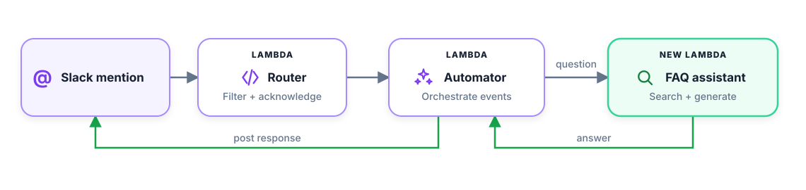
  <figcaption>Au-Tomator routes Slack events to the FAQ assistant and posts the generated answer back to Slack</figcaption>
  <!-- Gray arrows carry the request through the three Lambdas; green arrows carry the answer back through the automator to Slack -->
</figure>

As a bonus, now with this setup, I can trigger the FAQ assistant with `:faq:` reaction. Previously this reaction would only post a message to the Slack thread saying "Go check the FAQ".

<figure>
  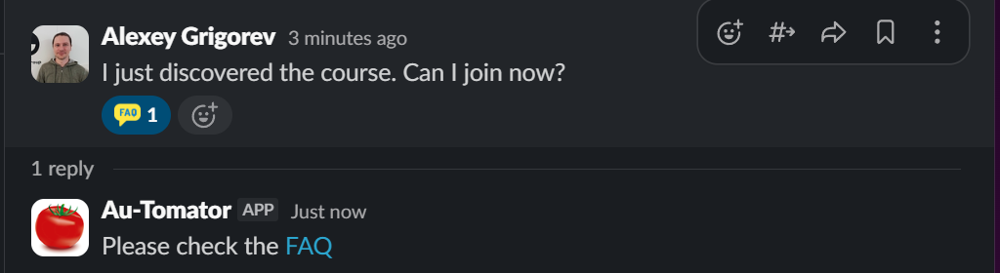
  <figcaption>Before the migration, the :faq: reaction just dropped a static 'check the FAQ' link - no answer was generated</figcaption>
  <!-- The old behavior: the reaction fires a canned reply and the member is left to go read the FAQ themselves. This is what the new setup replaces with a generated answer -->
</figure>

Now it actually checks the FAQ and generates the answer.

<figure>
  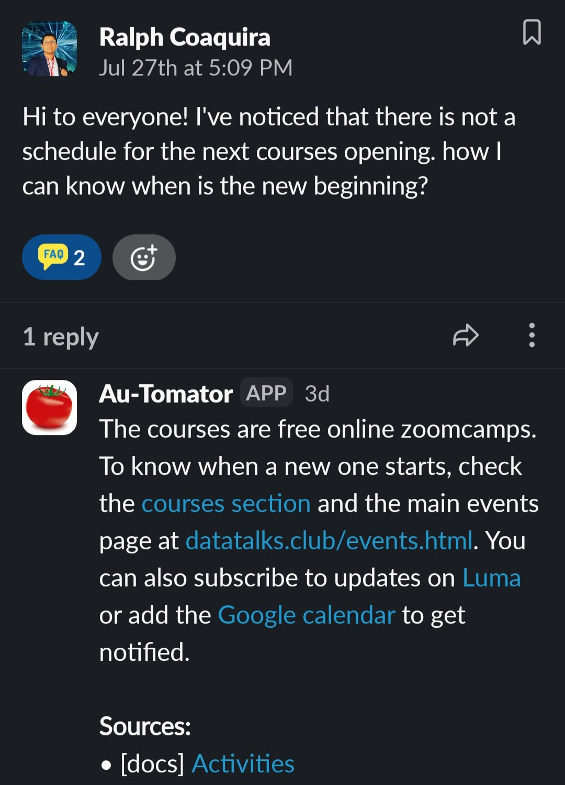
  <figcaption>The bot processing the :faq: reaction</figcaption>
  <!-- Shows both new capabilities in one screenshot: the reply was triggered on a message that never mentioned the bot, and because the channel sits outside the course channels the answer comes from the documentation only, which is why the single cited source is [docs] Activities -->
</figure>

### Part 2 as a diagram


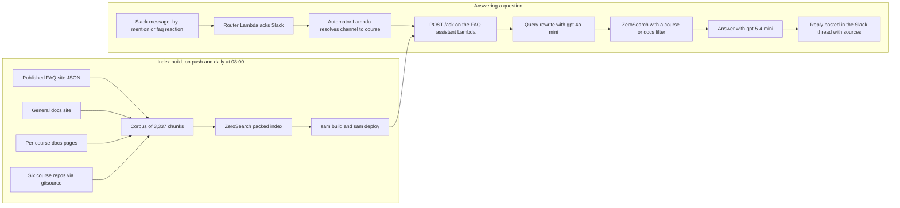

## The full picture

Here are both parts in one diagram, from where a question comes in to where the answer goes back out.

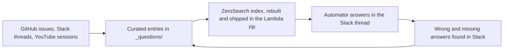

Following the diagram end to end:

- A question shows up somewhere - a GitHub issue, a Slack thread, or a live session - and becomes a curated FAQ entry, either through an agent's pull request that I review, or a direct commit.
- A build job turns the FAQ into a ZeroSearch index, together with the docs site and the course repos - about 3,300 chunks in total - and ships that index inside the Lambda zip, on every push and once a day.
- When someone asks something in Slack, Automator works out the course scope, asks the assistant, and posts the answer back in the thread with its sources.
- Anything the bot got wrong or couldn't answer gets pulled back out of Slack as a new FAQ entry, and is searchable again by the next morning.

Two evaluations sit across all of this: one on the agent that decides what goes into the FAQ, one on the retrieval that gets it back out. Neither runs in CI - both run on real cases that came from real mistakes.

The whole runtime is three Lambdas, one zero-dependency search library, and no database.
