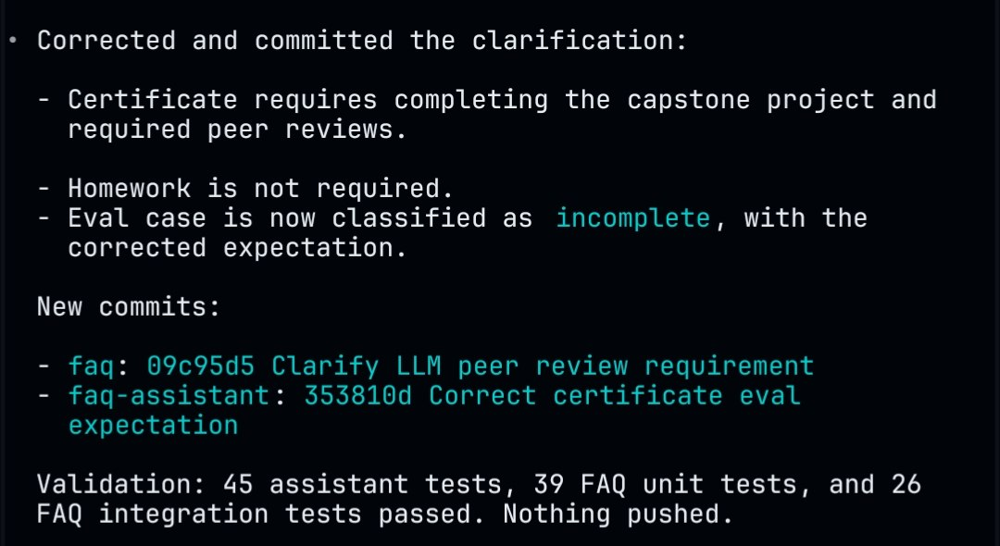

# Moving the FAQ Assistant onto Automator

Idea for a new article. There is already a published article about the FAQ bot - [From Google Docs to an Automated FAQ System for DataTalks.Club Courses](https://alexeyondata.substack.com/p/from-google-docs-to-an-automated). Since then I updated the FAQ assistant: I migrated it to Automator, and Alex Litvinov, who created it and hosted it, no longer needs to maintain it. The new article should describe how I went about it[^1].

Automator is the Slack bot behind the DataTalks.Club Slack workspace, described in [Building and Maintaining a Slack Community](https://alexeyondata.substack.com/p/building-and-maintaining-a-slack).

## What the migration looks like in practice

Once the assistant runs on Automator, correcting an answer is no longer a manual edit followed by a manual test run. The agent takes the correction, fixes the content, commits it to the right repositories, and reports back what it changed and what it verified[^1].

<figure>
  
  <figcaption>An Automator run correcting the certificate requirement in the FAQ</figcaption>
  <!-- Concrete example of the workflow the new article should describe: a correction goes in, the agent commits it across the faq and faq-assistant repos and reports the test results -->
</figure>

The run in the screenshot corrected a clarification about certificate requirements: the certificate requires completing the capstone project and the required peer reviews, homework is not required, and the evaluation case was reclassified as incomplete with the corrected expectation. It produced two commits - `09c95d5` in the faq repo clarifying the LLM peer review requirement, and `353810d` in the faq-assistant repo correcting the certificate evaluation expectation. Validation ran 45 assistant tests, 39 FAQ unit tests, and 26 FAQ integration tests, all passing, with nothing pushed[^1].

## To fill in

- How the assistant was wired into Automator and what triggers a run
- What the agent is allowed to change on its own and what still needs review before pushing
- What maintenance used to require before the migration, for the before-and-after comparison

## Sources

[^1]: [20260715_101244_AlexeyDTC_msg4773_photo.md](../inbox/used/20260715_101244_AlexeyDTC_msg4773_photo.md)
