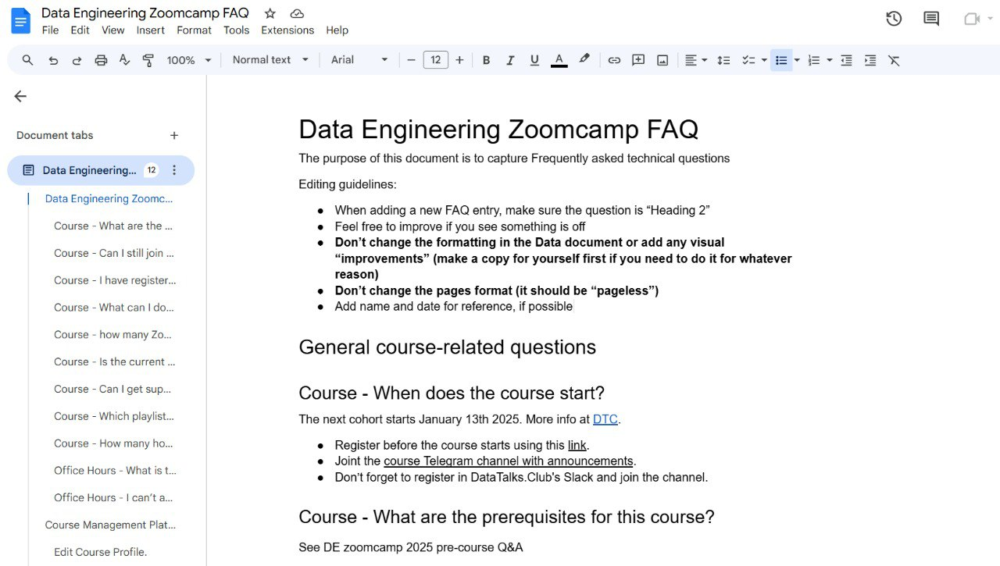
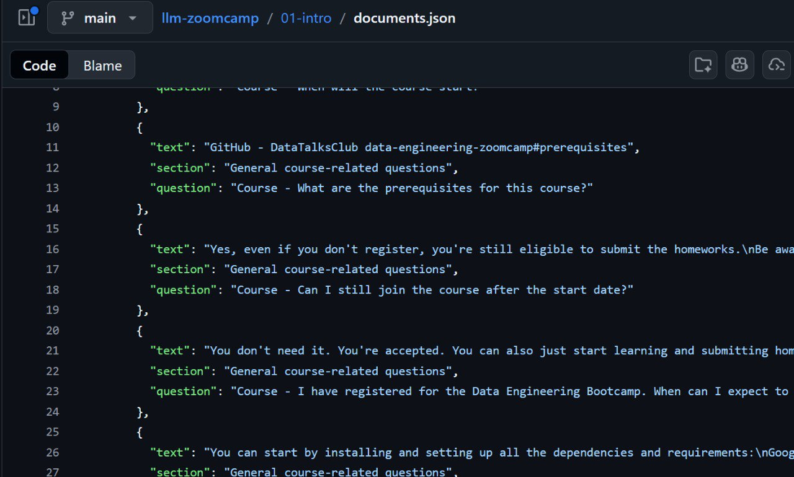
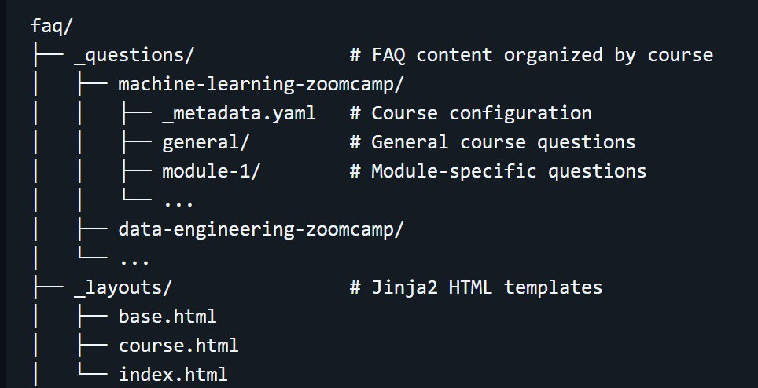
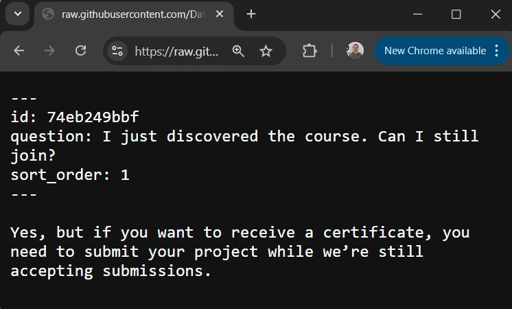
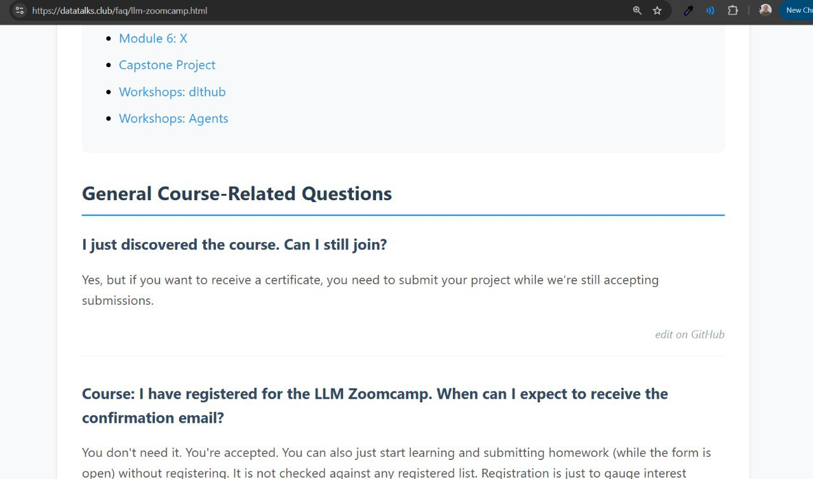
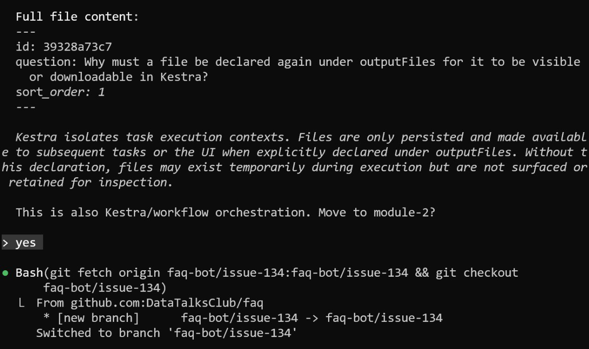

# FAQ System for Course Management

The DataTalks.Club FAQ system is a community-driven knowledge base.

We also use RAG (Retrieval-Augmented Generation) to automate content management. Students can propose FAQ entries, and an AI agent intelligently triages them into new entries, updates to existing entries, or duplicates[^1].

## Why This System Exists

Online courses generate many questions from students. Having a central FAQ helps students find answers quickly, but maintaining it manually is time-consuming. The FAQ system automates the repetitive work while keeping humans in control for quality decisions[^2].

**Links**: The FAQ website is at https://datatalks.club/faq/ and the repository is at https://github.com/DataTalksClub/faq

## How It Started: Google Docs Era

Before the current system, FAQs were stored in Google Docs. Each course had a single document open for anyone to edit. This was lightweight, anyone could contribute, but it had problems:

- No moderation - anyone could change or delete content
- Vandalism occurred repeatedly, requiring frequent document restores
- A Slack bot written by community member Alex Litvinov parsed these docs for RAG to answer student questions
- Formatting issues broke the parser, causing problems

<figure>
  
  <figcaption>The old FAQ format in Google Docs - editable by anyone, which led to both contributions and vandalism</figcaption>
  <!-- This shows what the FAQ looked like before the website was created -->
</figure>

## The Migration: From Google Docs to Markdown

To solve these problems, the FAQ needed to move to a proper website with moderation. The migration involved several steps:

### Parsing Google Docs

Code already existed to parse Google Docs into JSON. This was developed for the LLM Zoomcamp course, where RAG is a core topic. The process:

1. Download Google Doc as DOCX
2. Use Python's `docx` module to extract content
3. Preserve structure using headers to identify where questions end and answers begin
4. Output clean JSON with text, section, and question fields

<figure>
  
  <figcaption>The JSON format used for parsing - each entry has text, section, and question fields for RAG indexing</figcaption>
  <!-- This was the intermediate format for processing FAQ content -->
</figure>

### Structuring the Content

The new structure organizes FAQs by course, then module, then individual questions.

Each question is a separate markdown file with frontmatter metadata.

<figure>
  
  <figcaption>The repository structure - questions organized by course and module, with Jinja templates for site generation</figcaption>
  <!-- Shows how the FAQ content is organized in the repository -->
</figure>

### Content Processing with LLM

Converting from Google Docs to clean markdown took several evenings of work:

- Sent content to OpenAI API with formatting instructions
- Fixed grammar, converted code images to actual code blocks, standardized structure
- Added proper frontmatter for each entry
- Made everything consistent across all courses

## The Static Site Generator

Initially, Jekyll was considered for generating the site. However, a problem emerged: the Analytics Engineering module uses Jinja templates in its content, and Jinja conflicted with Jekyll's Liquid templates. Despite spending an evening trying different approaches, it wouldn't work properly[^4].

The solution was to write a custom static site generator in Python instead. The `generate_website.py` script does essentially what Jekyll does, but with limited scope:

- Uses Jinja2 for HTML templates
- Parses markdown with frontmatter
- Generates static HTML pages
- Recently added JSON export for machine-readable access

The JSON export is used in AI Engineering Buildcamp when teaching RAG examples. Students can simply fetch the JSON and use it directly with minsearch for a Q&A system[^5].

<figure>
  
  <figcaption>Each FAQ entry is a markdown file with ID, question, sort order, and answer content</figcaption>
  <!-- This shows the format that contributors' content becomes -->
</figure>

<figure>
  
  <figcaption>The final result - the FAQ website at datatalks.club/faq/llm-zoomcamp.html with navigation by module</figcaption>
  <!-- This is what users see and what contributors help build -->
</figure>

**Links**: https://github.com/DataTalksClub/faq/blob/main/generate_website.py

## The FAQ Automation Bot

The automation system uses RAG to triage new FAQ proposals. When someone wants to add a question, they create a GitHub issue with the `faq-proposal` label[^6].

### The Workflow

1. User creates an issue with course, question, and answer
2. GitHub Actions triggers the `faq-automation.yml` workflow
3. RAG agent searches existing FAQs for similar questions
4. LLM makes a decision: NEW, UPDATE, or DUPLICATE
5. Based on decision:
   - NEW or UPDATE: Creates branch, updates FAQ files, opens pull request
   - DUPLICATE: Posts explanation comment and closes issue
6. Human reviews and merges the pull request

### The Decision Model

The RAG agent in `faq_automation/rag_agent.py` uses a structured output model with these fields:

- `action` - NEW, UPDATE, or DUPLICATE
- `rationale` - 1-2 sentences explaining the decision
- `document_id` - Which FAQ entry to act on
- `section_id` - Which section this belongs to
- `section_rationale` - Why this section was chosen
- `order` - Where in the section this FAQ should appear
- `question` - The final question text
- `proposed_content` - The merged answer (for NEW and UPDATE)
- `filename_slug` - File-system friendly slug (for NEW)

**Links**: https://github.com/DataTalksClub/faq/blob/main/faq_automation/rag_agent.py

### Why This Matters

This is RAG applied beyond simple question-answering:

- Content triage - Automatically deciding where new content belongs
- Deduplication - Identifying when a proposal is already covered
- Content merging - Combining new information with existing answers
- Maintaining structure - Ensuring FAQs go in the right section and order

The human still reviews the pull request, but RAG handles the repetitive work of searching, comparing, and organizing.

## Community Contributions

A key part of this story is community involvement. During Hacktoberfest, a community member named Fred implemented the GitHub Actions orchestration that turns the issue-based workflow into pull requests automatically. The prototype existed as a notebook, but he built the automation infrastructure[^7].

Students contribute by filling out the FAQ proposal form with course, question, and answer. The bot handles the rest, creating appropriate pull requests for review.

**Links**: https://github.com/DataTalksClub/faq/blob/main/CONTRIBUTING.md

## Using Claude Code for Pull Request Review

The FAQ bot sometimes makes mistakes - it might categorize a question in the wrong module or miss context. For example, questions about Kestra (workflow orchestration) should go in module-2, not general. Initially there was no automated way to fix these issues[^8].

<figure>
  
  <figcaption>The FAQ bot sometimes misclassifies entries - here it correctly suggests moving from general to module-2 (workflow orchestration)</figcaption>
  <!-- Shows the bot can recognize when it made a mistake and suggest fixes -->
</figure>

### The Interactive Review Process

GitHub CLI (`gh`) combined with Claude Code creates an efficient review workflow:

1. Run `gh pr list` to see all open pull requests from the bot
2. For each PR, examine the changes
3. Tell Claude: "Change the category to module-2" or "This is also workflow orchestration, move it"
4. Claude makes the edit, switches to the branch, and pushes the change
5. Merge the corrected PR and delete the branch

This happened during one session: after correcting a few pull requests, Claude started recognizing the pattern and suggesting fixes proactively. When it saw another incorrectly categorized question, it offered to move it without being asked[^9].

### Benefits Over Full Automation

This approach has advantages over trying to build everything into the bot:

- Human control maintained - nothing gets merged without review
- Faster than creating automated feedback systems in GitHub Actions
- Can clean up duplicates and other issues during the weekly review
- Claude learns patterns and becomes more helpful over time
- No complex automation needed - just an interactive skill or command

The FAQ bot uses a simpler model for cost efficiency. During review, Claude (with a better model) can spot patterns the simpler model missed and provide corrections[^10].

### From Mistakes to Improvements

After the review session, the next step is updating the FAQ agent based on what was learned. By showing Claude the mistakes and corrections, we can improve the bot's future decisions. This creates a feedback loop where each review session makes the system better[^11].

## RAG Beyond Question-Answering

The FAQ system demonstrates that RAG is useful for more than just answering questions:

- Customer support - Routing tickets to the right team, suggesting responses
- Recommendation systems - Finding similar products, articles, or documents
- Research assistance - Literature review, finding related papers
- Fact-checking - Verifying claims against a knowledge base
- Code assistance - Searching codebases for relevant examples
- Education - Creating study materials or quizzes from content
- Writing assistance - Suggesting related content to include
- Content management - The FAQ system itself

The pattern is consistent: search for relevant context, then use an LLM to process that context for a specific task[^12].

## Sources

[^1]: [20260207_171105_AlexeyDTC_msg1128.md](../inbox/used/20260207_171105_AlexeyDTC_msg1128.md) - RAG for Content Management course material
[^2]: [20260207_170725_AlexeyDTC_msg1126_transcript.txt](../inbox/used/20260207_170725_AlexeyDTC_msg1126_transcript.txt) - Voice message explaining the FAQ bot workflow
[^3]: [20260207_172620_AlexeyDTC_msg1139_transcript.txt](../inbox/used/20260207_172620_AlexeyDTC_msg1139_transcript.txt) - Using FAQ data for RAG examples in LLM Zoomcamp
[^4]: [20260207_173142_AlexeyDTC_msg1156_transcript.txt](../inbox/used/20260207_173142_AlexeyDTC_msg1156_transcript.txt) - Jekyll vs Jinja template conflicts
[^5]: [20260207_173456_AlexeyDTC_msg1162_transcript.txt](../inbox/used/20260207_173456_AlexeyDTC_msg1162_transcript.txt) - JSON export for AI Engineering Buildcamp
[^6]: [20260207_171105_AlexeyDTC_msg1128.md](../inbox/used/20260207_171105_AlexeyDTC_msg1128.md) - FAQ automation workflow documentation
[^7]: [20260207_171156_AlexeyDTC_msg1129_transcript.txt](../inbox/used/20260207_171156_AlexeyDTC_msg1129_transcript.txt) - Hacktoberfest contribution story
[^8]: [20260207_170725_AlexeyDTC_msg1126_transcript.txt](../inbox/used/20260207_170725_AlexeyDTC_msg1126_transcript.txt) - FAQ bot makes mistakes with categorization
[^9]: [20260207_171552_AlexeyDTC_msg1132_transcript.txt](../inbox/used/20260207_171552_AlexeyDTC_msg1132_transcript.txt) - Using Claude Code to review and fix PRs interactively
[^10]: [20260207_171552_AlexeyDTC_msg1132_transcript.txt](../inbox/used/20260207_171552_AlexeyDTC_msg1132_transcript.txt) - Bot uses simpler model, Claude uses better model during review
[^11]: [20260207_170725_AlexeyDTC_msg1126_transcript.txt](../inbox/used/20260207_170725_AlexeyDTC_msg1126_transcript.txt) - Learning from mistakes to improve the agent
[^12]: [20260207_171105_AlexeyDTC_msg1128.md](../inbox/used/20260207_171105_AlexeyDTC_msg1128.md) - Other RAG applications beyond QA
