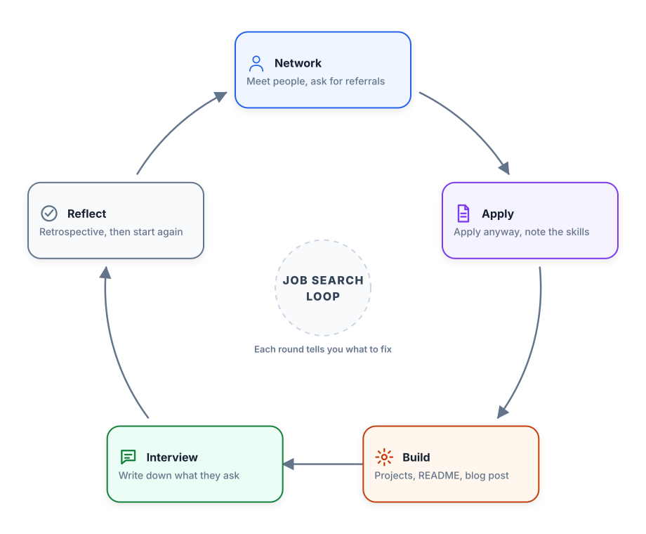

# Getting an AI Engineering Job

Back in 2020 I made a video. It was the first video on my channel, and it was a talk about how to get a job in data science[^3]. Despite all the changes that have happened on the job market since then, the algorithm from that talk still works. In this article I want to update it and adapt it to the realities of AI engineering[^1].

The overall algorithm stays the same. What changes is what you build, what they ask you, and how many of the rounds now involve an AI assistant sitting next to you.

## The Job Search Algorithm

The algorithm is simple in steps but requires a lot of work:

1. Network - go on LinkedIn, connect to people, attend meetups
2. Apply - apply to jobs regardless of qualifications
3. Build - do pet projects, share them online
4. Interview - note what they ask, improve
5. Repeat

## Networking

Connect to everyone you know on LinkedIn and also to people you don't know. Find people from your university, from your city, people who work in the field where you want to work.

Focus on people rather than programs. If you are a junior, talk to other juniors who recently got a job in this field. What did they do? What did they go through? What kind of companies did they apply to? Is their company still hiring? These are the things worth asking about[^2].

Ask if they have other open positions - chances are they do. They will often be happy to refer you because many companies give a referral bonus when a referred person gets hired.

Be active and share content online. Learning in public is the point here: write about what you are figuring out while you are figuring it out. This way you get noticed more easily.

## Applying to Jobs

When you look at job listings, apply anyway regardless of what you see. Descriptions often describe a perfect candidate who doesn't exist. The hiring manager has a perfect candidate in their head and writes a description of this person, but they will have trouble finding them. So even if you think you're not qualified, apply anyway - companies will see they can't find the perfect candidate and decide the available candidate is also fine.

When looking at job postings, note what skills they ask for. If you see something like LangGraph or Google's Agent Development Kit popping up in many job postings, you should learn it[^2]. Applying is also how you collect the list of things worth building next.

## Build

Building is where the skills you saw in job postings turn into something you can show. Do a small pet project with the library or framework you keep seeing, put the code on GitHub, and write about it.

Choosing what to build matters more than how much you build. I wrote a full guide on this: [Choosing a Portfolio Project. The Definite Guide](https://alexeyondata.substack.com/p/choosing-a-portfolio-project-the). It covers a repeatable six-step framework - pick a domain, find companies, analyze job descriptions and engineering blogs, extract the problems, find shared themes, then design a project matching the target companies' tech stack. It also covers the four project types (role-targeted projects, personal projects, take-home assignments, and hackathon or open-source work) and the difference between spray-and-pray and domain-based strategies[^2].

Once the project exists, write about it. A blog post is good, and a proper README is mandatory. The README is the first thing a hiring team sees when they open your repository, and often the only thing they read. This matters enormously for your projects - a good project with no README looks like an abandoned folder of scripts.

I have a separate guide for that too: [How to Write a Good README](https://alexeyondata.substack.com/p/how-to-write-a-good-readme). It goes through the 16 sections a project README should have, organised around four questions - what is this project, does it work well, can I run and reproduce it, and how was it built - plus limitations, future work and self-evaluation. It is written for three audiences at once: peer reviewers, hiring teams, and your future self[^2].

## Interviews

An interview is not an exam - it's a two-way process. You also assess the company. Do as many interviews as you can. After each interview, write down the questions you got and do a retrospective: think about what went well and what you can do better next time.

Rejections are fine. There can be millions of reasons: they hired a different candidate, they ran out of money, the company went bankrupt. Don't take them personally. Just keep interviewing.

## The Interview Stages

Only about 4.5% of the 1,765 AI Engineer job descriptions I analysed spell out their interview process, but the ones that do converge on a similar shape[^4]. The median process has 4 steps, most companies fall in the 3 to 5 range, a few lean processes have just 2 stages, and the longest reach 7.

The steps that appear most often:

1. Recruiter or talent screen - usually 15-30 minutes
2. Technical interview - live coding, system design, or code review
3. Hiring manager interview - a 45-60 minute deep dive
4. Behavioral interview - values and culture
5. Take-home challenge - typically 2-3 hours
6. Panel interview - multiple interviewers
7. CEO or founder interview - usually the final step, 15-30 minutes

Not every company includes all rounds. In total, expect 3 to 6 rounds spread over 2 to 6 weeks[^4]. One company I know of had just an initial call followed by a paid trial day[^5].

## Initial Call with Recruiter

A general introduction: the recruiter explains what the company does and what the position is about, then asks you to tell about yourself.

Tips:
- Recruiters aren't technical but may ask technical things - keep replies simple, not too technical
- Prepare a short introduction about yourself (a few sentences) and learn it by heart
- They will ask about salary expectations

## Salary Expectations

Two approaches:
- Say the number upfront - useful when you already know the market and have experience
- Postpone the conversation - works when entering a new field, relocating, or when you don't know the market yet

Regardless of which approach you choose, do research and have a number in mind. Recruiters can be pushy and may not accept "let's talk later" as an answer.

## Hiring Manager Interview

Usually 45-60 minutes with the person you would report to[^4]. It is typically a deep dive into your projects plus theory questions[^5].

This is the round where your portfolio projects actually get used. Expect to be asked why you made specific decisions, what you would do differently, and what broke along the way. If you built the project with an AI assistant, expect questions about how exactly you used it, how you gave instructions, and how you made sure the agent did not make mistakes. An answer like "I gave a prompt and everything worked on the first try" invites more questions, because it never works on the first try[^6]. Many iterations with the assistant is the valuable answer, and it is a genuinely useful skill.

## Theoretical AI Engineering Questions

The old version of this round was theoretical data science and machine learning questions: what is linear regression, what is overfitting, what is the ROC curve. For AI engineering roles, the topics have moved.

The round is typically 45-60 minutes and conversational. Theory questions rarely appear as a standalone round - they are usually woven into other rounds: system design, project deep dives, or dedicated AI/ML technical screens[^4].

The topics that come up:

- LLM practice - how LLMs work and how to control their behavior, without going into architecture internals
- RAG systems - connecting LLMs to external knowledge so they answer from your data
- Agents and tool use - LLM-powered systems that can reason and take actions
- Testing and evaluation - the AI equivalent of software QA, made harder by non-deterministic outputs
- Monitoring - what happens after you deploy
- Cost and latency optimization - making AI systems affordable and fast
- Safety and guardrails - preventing your AI system from being exploited or causing harm

Fine-tuning, training, and transformer internals are not asked by default. They come up when the job description specifically requires them. If the posting doesn't mention fine-tuning or transformer internals, you're unlikely to be asked about them[^4].

Questions I collected for the field guide give a good sense of the level:

- What is temperature and top-p sampling? How do they affect outputs?
- What is the context window and what happens when you exceed it? How do you handle long documents?
- What's RAG? Explain the complete process.
- Text vs vector search. When would you use each?
- You're making a system for huge PDF reports. How would you process them?
- What are common RAG failure points and how do you debug them?
- How do you scale a RAG system to 10M+ articles?
- What makes an AI system agentic?
- When is an agent the wrong solution?
- How do you detect and stop infinite planning loops?
- How do you handle tool failures, retries, and idempotency?
- How do you build a golden dataset for evaluation?
- How do you debug a RAG chatbot giving confident but wrong answers?
- What is time to first token and why does it matter for user experience?
- What is model tiering? When do you route to a small distilled model vs a large LLM?
- Estimate the budget for a RAG pipeline at enterprise scale, for example 300,000 legal contracts.
- How do you protect against prompt injection and jailbreaking?
- Your application generates code that gets executed. How do you prevent malicious code generation and execution?

I published a longer set with answers and downloadable cheatsheets: [50 Theory Interview Questions for AI Engineer Roles](https://alexeyondata.substack.com/p/50-theory-interview-questions-for).

The interviewer doesn't expect detailed answers. A few sentences that answer the question on an intuitive level are enough, without going deep into mathematics. If they ask something you don't know, be upfront about it - the interviewer will give a hint or move to another question.

## Coding Screening

A technical screening, often done online using platforms like CoderPad or even Google Docs. Sometimes on-site on a whiteboard.

Python and SQL are the important languages. Some companies treat AI engineers as software engineers and also check computer science basics (data structures, algorithms).

For basic coding, they check if you know Python basics - lists and sets, dictionaries, loops and if statements.

Coding rounds split into two kinds[^4]:

- Implementation rounds, 45-90 minutes. Usually a single problem with multiple levels that build on each other, so your code has to be extensible because each level builds on the previous one.
- Algorithm rounds, 25-70 minutes. LeetCode-style problems.

Implementation problems I have seen:

- Implement a website crawler (this is one I got myself)
- Refactor 100-120 lines of convoluted, deeply nested code
- Build a key-value database, starting with basic SET/GET/DELETE, then adding scan and prefix scan, then timestamped operations and TTL
- Implement SQL-like operations on an in-memory database
- The Unix cd command with symbolic link resolution
- A credits management system - track credit state across issued and used credits with different expiration rules and usage requirements, with increasing complexity

Algorithm problems I have seen:

- RLE encoding (another one I got myself)
- Prime numbers between 0 and 100
- LRU cache with O(1) time complexity
- Find the Excel column name from its column number (column 702 is "AAA")

For algorithmic questions, check with the recruiter first whether this is part of the process. If it is, LeetCode is a great source for practice. When solving exercises, take notes so you can come back and review them later.

The most likely case is still that you will be asked to write a simple algorithm without using AI. But more and more companies now include AI-assisted coding in the interview.

Whether it is allowed depends on the company. Some allow it, some do not. They will usually tell you. For LeetCode-style problems, most companies still want you to solve them without AI. For larger implementation tasks, some companies allow AI and evaluate how you steer the assistant[^5].

This is changing, but not everywhere. Some companies now allow coding agents and focus on walking through the solution. But many companies still use classical whiteboard interviews. The reasoning is: "what if the internet is down, can you still program?" Whether LeetCode is a good way to check that is debatable, but companies still do it and it is not going away anytime soon[^6].

Some processes now test both sides explicitly. Microsoft has run an applied AI/ML process where the first round is entirely AI-assisted and the second round bans AI tools, which tests AI-augmented productivity and baseline coding skill separately[^4]. When AI is allowed, what is being evaluated is judgment, not typing speed - the biggest pitfall is not understanding what the assistant is about to do and letting it make the decisions for you.

## Home Assignments

A task to do at home: they give you a dataset or a problem and ask you to build something. Do not be surprised by a home assignment - it is a normal part of the process. For AI engineering roles they usually take 2-3 hours, and most of them are RAG or agent systems[^4].

Warning signs to watch for:
- You get an automatic email with an assignment immediately after applying (the company may not even be actively hiring)
- Instructions are deliberately unclear and they say "we want to see how you deal with ambiguity"
- The task "can be solved in two hours" but requires weeks

On the positive side, home assignments are a great opportunity to add projects to your portfolio and learn new skills or libraries.

If you don't want to invest time but still like the company, you can tell them: "I already have similar projects, check my GitHub, I'm happy to continue talking without the assignment." Many will say no, but some will agree.

After the assignment, some companies have a defense session where you present your solution and discuss it. Having this step is a good sign.

## Case Study Interviews

Similar to home assignments but without code. A discussion on how to approach a problem.

Examples: "Build a model for predicting car prices - what would you do?" or a vague question like "We want to increase user engagement - how?"

For vague questions, you need to ask clarifying questions: how do we measure engagement, what do users do on the platform.

A useful approach is to start with a simple baseline, quickly iterate, roll out to production, then improve with more complex models.

These days the case study and the system design round often merge into a single AI system design round, which is where a lot of the current interview attention has moved[^2].

## System Design Interviews

Focuses on the engineering side. Examples: design a system for duplicate detection, spam detection, search autocomplete.

Traditional system design is what software engineers get (design Instagram, design an online library). For machine learning engineers and data scientists, the questions involve machine learning components.

To approach this:
- Ask as many questions as possible from the interviewers
- Break down the system into components
- Explain your reasoning for decisions (relational vs non-relational database, etc.)
- Think about what happens if load increases 10x

This is hard to prepare for because it requires experience. Best preparation comes from doing these things at work. Also look up system design resources online, go to conferences, read tech blogs. Before interviewing at a specific company, check their tech blog.

This is typically not for junior positions. Senior positions include it more often.

The difference between case studies and system design: case studies focus on the initial steps (formulating the problem for machine learning), while system design is about productionizing and engineering the solution.

## AI System Design Interviews

This one is new. AI system design is emerging as a distinct interview category, separate from both traditional software system design and classic ML system design. Instead of designing training pipelines, you design orchestration architectures around pre-trained models. Companies with a dedicated round include Doctolib ("AI System Design Interview"), Sprinter Health ("AI-Focused Systems Design"), and Anthropic (distributed search plus LLM inference at scale)[^4].

Typical questions:

- Design an AI chatbot
- Design a document Q&A assistant (a RAG system)
- Design an AI co-pilot like GitHub Copilot
- Design a hospital voice assistant
- Design ChatGPT's cross-conversation memory feature
- Design a real-time LLM-powered search engine like Perplexity

What makes it different from classic system design: the output is generated text rather than a prediction or a record, the system is non-deterministic, evaluation replaces straightforward accuracy metrics, the cost model is per-token rather than per-request, and the failure modes are hallucination and prompt injection rather than timeouts and outages alone[^4].

Four patterns are worth having ready before the round: retrieval-augmented generation, feedback and reinforcement loops, hallucination mitigation, and scalability with cost optimization.

## Behavioral Questions

Questions to see if there's a cultural fit. Examples: "Tell me about a time when you disagreed with someone," "When you needed to go beyond your duties."

Preparation:
- Research the company's values (if publicly available)
- For each value, think of 2-3 situations where you demonstrated it
- Structure answers in STAR format (Situation, Task, Action, Result)

Example in STAR format: "I had a problem with a library nobody knew. Nobody could help me, but I needed to fix it because it blocked my progress. I found an online course, took it, fixed the problem, and showed others how to do it."

If the company doesn't have public values, check Amazon's 14 leadership principles - they are a good generic set to prepare with.

## After the Interview

There are two outcomes - either you get an offer, or you don't.

If you are rejected, don't take it personally. Treat it as a learning experience. Do a retrospective and understand what went wrong (often nothing was wrong with you personally - someone was just better, or they ran out of money). If you lack some skill, build a project to improve it.

If you get an offer, don't rush into agreeing immediately. If you have interviews with other companies, finish them first. Once you get the first offer, tell other companies about it to speed up their process. Having multiple offers is the ideal situation for negotiating salary and benefits. With just one offer, negotiation is difficult.

If you already named a salary number in the initial interview and they offer that exact number, it's hard to negotiate upward.

## The Process Is Iterative

The one thing missing from the original talk is that this is a loop, not a checklist. Reflect on what happened and go back to point number one[^2].

Every interview tells you which skill to build next. Every rejection tells you something about how you present yourself. Every conversation adds people to your network. So you network again with a better idea of who to talk to, apply again with a sharper CV, build the project the last interview showed you were missing, and interview again.

<figure>
  
  <figcaption>The job search is a loop - each round tells you what to fix in the next one</figcaption>
  <!-- Shows the five steps of the algorithm as a cycle rather than a list, with reflection feeding back into networking -->
</figure>

## Sources

[^1]: [20260805_091043_AlexeyDTC_msg4845_transcript.txt](../inbox/used/20260805_091043_AlexeyDTC_msg4845_transcript.txt)
[^2]: [20260805_091048_AlexeyDTC_msg4847_transcript.txt](../inbox/used/20260805_091048_AlexeyDTC_msg4847_transcript.txt)
[^3]: [Getting a Data Science Job - YouTube](https://www.youtube.com/watch?v=jYYR1fH8k7o)
[^4]: [AI Engineering Field Guide](https://github.com/alexeygrigorev/ai-engineering-field-guide)
[^5]: [The AI Engineer Interview Process - webinar recording](https://www.youtube.com/watch?v=qjKAqMSD4Vw)
[^6]: [Defining the AI Engineer Role - webinar recording](https://www.youtube.com/watch?v=7NijlAdqk9U)
