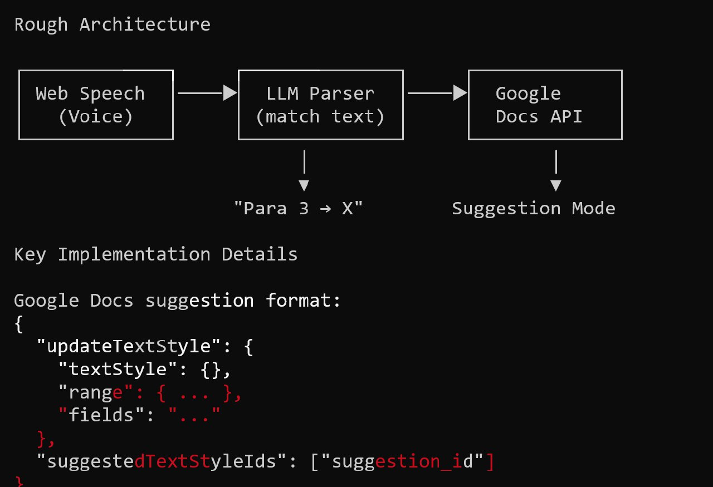
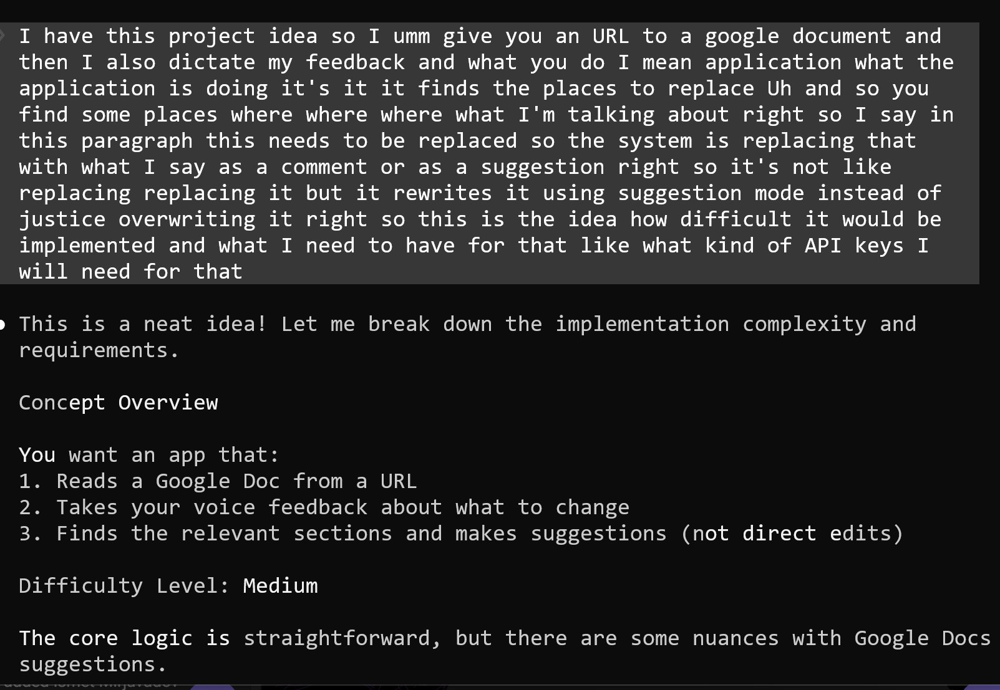
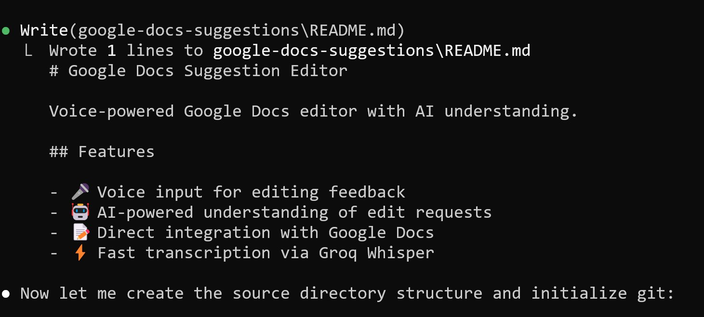
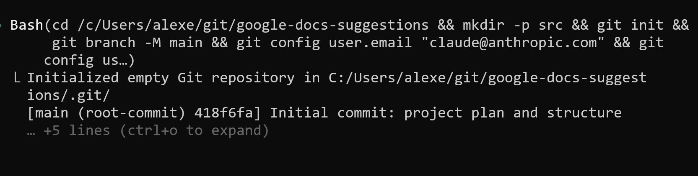
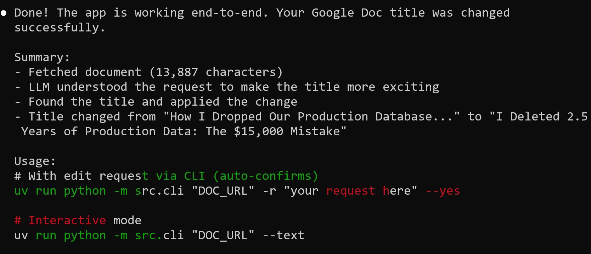

# Google Docs Voice Feedback Tool

I started a new project - giving feedback to Google Documents using voice notes[^1].

You give the app a URL to a Google Doc, then dictate your feedback about what to change. The application finds the relevant sections and applies changes - not as direct overwrites, but as suggestions or comments. So instead of manually editing, you record voice notes with corrections, and they get applied to the document automatically[^2].

This connects to the broader idea of voice-based document editing I had earlier. See [Personal Project Ideas](personal-project-ideas.md) for the original idea.

## Architecture

The rough architecture has three main components[^1]:

1. Web Speech (Voice) - captures voice input
2. LLM Parser (match text) - understands what to change
3. Google Docs API - applies the changes

Voice input goes to the LLM parser. The parser identifies what needs to change (e.g. "Para 3 -> X"). The Google Docs API then applies the change in suggestion mode.

<figure>
  
  <figcaption>Rough architecture of the voice feedback system with suggestion mode</figcaption>
  <!-- Shows the three-component architecture: Web Speech, LLM Parser, Google Docs API -->
</figure>

## Building with Claude Code

I described the idea to ChatGPT first using voice dictation (Win+H) to get an initial assessment of difficulty and requirements[^2].

<figure>
  
  <figcaption>Initial prompt dictated with Win+H describing the project concept</figcaption>
  <!-- The voice-dictated prompt explaining the concept to ChatGPT for initial assessment -->
</figure>

Then Claude Code started building the project - "Google Docs Suggestion Editor: Voice-powered Google Docs editor with AI understanding."

The features cover[^3]:

- Voice input for editing feedback
- AI-powered understanding of edit requests
- Direct integration with Google Docs
- Fast transcription via Groq Whisper

<figure>
  
  <figcaption>Claude Code setting up the project structure</figcaption>
  <!-- Claude Code writing the README and creating the source directory structure -->
</figure>

Claude set up the git repository and made the initial commit. It configured the git user email as claude@anthropic.com - Claude does not want me to take credit for its work[^4].

<figure>
  
  <figcaption>Claude does not want me to take credits for its work - see user.email</figcaption>
  <!-- Claude Code configured git with its own email address instead of the user's -->
</figure>

## First Successful Test

The first tests were successful.

The app is working end-to-end[^5]:

- Fetched document (13,887 characters)
- LLM understood the request to make the title more exciting
- Found the title and applied the change
- Title changed from "How I Dropped Our Production Database..." to "I Deleted 2.5 Years of Production Data: The $15,000 Mistake"

<figure>
  
  <figcaption>First successful test - the app changed a Google Doc title</figcaption>
  <!-- End-to-end test showing the app fetching a document, understanding the request, and applying the change -->
</figure>

Usage:

```bash
# With edit request via CLI (auto-confirms)
uv run python -m src.cli "DOC_URL" -r "your request here" --yes

# Interactive mode
uv run python -m src.cli "DOC_URL" --text
```

## Google Docs API has no suggestion mode

The tool runs end-to-end against the Google Docs API and several tests pass. The problem is that it overwrites text instead of making suggestions[^6].

The Google Docs API does not support suggestion mode. There is a [question on Stack Overflow](https://stackoverflow.com/questions/60775916/google-docs-api-edit-text-as-suggestion) about this that is already 5 years old. The suggestion capability never appeared in the API[^6][^7].

The current workaround is to have the agent apply changes as comments instead of suggestions. It remains to be seen which approach is more convenient - comments or just overwriting directly[^6].

## Sources

[^1]: [20260302_114910_AlexeyDTC_msg2684_photo.md](../inbox/used/20260302_114910_AlexeyDTC_msg2684_photo.md)
[^2]: [20260302_114955_AlexeyDTC_msg2686_photo.md](../inbox/used/20260302_114955_AlexeyDTC_msg2686_photo.md)
[^3]: [20260302_115907_AlexeyDTC_msg2688_photo.md](../inbox/used/20260302_115907_AlexeyDTC_msg2688_photo.md)
[^4]: [20260302_120000_AlexeyDTC_msg2690_photo.md](../inbox/used/20260302_120000_AlexeyDTC_msg2690_photo.md)
[^5]: [20260302_124749_AlexeyDTC_msg2692_photo.md](../inbox/used/20260302_124749_AlexeyDTC_msg2692_photo.md)
[^6]: [20260302_125418_AlexeyDTC_msg2696_transcript.txt](../inbox/used/20260302_125418_AlexeyDTC_msg2696_transcript.txt)
[^7]: [20260302_125405_AlexeyDTC_msg2694.md](../inbox/used/20260302_125405_AlexeyDTC_msg2694.md)
