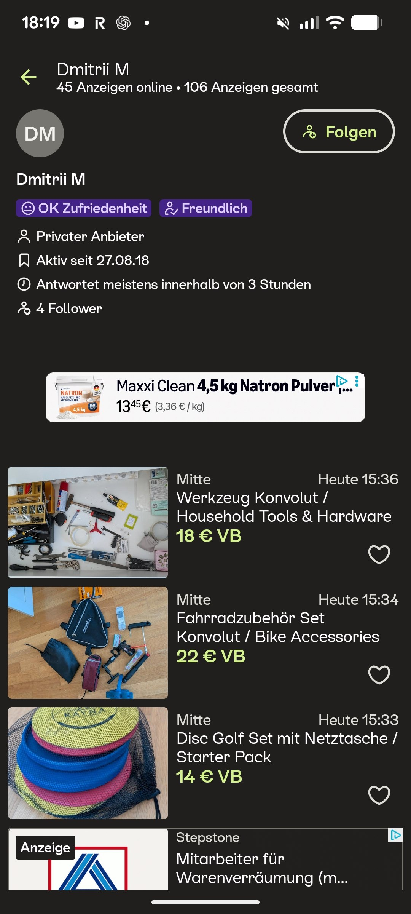
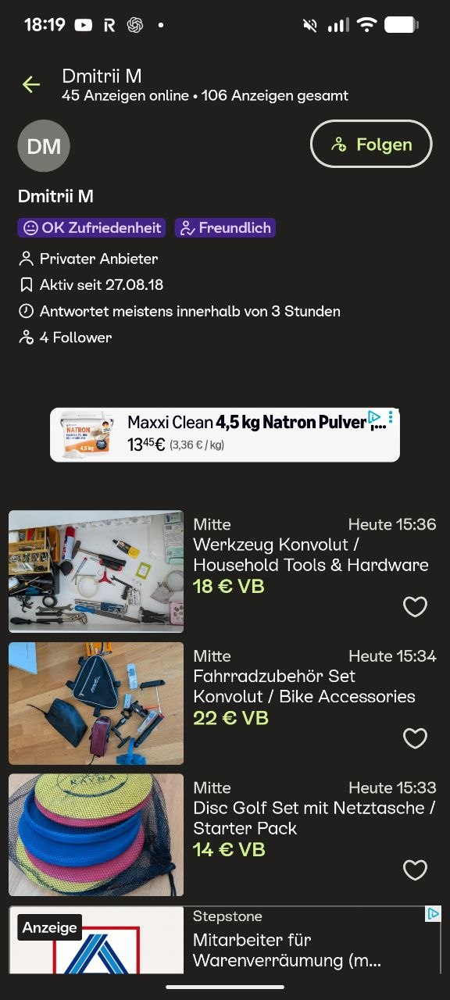

# ChatGPT for Kleinanzeigen Listings

A friend photographed unwanted things they felt bad about throwing away. They told ChatGPT to go to Kleinanzeigen, upload the photos, and set whatever prices it wanted. This is another example of using ChatGPT to automate everyday tasks.[^1]

The screenshots show the resulting listings for household tools, bicycle accessories, and a disc golf starter pack. The listed prices are EUR 18, EUR 22, and EUR 14, respectively. The seller's profile shows 45 active listings and 106 listings in total.[^1][^2]

<figure>
  
  <figcaption>A friend asked ChatGPT to create listings from photos and choose the prices</figcaption>
</figure>

<figure>
  
  <figcaption>The household tools, bicycle accessories, and disc golf listings</figcaption>
</figure>

## Sources

[^1]: [20260923_162027_AlexeyDTC_msg4978_photo.md](../../../inbox/used/20260923_162027_AlexeyDTC_msg4978_photo.md)
[^2]: [20260923_162055_AlexeyDTC_msg4980_photo.md](../../../inbox/used/20260923_162055_AlexeyDTC_msg4980_photo.md)
