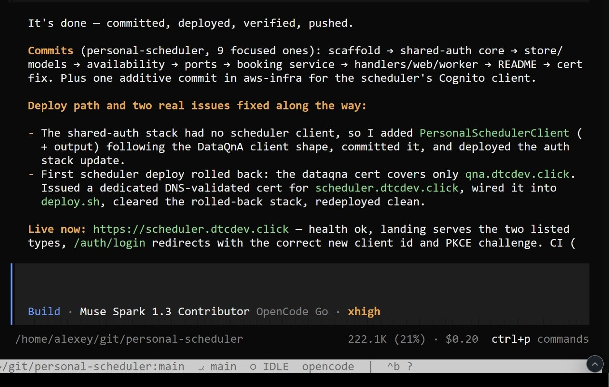

# Personal Scheduler Deployment

The agent reported nine focused commits for Personal Scheduler. It started with the scaffold and shared authentication core, then added the store and models. Next it added availability and ports. It then added the booking service, handlers/web/worker, README, and a certificate fix. It also reports one additional commit in aws-infra for the scheduler's Cognito client.[^1]

The report describes two deployment fixes:[^1]

- The shared authentication stack had no scheduler client. The agent added `PersonalSchedulerClient` and its output using the DataQnA client as a reference, then committed and deployed the authentication update.
- The first scheduler deployment rolled back because the DataQnA certificate only covered `qna.dtcdev.click`. The agent issued a dedicated DNS-validated certificate for `scheduler.dtcdev.click`, connected it in `deploy.sh`, cleared the rolled-back stack, and redeployed.

The agent reported a healthy deployment at `scheduler.dtcdev.click`. The agent checked that visitors could see both listed booking types. It also checked that `/auth/login` redirected with the new client ID and PKCE challenge. The agent said it had committed, deployed, verified, and pushed the changes.[^1]

<figure>
  
  <figcaption>Personal Scheduler deployment report</figcaption>
</figure>

## Sources

[^1]: [20260921_172654_AlexeyDTC_msg4976_photo.md](../../../inbox/used/20260921_172654_AlexeyDTC_msg4976_photo.md)
