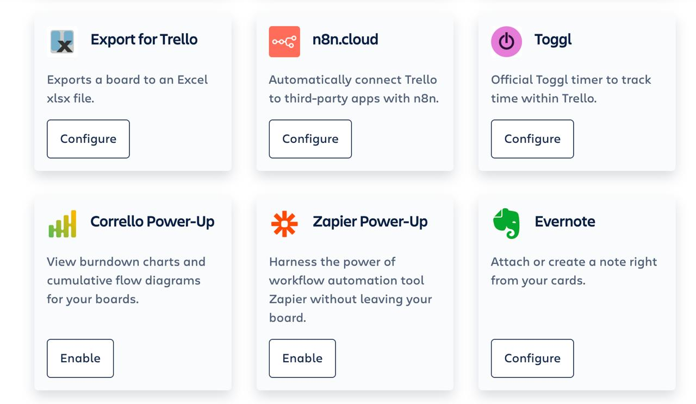
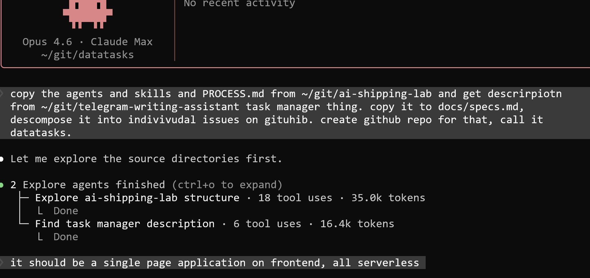

# Task Management App Idea

An idea for a unified task management application that combines the best aspects of Trello and todo lists, specifically designed for the needs of community managers and small teams.

## Implementation Requirements

Some time ago we discussed the todo list app idea. Now I want to return to it and implement it[^19].

The main goal: make it maximally cheap. No hosting costs at all.

### Architecture

- Backend: AWS Lambda with JavaScript
- Database: DynamoDB
- Frontend: vanilla JavaScript (no React), served from the Lambda on the index request
- Multiple JS files that get packaged together

### Local Development

The setup should be maximally lightweight:

- Use a local DynamoDB alternative that works like SQLite - no need for the real DynamoDB locally
- No Docker required for development
- Run and test everything locally without hassle
- Local environment should be as close to Lambda as possible

### Deployment

- Deploy through Lambda and DynamoDB
- If Docker is needed for packaging the deployment, that is acceptable
- Fewer dependencies the better
- If everything fits in one Lambda - perfect
- Could put JavaScript files on S3, but probably not needed
- Simple zip archive deployment would be ideal

### Testing

- Local testing should be easy and straightforward
- Integration testing: run Lambda in Docker and test through that

## The Problem

The current workflow for Grace (community manager at DataTalks Club) involves multiple disjointed systems:

Multiple task sources:
- Google Spreadsheet for todo list
- Trello for project cards
- Individual tasks inside Trello cards
- Ad hoc tasks sent via Telegram
- Email forwarding creates additional tasks
- Regular recurring tasks (weekly mailchimp dumps, etc.)

Inefficiency: to see what needs to be done today, Grace must:
1. Check the Google Spreadsheet
2. Go through each Trello card
3. Look at tasks inside each card
4. Check for any Telegram messages
5. Check email-derived tasks

This scattered approach means significant time spent just gathering information before any work can begin.

## Why Existing Tools Don't Work

Trello limitations:
- Ad hoc tasks cannot be easily added to Trello
- Would need to create a separate card for each small task (overkill)
- Tasks are trapped inside cards - no unified view of all tasks across cards
- No way to see all today's tasks at a glance without opening every card
- Integrations exist (Zapier, n8n, etc.) but may be paid and limited

<figure>
  
  <figcaption>Trello offers various power-ups and integrations, but they are typically paid and limited to supported services</figcaption>
  <!-- The screenshot shows available integrations like Export for Trello, n8n.cloud, Toggl, Corrello, Zapier, and Evernote -->
</figure>

Other tools:
- Monday, Asana, Jira - don't quite fit this specific use case
- Trello's power-ups and integrations are limited to what they support
- Need something simple and customizable

## The Vision

A unified task management system that combines:
- Trello-like project templates and cards
- Spreadsheet-like task list view
- Automated task capture from multiple sources
- Template-based deadline management

### Core Concepts

Templates (Playbooks):
- Newsletter template
- Course template
- Event template
- Each template contains a set of related tasks with relative deadlines

Anchor Date: each card/project has an anchor date (e.g., event date, launch date)
- Tasks have relative deadlines: "2 weeks before", "1 week before", "1 week after"
- System automatically calculates actual due dates based on anchor date
- All tasks from the project appear in the unified task list

Two views:
1. Project/Card View - Like Trello, high-level organization
2. Task List View - All tasks from all projects in a simple table

### Task Types

Template-based tasks:
- Created automatically when a project is instantiated from a template
- Have relative deadlines calculated from anchor date
- Appear in both the project card and the unified task list

Ad hoc tasks:
- Created via Telegram slash command
- Created via email forwarding
- Standalone tasks not part of any project
- Appear in the unified task list

Recurring tasks:
- Regular tasks like "weekly mailchimp dump" on Wednesdays
- Automatically added to the task list on schedule
- Configurable schedule

### Simple Task Interface

Each task should have:
- Date
- Task description
- Comment field (for links to results, like process documents)
- Status (todo/done)

When Grace completes a task (like converting a Loom video to a process document), she adds the link in the comment field and marks it done.

## Technical Considerations

Static site approach: the user is considering building this as a static site (GitHub Pages) to avoid database costs. This would mean:
- No backend database
- All data stored in Git
- Jekyll or similar static site generator
- Free hosting

This approach works for simple sites but may not be ideal for a dynamic task management system. A possible alternative:
- Build with a database first for functionality
- Later adapt to static generation if needed

Lovable for prototyping: the idea could be quickly prototyped using Lovable:
1. Brainstorm all requirements into a document
2. Use ChatGPT to formalize into a detailed specification
3. Use Lovable with a few prompts to create a working mock
4. Iterate based on feedback

This approach could produce a functional prototype quickly, which could then serve as the basis for a production application.

## Value Beyond Internal Use

This tool could be useful for others:
- Shows how DataTalks Club organizes work
- Could be shared with the community
- Might be interesting to other small teams with similar workflows

## Potential Extensions

Invoice tracking: the user also mentioned forgetting to send invoices. The system could include:
- Invoice tracking functionality
- Reminders for pending invoices
- Could be separate or integrated into the task system

## Starting the Implementation: DataTasks

The project is called "datatasks." There was already a repo created two years ago, so the decision was to reuse it: [github.com/alexeygrigorev/datatasks](https://github.com/alexeygrigorev/datatasks)[^22].

The implementation started using Claude Code (Opus 4.6). The prompt instructed Claude to copy agents, skills, and PROCESS.md from the ai-shipping-lab project, get the task manager description from the telegram-writing-assistant repo, copy it to docs/specs.md, decompose it into individual issues on GitHub, and create the repo. An additional instruction: it should be a single page application on the frontend, all serverless[^20].

<figure>
  
  <figcaption>The initial prompt to Claude Code to set up the datatasks project, exploring source directories with parallel subagents</figcaption>
  <!-- Shows Claude Code Opus 4.6 in ~/git/datatasks, running explore agents to find the ai-shipping-lab structure and task manager description -->
</figure>

Claude Code immediately started following the PROCESS.md workflow - grooming issues first, then implementing in batches of 2. It launched parallel PM agents to groom the two foundational issues (#1 Project scaffold and local dev setup, #2 DynamoDB table design and data layer)[^21].

<figure>
  
  <figcaption>Claude Code grooming issues #1 and #2 in parallel, showing the todo list with implementation steps and dependencies</figcaption>
  <!-- Shows the PM grooming workflow: groom issues, implement, QA, PM review, commit and push, pick next issues - all with dependency tracking -->
</figure>

## Sources

[^1]: [20260211_043338_AlexeyDTC_msg1350.md](../../inbox/used/20260211_043338_AlexeyDTC_msg1350.md)
[^2]: [20260211_043339_AlexeyDTC_msg1351_transcript.txt](../../inbox/used/20260211_043339_AlexeyDTC_msg1351_transcript.txt)
[^3]: [20260211_043339_AlexeyDTC_msg1352_transcript.txt](../../inbox/used/20260211_043339_AlexeyDTC_msg1352_transcript.txt)
[^4]: [20260211_043339_AlexeyDTC_msg1353_transcript.txt](../../inbox/used/20260211_043339_AlexeyDTC_msg1353_transcript.txt)
[^5]: [20260211_043339_AlexeyDTC_msg1354_transcript.txt](../../inbox/used/20260211_043339_AlexeyDTC_msg1354_transcript.txt)
[^6]: [20260211_043339_AlexeyDTC_msg1355_transcript.txt](../../inbox/used/20260211_043339_AlexeyDTC_msg1355_transcript.txt)
[^7]: [20260211_043339_AlexeyDTC_msg1356_transcript.txt](../../inbox/used/20260211_043339_AlexeyDTC_msg1356_transcript.txt)
[^8]: [20260211_043339_AlexeyDTC_msg1357.md](../../inbox/used/20260211_043339_AlexeyDTC_msg1357.md)
[^9]: [20260211_043339_AlexeyDTC_msg1358.md](../../inbox/used/20260211_043339_AlexeyDTC_msg1358.md)
[^10]: [20260211_043339_AlexeyDTC_msg1359_transcript.txt](../../inbox/used/20260211_043339_AlexeyDTC_msg1359_transcript.txt)
[^11]: [20260211_043339_AlexeyDTC_msg1360_transcript.txt](../../inbox/used/20260211_043339_AlexeyDTC_msg1360_transcript.txt)
[^12]: [20260211_043339_AlexeyDTC_msg1361_transcript.txt](../../inbox/used/20260211_043339_AlexeyDTC_msg1361_transcript.txt)
[^13]: [20260211_043339_AlexeyDTC_msg1362_photo.md](../../inbox/used/20260211_043339_AlexeyDTC_msg1362_photo.md)
[^14]: [20260211_043339_AlexeyDTC_msg1363_transcript.txt](../../inbox/used/20260211_043339_AlexeyDTC_msg1363_transcript.txt)
[^15]: [20260211_043339_AlexeyDTC_msg1364_transcript.txt](../../inbox/used/20260211_043339_AlexeyDTC_msg1364_transcript.txt)
[^16]: [20260211_043339_AlexeyDTC_msg1365_transcript.txt](../../inbox/used/20260211_043339_AlexeyDTC_msg1365_transcript.txt)
[^17]: [20260211_043431_AlexeyDTC_msg1366.md](../../inbox/used/20260211_043431_AlexeyDTC_msg1366.md)
[^18]: [20260211_074754_AlexeyDTC_msg1372_transcript.txt](../../inbox/used/20260211_074754_AlexeyDTC_msg1372_transcript.txt)
[^19]: [20260223_192235_AlexeyDTC_msg2226_transcript.txt](../../inbox/used/20260223_192235_AlexeyDTC_msg2226_transcript.txt)
[^20]: [20260223_220022_AlexeyDTC_msg2232_photo.md](../../inbox/used/20260223_220022_AlexeyDTC_msg2232_photo.md)
[^21]: [20260223_220046_AlexeyDTC_msg2234_photo.md](../../inbox/used/20260223_220046_AlexeyDTC_msg2234_photo.md)
[^22]: [20260223_220135_AlexeyDTC_msg2238.md](../../inbox/used/20260223_220135_AlexeyDTC_msg2238.md)
[^23]: [20260223_220104_AlexeyDTC_msg2236.md](../../inbox/used/20260223_220104_AlexeyDTC_msg2236.md)
