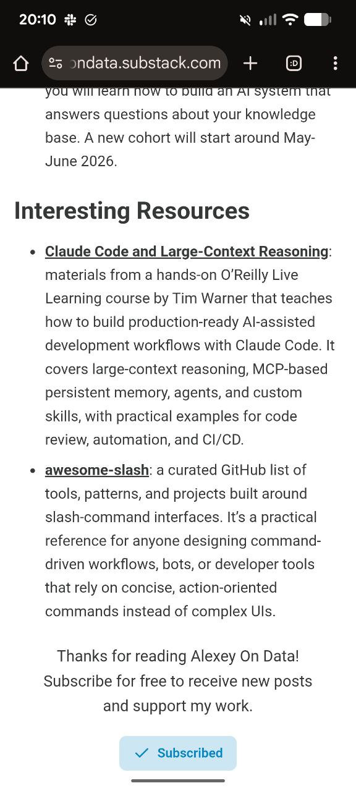

# Interesting Resources

A collection of interesting resources curated for the "Alexey On Data" newsletter and beyond.

<figure>
  
  <figcaption>The Interesting Resources section as it appears in the Alexey On Data newsletter on Substack</figcaption>
  <!-- This shows the format and presentation of resources in the newsletter -->
</figure>

## Resource Format

Each resource entry follows this simple format:
- Title: the resource name (what it is)
- First sentence: must include a link to the resource
- One paragraph description: what it does and why it's useful
- Keep it concise, 2-4 sentences max
- No bulleted lists, no code examples, no extra sections

### Codex

[Codex](https://gist.github.com/antirez/2e07727fb37e7301247e568b6634beff) is an AI-powered CLI tool by antirez for complex debugging, code analysis, and technical questions. It handles file-based input for complex problems and can help with debugging subtle bugs, analyzing algorithms against specifications, and providing detailed code reviews[^2].

### Gas Town

[Gas Town](https://github.com/steveyegge/gastown) is an orchestrator for managing multiple Claude Code instances simultaneously. It addresses the challenge of tracking work across many AI coding agents by providing a system for coordinating workers, managing merge queues, and maintaining persistent identities. It uses concepts from Kubernetes and Temporal, with tmux as the primary UI. The project represents a vision for what comes next after individual AI coding agents - coordinated workflows and "Kubernetes for agents"[^8].

### planning-with-files

[planning-with-files](https://github.com/othmanadi/planning-with-files) is a Claude Code skill that implements Manus-style persistent markdown planning. This is the workflow pattern behind Manus, the AI agent company that Meta acquired for $2 billion. The plugin transforms your workflow to use persistent markdown files for planning, progress tracking, and knowledge storage. It supports multiple IDEs including Claude Code, Cursor, Gemini CLI, Continue, and more[^6].

### Atomic Agents

[Atomic Agents](https://github.com/BrainBlend-AI/atomic-agents) is a lightweight and modular framework for building AI agent pipelines and applications. Built on Instructor and Pydantic, Atomic Agents focuses on atomicity where each component (agent, tool, context provider) is single-purpose, reusable, composable, and predictable. It enables creating AI applications using familiar software engineering principles with clear input and output schemas for consistent behavior[^7].

### pro-workflow

[pro-workflow](https://github.com/rohitg00/pro-workflow) is a collection of battle-tested Claude Code workflows from power users. It implements patterns like self-correcting memory, parallel worktrees, wrap-up rituals, and the 80/20 AI coding ratio. Features include agent teams, custom subagents, smart commit with quality gates, session analytics, and persistent SQLite storage for learnings with full-text search. Optimized for reducing correction cycles when working with AI coding assistants[^9].

### PaperBanana

[PaperBanana](https://paperbanana.org/) is an agentic framework for AI researchers that automates creation of high-quality academic illustrations. It generates methodology diagrams, flowcharts, and statistical plots from text descriptions or by polishing hand-drawn sketches. Uses a multi-step process with retrieve, plan, render, and refine agents powered by state-of-the-art vision and image generation models. Includes PaperBananaBench with 292 curated test cases from NeurIPS 2025[^10].

### Dexter

[Dexter](https://github.com/virattt/dexter) is an autonomous financial research agent that thinks, plans, and learns as it works. It performs analysis using task planning, self-reflection, and real-time market data. Think Claude Code, but built specifically for financial research. It features intelligent task planning, autonomous execution, self-validation, real-time financial data access, and safety features like loop detection and step limits[^11].

### LLM Interview Questions

[LLM Interview Questions](https://x.com/techNmak/status/2021459379564970353) is a curated collection of 50 interview questions for LLM-related positions shared by Hao Hoang. The questions cover fundamentals like tokenization and attention mechanisms, fine-tuning techniques including LoRA and QLoRA, generation strategies like beam search and temperature sampling, advanced concepts like RAG and Chain-of-Thought, plus math and theory topics like softmax, cross-entropy loss, and KL divergence. A [PDF version](https://drive.google.com/file/d/1cUxKspEXgQ64s4OFEw0kabf_qNauOPiH/view) with detailed answers is also available[^18][^19].

### LangExtract

[LangExtract](https://github.com/google/langextract) is a library for extracting language and locale information from text. It provides a simple way to detect the language of content, which is useful for applications that need to handle multilingual text or route content based on language[^12].

### nao

[nao](https://github.com/getnao/nao) is an open source analytics agent that combines a CLI tool for creating context with a deployable chat interface for teams. It allows data teams to set up a chat interface over their data sources, with the nao-core CLI handling context creation and indexing. The project supports self-hosting via Docker and provides a web UI for business users to interact with data through natural language queries[^17].

### Docling

[Docling](https://github.com/docling-project/docling) is a document parsing library that extracts structured content from PDFs and other documents. It provides a unified API for document conversion with support for equations, tables, code, and layout analysis. The project uses the Granite Docling 258M model under the hood, a compact multimodal model that works well on CPU without requiring GPU. Installation is straightforward with pip install, making it easy to integrate into existing workflows. Resource shared by Léonore Tideman from AI Buildcamp[^13].

### LLM Coding Insights

[2000 Hours Coding with LLMs in 2025](https://www.reddit.com/r/ClaudeAI/comments/1q3t579/i_spent_2000_hours_coding_with_llms_in_2025_here/) is a comprehensive Reddit post detailing lessons learned from extensive LLM-assisted coding. The author shares practical insights about what works, what doesn't, and how to effectively integrate AI coding assistants into real-world development workflows[^16].

## Sources

[^1]: [20260131_191039_AlexeyDTC_msg741_photo.md](../inbox/used/20260131_191039_AlexeyDTC_msg741_photo.md)
[^2]: [https://gist.github.com/antirez/2e07727fb37e7301247e568b6634beff](https://gist.github.com/antirez/2e07727fb37e7301247e568b6634beff)
[^3]: [20260131_191025_AlexeyDTC_msg739_transcript.txt](../inbox/used/20260131_191025_AlexeyDTC_msg739_transcript.txt)
[^4]: [20260131_191153_AlexeyDTC_msg745_transcript.txt](../inbox/used/20260131_191153_AlexeyDTC_msg745_transcript.txt)
[^5]: [20260131_194824_AlexeyDTC_msg751_transcript.txt](../inbox/raw/20260131_194824_AlexeyDTC_msg751_transcript.txt)
[^6]: [20260202_122612_AlexeyDTC_msg848.md](../inbox/raw/20260202_122612_AlexeyDTC_msg848.md)
[^7]: [20260202_171315_AlexeyDTC_msg854.md](../inbox/raw/20260202_171315_AlexeyDTC_msg854.md)
[^8]: [20260203_134255_AlexeyDTC_msg884_transcript.txt](../inbox/raw/20260203_134255_AlexeyDTC_msg884_transcript.txt)
[^9]: [20260205_152323_AlexeyDTC_msg949.md](../inbox/raw/20260205_152323_AlexeyDTC_msg949.md)
[^10]: [20260205_162426_AlexeyDTC_msg950.md](../inbox/raw/20260205_162426_AlexeyDTC_msg950.md)
[^11]: [20260206_074649_valeriia_kuka_msg971.md](../inbox/raw/20260206_074649_valeriia_kuka_msg971.md)
[^12]: [20260207_215252_AlexeyDTC_msg1182.md](../inbox/used/20260207_215252_AlexeyDTC_msg1182.md)
[^13]: [20260209_170808_AlexeyDTC_msg1244.md](../inbox/raw/20260209_170808_AlexeyDTC_msg1244.md)
[^14]: [20260209_170914_AlexeyDTC_msg1246_transcript.txt](../inbox/raw/20260209_170914_AlexeyDTC_msg1246_transcript.txt)
[^15]: [20260209_171006_AlexeyDTC_msg1248.md](../inbox/raw/20260209_171006_AlexeyDTC_msg1248.md)
[^16]: [20260210_084748_AlexeyDTC_msg1267.md](../inbox/raw/20260210_084748_AlexeyDTC_msg1267.md)
[^17]: [20260210_150732_AlexeyDTC_msg1291.md](../inbox/raw/20260210_150732_AlexeyDTC_msg1291.md)
[^18]: [20260211_131904_valeriia_kuka_msg1441.md](../inbox/raw/20260211_131904_valeriia_kuka_msg1441.md)
[^19]: [20260211_130747_valeriia_kuka_msg1433.md](../inbox/raw/20260211_130747_valeriia_kuka_msg1433.md)
